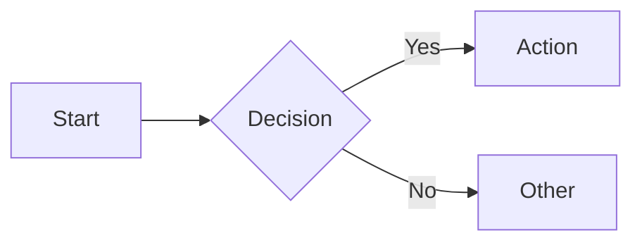

<objective>
Explain $ARGUMENTS (or the current topic if no arguments provided) visually.

Create diagrams that show structure, flow, or relationships. A picture is worth a thousand words.
</objective>

<intake_gate>

<context_analysis>
First, analyze $ARGUMENTS to extract what's already provided:
- What concept to visualize
- What aspect to show (structure, flow, state, relationships)
- Preferred diagram format (ASCII, mermaid, etc.)

Only ask about genuine gaps - don't re-ask what's already stated.
</context_analysis>

<initial_questions>
Use AskUserQuestion to ask 2-3 questions based on actual gaps:

**If aspect unclear:**
- "What should the diagram show?" with options: Structure/architecture, Process/flow, States/transitions, Relationships/connections, Comparison, Other

**If format unclear:**
- "What format?" with options: ASCII art (simple), Mermaid (complex/interactive), Both, Whatever fits best, Other

**If focus unclear:**
- "What's most important to see?" with options: The big picture, Specific details, How things connect, Where decisions happen, Other

Skip questions where $ARGUMENTS already provides the answer.
</initial_questions>

<decision_gate>
After receiving answers, use AskUserQuestion:

Question: "Ready to create the diagram, or would you like me to ask more questions?"

Options:
1. **Start diagramming** - I have enough context
2. **Ask more questions** - There are details to clarify
3. **Let me add context** - I want to provide additional information

If "Ask more questions" → generate 2-3 contextual follow-ups, then present decision gate again
If "Let me add context" → receive input, then present decision gate again
If "Start diagramming" → proceed
</decision_gate>

</intake_gate>

<process>
1. Identify what needs to be visualized (structure, flow, state, relationships)
2. Choose appropriate diagram type:
   - Flowchart: processes, decisions, sequences
   - Box-and-arrow: architecture, data flow, dependencies
   - State diagram: transitions, lifecycles
   - Tree: hierarchies, inheritance
   - Table: comparisons, mappings
3. Create the diagram (ASCII or mermaid)
4. Add brief labels and a legend if needed
5. Provide minimal text explanation of what the diagram shows
</process>

<output_format>
**Diagram:**
```
[ASCII art or mermaid diagram]
```

**What this shows:**
[1-2 sentences explaining the key insight the diagram reveals]

**Reading the diagram:**
- [Brief legend or guide if needed]
</output_format>

<diagram_types>
Use ASCII for simple diagrams:
```
[Input] → [Process] → [Output]
            ↓
        [Side effect]
```

Use mermaid for complex diagrams:

</diagram_types>

<success_criteria>
- Diagram type matches what's being explained
- Visual clearly shows structure/flow/relationships
- Minimal text - let the diagram do the work
- Labels are concise and clear
- Someone could understand the concept from the diagram alone
</success_criteria>
