# Skill Seekers Architecture

> Generated 2026-03-22 | StarUML project: `Docs/UML/skill_seekers.mdj`

## Overview

Skill Seekers converts documentation from 17 source types into production-ready formats for 24+ AI platforms. The architecture follows a layered module design with 8 core modules and 5 utility modules.

## Package Diagram

**Core Modules** (upper area):
- **CLICore** -- Git-style command dispatcher, entry point for all `skill-seekers` commands
- **Scrapers** -- 17 source-type extractors (web, GitHub, PDF, Word, EPUB, video, etc.)
- **Adaptors** -- Strategy+Factory pattern for 20+ output platforms (Claude, Gemini, OpenAI, RAG frameworks)
- **Analysis** -- C3.x codebase analysis pipeline (AST parsing, 10 GoF pattern detectors, guide builders)
- **Enhancement** -- AI-powered skill improvement (API mode + LOCAL mode, --enhance-level 0-3)
- **Packaging** -- Package, upload, and install skills to AI agent directories
- **MCP** -- FastMCP server exposing 34 tools via stdio/HTTP transport
- **Sync** -- Documentation change detection and re-scraping triggers

**Utility Modules** (lower area):
- **Parsers** -- CLI argument parsers (30+ SubcommandParser subclasses)
- **Storage** -- Cloud storage abstraction (S3, GCS, Azure)
- **Embedding** -- Multi-provider vector embedding generation
- **Benchmark** -- Performance measurement framework
- **Utilities** -- Shared helpers (LanguageDetector, RAGChunker, MarkdownCleaner, etc.)

## Core Module Diagrams

### CLICore
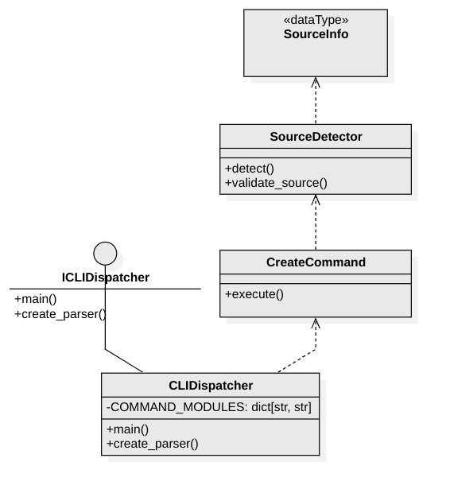

Entry point: `skill-seekers` CLI. `CLIDispatcher` maps subcommands to modules via `COMMAND_MODULES` dict. `CreateCommand` auto-detects source type via `SourceDetector`.

### Scrapers
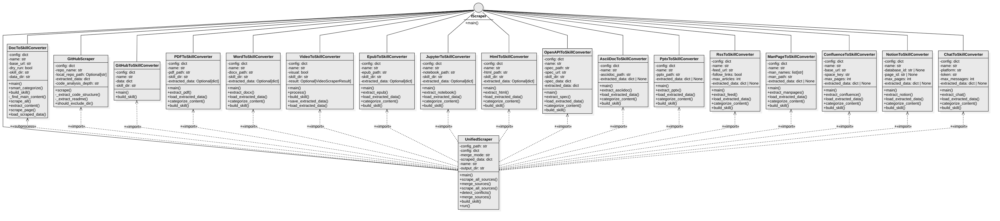

18 scraper classes implementing `IScraper`. Each has a `main()` entry point. Notable: `GitHubScraper` (3-stream fetcher) + `GitHubToSkillConverter` (builder), `UnifiedScraper` (multi-source orchestrator).

### Adaptors

`SkillAdaptor` ABC with 3 abstract methods: `format_skill_md()`, `package()`, `upload()`. Two-level hierarchy: direct subclasses (Claude, Gemini, OpenAI, Markdown, OpenCode, RAG adaptors) and `OpenAICompatibleAdaptor` intermediate (MiniMax, Kimi, DeepSeek, Qwen, OpenRouter, Together, Fireworks).

### Analysis (C3.x Pipeline)
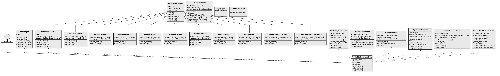

`UnifiedCodebaseAnalyzer` controller orchestrates: `CodeAnalyzer` (AST, 9 languages), `PatternRecognizer` (10 GoF detectors via `BasePatternDetector`), `TestExampleExtractor`, `HowToGuideBuilder`, `ConfigExtractor`, `SignalFlowAnalyzer`, `DependencyAnalyzer`, `ArchitecturalPatternDetector`.

### Enhancement
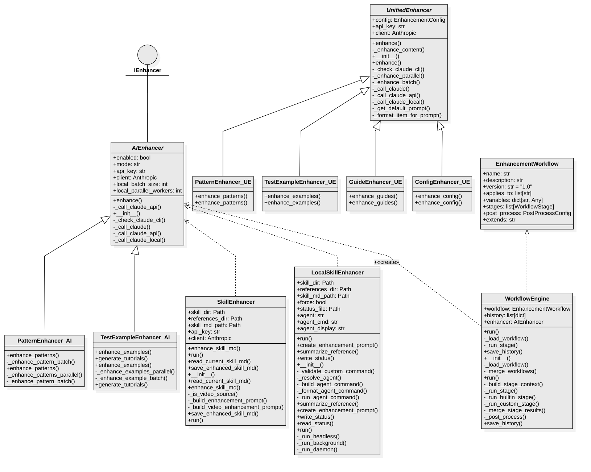

Two enhancement hierarchies: `AIEnhancer` (API mode, Claude API calls) and `UnifiedEnhancer` (C3.x pipeline enhancers). Each has specialized subclasses for patterns, test examples, guides, and configs. `WorkflowEngine` orchestrates multi-stage `EnhancementWorkflow`.

### Packaging
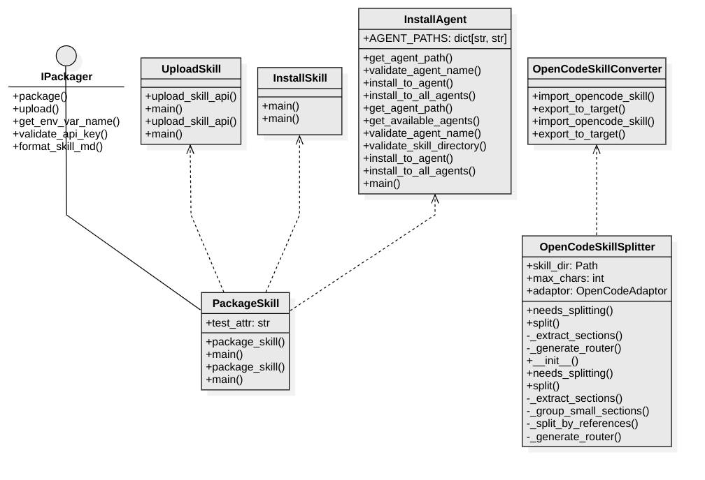

`PackageSkill` delegates to adaptors for format-specific packaging. `UploadSkill` handles platform API uploads. `InstallSkill`/`InstallAgent` install to AI agent directories. `OpenCodeSkillSplitter` handles large file splitting.

### MCP Server
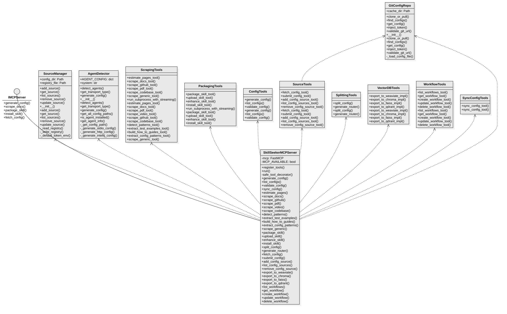

`SkillSeekerMCPServer` (FastMCP) with 34 tools in 8 categories. Supporting classes: `SourceManager` (config CRUD), `AgentDetector` (environment detection), `GitConfigRepo` (community configs).

### Sync
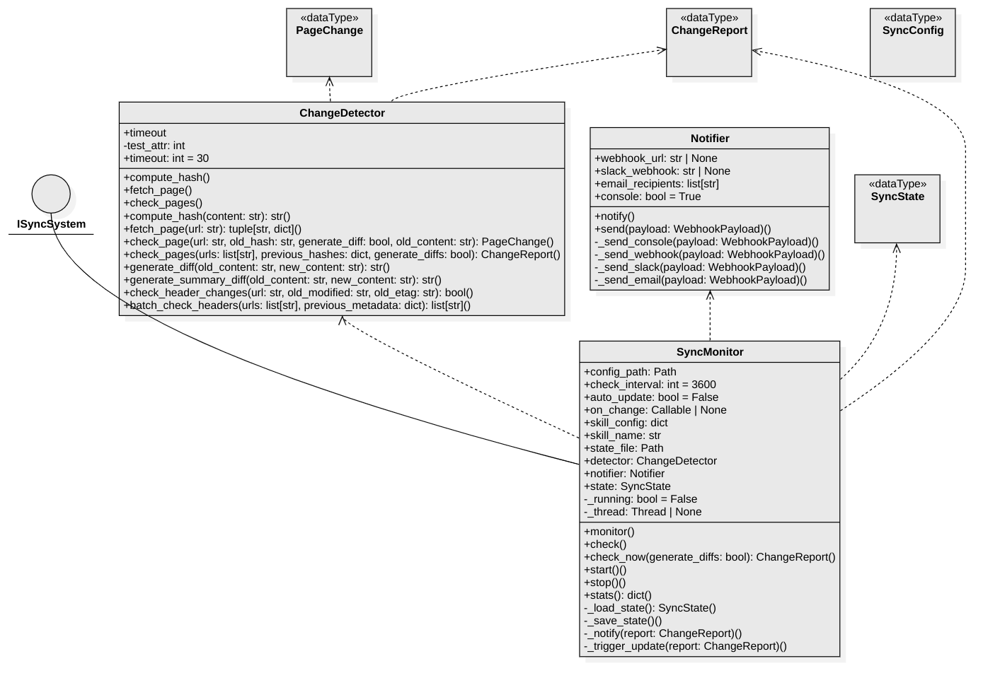

`SyncMonitor` controller schedules periodic checks via `ChangeDetector` (SHA-256 hashing, HTTP headers, content diffing). `Notifier` sends alerts when changes are found. Pydantic models: `PageChange`, `ChangeReport`, `SyncConfig`, `SyncState`.

## Utility Module Diagrams

### Parsers
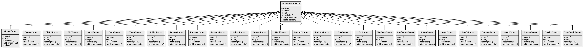

`SubcommandParser` ABC with 27 subclasses -- one per CLI subcommand (Create, Scrape, GitHub, PDF, Word, EPUB, Video, Unified, Analyze, Enhance, Package, Upload, Jupyter, HTML, OpenAPI, AsciiDoc, Pptx, RSS, ManPage, Confluence, Notion, Chat, Config, Estimate, Install, Stream, Quality, SyncConfig).

### Storage

`BaseStorageAdaptor` ABC with `S3StorageAdaptor`, `GCSStorageAdaptor`, `AzureStorageAdaptor`. `StorageObject` dataclass for file metadata.

### Embedding
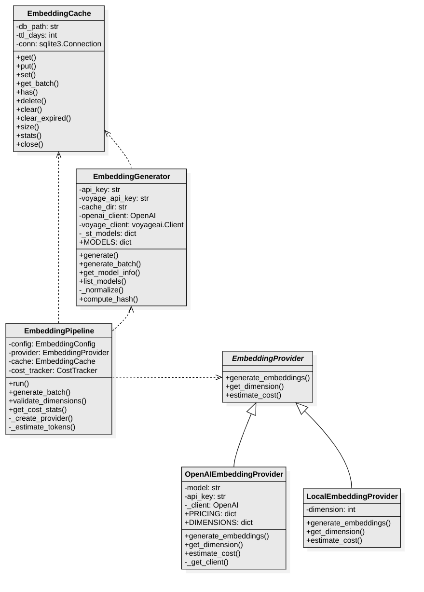

`EmbeddingGenerator` (multi-provider: OpenAI, Sentence Transformers, Voyage AI). `EmbeddingPipeline` coordinates provider, caching, and cost tracking. `EmbeddingProvider` ABC with OpenAI and Local implementations.

### Benchmark
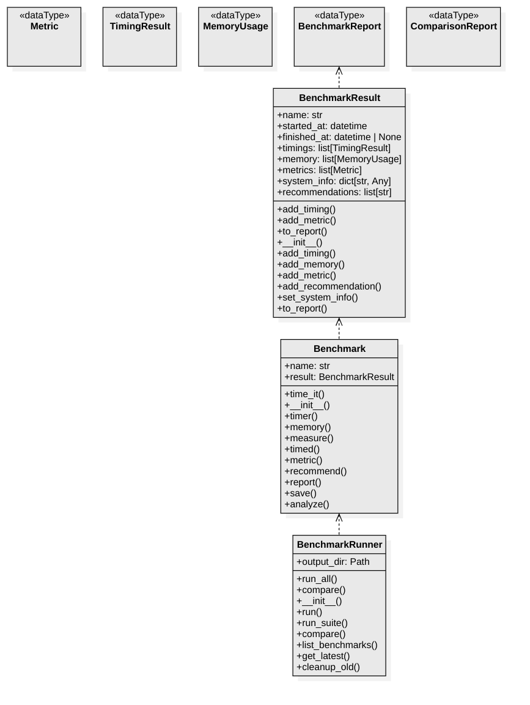

`BenchmarkRunner` orchestrates `Benchmark` instances. `BenchmarkResult` collects timings/memory/metrics and produces `BenchmarkReport`. Supporting data types: `Metric`, `TimingResult`, `MemoryUsage`, `ComparisonReport`.

### Utilities
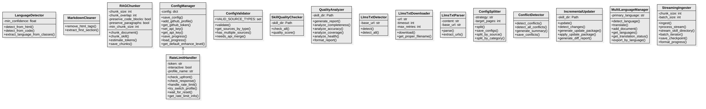

16 shared helper classes: `LanguageDetector`, `MarkdownCleaner`, `RAGChunker`, `RateLimitHandler`, `ConfigManager`, `ConfigValidator`, `SkillQualityChecker`, `QualityAnalyzer`, `LlmsTxtDetector`/`Downloader`/`Parser`, `ConfigSplitter`, `ConflictDetector`, `IncrementalUpdater`, `MultiLanguageManager`, `StreamingIngester`.

## Key Design Patterns

| Pattern | Where | Classes |
|---------|-------|---------|
| Strategy + Factory | Adaptors | `SkillAdaptor` ABC + `get_adaptor()` factory + 20+ implementations |
| Strategy + Factory | Storage | `BaseStorageAdaptor` ABC + S3/GCS/Azure |
| Strategy + Factory | Embedding | `EmbeddingProvider` ABC + OpenAI/Local |
| Command | CLI | `CLIDispatcher` + `COMMAND_MODULES` lazy dispatch |
| Template Method | Pattern Detection | `BasePatternDetector` + 10 GoF detectors |
| Template Method | Parsers | `SubcommandParser` + 27 subclasses |

## File Locations

- **StarUML project**: `Docs/UML/skill_seekers.mdj`
- **Diagram exports**: `Docs/UML/exports/*.png`
- **Source code**: `src/skill_seekers/`
