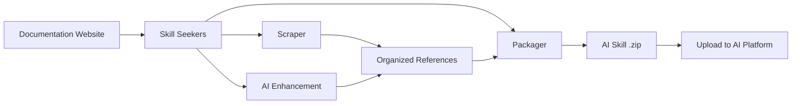

<p align="center">
  
</p>

# Skill Seekers

[English](README.md) | [简体中文](README.zh-CN.md) | [日本語](README.ja.md) | [한국어](README.ko.md) | [Español](README.es.md) | [Français](README.fr.md) | [Deutsch](README.de.md) | [Português](README.pt-BR.md) | [Türkçe](README.tr.md) | العربية | [हिन्दी](README.hi.md) | [Русский](README.ru.md)

> ⚠️ **إشعار الترجمة الآلية**
>
> تمت ترجمة هذا المستند تلقائيًا بواسطة الذكاء الاصطناعي. على الرغم من حرصنا على جودة الترجمة، قد تتضمن تعبيرات غير دقيقة.

[](https://github.com/yusufkaraaslan/Skill_Seekers/releases)
[](https://opensource.org/licenses/MIT)
[](https://www.python.org/downloads/)
[](https://modelcontextprotocol.io)
[](tests/)
[](https://pypi.org/project/skill-seekers/)
[](https://pypi.org/project/skill-seekers/)
[](https://skillseekersweb.com/)
[](https://github.com/yusufkaraaslan/Skill_Seekers)
[](https://pepy.tech/projects/skill-seekers)

<a href="https://trendshift.io/repositories/18329" target="_blank"></a>

**🧠 طبقة البيانات لأنظمة الذكاء الاصطناعي.** يحوّل Skill Seekers مواقع التوثيق ومستودعات GitHub وملفات PDF ومقاطع الفيديو ودفاتر Jupyter وصفحات الويكي وغيرها — **18 نوع مصدر** — إلى أصول معرفية مُهيكلة، جاهزة لتشغيل مهارات الذكاء الاصطناعي (Claude وGemini وOpenAI)، ومسارات RAG (LangChain وLlamaIndex وPinecone)، ومساعدي البرمجة بالذكاء الاصطناعي (Cursor وWindsurf وCline). جهّز مرة واحدة، وصدّر إلى **22 هدفًا**.

## 💛 الرعاة

<!-- SPONSORS:START -->
### Launch Partner

<p align="center">
  <a href="https://www.atlascloud.ai/"></a><br/><sub><b>Launch Partner</b></sub>
</p>

[Atlas Cloud](https://www.atlascloud.ai/) — A full-modal, OpenAI-compatible AI inference platform. Skill Seekers supports it as a packaging/enhancement target via `--target atlas` with `ATLAS_API_KEY`.

### Silver Sponsors

<p align="center">
  <a href="https://www.rapidproxy.io/?utm_source=skillseekers&utm_medium=sponsor"></a><br/><sub><b>Sponsor — Silver</b></sub>
</p>
<!-- SPONSORS:END -->

**[كن راعيًا](SPONSORSHIP.md)** · [GitHub Sponsors](https://github.com/sponsors/yusufkaraaslan)

---

## 🚀 البدء السريع

```bash
# 1. التثبيت
pip install skill-seekers

# 2. أنشئ مهارة من أي مصدر
skill-seekers create https://docs.djangoproject.com/

# 3. حزّمها لمنصة الذكاء الاصطناعي التي تستخدمها
skill-seekers package output/django --target claude
```

أصبح لديك الآن `output/django-claude.zip`، جاهز للاستخدام.

```bash
# اختر وكيل ذكاء اصطناعي مختلفًا للتحسين (الافتراضي: claude)
skill-seekers create https://docs.djangoproject.com/ --agent kimi
skill-seekers create https://docs.djangoproject.com/ --agent-cmd "my-custom-agent run"
```

### 🛰️ فحص المشروع بقيادة الذكاء الاصطناعي

وجّه `scan` إلى مشروع، فيقرأ وكيل ذكاء اصطناعي ملفات التبعيات وREADME وDockerfile/CI وعيّنات من استيرادات الشيفرة المصدرية — ثم يُصدر ملف إعداد واحدًا لكل إطار عمل مُكتشَف، إضافةً إلى `<project>-codebase.json` لشيفرتك الخاصة:

```bash
skill-seekers scan ./my-react-app --out ./configs/scanned/
# → react.json, vite.json, tailwind.json, jest.json, my-react-app-codebase.json

skill-seekers create ./configs/scanned/react.json
```

إذا لم يكن للاكتشاف إعداد مسبق موجود، يولّد الذكاء الاصطناعي ملف إعداد جديدًا؛ وعند الخروج يمكنك اختياريًا نشره في [سجل المجتمع](https://github.com/yusufkaraaslan/skill-seekers-configs).

### جميع أنواع المصادر الـ 18

```bash
skill-seekers create facebook/react            # مستودع GitHub
skill-seekers create ./my-project              # قاعدة شيفرة محلية
skill-seekers create manual.pdf                # PDF
skill-seekers create report.docx               # Word
skill-seekers create book.epub                 # EPUB
skill-seekers create notebook.ipynb            # Jupyter
skill-seekers create openapi.yaml              # OpenAPI/Swagger
skill-seekers create presentation.pptx         # PowerPoint
skill-seekers create guide.adoc                # AsciiDoc
skill-seekers create page.html                 # HTML محلي (أو مجلد كامل)
skill-seekers create feed.rss                  # RSS/Atom
skill-seekers create curl.1                    # صفحة Man

# فيديو (YouTube أو Vimeo أو ملف محلي — يتطلب skill-seekers[video])
skill-seekers create --video-url https://www.youtube.com/watch?v=... --name mytutorial
skill-seekers create --setup                   # تثبيت تلقائي للتبعيات البصرية المدرِكة لكرت الرسوميات

skill-seekers create --space-key TEAM --name wiki               # Confluence
skill-seekers create --database-id ... --name docs              # Notion
skill-seekers create --chat-export-path ./slack-export --name team-chat  # Slack/Discord
```

راجع [دليل الاستخراج](docs/user-guide/02-scraping.md) للاطلاع على كل نوع مصدر وخياراته.

---

## 📦 التثبيت

```bash
pip install skill-seekers              # الأساس: الاستخراج وGitHub وPDF والتحزيم
pip install skill-seekers[all-llms]    # + كل منصات نماذج اللغة
pip install skill-seekers[mcp]         # + خادم MCP
pip install skill-seekers[all]         # كل شيء
```

**لست متأكدًا مما تحتاج إليه؟** شغّل المعالج: `skill-seekers-setup`

<details>
<summary><b>جميع إضافات التثبيت</b></summary>

| التثبيت | ما يضيفه |
|---------|------|
| `skill-seekers[gemini]` | دعم Google Gemini |
| `skill-seekers[openai]` | دعم OpenAI ChatGPT |
| `skill-seekers[all-llms]` | جميع منصات نماذج اللغة |
| `skill-seekers[mcp]` | خادم MCP لـ Claude Code وCursor وغيرهما |
| `skill-seekers[video]` | استخراج النصوص والبيانات الوصفية من YouTube/Vimeo |
| `skill-seekers[video-full]` | + تفريغ صوتي عبر Whisper واستخراج الإطارات المرئية |
| `skill-seekers[jupyter]` | دعم دفاتر Jupyter |
| `skill-seekers[pptx]` | دعم PowerPoint |
| `skill-seekers[confluence]` | دعم ويكي Confluence |
| `skill-seekers[notion]` | دعم صفحات Notion |
| `skill-seekers[rss]` | دعم خلاصات RSS/Atom |
| `skill-seekers[chat]` | دعم تصدير محادثات Slack/Discord |
| `skill-seekers[asciidoc]` | دعم AsciiDoc |
| `skill-seekers[all]` | كل شيء |

> **التبعيات البصرية للفيديو (مدرِكة لكرت الرسوميات):** بعد تثبيت `skill-seekers[video-full]`، شغّل `skill-seekers create --setup` للكشف التلقائي عن كرت الرسوميات لديك وتثبيت نسخة PyTorch المطابقة مع easyocr.

</details>

**المتطلبات المسبقة:** Python 3.10+، وGit. جديد هنا؟ ← **[بداية سريعة مضمونة](docs/getting-started/BULLETPROOF_QUICKSTART.md)** 🎯

---

## 📚 التوثيق

| أريد أن... | اقرأ هذا |
|--------------|-----------|
| **أبدأ بسرعة** | [البدء السريع](docs/getting-started/02-quick-start.md) — 3 أوامر للوصول إلى مهارتك الأولى |
| **أفهم المفاهيم** | [المفاهيم الأساسية](docs/user-guide/01-core-concepts.md) |
| **أستخرج من المصادر** | [دليل الاستخراج](docs/user-guide/02-scraping.md) — جميع أنواع المصادر الـ 18 |
| **أحسّن المهارات بالذكاء الاصطناعي** | [دليل التحسين](docs/user-guide/03-enhancement.md) · [أوضاع التحسين](docs/features/ENHANCEMENT_MODES.md) |
| **أصدّر المهارات** | [دليل التحزيم](docs/user-guide/04-packaging.md) |
| **أبني سير عمل** | [سير العمل](docs/user-guide/05-workflows.md) |
| **أبحث عن أمر** | [مرجع سطر الأوامر](docs/reference/CLI_REFERENCE.md) — جميع الأوامر الـ 19 |
| **أضبط الإعدادات** | [صيغة ملف الإعداد](docs/reference/CONFIG_FORMAT.md) · [متغيرات البيئة](docs/reference/ENVIRONMENT_VARIABLES.md) |
| **أعدّ MCP** | [إعداد MCP](docs/guides/MCP_SETUP.md) · [مرجع MCP](docs/reference/MCP_REFERENCE.md) |
| **أتكامل مع RAG أو بيئات التطوير** | [LangChain](docs/integrations/LANGCHAIN.md) · [مسارات RAG](docs/integrations/RAG_PIPELINES.md) · [Cursor](docs/integrations/CURSOR.md) · [Windsurf](docs/integrations/WINDSURF.md) · [Cline](docs/integrations/CLINE.md) |
| **أتعامل مع مجموعات توثيق ضخمة** | [التوثيق الكبير](docs/reference/LARGE_DOCUMENTATION.md) — من 10 آلاف إلى أكثر من 40 ألف صفحة |
| **أفهم البنية المعمارية** | [بنية UML](docs/UML_ARCHITECTURE.md) — 14 مخططًا |
| **أصلح مشكلة** | [استكشاف الأخطاء](docs/user-guide/06-troubleshooting.md) |

**فهرس التوثيق الكامل:** [docs/README.md](docs/README.md)

---

## 🎯 ما الذي تحصل عليه

| حالة الاستخدام | المُخرَج | يُشغّل |
|----------|--------|--------|
| **مهارات الذكاء الاصطناعي** | ملف `SKILL.md` شامل + ملفات مرجعية | Claude Code، Gemini، GPT |
| **مسارات RAG** | مستندات مُقطّعة ببيانات وصفية غنية | LangChain، LlamaIndex، Haystack |
| **قواعد البيانات الشعاعية** | بيانات مُهيّأة مسبقًا وجاهزة للإدراج | Pinecone، Chroma، Weaviate، FAISS، Qdrant |
| **مساعدو البرمجة بالذكاء الاصطناعي** | ملفات سياق يقرأها ذكاء بيئة التطوير تلقائيًا | Cursor، Windsurf، Cline، Continue.dev |

### أهداف التصدير (22)

```bash
skill-seekers package output/react --target claude      # → مهارة Claude (ZIP + YAML)
skill-seekers package output/react --target langchain   # → مستندات LangChain
skill-seekers package output/react --target llama-index # → عُقد TextNodes في LlamaIndex
skill-seekers package output/react --target ibm-bob     # → مجلد مهارة IBM Bob
```

**منصات نماذج اللغة (12):** `claude` · `gemini` · `openai` · `minimax` · `opencode` · `kimi` · `deepseek` · `qwen` · `openrouter` · `together` · `fireworks` · `markdown`
**RAG والقواعد الشعاعية (8):** `langchain` · `llama-index` · `haystack` · `chroma` · `faiss` · `weaviate` · `qdrant` · `pinecone`
**أخرى (2):** `atlas` · `ibm-bob`

راجع [مصفوفة الميزات](docs/reference/FEATURE_MATRIX.md) لمعرفة تفاصيل الدعم لكل منصة.

### لماذا هذا مهم

- ⚡ **أسرع بنسبة 99%** — أيام من تجهيز البيانات يدويًا ← من 15 إلى 45 دقيقة
- 🎯 **جودة مهارات حقيقية** — ملفات `SKILL.md` تتجاوز 500 سطر مع أمثلة وأنماط وأدلة
- 📊 **مقاطع جاهزة لـ RAG** — التقطيع الذكي يحافظ على كتل الشيفرة والسياق
- 🔄 **متعدد المصادر** — ادمج التوثيق وGitHub وملفات PDF ومقاطع الفيديو في أصل معرفي واحد
- 🌐 **تجهيز واحد لكل الأهداف** — صدّر إلى 22 هدفًا دون إعادة الاستخراج
- ✅ **مُختبَر ميدانيًا** — أكثر من 3,900 اختبار، و68 إعدادًا مسبقًا لسير العمل، وجاهز للإنتاج

---

## ✨ القدرات الرئيسية

<details>
<summary><b>استخراج التوثيق</b> — اكتشاف مواقع SPA، وllms.txt، والتصنيف الذكي</summary>

اكتشاف ثلاثي الطبقات لمواقع SPA المبنية على JavaScript (`sitemap.xml` ← `llms.txt` ← عرض عبر متصفح بلا واجهة)، وكشف تلقائي لـ `llms.txt` (أسرع بعشرة أضعاف عند توفره)، وتصنيف ذكي للمواضيع، ومحلل HTML متسامح كخيار احتياطي بحيث تظل الصفحات ذات الترميز المكسور قابلة للاستخراج.

← [دليل الاستخراج](docs/user-guide/02-scraping.md) · [دعم llms.txt](docs/reference/LLMS_TXT_SUPPORT.md)
</details>

<details>
<summary><b>تحليل GitHub وقواعد الشيفرة (C3.x)</b> — تحليل AST، وكشف الأنماط، والأدلة الإرشادية</summary>

بنية ثلاثية المسارات: تحليل الشيفرة (AST، وأنماط التصميم، والاختبارات)، والتوثيق (README، و`docs/`، والويكي)، والمجتمع (المشكلات، وطلبات الدمج، والبيانات الوصفية). يضيف خط معالجة C3.x عشرة كواشف لأنماط GoF عبر 9 لغات، وأمثلة استخدام مستخرجة من الاختبارات، وأدلة إرشادية يكتبها الذكاء الاصطناعي، واستخراج الإعدادات، ونظرات عامة على البنية المعمارية.

```bash
skill-seekers create ./my-project --preset quick          # 1–2 دقيقة، مستوى سطحي
skill-seekers create ./my-project --preset standard       # متوازن (الافتراضي)
skill-seekers create ./my-project --preset comprehensive  # عميق وشامل
```

← [كشف الأنماط](docs/features/PATTERN_DETECTION.md) · [الأدلة الإرشادية](docs/features/HOW_TO_GUIDES.md) · [استخراج أمثلة الاختبار](docs/features/TEST_EXAMPLE_EXTRACTION.md)
</details>

<details>
<summary><b>التحسين بالذكاء الاصطناعي</b> — عبر API أو وكلاء محليين، و68 إعدادًا مسبقًا لسير العمل</summary>

تمر كل استدعاءات الذكاء الاصطناعي عبر ناقل واحد، إمّا في **وضع API** (Anthropic، وGoogle Gemini، وOpenAI، وMoonshot/Kimi، وMiniMax) أو في **الوضع المحلي** (Claude Code، وKimi Code، وCodex، وCopilot، وOpenCode، ووكلاء مخصصون — دون تكاليف API). تحكّم في العمق عبر `--enhance-level 0-3`، واختر وكيلًا عبر `--agent`.

← [دليل التحسين](docs/user-guide/03-enhancement.md) · [أوضاع التحسين](docs/features/ENHANCEMENT_MODES.md) · [إعداد الوكلاء المتعددين](docs/guides/MULTI_AGENT_SETUP.md)
</details>

<details>
<summary><b>الاستخراج الموحّد متعدد المصادر</b> — ادمج مصادر عديدة في مهارة واحدة</summary>

يمكن لملف إعداد واحد أن يجلب التوثيق وGitHub وملفات PDF ومقاطع الفيديو وغيرها إلى أصل معرفي واحد، مع كشف التعارضات والتوليف الثنائي بين المصادر.

← [الاستخراج الموحّد](docs/features/UNIFIED_SCRAPING.md)
</details>

<details>
<summary><b>استخراج الفيديو</b> — النصوص، والإطارات، والشيفرة الظاهرة على الشاشة</summary>

YouTube وVimeo والملفات المحلية. تفريغ نصي بثلاثة مستويات احتياطية (الترجمات ← واجهة نصوص YouTube ← Whisper محليًا)، إضافةً إلى استخراج بصري اختياري يقرأ الشيفرة الظاهرة على الشاشة من إطارات مُعايَنة عبر OCR.

← [دليل الفيديو](docs/VIDEO_GUIDE.md)
</details>

<details>
<summary><b>الجودة والمزامنة والتوسّع</b></summary>

تقييم للجودة مع بوابة تحقق (`skill-seekers quality output/react/ --threshold 7`)، وكشف لتغيّرات التوثيق مع إعادة استخراج مجدولة وإشعارات، واستيعاب تدفقي لمجموعات التوثيق الكبيرة جدًا، وتحديثات تزايدية.

← [التوثيق الكبير](docs/reference/LARGE_DOCUMENTATION.md) · [جودة الشيفرة](docs/reference/CODE_QUALITY.md)
</details>

---

## 🔌 تكامل MCP (40 أداة)

يوفّر Skill Seekers خادم MCP لـ Claude Code وCursor وWindsurf وVS Code + Cline وIntelliJ IDEA.

```bash
# وضع stdio (Claude Code، وVS Code + Cline)
python -m skill_seekers.mcp.server_fastmcp

# وضع HTTP (Cursor، وWindsurf، وIntelliJ)
python -m skill_seekers.mcp.server_fastmcp --transport http --port 8765
```

ثم اطلب من مساعدك ببساطة: *«حزّم مهارة React وارفعها.»*

← [إعداد MCP](docs/guides/MCP_SETUP.md) · [مرجع MCP](docs/reference/MCP_REFERENCE.md) · [نقل HTTP](docs/guides/HTTP_TRANSPORT.md)

---

## 🤖 التثبيت في وكلاء الذكاء الاصطناعي

تُثبَّت المهارات تلقائيًا في **19 وكيل برمجة بالذكاء الاصطناعي**:

```bash
skill-seekers install-agent output/react/ --agent cursor
skill-seekers install-agent output/react/ --agent all      # كل وكيل مُكتشَف
skill-seekers install-agent output/react/ --agent cursor --dry-run
```

| الوكيل | المسار | النطاق |
|-------|------|-------|
| Claude Code | `~/.claude/skills/` | عام |
| Cursor | `.cursor/skills/` | مشروع |
| VS Code / Copilot | `.github/skills/` | مشروع |
| Amp | `~/.amp/skills/` | عام |
| Goose | `~/.config/goose/skills/` | عام |
| OpenCode | `~/.opencode/skills/` | عام |
| Letta | `~/.letta/skills/` | عام |
| Aide | `~/.aide/skills/` | عام |
| Windsurf | `~/.windsurf/skills/` | عام |
| Neovate | `~/.neovate/skills/` | عام |
| Roo Code | `.roo/skills/` | مشروع |
| Cline | `.cline/skills/` | مشروع |
| Aider | `~/.aider/skills/` | عام |
| Bolt | `.bolt/skills/` | مشروع |
| Kilo Code | `.kilo/skills/` | مشروع |
| Continue | `~/.continue/skills/` | عام |
| Kimi Code | `~/.kimi/skills/` | عام |
| IBM Bob | `.bob/skills/` | مشروع |

### الرفع إلى Claude

```bash
export ANTHROPIC_API_KEY=sk-ant-...
skill-seekers package output/react/ --upload   # تحزيم + رفع
skill-seekers upload output/react.zip          # رفع ملف zip موجود
```

لا يوجد مفتاح API؟ حزّم المهارة وارفع `output/react.zip` يدويًا عبر [claude.ai/skills](https://claude.ai/skills).

← [دليل الرفع](docs/guides/UPLOAD_GUIDE.md)

---

## ⚙️ كيف يعمل



1. **الاستخراج** — استخراج كل صفحة (مع التحقق من `llms.txt` أولًا)
2. **التصنيف** — تنظيم المحتوى في مواضيع (API، وأدلة، ودروس تعليمية، …)
3. **التحسين** — يكتب الذكاء الاصطناعي ملف `SKILL.md` شاملًا مع أمثلة
4. **التحزيم** — التجميع في مُنتَج جاهز للمنصة
5. **الرفع** — إرساله إلى منصة الذكاء الاصطناعي لديك (اختياري)

### البنية المعمارية

**8 وحدات أساسية + 5 وحدات مساعدة** (نحو 200 صنف):

| الوحدة | الغرض |
|--------|---------|
| **CLICore** | موزّع أوامر بأسلوب Git، وكشف تلقائي لنوع المصدر |
| **Scrapers** | 18 مُستخرِجًا لأنواع المصادر فوق طبقة بناء مشتركة |
| **Adaptors** | 22 صيغة منصة إخراج خلف صنف مجرّد واحد هو `SkillAdaptor` |
| **Analysis** | خط معالجة قواعد الشيفرة C3.x، وعشرة كواشف لأنماط GoF |
| **Enhancement** | التحسين بالذكاء الاصطناعي عبر ناقل واحد هو `AgentClient` |
| **Packaging** | تحزيم المهارات ورفعها وتثبيتها |
| **MCP** | خادم FastMCP (40 أداة، و10 وحدات أدوات) |
| **Sync** | كشف تغيّرات التوثيق والإشعار بها |

← [بنية UML](docs/UML_ARCHITECTURE.md) · [مرجع API](docs/reference/API_REFERENCE.md) · [بنية المهارات](docs/reference/SKILL_ARCHITECTURE.md)

---

## 🆕 الجديد في v3.9.0

- **محلل HTML احتياطي للترميز المكسور** (#96) — الصفحات المشوّهة بشدة لم تعد تُستخرج فارغة؛ والصفحات سليمة البنية تبقى مطابقة بايت ببايت.
- **إعادة المحاولة عند الأعطال العابرة** — يعيد مستخرج التوثيق (#97) و`fetch_config` في MCP (#92) المحاولة الآن عند انقطاعات الاتصال وأخطاء 5xx مع تراجع تدريجي؛ أما أخطاء 4xx فتفشل فورًا.
- **تفريغ صوتي احتياطي عبر Whisper** (#420) — مقاطع الفيديو المحلية بلا ترجمات تحصل أخيرًا على نص حقيقي.
- **قراءة الصور بـ OCR في MiniMax ومزوّدون متعددو الوسائط مبنيّون على سجل** (#423) — يعلن كل مزوّد عن بروتوكول اتصاله وقدرته على معالجة الصور؛ والمفاتيح الصادرة في الصين تعمل مع نقطة النهاية الصحيحة.
- **إعدادات افتراضية موفّرة للتوكنات في مشكلات GitHub** (#169) — لم تعد مهارات GitHub تتضمن كامل سجل المشكلات المغلقة افتراضيًا.
- **ضبط CORS عبر متغيرات البيئة في الخوادم الثلاثة جميعها** (#422، #424) — لا مزيد من المصادر الشاملة مع بيانات الاعتماد.

السجل الكامل: **[CHANGELOG.md](CHANGELOG.md)**

---

## 📈 الأداء

| حجم التوثيق | الوقت | المُخرَج |
|---|---|---|
| صغير (< 100 صفحة) | 5–10 دقائق | ~2 MB |
| متوسط (100–500 صفحة) | 15–30 دقيقة | ~10 MB |
| كبير (500–2,000 صفحة) | 30–60 دقيقة | ~40 MB |
| ضخم (10K–40K+ صفحة) | استخدم `stream` | راجع [التوثيق الكبير](docs/reference/LARGE_DOCUMENTATION.md) |

---

## 🐛 استكشاف الأخطاء

```bash
skill-seekers doctor          # تشخيص التثبيت والبيئة
skill-seekers sync-config     # كشف انحراف الإعدادات
```

المشكلات الشائعة وحلولها: **[دليل استكشاف الأخطاء](docs/user-guide/06-troubleshooting.md)** · [TROUBLESHOOTING.md](docs/TROUBLESHOOTING.md)

---

## 🤝 المساهمة

المساهمات مرحّب بها — راجع **[CONTRIBUTING.md](CONTRIBUTING.md)**.

- 📋 **[خارطة طريق التطوير والمهام](https://github.com/users/yusufkaraaslan/projects/2)** — اختر أي مهمة
- 💬 **[النقاشات](https://github.com/yusufkaraaslan/Skill_Seekers/discussions)** — أسئلة وأفكار
- 🐛 **[المشكلات](https://github.com/yusufkaraaslan/Skill_Seekers/issues)** — أخطاء وطلبات ميزات

---

## 📝 الترخيص

MIT — راجع [LICENSE](LICENSE).

## 🔒 الأمان

[](https://mseep.ai/app/yusufkaraaslan-skill-seekers)

---

## 🌐 المنظومة

Skill Seekers مشروع موزّع على عدة مستودعات:

| المستودع | الوصف | الروابط |
|-----------|-------------|-------|
| **[Skill_Seekers](https://github.com/yusufkaraaslan/Skill_Seekers)** | واجهة سطر الأوامر الأساسية وخادم MCP (هذا المستودع) | [PyPI](https://pypi.org/project/skill-seekers/) |
| **[skillseekersweb](https://github.com/yusufkaraaslan/skillseekersweb)** | الموقع الإلكتروني والتوثيق | [مباشر](https://skillseekersweb.com/) |
| **[skill-seekers-configs](https://github.com/yusufkaraaslan/skill-seekers-configs)** | مستودع إعدادات المجتمع | |
| **[skill-seekers-action](https://github.com/yusufkaraaslan/skill-seekers-action)** | إجراء GitHub للتكامل والنشر المستمر | |
| **[skill-seekers-plugin](https://github.com/yusufkaraaslan/skill-seekers-plugin)** | إضافة Claude Code | |
| **[homebrew-skill-seekers](https://github.com/yusufkaraaslan/homebrew-skill-seekers)** | صنبور Homebrew لنظام macOS | |

> **تريد المساهمة؟** مستودعا الموقع والإعدادات نقطتا انطلاق ممتازتان للمساهمين الجدد!
