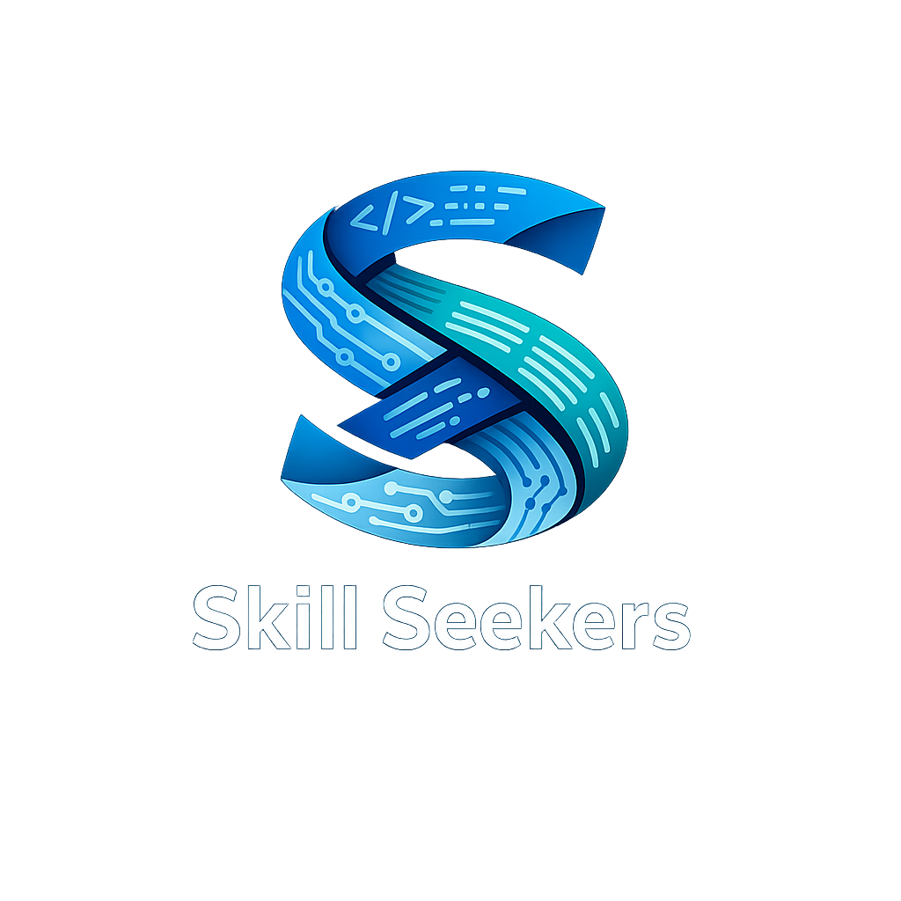
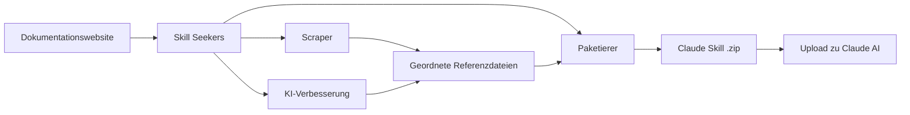

<p align="center">
  
</p>

# Skill Seekers

[English](README.md) | [简体中文](README.zh-CN.md) | [日本語](README.ja.md) | [한국어](README.ko.md) | [Español](README.es.md) | [Français](README.fr.md) | Deutsch | [Português](README.pt-BR.md) | [Türkçe](README.tr.md) | [العربية](README.ar.md) | [हिन्दी](README.hi.md) | [Русский](README.ru.md)

> ⚠️ **Hinweis zur maschinellen Übersetzung**
>
> Dieses Dokument wurde automatisch durch KI übersetzt. Trotz Bemühungen um Qualität können ungenaue Ausdrücke vorkommen.
>
> Gerne können Sie über [GitHub Issue #260](https://github.com/yusufkaraaslan/Skill_Seekers/issues/260) zur Verbesserung der Übersetzung beitragen! Ihr Feedback ist uns sehr wertvoll.

[](https://github.com/yusufkaraaslan/Skill_Seekers/releases)
[](https://opensource.org/licenses/MIT)
[](https://www.python.org/downloads/)
[](https://modelcontextprotocol.io)
[](tests/)
[](https://github.com/users/yusufkaraaslan/projects/2)
[](https://pypi.org/project/skill-seekers/)
[](https://pypi.org/project/skill-seekers/)
[](https://pypi.org/project/skill-seekers/)
[](https://skillseekersweb.com/)
[](https://x.com/_yUSyUS_)
[](https://github.com/yusufkaraaslan/Skill_Seekers)

**Die Datenschicht für KI-Systeme.** Skill Seekers verwandelt Dokumentationswebsites, GitHub-Repositories, PDFs, Videos, Jupyter-Notebooks, Wikis und über 10 weitere Quelltypen in strukturierte Wissensressourcen — bereit für KI-Skills (Claude, Gemini, OpenAI), RAG-Pipelines (LangChain, LlamaIndex, Pinecone) und KI-Programmierassistenten (Cursor, Windsurf, Cline) in Minuten statt Stunden.

> **[Besuchen Sie SkillSeekersWeb.com](https://skillseekersweb.com/)** - Durchsuchen Sie über 24 vorgefertigte Konfigurationen, teilen Sie Ihre Konfigurationen und greifen Sie auf die vollständige Dokumentation zu!

> **[Entwicklungsroadmap und Aufgaben ansehen](https://github.com/users/yusufkaraaslan/projects/2)** - 134 Aufgaben in 10 Kategorien — wählen Sie eine beliebige zum Mitwirken!

## 🌐 Ökosystem

Skill Seekers ist ein Multi-Repository-Projekt. Hier finden Sie alles:

| Repository | Beschreibung | Links |
|-----------|-------------|-------|
| **[Skill_Seekers](https://github.com/yusufkaraaslan/Skill_Seekers)** | Kern-CLI & MCP-Server (dieses Repo) | [PyPI](https://pypi.org/project/skill-seekers/) |
| **[skillseekersweb](https://github.com/yusufkaraaslan/skillseekersweb)** | Website & Dokumentation | [Web](https://skillseekersweb.com/) |
| **[skill-seekers-configs](https://github.com/yusufkaraaslan/skill-seekers-configs)** | Community-Konfigurationsrepository | |
| **[skill-seekers-action](https://github.com/yusufkaraaslan/skill-seekers-action)** | GitHub Action für CI/CD | |
| **[skill-seekers-plugin](https://github.com/yusufkaraaslan/skill-seekers-plugin)** | Claude Code Plugin | |
| **[homebrew-skill-seekers](https://github.com/yusufkaraaslan/homebrew-skill-seekers)** | Homebrew Tap für macOS | |

> **Möchten Sie beitragen?** Die Website- und Konfigurations-Repos sind ideale Einstiegspunkte für neue Mitwirkende!

## Die Datenschicht für KI-Systeme

**Skill Seekers ist die universelle Vorverarbeitungsschicht**, die zwischen Rohdokumentation und jedem KI-System steht, das diese konsumiert. Ob Sie Claude-Skills, eine LangChain-RAG-Pipeline oder eine Cursor-`.cursorrules`-Datei erstellen — die Datenaufbereitung ist identisch. Sie führen sie einmal durch und exportieren für alle Zielplattformen.

```bash
# Ein Befehl → strukturierte Wissensressource
skill-seekers create https://docs.react.dev/
# oder: skill-seekers create facebook/react
# oder: skill-seekers create ./my-project

# Export in jedes KI-System
skill-seekers package output/react --target claude      # → Claude AI Skill (ZIP)
skill-seekers package output/react --target langchain   # → LangChain Documents
skill-seekers package output/react --target llama-index # → LlamaIndex TextNodes
skill-seekers package output/react --target cursor      # → .cursorrules
```

### Was erstellt wird

| Ausgabe | Ziel | Einsatzbereich |
|---------|------|---------------|
| **Claude Skill** (ZIP + YAML) | `--target claude` | Claude Code, Claude API |
| **Gemini Skill** (tar.gz) | `--target gemini` | Google Gemini |
| **OpenAI / Custom GPT** (ZIP) | `--target openai` | GPT-4o, benutzerdefinierte Assistenten |
| **LangChain Documents** | `--target langchain` | QA-Chains, Agenten, Retriever |
| **LlamaIndex TextNodes** | `--target llama-index` | Query Engines, Chat Engines |
| **Haystack Documents** | `--target haystack` | Enterprise-RAG-Pipelines |
| **Pinecone-ready** (Markdown) | `--target markdown` | Vektor-Upsert |
| **ChromaDB / FAISS / Qdrant** | `--format chroma/faiss/qdrant` | Lokale Vektordatenbanken |
| **Cursor** `.cursorrules` | `--target claude` → kopieren | Cursor IDE KI-Kontext |
| **Windsurf / Cline / Continue** | `--target claude` → kopieren | VS Code, IntelliJ, Vim |

### Warum Skill Seekers

- **99 % schneller** — Tage manueller Datenaufbereitung → 15–45 Minuten
- **KI-Skill-Qualität** — Über 500 Zeilen SKILL.md-Dateien mit Beispielen, Mustern und Anleitungen
- **RAG-fertige Chunks** — Intelligentes Chunking bewahrt Codeblöcke und Kontext
- **17 Quelltypen** — Dokumentation + GitHub + PDF + Videos + Notebooks + Wikis u. v. m. zu einer Wissensressource vereinen
- **Einmal aufbereiten, überall exportieren** — Export auf 16 Plattformen ohne erneutes Scrapen
- **Videos** — Code, Transkripte und strukturiertes Wissen aus YouTube- und lokalen Videos extrahieren
- **Kampferprobt** — Über 2.540 Tests, 24+ Framework-Presets, produktionsreif

## Schnellstart

```bash
pip install skill-seekers

# KI-Skill aus beliebiger Quelle erstellen
skill-seekers create https://docs.django.com/    # Dokumentationswebsite
skill-seekers create django/django               # GitHub-Repository
skill-seekers create ./my-codebase               # Lokales Projekt
skill-seekers create manual.pdf                  # PDF-Datei
skill-seekers create manual.docx                 # Word-Dokument
skill-seekers create book.epub                   # EPUB-E-Book
skill-seekers create notebook.ipynb              # Jupyter Notebook
skill-seekers create page.html                   # Lokale HTML-Datei
skill-seekers create api-spec.yaml               # OpenAPI/Swagger-Spezifikation
skill-seekers create guide.adoc                  # AsciiDoc-Dokument
skill-seekers create slides.pptx                 # PowerPoint-Präsentation

# Video (YouTube, Vimeo oder lokale Datei — erfordert skill-seekers[video])
skill-seekers video --url https://www.youtube.com/watch?v=... --name mytutorial
# Erstmalig? Automatische Installation GPU-bewusster visueller Abhängigkeiten:
skill-seekers video --setup

# Je nach Einsatzzweck exportieren
skill-seekers package output/django --target claude     # Claude AI Skill
skill-seekers package output/django --target langchain  # LangChain RAG
skill-seekers package output/django --target cursor     # Cursor IDE Kontext
```

**Vollständige Beispiele:**
- [Claude AI Skill](examples/claude-skill/) - Skill für Claude Code
- [LangChain RAG-Pipeline](examples/langchain-rag-pipeline/) - QA-Chain mit Chroma
- [Cursor IDE Kontext](examples/cursor-react-skill/) - Framework-bewusstes KI-Programmieren

## Was ist Skill Seekers?

Skill Seekers ist die **Datenschicht für KI-Systeme** und transformiert 17 Quelltypen — Dokumentationswebsites, GitHub-Repositories, PDFs, Videos, Jupyter-Notebooks, Word-/EPUB-/AsciiDoc-Dokumente, OpenAPI/Swagger-Spezifikationen, PowerPoint-Präsentationen, RSS/Atom-Feeds, Man-Pages, Confluence-Wikis, Notion-Seiten, Slack-/Discord-Chatexporte und mehr — in strukturierte Wissensressourcen für jedes KI-Ziel:

| Anwendungsfall | Ergebnis | Beispiele |
|----------------|----------|-----------|
| **KI-Skills** | Umfassende SKILL.md + Referenzdateien | Claude Code, Gemini, GPT |
| **RAG-Pipelines** | Dokumenten-Chunks mit reichhaltigen Metadaten | LangChain, LlamaIndex, Haystack |
| **Vektordatenbanken** | Vorformatierte, upload-bereite Daten | Pinecone, Chroma, Weaviate, FAISS |
| **KI-Programmierassistenten** | Kontextdateien, die Ihre IDE-KI automatisch liest | Cursor, Windsurf, Cline, Continue.dev |

Anstatt tagelange manuelle Vorverarbeitung durchzuführen, erledigt Skill Seekers dies:

1. **Erfassen** — Dokumentation, GitHub-Repos, lokale Codebasen, PDFs, Videos, Jupyter-Notebooks, Wikis und über 17 weitere Quelltypen
2. **Analysieren** — Tiefgreifendes AST-Parsing, Mustererkennung, API-Extraktion
3. **Strukturieren** — Kategorisierte Referenzdateien mit Metadaten
4. **Verbessern** — KI-gestützte SKILL.md-Generierung (Claude, Gemini oder lokal)
5. **Exportieren** — 16 plattformspezifische Formate aus einer Ressource

## Warum Skill Seekers nutzen?

### Für KI-Skill-Ersteller (Claude, Gemini, OpenAI)

- **Produktionsreife Skills** — Über 500 Zeilen SKILL.md-Dateien mit Codebeispielen, Mustern und Anleitungen
- **Verbesserungsworkflows** — `security-focus`, `architecture-comprehensive` oder eigene YAML-Presets anwenden
- **Jede Domäne** — Game-Engines (Godot, Unity), Frameworks (React, Django), interne Tools
- **Teamarbeit** — Interne Dokumentation + Code zu einer einzigen Wissensquelle vereinen
- **Hohe Qualität** — KI-verbessert mit Beispielen, Kurzreferenz und Navigationshinweisen

### Für RAG-Entwickler und KI-Ingenieure

- **RAG-fertige Daten** — Vorgesplittete LangChain `Documents`, LlamaIndex `TextNodes`, Haystack `Documents`
- **99 % schneller** — Tage der Vorverarbeitung → 15–45 Minuten
- **Intelligente Metadaten** — Kategorien, Quellen, Typen → höhere Abrufgenauigkeit
- **Multi-Source** — Dokumentation + GitHub + PDFs in einer Pipeline kombinieren
- **Plattformunabhängig** — Export in jede Vektordatenbank oder jedes Framework ohne erneutes Scrapen

### Für KI-Programmierassistenten-Nutzer

- **Cursor / Windsurf / Cline** — `.cursorrules` / `.windsurfrules` / `.clinerules` automatisch generieren
- **Dauerhafter Kontext** — Die KI „kennt" Ihre Frameworks ohne wiederholtes Prompting
- **Immer aktuell** — Kontext in Minuten aktualisieren, wenn sich die Dokumentation ändert

## Kernfunktionen

### Dokumentations-Scraping
- **llms.txt-Unterstützung** - Erkennt und nutzt automatisch LLM-bereite Dokumentationsdateien (10x schneller)
- **Universal-Scraper** - Funktioniert mit JEDER Dokumentationswebsite
- **Intelligente Kategorisierung** - Organisiert Inhalte automatisch nach Themen
- **Code-Spracherkennung** - Erkennt Python, JavaScript, C++, GDScript usw.
- **Über 24 fertige Presets** - Godot, React, Vue, Django, FastAPI und mehr

### PDF-Unterstützung
- **Grundlegende PDF-Extraktion** - Text, Code und Bilder aus PDFs extrahieren
- **OCR für gescannte PDFs** - Text aus gescannten Dokumenten extrahieren
- **Passwortgeschützte PDFs** - Verschlüsselte PDFs verarbeiten
- **Tabellenextraktion** - Komplexe Tabellen aus PDFs extrahieren
- **Parallelverarbeitung** - 3x schneller bei großen PDFs
- **Intelligentes Caching** - 50 % schneller bei Wiederholungen

### Videoextraktion
- **YouTube und lokale Videos** - Transkripte, Bildschirmcode und strukturiertes Wissen aus Videos extrahieren
- **Visuelle Frameanalyse** - OCR-Extraktion aus Code-Editoren, Terminals, Folien und Diagrammen
- **GPU-Autoerkennung** - Installiert automatisch den richtigen PyTorch-Build (CUDA/ROCm/MPS/CPU)
- **KI-Verbesserung** - Zwei Durchläufe: OCR-Artefakte bereinigen + ausgefeilte SKILL.md generieren
- **Zeitausschnitte** - Bestimmte Abschnitte mit `--start-time` und `--end-time` extrahieren
- **Playlist-Unterstützung** - Alle Videos einer YouTube-Playlist stapelweise verarbeiten

### GitHub-Repository-Analyse
- **Tiefgreifende Codeanalyse** - AST-Parsing für Python, JavaScript, TypeScript, Java, C++, Go
- **API-Extraktion** - Funktionen, Klassen, Methoden mit Parametern und Typen
- **Repository-Metadaten** - README, Dateibaum, Sprachverteilung, Stars/Forks
- **GitHub Issues und PRs** - Offene/geschlossene Issues mit Labels und Meilensteinen abrufen
- **CHANGELOG und Releases** - Versionshistorie automatisch extrahieren
- **Konflikterkennung** - Dokumentierte APIs mit tatsächlicher Code-Implementierung vergleichen
- **MCP-Integration** - Natürliche Sprache: „Scrape GitHub Repo facebook/react"

### Vereinheitlichtes Multi-Source-Scraping
- **Mehrere Quellen kombinieren** - Dokumentation + GitHub + PDF in einem Skill vereinen
- **Konflikterkennung** - Automatische Erkennung von Abweichungen zwischen Dokumentation und Code
- **Intelligentes Zusammenführen** - Regelbasierte oder KI-gesteuerte Konfliktlösung
- **Transparente Berichte** - Nebeneinander-Vergleich mit Warnhinweisen
- **Dokumentationslückenanalyse** - Erkennt veraltete Dokumentation und undokumentierte Funktionen
- **Einzelne Wahrheitsquelle** - Ein Skill zeigt sowohl Absicht (Dokumentation) als auch Realität (Code)
- **Abwärtskompatibel** - Bestehende Einzelquellen-Konfigurationen funktionieren weiterhin

### Multi-LLM-Plattformunterstützung
- **12 LLM-Plattformen** - Claude AI, Google Gemini, OpenAI ChatGPT, MiniMax AI, Generisches Markdown, OpenCode, Kimi, DeepSeek, Qwen, OpenRouter, Together AI, Fireworks AI
- **Universelles Scraping** - Dieselbe Dokumentation funktioniert für alle Plattformen
- **Plattformspezifische Paketierung** - Optimierte Formate für jedes LLM
- **Ein-Befehl-Export** - `--target`-Flag wählt die Plattform
- **Optionale Abhängigkeiten** - Nur installieren, was Sie benötigen
- **100 % abwärtskompatibel** - Bestehende Claude-Workflows bleiben unverändert

| Plattform | Format | Upload | Verbesserung | API Key | Benutzerdefinierter Endpunkt |
|-----------|--------|--------|-------------|---------|------------------------------|
| **Claude AI** | ZIP + YAML | Auto | Ja | ANTHROPIC_API_KEY | ANTHROPIC_BASE_URL |
| **Google Gemini** | tar.gz | Auto | Ja | GOOGLE_API_KEY | - |
| **OpenAI ChatGPT** | ZIP + Vector Store | Auto | Ja | OPENAI_API_KEY | - |
| **Generisches Markdown** | ZIP | Manuell | Nein | - | - |

```bash
# Claude (Standard - keine Änderungen nötig!)
skill-seekers package output/react/
skill-seekers upload react.zip

# Google Gemini
pip install skill-seekers[gemini]
skill-seekers package output/react/ --target gemini
skill-seekers upload react-gemini.tar.gz --target gemini

# OpenAI ChatGPT
pip install skill-seekers[openai]
skill-seekers package output/react/ --target openai
skill-seekers upload react-openai.zip --target openai

# Generisches Markdown (universeller Export)
skill-seekers package output/react/ --target markdown
```

<details>
<summary><strong>Umgebungsvariablen für Claude-kompatible APIs (z. B. GLM-4.7)</strong></summary>

Skill Seekers unterstützt jeden Claude-kompatiblen API-Endpunkt:

```bash
# Option 1: Offizielle Anthropic API (Standard)
export ANTHROPIC_API_KEY=sk-ant-...

# Option 2: GLM-4.7 Claude-kompatible API
export ANTHROPIC_API_KEY=your-glm-47-api-key
export ANTHROPIC_BASE_URL=https://glm-4-7-endpoint.com/v1

# Alle KI-Verbesserungsfunktionen verwenden den konfigurierten Endpunkt
skill-seekers enhance output/react/
skill-seekers analyze --directory . --enhance
```

**Hinweis**: Das Setzen von `ANTHROPIC_BASE_URL` ermöglicht die Nutzung jedes Claude-kompatiblen API-Endpunkts, wie GLM-4.7 oder anderer kompatibler Dienste.

</details>

**Installation:**
```bash
# Mit Gemini-Unterstützung installieren
pip install skill-seekers[gemini]

# Mit OpenAI-Unterstützung installieren
pip install skill-seekers[openai]

# Mit allen LLM-Plattformen installieren
pip install skill-seekers[all-llms]
```

### RAG-Framework-Integrationen

- **LangChain Documents** - Direkter Export ins `Document`-Format mit `page_content` + Metadaten
  - Geeignet für: QA-Chains, Retriever, Vektorspeicher, Agenten
  - Beispiel: [LangChain RAG-Pipeline](examples/langchain-rag-pipeline/)
  - Anleitung: [LangChain-Integration](docs/integrations/LANGCHAIN.md)

- **LlamaIndex TextNodes** - Export ins `TextNode`-Format mit eindeutigen IDs + Embeddings
  - Geeignet für: Query Engines, Chat Engines, Storage Context
  - Beispiel: [LlamaIndex Query Engine](examples/llama-index-query-engine/)
  - Anleitung: [LlamaIndex-Integration](docs/integrations/LLAMA_INDEX.md)

- **Pinecone-fertiges Format** - Optimiert für Vektordatenbank-Upsert
  - Geeignet für: Produktions-Vektorsuche, semantische Suche, Hybridsuche
  - Beispiel: [Pinecone Upsert](examples/pinecone-upsert/)
  - Anleitung: [Pinecone-Integration](docs/integrations/PINECONE.md)

**Schnellexport:**
```bash
# LangChain Documents (JSON)
skill-seekers package output/django --target langchain
# → output/django-langchain.json

# LlamaIndex TextNodes (JSON)
skill-seekers package output/django --target llama-index
# → output/django-llama-index.json

# Markdown (Universal)
skill-seekers package output/django --target markdown
# → output/django-markdown/SKILL.md + references/
```

**Vollständige RAG-Pipeline-Anleitung:** [RAG-Pipelines-Dokumentation](docs/integrations/RAG_PIPELINES.md)

---

### KI-Programmierassistenten-Integrationen

Verwandeln Sie beliebige Framework-Dokumentation in Experten-Programmierkontext für über 4 KI-Assistenten:

- **Cursor IDE** - `.cursorrules` für KI-gestützte Codevorschläge generieren
  - Geeignet für: Framework-spezifische Codegenerierung, konsistente Muster
  - Anleitung: [Cursor-Integration](docs/integrations/CURSOR.md)
  - Beispiel: [Cursor React Skill](examples/cursor-react-skill/)

- **Windsurf** - Windsurf-KI-Assistentenkontext mit `.windsurfrules` anpassen
  - Geeignet für: IDE-native KI-Unterstützung, Flow-basiertes Programmieren
  - Anleitung: [Windsurf-Integration](docs/integrations/WINDSURF.md)
  - Beispiel: [Windsurf FastAPI Kontext](examples/windsurf-fastapi-context/)

- **Cline (VS Code)** - System-Prompts + MCP für VS Code Agenten
  - Geeignet für: Agentische Codegenerierung in VS Code
  - Anleitung: [Cline-Integration](docs/integrations/CLINE.md)
  - Beispiel: [Cline Django Assistent](examples/cline-django-assistant/)

- **Continue.dev** - Kontextserver für IDE-unabhängige KI
  - Geeignet für: Multi-IDE-Umgebungen (VS Code, JetBrains, Vim), benutzerdefinierte LLM-Anbieter
  - Anleitung: [Continue-Integration](docs/integrations/CONTINUE_DEV.md)
  - Beispiel: [Continue Universal Kontext](examples/continue-dev-universal/)

**Schnellexport (für KI-Programmiertools):**
```bash
# Für jeden KI-Programmierassistenten (Cursor, Windsurf, Cline, Continue.dev)
skill-seekers scrape --config configs/django.json
skill-seekers package output/django --target claude

# In Ihr Projekt kopieren (Beispiel für Cursor)
cp output/django-claude/SKILL.md my-project/.cursorrules

# Oder für Windsurf
cp output/django-claude/SKILL.md my-project/.windsurf/rules/django.md

# Oder für Cline
cp output/django-claude/SKILL.md my-project/.clinerules
```

**Integrations-Hub:** [Alle KI-System-Integrationen](docs/integrations/INTEGRATIONS.md)

---

### Drei-Stream-GitHub-Architektur
- **Triple-Stream-Analyse** - GitHub-Repos in Code-, Dokumentations- und Insights-Streams aufteilen
- **Vereinheitlichter Codebase-Analyzer** - Funktioniert mit GitHub-URLs UND lokalen Pfaden
- **C3.x als Analysetiefe** - „basic" (1–2 Min.) oder „c3x" (20–60 Min.) Analyse wählen
- **Erweiterte Router-Generierung** - GitHub-Metadaten, README-Schnellstart, häufige Probleme
- **Issue-Integration** - Häufigste Probleme und Lösungen aus GitHub Issues
- **Intelligente Routing-Schlüsselwörter** - GitHub-Labels 2x gewichtet für bessere Themenerkennung

**Drei Streams erklärt:**
- **Stream 1: Code** - Tiefgreifende C3.x-Analyse (Muster, Beispiele, Anleitungen, Konfigurationen, Architektur)
- **Stream 2: Dokumentation** - Repository-Dokumentation (README, CONTRIBUTING, docs/*.md)
- **Stream 3: Insights** - Community-Wissen (Issues, Labels, Stars, Forks)

```python
from skill_seekers.cli.unified_codebase_analyzer import UnifiedCodebaseAnalyzer

# GitHub-Repo mit allen drei Streams analysieren
analyzer = UnifiedCodebaseAnalyzer()
result = analyzer.analyze(
    source="https://github.com/facebook/react",
    depth="c3x",  # oder "basic" für schnelle Analyse
    fetch_github_metadata=True
)

print(f"Designmuster: {len(result.code_analysis['c3_1_patterns'])}")
print(f"Stars: {result.github_insights['metadata']['stars']}")
```

**Vollständige Dokumentation**: [Drei-Stream-Implementierungszusammenfassung](docs/IMPLEMENTATION_SUMMARY_THREE_STREAM.md)

### Intelligentes Rate-Limit-Management und Konfiguration
- **Multi-Token-Konfigurationssystem** - Mehrere GitHub-Konten verwalten (Privat, Arbeit, Open Source)
  - Sichere Konfigurationsspeicherung unter `~/.config/skill-seekers/config.json` (Berechtigung 600)
  - Rate-Limit-Strategien pro Profil: `prompt`, `wait`, `switch`, `fail`
  - Intelligente Fallback-Kette: CLI-Argument → Umgebungsvariable → Konfigurationsdatei → Abfrage
- **Interaktiver Konfigurationsassistent** - Ansprechende Terminal-UI für einfache Einrichtung
- **Intelligenter Rate-Limit-Handler** - Kein endloses Warten mehr!
  - Echtzeit-Countdown, automatischer Profilwechsel
  - Vier Strategien: prompt (fragen), wait (Countdown), switch (wechseln), fail (abbrechen)
- **Wiederaufnahme-Funktion** - Unterbrochene Aufgaben fortsetzen
- **CI/CD-Unterstützung** - `--non-interactive`-Flag für Automatisierung

**Schnelleinrichtung:**
```bash
# Einmalige Konfiguration (5 Minuten)
skill-seekers config --github

# Spezifisches Profil für private Repositories verwenden
skill-seekers github --repo mycompany/private-repo --profile work

# CI/CD-Modus (schnelles Abbrechen, keine Abfragen)
skill-seekers github --repo owner/repo --non-interactive
```

### Bootstrap-Skill - Selbst-Hosting

Skill Seekers als Claude Code Skill generieren:

```bash
./scripts/bootstrap_skill.sh
cp -r output/skill-seekers ~/.claude/skills/
```

### Private Konfigurations-Repositories
- **Git-basierte Konfigurationsquellen** - Konfigurationen aus privaten/Team-Git-Repositories abrufen
- **Multi-Source-Verwaltung** - Unbegrenzte GitHub-, GitLab-, Bitbucket-Repositories registrieren
- **Team-Zusammenarbeit** - Benutzerdefinierte Konfigurationen in 3–5-Personen-Teams teilen
- **Enterprise-Unterstützung** - Skalierung auf 500+ Entwickler
- **Sichere Authentifizierung** - Umgebungsvariablen-Tokens (GITHUB_TOKEN, GITLAB_TOKEN)

### Codebase-Analyse (C3.x)

**C3.4: Konfigurationsmuster-Extraktion (mit KI-Verbesserung)**
- **9 Konfigurationsformate** - JSON, YAML, TOML, ENV, INI, Python, JavaScript, Dockerfile, Docker Compose
- **7 Mustertypen** - Datenbank-, API-, Logging-, Cache-, E-Mail-, Auth-, Server-Konfigurationen
- **KI-Verbesserung** - Optionale Dual-Modus-KI-Analyse (API + LOCAL)
- **Sicherheitsanalyse** - Hartcodierte Geheimnisse und offengelegte Anmeldedaten finden

**C3.3: KI-verbesserte Anleitungen**
- **Umfassende KI-Verbesserung** - Grundanleitungen in professionelle Tutorials verwandeln
- **5 automatische Verbesserungen** - Schrittbeschreibungen, Fehlerbehebung, Voraussetzungen, nächste Schritte, Anwendungsfälle
- **Dual-Modus-Unterstützung** - API-Modus (Claude API) oder LOCAL-Modus (Claude Code CLI)
- **LOCAL-Modus kostenlos** - Kostenlose Verbesserung mit Ihrem Claude Code Max Plan

**Verwendung:**
```bash
# Schnellanalyse (1–2 Minuten, nur Grundfunktionen)
skill-seekers analyze --directory tests/ --quick

# Umfassende Analyse (mit KI, 20–60 Minuten)
skill-seekers analyze --directory tests/ --comprehensive

# Mit KI-Verbesserung
skill-seekers analyze --directory tests/ --enhance
```

**Vollständige Dokumentation:** [docs/HOW_TO_GUIDES.md](docs/HOW_TO_GUIDES.md#ai-enhancement-new)

### Verbesserungs-Workflow-Presets

Wiederverwendbare YAML-definierte Verbesserungspipelines, die steuern, wie KI Ihre Rohdokumentation in einen ausgefeilten Skill transformiert.

- **5 mitgelieferte Presets** — `default`, `minimal`, `security-focus`, `architecture-comprehensive`, `api-documentation`
- **Benutzerdefinierte Presets** — Eigene Workflows unter `~/.config/skill-seekers/workflows/` hinzufügen
- **Mehrere Workflows** — Zwei oder mehr Workflows in einem Befehl verketten
- **Vollständige CLI-Verwaltung** — Workflows auflisten, anzeigen, kopieren, hinzufügen, entfernen und validieren

```bash
# Einzelnen Workflow anwenden
skill-seekers create ./my-project --enhance-workflow security-focus

# Mehrere Workflows verketten (werden der Reihe nach angewendet)
skill-seekers create ./my-project \
  --enhance-workflow security-focus \
  --enhance-workflow minimal

# Presets verwalten
skill-seekers workflows list                          # Alle auflisten (mitgeliefert + benutzerdefiniert)
skill-seekers workflows show security-focus           # YAML-Inhalt anzeigen
skill-seekers workflows copy security-focus           # Zum Benutzerverzeichnis kopieren (zum Bearbeiten)
skill-seekers workflows add ./my-workflow.yaml        # Benutzerdefiniertes Preset installieren
skill-seekers workflows remove my-workflow            # Benutzerdefiniertes Preset entfernen
skill-seekers workflows validate security-focus       # Preset-Struktur validieren

# Mehrere gleichzeitig kopieren
skill-seekers workflows copy security-focus minimal api-documentation

# Mehrere Dateien gleichzeitig hinzufügen
skill-seekers workflows add ./wf-a.yaml ./wf-b.yaml

# Mehrere gleichzeitig entfernen
skill-seekers workflows remove my-wf-a my-wf-b
```

**YAML-Preset-Format:**
```yaml
name: security-focus
description: "Sicherheitsorientierte Prüfung: Schwachstellen, Authentifizierung, Datenverarbeitung"
version: "1.0"
stages:
  - name: vulnerabilities
    type: custom
    prompt: "Prüfung auf OWASP Top 10 und häufige Sicherheitslücken..."
  - name: auth-review
    type: custom
    prompt: "Authentifizierungs- und Autorisierungsmuster untersuchen..."
    uses_history: true
```

### Leistung und Skalierung
- **Async-Modus** - 2–3x schnelleres Scraping mit async/await (Flag `--async` verwenden)
- **Unterstützung großer Dokumentationen** - 10K–40K+ Seiten mit intelligentem Aufteilen verarbeiten
- **Router-/Hub-Skills** - Intelligentes Routing zu spezialisierten Sub-Skills
- **Paralleles Scraping** - Mehrere Skills gleichzeitig verarbeiten
- **Checkpoint/Wiederaufnahme** - Bei langen Scraping-Vorgängen nie den Fortschritt verlieren
- **Caching-System** - Einmal scrapen, sofort neu erstellen

### Qualitätssicherung
- **Vollständig getestet** - Über 2.540 Tests mit umfassender Abdeckung

---

## Installation

```bash
# Basisinstallation (Dokumentations-Scraping, GitHub-Analyse, PDF, Paketierung)
pip install skill-seekers

# Mit Unterstützung aller LLM-Plattformen
pip install skill-seekers[all-llms]

# Mit MCP-Server
pip install skill-seekers[mcp]

# Alles
pip install skill-seekers[all]
```

**Hilfe bei der Auswahl nötig?** Starten Sie den Einrichtungsassistenten:
```bash
skill-seekers-setup
```

### Installationsoptionen

| Installation | Funktionen |
|-------------|-----------|
| `pip install skill-seekers` | Scraping, GitHub-Analyse, PDF, alle Plattformen |
| `pip install skill-seekers[gemini]` | + Google Gemini-Unterstützung |
| `pip install skill-seekers[openai]` | + OpenAI ChatGPT-Unterstützung |
| `pip install skill-seekers[all-llms]` | + Alle LLM-Plattformen |
| `pip install skill-seekers[mcp]` | + MCP-Server |
| `pip install skill-seekers[video]` | + YouTube-/Vimeo-Transkript- und Metadatenextraktion |
| `pip install skill-seekers[video-full]` | + Whisper-Transkription und visuelle Frameextraktion |
| `pip install skill-seekers[jupyter]` | + Jupyter-Notebook-Unterstützung |
| `pip install skill-seekers[pptx]` | + PowerPoint-Unterstützung |
| `pip install skill-seekers[confluence]` | + Confluence-Wiki-Unterstützung |
| `pip install skill-seekers[notion]` | + Notion-Seitenunterstützung |
| `pip install skill-seekers[rss]` | + RSS-/Atom-Feed-Unterstützung |
| `pip install skill-seekers[chat]` | + Slack-/Discord-Chatexport-Unterstützung |
| `pip install skill-seekers[asciidoc]` | + AsciiDoc-Dokumentunterstützung |
| `pip install skill-seekers[all]` | Alles aktiviert |

> **Visuelle Video-Abhängigkeiten (GPU-bewusst):** Nach der Installation von `skill-seekers[video-full]` führen Sie
> `skill-seekers video --setup` aus, um Ihre GPU automatisch zu erkennen und die richtige PyTorch-
> Variante + easyocr zu installieren. Dies ist der empfohlene Weg zur Installation visueller Extraktionsabhängigkeiten.

---

## Ein-Befehl-Installations-Workflow

**Der schnellste Weg von der Konfiguration zum hochgeladenen Skill — vollständig automatisiert:**

```bash
# React-Skill aus offiziellen Konfigurationen installieren (automatischer Upload zu Claude)
skill-seekers install --config react

# Aus lokaler Konfigurationsdatei installieren
skill-seekers install --config configs/custom.json

# Ohne Upload installieren (nur Paketierung)
skill-seekers install --config django --no-upload

# Workflow ohne Ausführung in der Vorschau anzeigen
skill-seekers install --config react --dry-run
```

**Ausgeführte Phasen:**
```
Phase 1: Konfiguration abrufen (falls Konfigurationsname angegeben)
Phase 2: Dokumentation scrapen
Phase 3: KI-Verbesserung
Phase 4: Skill paketieren
Phase 5: Zu Claude hochladen (optional, erfordert API Key)
```

---

## Funktionsmatrix

Skill Seekers unterstützt **12 LLM-Plattformen**, **17 Quelltypen** und vollständige Funktionsparität für alle Ziele.

**Plattformen:** Claude AI, Google Gemini, OpenAI ChatGPT, MiniMax AI, Generisches Markdown, OpenCode, Kimi, DeepSeek, Qwen, OpenRouter, Together AI, Fireworks AI
**Quelltypen:** Dokumentationswebsites, GitHub-Repos, PDFs, Word (.docx), EPUB, Video, lokale Codebasen, Jupyter-Notebooks, lokales HTML, OpenAPI/Swagger, AsciiDoc, PowerPoint (.pptx), RSS-/Atom-Feeds, Man-Pages, Confluence-Wikis, Notion-Seiten, Slack-/Discord-Chatexporte

Vollständige Informationen finden Sie in der [vollständigen Funktionsmatrix](docs/FEATURE_MATRIX.md).

### Schneller Plattformvergleich

| Funktion | Claude | Gemini | OpenAI | Markdown |
|----------|--------|--------|--------|----------|
| Format | ZIP + YAML | tar.gz | ZIP + Vector | ZIP |
| Upload | API | API | API | Manuell |
| Verbesserung | Sonnet 4 | 2.0 Flash | GPT-4o | Keine |
| Alle Skill-Modi | Ja | Ja | Ja | Ja |

---

## Verwendungsbeispiele

### Dokumentations-Scraping

```bash
# Dokumentationswebsite scrapen
skill-seekers scrape --config configs/react.json

# Schnelles Scraping (ohne Konfiguration)
skill-seekers scrape --url https://react.dev --name react

# Mit Async-Modus (3x schneller)
skill-seekers scrape --config configs/godot.json --async --workers 8
```

### PDF-Extraktion

```bash
# Grundlegende PDF-Extraktion
skill-seekers pdf --pdf docs/manual.pdf --name myskill

# Erweiterte Funktionen
skill-seekers pdf --pdf docs/manual.pdf --name myskill \
    --extract-tables \        # Tabellen extrahieren
    --parallel \              # Schnelle Parallelverarbeitung
    --workers 8               # 8 CPU-Kerne verwenden

# Gescannte PDFs (erfordert: pip install pytesseract Pillow)
skill-seekers pdf --pdf docs/scanned.pdf --name myskill --ocr
```

### Videoextraktion

```bash
# Video-Unterstützung installieren
pip install skill-seekers[video]        # Transkripte + Metadaten
pip install skill-seekers[video-full]   # + Whisper-Transkription + visuelle Frameextraktion

# GPU automatisch erkennen und visuelle Abhängigkeiten installieren (PyTorch + easyocr)
skill-seekers video --setup

# Aus YouTube-Video extrahieren
skill-seekers video --url https://www.youtube.com/watch?v=dQw4w9WgXcQ --name mytutorial

# Aus einer YouTube-Playlist extrahieren
skill-seekers video --playlist https://www.youtube.com/playlist?list=... --name myplaylist

# Aus einer lokalen Videodatei extrahieren
skill-seekers video --video-file recording.mp4 --name myrecording

# Mit visueller Frameanalyse extrahieren (erfordert video-full-Abhängigkeiten)
skill-seekers video --url https://www.youtube.com/watch?v=... --name mytutorial --visual

# Mit KI-Verbesserung (OCR bereinigen + ausgefeilte SKILL.md generieren)
skill-seekers video --url https://www.youtube.com/watch?v=... --visual --enhance-level 2

# Bestimmten Abschnitt eines Videos ausschneiden (unterstützt Sekunden, MM:SS, HH:MM:SS)
skill-seekers video --url https://www.youtube.com/watch?v=... --start-time 1:30 --end-time 5:00

# Vision API für OCR-Frames mit niedriger Konfidenz verwenden (erfordert ANTHROPIC_API_KEY)
skill-seekers video --url https://www.youtube.com/watch?v=... --visual --vision-ocr

# Skill aus zuvor extrahierten Daten neu erstellen (Download überspringen)
skill-seekers video --from-json output/mytutorial/video_data/extracted_data.json --name mytutorial
```

> **Vollständige Anleitung:** Siehe [docs/VIDEO_GUIDE.md](docs/VIDEO_GUIDE.md) für die vollständige CLI-Referenz,
> Details zur visuellen Pipeline, KI-Verbesserungsoptionen und Fehlerbehebung.

### GitHub-Repository-Analyse

```bash
# Grundlegendes Repository-Scraping
skill-seekers github --repo facebook/react

# Mit Authentifizierung (höhere Rate-Limits)
export GITHUB_TOKEN=ghp_your_token_here
skill-seekers github --repo facebook/react

# Inhalte anpassen
skill-seekers github --repo django/django \
    --include-issues \        # GitHub Issues extrahieren
    --max-issues 100 \        # Issue-Anzahl begrenzen
    --include-changelog       # CHANGELOG.md extrahieren
```

### Vereinheitlichtes Multi-Source-Scraping

**Dokumentation + GitHub + PDF zu einem vereinheitlichten Skill mit Konflikterkennung kombinieren:**

```bash
# Vorhandene vereinheitlichte Konfigurationen verwenden
skill-seekers unified --config configs/react_unified.json

# Oder vereinheitlichte Konfiguration erstellen
cat > configs/myframework_unified.json << 'EOF'
{
  "name": "myframework",
  "merge_mode": "rule-based",
  "sources": [
    {
      "type": "documentation",
      "base_url": "https://docs.myframework.com/",
      "max_pages": 200
    },
    {
      "type": "github",
      "repo": "owner/myframework",
      "code_analysis_depth": "surface"
    }
  ]
}
EOF

skill-seekers unified --config configs/myframework_unified.json
```

**Die Konflikterkennung findet automatisch:**
- **Im Code fehlend** (hoch): Dokumentiert, aber nicht implementiert
- **In der Dokumentation fehlend** (mittel): Implementiert, aber nicht dokumentiert
- **Signatur-Abweichung**: Unterschiedliche Parameter/Typen
- **Beschreibungs-Abweichung**: Unterschiedliche Erklärungen

**Vollständige Anleitung:** Siehe [docs/UNIFIED_SCRAPING.md](docs/UNIFIED_SCRAPING.md).

### Private Konfigurations-Repositories

**Benutzerdefinierte Konfigurationen über private Git-Repositories im Team teilen:**

```bash
# MCP-Tools verwenden, um das private Team-Repository zu registrieren
add_config_source(
    name="team",
    git_url="https://github.com/mycompany/skill-configs.git",
    token_env="GITHUB_TOKEN"
)

# Konfiguration aus dem Team-Repository abrufen
fetch_config(source="team", config_name="internal-api")
```

**Unterstützte Plattformen:**
- GitHub (`GITHUB_TOKEN`), GitLab (`GITLAB_TOKEN`), Gitea (`GITEA_TOKEN`), Bitbucket (`BITBUCKET_TOKEN`)

**Vollständige Anleitung:** Siehe [docs/GIT_CONFIG_SOURCES.md](docs/GIT_CONFIG_SOURCES.md).

## Funktionsweise



0. **llms.txt erkennen** - Prüft zuerst auf llms-full.txt, llms.txt, llms-small.txt
1. **Scrapen**: Alle Seiten aus der Dokumentation extrahieren
2. **Kategorisieren**: Inhalte nach Themen organisieren (API, Anleitungen, Tutorials usw.)
3. **Verbessern**: KI analysiert Dokumente und erstellt umfassende SKILL.md mit Beispielen
4. **Paketieren**: Alles in eine Claude-fertige `.zip`-Datei bündeln

## Voraussetzungen

**Bevor Sie beginnen, stellen Sie sicher, dass Sie Folgendes haben:**

1. **Python 3.10 oder höher** - [Herunterladen](https://www.python.org/downloads/) | Prüfen: `python3 --version`
2. **Git** - [Herunterladen](https://git-scm.com/) | Prüfen: `git --version`
3. **15–30 Minuten** für die erstmalige Einrichtung

**Erstmalig hier?** → **[Starten Sie hier: Narrensichere Schnellstartanleitung](BULLETPROOF_QUICKSTART.md)**

---

## Skills zu Claude hochladen

Sobald Ihr Skill paketiert ist, müssen Sie ihn zu Claude hochladen:

### Option 1: Automatischer Upload (API-basiert)

```bash
# API Key setzen (einmalig)
export ANTHROPIC_API_KEY=sk-ant-...

# Paketieren und automatisch hochladen
skill-seekers package output/react/ --upload

# ODER vorhandene .zip hochladen
skill-seekers upload output/react.zip
```

### Option 2: Manueller Upload (ohne API Key)

```bash
# Skill paketieren
skill-seekers package output/react/
# → Erstellt output/react.zip

# Dann manuell hochladen:
# - Gehen Sie zu https://claude.ai/skills
# - Klicken Sie auf „Skill hochladen"
# - Wählen Sie output/react.zip
```

### Option 3: MCP (Claude Code)

```
In Claude Code einfach fragen:
"Paketiere und lade den React-Skill hoch"
```

---

## Installation für KI-Agenten

Skill Seekers kann Skills automatisch für 18 KI-Programmieragenten installieren.

```bash
# Für einen bestimmten Agenten installieren
skill-seekers install-agent output/react/ --agent cursor

# Für alle Agenten gleichzeitig installieren
skill-seekers install-agent output/react/ --agent all

# Vorschau ohne Installation
skill-seekers install-agent output/react/ --agent cursor --dry-run
```

### Unterstützte Agenten

| Agent | Pfad | Typ |
|-------|------|-----|
| **Claude Code** | `~/.claude/skills/` | Global |
| **Cursor** | `.cursor/skills/` | Projekt |
| **VS Code / Copilot** | `.github/skills/` | Projekt |
| **Amp** | `~/.amp/skills/` | Global |
| **Goose** | `~/.config/goose/skills/` | Global |
| **OpenCode** | `~/.opencode/skills/` | Global |
| **Windsurf** | `~/.windsurf/skills/` | Global |
| **Roo Code** | `.roo/skills/` | Projekt |
| **Cline** | `.cline/skills/` | Projekt |
| **Aider** | `~/.aider/skills/` | Global |
| **Bolt** | `.bolt/skills/` | Projekt |
| **Kilo Code** | `.kilo/skills/` | Projekt |
| **Continue** | `~/.continue/skills/` | Global |
| **Kimi Code** | `~/.kimi/skills/` | Global |

---

## MCP-Integration (26 Tools)

Skill Seekers liefert einen MCP-Server für die Verwendung mit Claude Code, Cursor, Windsurf, VS Code + Cline oder IntelliJ IDEA.

```bash
# stdio-Modus (Claude Code, VS Code + Cline)
python -m skill_seekers.mcp.server_fastmcp

# HTTP-Modus (Cursor, Windsurf, IntelliJ)
python -m skill_seekers.mcp.server_fastmcp --transport http --port 8765

# Alle Agenten automatisch konfigurieren
./setup_mcp.sh
```

**Alle 26 verfügbaren Tools:**
- **Kern (9):** `list_configs`, `generate_config`, `validate_config`, `estimate_pages`, `scrape_docs`, `package_skill`, `upload_skill`, `enhance_skill`, `install_skill`
- **Erweitert (10):** `scrape_github`, `scrape_pdf`, `unified_scrape`, `merge_sources`, `detect_conflicts`, `add_config_source`, `fetch_config`, `list_config_sources`, `remove_config_source`, `split_config`
- **Vektordatenbank (4):** `export_to_chroma`, `export_to_weaviate`, `export_to_faiss`, `export_to_qdrant`
- **Cloud (3):** `cloud_upload`, `cloud_download`, `cloud_list`

**Vollständige Anleitung:** [docs/MCP_SETUP.md](docs/MCP_SETUP.md)

---

## Konfiguration

### Verfügbare Presets (24+)

```bash
# Alle Presets auflisten
skill-seekers list-configs
```

| Kategorie | Presets |
|-----------|---------|
| **Web-Frameworks** | `react`, `vue`, `angular`, `svelte`, `nextjs` |
| **Python** | `django`, `flask`, `fastapi`, `sqlalchemy`, `pytest` |
| **Spieleentwicklung** | `godot`, `pygame`, `unity` |
| **Tools und DevOps** | `docker`, `kubernetes`, `terraform`, `ansible` |
| **Vereinheitlicht (Doku + GitHub)** | `react-unified`, `vue-unified`, `nextjs-unified` u. a. |

### Eigene Konfiguration erstellen

```bash
# Option 1: Interaktiv
skill-seekers scrape --interactive

# Option 2: Preset kopieren und bearbeiten
cp configs/react.json configs/myframework.json
nano configs/myframework.json
skill-seekers scrape --config configs/myframework.json
```

### Konfigurationsdatei-Struktur

```json
{
  "name": "myframework",
  "description": "Wann dieser Skill verwendet werden soll",
  "base_url": "https://docs.myframework.com/",
  "selectors": {
    "main_content": "article",
    "title": "h1",
    "code_blocks": "pre code"
  },
  "url_patterns": {
    "include": ["/docs", "/guide"],
    "exclude": ["/blog", "/about"]
  },
  "categories": {
    "getting_started": ["intro", "quickstart"],
    "api": ["api", "reference"]
  },
  "rate_limit": 0.5,
  "max_pages": 500
}
```

### Speicherorte für Konfigurationen

Das Tool sucht in dieser Reihenfolge:
1. Exakter Pfad wie angegeben
2. `./configs/` (aktuelles Verzeichnis)
3. `~/.config/skill-seekers/configs/` (Benutzerkonfigurationsverzeichnis)
4. SkillSeekersWeb.com API (Preset-Konfigurationen)

---

## Was wird erstellt

```
output/
├── godot_data/              # Gescrapte Rohdaten
│   ├── pages/              # JSON-Dateien (eine pro Seite)
│   └── summary.json        # Übersicht
│
└── godot/                   # Der Skill
    ├── SKILL.md            # Verbessert mit echten Beispielen
    ├── references/         # Kategorisierte Dokumentation
    │   ├── index.md
    │   ├── getting_started.md
    │   ├── scripting.md
    │   └── ...
    ├── scripts/            # Leer (eigene hinzufügen)
    └── assets/             # Leer (eigene hinzufügen)
```

---

## Fehlerbehebung

### Kein Inhalt extrahiert?
- Überprüfen Sie Ihren `main_content`-Selektor
- Versuchen Sie: `article`, `main`, `div[role="main"]`

### Daten vorhanden, aber werden nicht verwendet?
```bash
# Erneutes Scraping erzwingen
rm -rf output/myframework_data/
skill-seekers scrape --config configs/myframework.json
```

### Kategorien nicht gut?
Bearbeiten Sie den `categories`-Abschnitt in der Konfiguration mit besseren Schlüsselwörtern.

### Dokumentation aktualisieren?
```bash
# Alte Daten löschen und erneut scrapen
rm -rf output/godot_data/
skill-seekers scrape --config configs/godot.json
```

### Verbesserung funktioniert nicht?
```bash
# Prüfen, ob API Key gesetzt ist
echo $ANTHROPIC_API_KEY

# LOCAL-Modus versuchen (nutzt Claude Code Max, kein API Key nötig)
skill-seekers enhance output/react/ --mode LOCAL

# Hintergrund-Verbesserungsstatus überwachen
skill-seekers enhance-status output/react/ --watch
```

### GitHub-Rate-Limit-Probleme?
```bash
# GitHub Token setzen (5000 Anfragen/Stunde vs. 60/Stunde anonym)
export GITHUB_TOKEN=ghp_your_token_here

# Oder mehrere Profile konfigurieren
skill-seekers config --github
```

---

## Leistung

| Aufgabe | Dauer | Hinweise |
|---------|-------|----------|
| Scraping (synchron) | 15–45 Min. | Nur beim ersten Mal, thread-basiert |
| Scraping (asynchron) | 5–15 Min. | 2–3x schneller mit `--async`-Flag |
| Erstellen | 1–3 Min. | Schneller Neuaufbau aus Cache |
| Neuerstellen | <1 Min. | Mit `--skip-scrape` |
| Verbesserung (LOCAL) | 30–60 Sek. | Nutzt Claude Code Max |
| Verbesserung (API) | 20–40 Sek. | Erfordert API Key |
| Video (Transkript) | 1–3 Min. | YouTube/lokal, nur Transkript |
| Video (visuell) | 5–15 Min. | + OCR-Frameextraktion |
| Paketierung | 5–10 Sek. | Finale .zip-Erstellung |

---

## Dokumentation

### Erste Schritte
- **[BULLETPROOF_QUICKSTART.md](BULLETPROOF_QUICKSTART.md)** - **Neue Nutzer starten hier!**
- **[QUICKSTART.md](QUICKSTART.md)** - Schnellstart für erfahrene Nutzer
- **[TROUBLESHOOTING.md](TROUBLESHOOTING.md)** - Häufige Probleme und Lösungen
- **[docs/QUICK_REFERENCE.md](docs/QUICK_REFERENCE.md)** - Einseiter-Kurzreferenz

### Anleitungen
- **[docs/LARGE_DOCUMENTATION.md](docs/LARGE_DOCUMENTATION.md)** - 10K–40K+ Seiten verarbeiten
- **[ASYNC_SUPPORT.md](ASYNC_SUPPORT.md)** - Async-Modus-Anleitung (2–3x schnelleres Scraping)
- **[docs/ENHANCEMENT_MODES.md](docs/ENHANCEMENT_MODES.md)** - KI-Verbesserungsmodi-Anleitung
- **[docs/MCP_SETUP.md](docs/MCP_SETUP.md)** - MCP-Integrations-Einrichtung
- **[docs/UNIFIED_SCRAPING.md](docs/UNIFIED_SCRAPING.md)** - Multi-Source-Scraping
- **[docs/VIDEO_GUIDE.md](docs/VIDEO_GUIDE.md)** - Vollständige Videoextraktions-Anleitung

### Integrationsanleitungen
- **[docs/integrations/LANGCHAIN.md](docs/integrations/LANGCHAIN.md)** - LangChain RAG
- **[docs/integrations/CURSOR.md](docs/integrations/CURSOR.md)** - Cursor IDE
- **[docs/integrations/WINDSURF.md](docs/integrations/WINDSURF.md)** - Windsurf IDE
- **[docs/integrations/CLINE.md](docs/integrations/CLINE.md)** - Cline (VS Code)
- **[docs/integrations/RAG_PIPELINES.md](docs/integrations/RAG_PIPELINES.md)** - Alle RAG-Pipelines

---

## Lizenz

MIT-Lizenz - siehe [LICENSE](LICENSE)-Datei für Details

---

Viel Erfolg beim Erstellen von Skills!

---

## Sicherheit

[](https://mseep.ai/app/yusufkaraaslan-skill-seekers)
