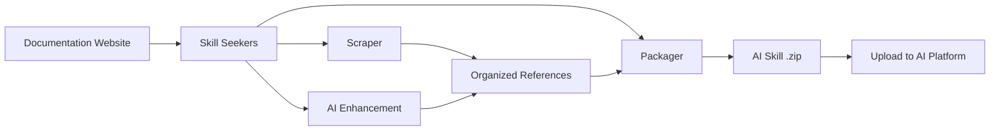

<p align="center">
  
</p>

# Skill Seekers

[English](README.md) | [简体中文](README.zh-CN.md) | [日本語](README.ja.md) | [한국어](README.ko.md) | [Español](README.es.md) | [Français](README.fr.md) | Deutsch | [Português](README.pt-BR.md) | [Türkçe](README.tr.md) | [العربية](README.ar.md) | [हिन्दी](README.hi.md) | [Русский](README.ru.md)

> ⚠️ **Hinweis zur maschinellen Übersetzung**
>
> Dieses Dokument wurde automatisch durch KI übersetzt. Trotz Bemühungen um Qualität können ungenaue Ausdrücke vorkommen.
>
> Gerne können Sie über [GitHub Issue #260](https://github.com/yusufkaraaslan/Skill_Seekers/issues/260) zur Verbesserung der Übersetzung beitragen! Ihr Feedback ist uns sehr wertvoll.

[](https://github.com/yusufkaraaslan/Skill_Seekers/releases)
[](https://opensource.org/licenses/MIT)
[](https://www.python.org/downloads/)
[](https://modelcontextprotocol.io)
[](tests/)
[](https://pypi.org/project/skill-seekers/)
[](https://pypi.org/project/skill-seekers/)
[](https://skillseekersweb.com/)
[](https://github.com/yusufkaraaslan/Skill_Seekers)
[](https://pepy.tech/projects/skill-seekers)

<a href="https://trendshift.io/repositories/18329" target="_blank"></a>

**🧠 Die Datenschicht für KI-Systeme.** Skill Seekers verwandelt Dokumentationsseiten, GitHub-Repos, PDFs, Videos, Notebooks, Wikis und mehr — **18 Quelltypen** — in strukturierte Wissensbestände, bereit für AI Skills (Claude, Gemini, OpenAI), RAG-Pipelines (LangChain, LlamaIndex, Pinecone) und KI-Coding-Assistenten (Cursor, Windsurf, Cline). Einmal aufbereiten, in **22 Ziele** exportieren.

## 💛 Sponsoren

<!-- SPONSORS:START -->
### Launch Partner

<p align="center">
  <a href="https://www.atlascloud.ai/"></a><br/><sub><b>Launch Partner</b></sub>
</p>

[Atlas Cloud](https://www.atlascloud.ai/) — A full-modal, OpenAI-compatible AI inference platform. Skill Seekers supports it as a packaging/enhancement target via `--target atlas` with `ATLAS_API_KEY`.

### Silver Sponsors

<p align="center">
  <a href="https://www.rapidproxy.io/?utm_source=skillseekers&utm_medium=sponsor"></a><br/><sub><b>Sponsor — Silver</b></sub>
</p>
<!-- SPONSORS:END -->

**[Sponsor werden](SPONSORSHIP.md)** · [GitHub Sponsors](https://github.com/sponsors/yusufkaraaslan)

---

## 🚀 Schnellstart

```bash
# 1. Installieren
pip install skill-seekers

# 2. Skill aus einer beliebigen Quelle erstellen
skill-seekers create https://docs.djangoproject.com/

# 3. Für die eigene KI-Plattform paketieren
skill-seekers package output/django --target claude
```

Damit liegt `output/django-claude.zip` einsatzbereit vor.

```bash
# Anderen KI-Agenten für das Enhancement wählen (Standard: claude)
skill-seekers create https://docs.djangoproject.com/ --agent kimi
skill-seekers create https://docs.djangoproject.com/ --agent-cmd "my-custom-agent run"
```

### 🛰️ KI-gesteuerter Projekt-Scan

`scan` auf ein Projekt richten: Ein KI-Agent liest dessen Manifeste, README, Dockerfile/CI und stichprobenartig erfasste Quellcode-Importe — und erzeugt daraus eine Konfiguration pro erkanntem Framework sowie eine `<project>-codebase.json` für den eigenen Code:

```bash
skill-seekers scan ./my-react-app --out ./configs/scanned/
# → react.json, vite.json, tailwind.json, jest.json, my-react-app-codebase.json

skill-seekers create ./configs/scanned/react.json
```

Existiert für eine Erkennung kein vorhandenes Preset, generiert die KI eine neue Konfiguration; beim Beenden lässt sie sich optional an die [Community-Registry](https://github.com/yusufkaraaslan/skill-seekers-configs) zurückmelden.

### Alle 18 Quelltypen

```bash
skill-seekers create facebook/react            # GitHub-Repository
skill-seekers create ./my-project              # Lokale Codebasis
skill-seekers create manual.pdf                # PDF
skill-seekers create report.docx               # Word
skill-seekers create book.epub                 # EPUB
skill-seekers create notebook.ipynb            # Jupyter
skill-seekers create openapi.yaml              # OpenAPI/Swagger
skill-seekers create presentation.pptx         # PowerPoint
skill-seekers create guide.adoc                # AsciiDoc
skill-seekers create page.html                 # Lokales HTML (oder ein ganzes Verzeichnis)
skill-seekers create feed.rss                  # RSS/Atom
skill-seekers create curl.1                    # Man-Page

# Video (YouTube, Vimeo oder lokal — benötigt skill-seekers[video])
skill-seekers create --video-url https://www.youtube.com/watch?v=... --name mytutorial
skill-seekers create --setup                   # GPU-bewusste Visual-Abhängigkeiten automatisch installieren

skill-seekers create --space-key TEAM --name wiki               # Confluence
skill-seekers create --database-id ... --name docs              # Notion
skill-seekers create --chat-export-path ./slack-export --name team-chat  # Slack/Discord
```

Alle Quelltypen samt ihrer Optionen beschreibt der [Scraping-Leitfaden](docs/user-guide/02-scraping.md).

---

## 📦 Installation

```bash
pip install skill-seekers              # Kern: Scraping, GitHub, PDF, Packaging
pip install skill-seekers[all-llms]    # + jede LLM-Plattform
pip install skill-seekers[mcp]         # + MCP-Server
pip install skill-seekers[all]         # Alles
```

**Unklar, was benötigt wird?** Den Assistenten starten: `skill-seekers-setup`

<details>
<summary><b>Alle Installations-Extras</b></summary>

| Installation | Ergänzt |
|---------|------|
| `skill-seekers[gemini]` | Unterstützung für Google Gemini |
| `skill-seekers[openai]` | Unterstützung für OpenAI ChatGPT |
| `skill-seekers[all-llms]` | Alle LLM-Plattformen |
| `skill-seekers[mcp]` | MCP-Server für Claude Code, Cursor usw. |
| `skill-seekers[video]` | Transkript- und Metadaten-Extraktion für YouTube/Vimeo |
| `skill-seekers[video-full]` | + Whisper-Transkription und visuelle Frame-Extraktion |
| `skill-seekers[jupyter]` | Unterstützung für Jupyter Notebooks |
| `skill-seekers[pptx]` | Unterstützung für PowerPoint |
| `skill-seekers[confluence]` | Unterstützung für Confluence-Wikis |
| `skill-seekers[notion]` | Unterstützung für Notion-Seiten |
| `skill-seekers[rss]` | Unterstützung für RSS-/Atom-Feeds |
| `skill-seekers[chat]` | Unterstützung für Slack-/Discord-Chat-Exporte |
| `skill-seekers[asciidoc]` | Unterstützung für AsciiDoc |
| `skill-seekers[all]` | Alles |

> **Visual-Abhängigkeiten für Video (GPU-bewusst):** Nach der Installation von `skill-seekers[video-full]` `skill-seekers create --setup` ausführen — damit wird die GPU automatisch erkannt und die passende PyTorch-Variante samt easyocr installiert.

</details>

**Voraussetzungen:** Python 3.10+, Git. Neu hier? → **[Bulletproof Quick Start](docs/getting-started/BULLETPROOF_QUICKSTART.md)** 🎯

---

## 📚 Dokumentation

| Ziel | Passende Lektüre |
|--------------|-----------|
| **Schnell loslegen** | [Schnellstart](docs/getting-started/02-quick-start.md) — 3 Befehle bis zum ersten Skill |
| **Die Konzepte verstehen** | [Kernkonzepte](docs/user-guide/01-core-concepts.md) |
| **Quellen scrapen** | [Scraping-Leitfaden](docs/user-guide/02-scraping.md) — alle 18 Quelltypen |
| **Skills mit KI verbessern** | [Enhancement-Leitfaden](docs/user-guide/03-enhancement.md) · [Enhancement-Modi](docs/features/ENHANCEMENT_MODES.md) |
| **Skills exportieren** | [Packaging-Leitfaden](docs/user-guide/04-packaging.md) |
| **Workflows aufbauen** | [Workflows](docs/user-guide/05-workflows.md) |
| **Einen Befehl nachschlagen** | [CLI-Referenz](docs/reference/CLI_REFERENCE.md) — alle 19 Befehle |
| **Konfigurieren** | [Konfigurationsformat](docs/reference/CONFIG_FORMAT.md) · [Umgebungsvariablen](docs/reference/ENVIRONMENT_VARIABLES.md) |
| **MCP einrichten** | [MCP-Einrichtung](docs/guides/MCP_SETUP.md) · [MCP-Referenz](docs/reference/MCP_REFERENCE.md) |
| **Mit RAG / IDEs integrieren** | [LangChain](docs/integrations/LANGCHAIN.md) · [RAG-Pipelines](docs/integrations/RAG_PIPELINES.md) · [Cursor](docs/integrations/CURSOR.md) · [Windsurf](docs/integrations/WINDSURF.md) · [Cline](docs/integrations/CLINE.md) |
| **Riesige Dokumentationsbestände bewältigen** | [Große Dokumentationen](docs/reference/LARGE_DOCUMENTATION.md) — 10K–40K+ Seiten |
| **Die Architektur verstehen** | [UML-Architektur](docs/UML_ARCHITECTURE.md) — 14 Diagramme |
| **Ein Problem beheben** | [Fehlerbehebung](docs/user-guide/06-troubleshooting.md) |

**Vollständiges Dokumentationsverzeichnis:** [docs/README.md](docs/README.md)

---

## 🎯 Das Ergebnis

| Anwendungsfall | Ausgabe | Einsatz bei |
|----------|--------|--------|
| **AI Skills** | Umfassende `SKILL.md` + Referenzdateien | Claude Code, Gemini, GPT |
| **RAG-Pipelines** | Gechunkte Dokumente mit reichhaltigen Metadaten | LangChain, LlamaIndex, Haystack |
| **Vektordatenbanken** | Vorformatierte Daten, bereit zum Upsert | Pinecone, Chroma, Weaviate, FAISS, Qdrant |
| **KI-Coding-Assistenten** | Kontextdateien, die die IDE-KI automatisch liest | Cursor, Windsurf, Cline, Continue.dev |

### Export-Ziele (22)

```bash
skill-seekers package output/react --target claude      # → Claude Skill (ZIP + YAML)
skill-seekers package output/react --target langchain   # → LangChain-Dokumente
skill-seekers package output/react --target llama-index # → LlamaIndex-TextNodes
skill-seekers package output/react --target ibm-bob     # → IBM-Bob-Skill-Verzeichnis
```

**LLM-Plattformen (12):** `claude` · `gemini` · `openai` · `minimax` · `opencode` · `kimi` · `deepseek` · `qwen` · `openrouter` · `together` · `fireworks` · `markdown`
**RAG & Vektor (8):** `langchain` · `llama-index` · `haystack` · `chroma` · `faiss` · `weaviate` · `qdrant` · `pinecone`
**Sonstige (2):** `atlas` · `ibm-bob`

Details zur Unterstützung je Plattform liefert die [Feature-Matrix](docs/reference/FEATURE_MATRIX.md).

### Warum das zählt

- ⚡ **99% schneller** — aus Tagen manueller Datenaufbereitung werden 15–45 Minuten
- 🎯 **Echte Skill-Qualität** — `SKILL.md`-Dateien mit 500+ Zeilen inklusive Beispielen, Patterns und Anleitungen
- 📊 **RAG-fertige Chunks** — intelligentes Chunking bewahrt Codeblöcke und Kontext
- 🔄 **Multi-Source** — Docs + GitHub + PDFs + Videos zu einem einzigen Wissensbestand kombinieren
- 🌐 **Einmal aufbereiten, überallhin exportieren** — 22 Ziele ohne erneutes Scraping
- ✅ **Praxiserprobt** — 3,900+ Tests, 68 Workflow-Presets, produktionsreif

---

## ✨ Zentrale Fähigkeiten

<details>
<summary><b>Dokumentations-Scraping</b> — SPA-Discovery, llms.txt, intelligente Kategorisierung</summary>

Dreistufige Discovery für JavaScript-SPA-Seiten (`sitemap.xml` → `llms.txt` → Rendering im Headless-Browser), automatische `llms.txt`-Erkennung (10× schneller, wenn vorhanden), intelligente Themen-Kategorisierung und ein toleranter HTML-Parser-Fallback, sodass auch defektes Markup noch scrapebar bleibt.

→ [Scraping-Leitfaden](docs/user-guide/02-scraping.md) · [llms.txt-Unterstützung](docs/reference/LLMS_TXT_SUPPORT.md)
</details>

<details>
<summary><b>GitHub- & Codebasis-Analyse (C3.x)</b> — AST-Parsing, Pattern-Erkennung, How-to-Guides</summary>

Drei-Stream-Architektur: Codeanalyse (AST, Design Patterns, Tests), Dokumentation (README, `docs/`, Wiki) und Community (Issues, PRs, Metadaten). Die C3.x-Pipeline ergänzt 10 GoF-Pattern-Detektoren für 9 Sprachen, aus Tests extrahierte Nutzungsbeispiele, KI-geschriebene How-to-Guides, Konfigurations-Extraktion und Architekturüberblicke.

```bash
skill-seekers create ./my-project --preset quick          # 1–2 Min., oberflächlich
skill-seekers create ./my-project --preset standard       # ausgewogen (Standard)
skill-seekers create ./my-project --preset comprehensive  # tief, erschöpfend
```

→ [Pattern-Erkennung](docs/features/PATTERN_DETECTION.md) · [How-to-Guides](docs/features/HOW_TO_GUIDES.md) · [Extraktion von Testbeispielen](docs/features/TEST_EXAMPLE_EXTRACTION.md)
</details>

<details>
<summary><b>KI-Enhancement</b> — API oder lokale Agenten, 68 Workflow-Presets</summary>

Jeder KI-Aufruf läuft über einen einzigen Transport, im **API-Modus** (Anthropic, Google Gemini, OpenAI, Moonshot/Kimi, MiniMax) oder im **LOCAL-Modus** (Claude Code, Kimi Code, Codex, Copilot, OpenCode, eigene Agenten — ohne API-Kosten). Die Tiefe steuert `--enhance-level 0-3`, den Agenten wählt `--agent`.

→ [Enhancement-Leitfaden](docs/user-guide/03-enhancement.md) · [Enhancement-Modi](docs/features/ENHANCEMENT_MODES.md) · [Multi-Agent-Einrichtung](docs/guides/MULTI_AGENT_SETUP.md)
</details>

<details>
<summary><b>Vereinheitlichtes Multi-Source-Scraping</b> — viele Quellen zu einem Skill verbinden</summary>

Eine einzige Konfiguration kann Dokumentation, GitHub, PDFs, Videos und mehr zu einem gemeinsamen Wissensbestand zusammenführen — inklusive Konflikterkennung und paarweiser Synthese über Quellen hinweg.

→ [Vereinheitlichtes Scraping](docs/features/UNIFIED_SCRAPING.md)
</details>

<details>
<summary><b>Video-Extraktion</b> — Transkripte, Frames, Code am Bildschirm</summary>

YouTube, Vimeo und lokale Dateien. Dreistufiger Transkript-Fallback (Untertitel → YouTube-Transcript-API → lokales Whisper), dazu optionale visuelle Extraktion, die am Bildschirm sichtbaren Code aus Stichproben-Frames per OCR erfasst.

→ [Video-Leitfaden](docs/VIDEO_GUIDE.md)
</details>

<details>
<summary><b>Qualität, Sync & Skalierung</b></summary>

Qualitätsbewertung mit Schwellenwert-Gate (`skill-seekers quality output/react/ --threshold 7`), Erkennung von Dokumentationsänderungen mit geplanten Re-Scrapes und Benachrichtigungen, Streaming-Ingestion für sehr große Dokumentationsbestände sowie inkrementelle Updates.

→ [Große Dokumentationen](docs/reference/LARGE_DOCUMENTATION.md) · [Codequalität](docs/reference/CODE_QUALITY.md)
</details>

---

## 🔌 MCP-Integration (40 Tools)

Skill Seekers bringt einen MCP-Server für Claude Code, Cursor, Windsurf, VS Code + Cline und IntelliJ IDEA mit.

```bash
# stdio-Modus (Claude Code, VS Code + Cline)
python -m skill_seekers.mcp.server_fastmcp

# HTTP-Modus (Cursor, Windsurf, IntelliJ)
python -m skill_seekers.mcp.server_fastmcp --transport http --port 8765
```

Danach genügt eine Anweisung an den Assistenten: *„Paketiere und lade den React-Skill hoch.“*

→ [MCP-Einrichtung](docs/guides/MCP_SETUP.md) · [MCP-Referenz](docs/reference/MCP_REFERENCE.md) · [HTTP-Transport](docs/guides/HTTP_TRANSPORT.md)

---

## 🤖 Installation in KI-Agenten

Skills installieren sich automatisch in **19 KI-Coding-Agenten**:

```bash
skill-seekers install-agent output/react/ --agent cursor
skill-seekers install-agent output/react/ --agent all      # jeder erkannte Agent
skill-seekers install-agent output/react/ --agent cursor --dry-run
```

| Agent | Pfad | Geltungsbereich |
|-------|------|-------|
| Claude Code | `~/.claude/skills/` | Global |
| Cursor | `.cursor/skills/` | Projekt |
| VS Code / Copilot | `.github/skills/` | Projekt |
| Amp | `~/.amp/skills/` | Global |
| Goose | `~/.config/goose/skills/` | Global |
| OpenCode | `~/.opencode/skills/` | Global |
| Letta | `~/.letta/skills/` | Global |
| Aide | `~/.aide/skills/` | Global |
| Windsurf | `~/.windsurf/skills/` | Global |
| Neovate | `~/.neovate/skills/` | Global |
| Roo Code | `.roo/skills/` | Projekt |
| Cline | `.cline/skills/` | Projekt |
| Aider | `~/.aider/skills/` | Global |
| Bolt | `.bolt/skills/` | Projekt |
| Kilo Code | `.kilo/skills/` | Projekt |
| Continue | `~/.continue/skills/` | Global |
| Kimi Code | `~/.kimi/skills/` | Global |
| IBM Bob | `.bob/skills/` | Projekt |

### Upload zu Claude

```bash
export ANTHROPIC_API_KEY=sk-ant-...
skill-seekers package output/react/ --upload   # paketieren + hochladen
skill-seekers upload output/react.zip          # ein vorhandenes ZIP hochladen
```

Kein API-Schlüssel? Einfach paketieren und `output/react.zip` manuell unter [claude.ai/skills](https://claude.ai/skills) hochladen.

→ [Upload-Leitfaden](docs/guides/UPLOAD_GUIDE.md)

---

## ⚙️ Funktionsweise


```mermaid
graph LR
    A[Documentation Website] --> B[Skill Seekers]
    B --> C[Scraper]
    B --> D[AI Enhancement]
    B --> E[Packager]
    C --> F[Organized References]
    D --> F
    F --> E
    E --> G[AI Skill .zip]
    G --> H[Upload to AI Platform]
```

1. **Scrape** — jede Seite extrahieren (zuerst wird `llms.txt` geprüft)
2. **Kategorisieren** — Inhalte nach Themen ordnen (API, Guides, Tutorials, …)
3. **Enhance** — die KI schreibt eine umfassende `SKILL.md` mit Beispielen
4. **Paketieren** — zu einem plattformfertigen Artefakt bündeln
5. **Upload** — an die eigene KI-Plattform ausliefern (optional)

### Architektur

**8 Kernmodule + 5 Hilfsmodule** (~200 Klassen):

| Modul | Zweck |
|--------|---------|
| **CLICore** | Git-artiger Befehls-Dispatcher, automatische Quellenerkennung |
| **Scrapers** | 18 Quelltyp-Extraktoren auf einer gemeinsamen Build-Schicht |
| **Adaptors** | 22 Ausgabeformate für Plattformen hinter einer einzigen `SkillAdaptor`-ABC |
| **Analysis** | C3.x-Codebasis-Pipeline, 10 GoF-Pattern-Detektoren |
| **Enhancement** | KI-Verbesserung über einen einzigen `AgentClient`-Transport |
| **Packaging** | Skills paketieren, hochladen und installieren |
| **MCP** | FastMCP-Server (40 Tools, 10 Tool-Module) |
| **Sync** | Erkennung von Dokumentationsänderungen und Benachrichtigung |

→ [UML-Architektur](docs/UML_ARCHITECTURE.md) · [API-Referenz](docs/reference/API_REFERENCE.md) · [Skill-Architektur](docs/reference/SKILL_ARCHITECTURE.md)

---

## 🆕 Neu in v3.9.0

- **HTML-Parser-Fallback für defektes Markup** (#96) — stark fehlerhafte Seiten werden nicht mehr leer gescrapt; wohlgeformte Seiten bleiben byte-identisch.
- **Wiederholungen bei transienten Fehlern** — der Doc-Scraper (#97) und MCP `fetch_config` (#92) versuchen es bei Verbindungsaussetzern und 5xx nun mit Backoff erneut; 4xx schlägt weiterhin sofort fehl.
- **Whisper-Transkriptions-Fallback** (#420) — lokale Videos ohne Untertitel erhalten endlich ein echtes Transkript.
- **MiniMax-Bild-OCR + registry-gesteuerte multimodale Provider** (#423) — Provider deklarieren ihr Wire-Protokoll und ihre Bildfähigkeit; in China ausgestellte Schlüssel funktionieren gegen den richtigen Endpunkt.
- **Token-sparsame Standardwerte für GitHub-Issues** (#169) — GitHub-Skills bündeln standardmäßig nicht mehr die vollständige Historie geschlossener Issues.
- **Env-gesteuertes CORS über alle drei Server hinweg** (#422, #424) — keine Wildcard-Origins mit Credentials mehr.

Vollständige Historie: **[CHANGELOG.md](CHANGELOG.md)**

---

## 📈 Performance

| Dokumentationsumfang | Dauer | Ausgabe |
|---|---|---|
| Klein (< 100 Seiten) | 5–10 Min. | ~2 MB |
| Mittel (100–500 Seiten) | 15–30 Min. | ~10 MB |
| Groß (500–2,000 Seiten) | 30–60 Min. | ~40 MB |
| Riesig (10K–40K+ Seiten) | `stream` verwenden | Siehe [Große Dokumentationen](docs/reference/LARGE_DOCUMENTATION.md) |

---

## 🐛 Fehlerbehebung

```bash
skill-seekers doctor          # Installation & Umgebung diagnostizieren
skill-seekers sync-config     # Konfigurations-Drift erkennen
```

Häufige Probleme und Lösungen: **[Leitfaden zur Fehlerbehebung](docs/user-guide/06-troubleshooting.md)** · [TROUBLESHOOTING.md](docs/TROUBLESHOOTING.md)

---

## 🤝 Mitwirken

Beiträge sind willkommen — siehe **[CONTRIBUTING.md](CONTRIBUTING.md)**.

- 📋 **[Entwicklungs-Roadmap & Aufgaben](https://github.com/users/yusufkaraaslan/projects/2)** — beliebige Aufgabe auswählen
- 💬 **[Diskussionen](https://github.com/yusufkaraaslan/Skill_Seekers/discussions)** — Fragen und Ideen
- 🐛 **[Issues](https://github.com/yusufkaraaslan/Skill_Seekers/issues)** — Bugs und Feature-Wünsche

---

## 📝 Lizenz

MIT — siehe [LICENSE](LICENSE).

## 🔒 Sicherheit

[](https://mseep.ai/app/yusufkaraaslan-skill-seekers)

---

## 🌐 Ökosystem

Skill Seekers ist ein Multi-Repo-Projekt:

| Repository | Beschreibung | Links |
|-----------|-------------|-------|
| **[Skill_Seekers](https://github.com/yusufkaraaslan/Skill_Seekers)** | Core-CLI & MCP-Server (dieses Repo) | [PyPI](https://pypi.org/project/skill-seekers/) |
| **[skillseekersweb](https://github.com/yusufkaraaslan/skillseekersweb)** | Website & Dokumentation | [Live](https://skillseekersweb.com/) |
| **[skill-seekers-configs](https://github.com/yusufkaraaslan/skill-seekers-configs)** | Community-Repository für Konfigurationen | |
| **[skill-seekers-action](https://github.com/yusufkaraaslan/skill-seekers-action)** | GitHub Action für CI/CD | |
| **[skill-seekers-plugin](https://github.com/yusufkaraaslan/skill-seekers-plugin)** | Claude-Code-Plugin | |
| **[homebrew-skill-seekers](https://github.com/yusufkaraaslan/homebrew-skill-seekers)** | Homebrew-Tap für macOS | |

> **Lust mitzuwirken?** Die Website- und Config-Repos sind ein hervorragender Einstieg für neue Beitragende!
