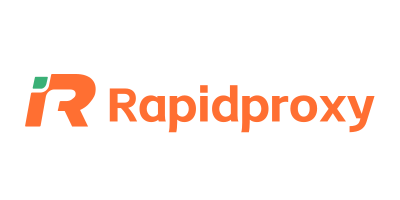
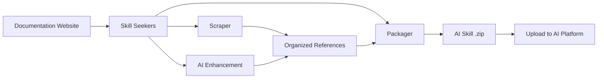

<p align="center">
  
</p>

# Skill Seekers

[English](README.md) | [简体中文](README.zh-CN.md) | [日本語](README.ja.md) | [한국어](README.ko.md) | Español | [Français](README.fr.md) | [Deutsch](README.de.md) | [Português](README.pt-BR.md) | [Türkçe](README.tr.md) | [العربية](README.ar.md) | [हिन्दी](README.hi.md) | [Русский](README.ru.md)

> ⚠️ **Aviso de traducción automática**
>
> Este documento ha sido traducido automáticamente por IA. Aunque nos esforzamos por garantizar la calidad, pueden existir expresiones inexactas.
>
> ¡Ayúdanos a mejorar la traducción a través de [GitHub Issue #260](https://github.com/yusufkaraaslan/Skill_Seekers/issues/260)! Tu retroalimentación es muy valiosa para nosotros.

[](https://github.com/yusufkaraaslan/Skill_Seekers/releases)
[](https://opensource.org/licenses/MIT)
[](https://www.python.org/downloads/)
[](https://modelcontextprotocol.io)
[](tests/)
[](https://pypi.org/project/skill-seekers/)
[](https://pypi.org/project/skill-seekers/)
[](https://skillseekersweb.com/)
[](https://github.com/yusufkaraaslan/Skill_Seekers)
[](https://pepy.tech/projects/skill-seekers)

<a href="https://trendshift.io/repositories/18329" target="_blank"></a>

**🧠 La capa de datos para sistemas de IA.** Skill Seekers convierte sitios de documentación, repositorios de GitHub, PDF, videos, notebooks, wikis y mucho más — **18 tipos de fuente** — en activos de conocimiento estructurados, listos para impulsar AI Skills (Claude, Gemini, OpenAI), pipelines de RAG (LangChain, LlamaIndex, Pinecone) y asistentes de programación con IA (Cursor, Windsurf, Cline). Prepare una vez, exporte a **22 destinos**.

## 💛 Patrocinadores

<!-- SPONSORS:START -->
### Launch Partner

<p align="center">
  <a href="https://www.atlascloud.ai/"></a><br/><sub><b>Launch Partner</b></sub>
</p>

[Atlas Cloud](https://www.atlascloud.ai/) — A full-modal, OpenAI-compatible AI inference platform. Skill Seekers supports it as a packaging/enhancement target via `--target atlas` with `ATLAS_API_KEY`.

### Silver Sponsors

<p align="center">
  <a href="https://www.rapidproxy.io/?utm_source=skillseekers&utm_medium=sponsor"></a><br/><sub><b>Sponsor — Silver</b></sub>
</p>
<!-- SPONSORS:END -->

**[Conviértete en patrocinador](SPONSORSHIP.md)** · [GitHub Sponsors](https://github.com/sponsors/yusufkaraaslan)

---

## 🚀 Inicio rápido

```bash
# 1. Instalar
pip install skill-seekers

# 2. Crear una skill desde cualquier fuente
skill-seekers create https://docs.djangoproject.com/

# 3. Empaquetarla para su plataforma de IA
skill-seekers package output/django --target claude
```

Ya tiene `output/django-claude.zip`, listo para usar.

```bash
# Elija otro agente de IA para la mejora (por defecto: claude)
skill-seekers create https://docs.djangoproject.com/ --agent kimi
skill-seekers create https://docs.djangoproject.com/ --agent-cmd "my-custom-agent run"
```

### 🛰️ Escaneo de proyectos con IA

Apunte `scan` a un proyecto y un agente de IA leerá sus manifiestos, el README, el Dockerfile/CI y una muestra de las importaciones del código fuente; después emitirá una configuración por cada framework detectado, más un `<project>-codebase.json` para su propio código:

```bash
skill-seekers scan ./my-react-app --out ./configs/scanned/
# → react.json, vite.json, tailwind.json, jest.json, my-react-app-codebase.json

skill-seekers create ./configs/scanned/react.json
```

Si una detección no tiene un preset existente, la IA genera una configuración nueva; al salir, puede publicarla opcionalmente en el [registro de la comunidad](https://github.com/yusufkaraaslan/skill-seekers-configs).

### Los 18 tipos de fuente

```bash
skill-seekers create facebook/react            # Repositorio de GitHub
skill-seekers create ./my-project              # Base de código local
skill-seekers create manual.pdf                # PDF
skill-seekers create report.docx               # Word
skill-seekers create book.epub                 # EPUB
skill-seekers create notebook.ipynb            # Jupyter
skill-seekers create openapi.yaml              # OpenAPI/Swagger
skill-seekers create presentation.pptx         # PowerPoint
skill-seekers create guide.adoc                # AsciiDoc
skill-seekers create page.html                 # HTML local (o un directorio completo)
skill-seekers create feed.rss                  # RSS/Atom
skill-seekers create curl.1                    # Página de manual

# Video (YouTube, Vimeo o local — requiere skill-seekers[video])
skill-seekers create --video-url https://www.youtube.com/watch?v=... --name mytutorial
skill-seekers create --setup                   # instala dependencias visuales según la GPU

skill-seekers create --space-key TEAM --name wiki               # Confluence
skill-seekers create --database-id ... --name docs              # Notion
skill-seekers create --chat-export-path ./slack-export --name team-chat  # Slack/Discord
```

Consulte la [Guía de scraping](docs/user-guide/02-scraping.md) para ver cada tipo de fuente y sus opciones.

---

## 📦 Instalación

```bash
pip install skill-seekers              # Núcleo: scraping, GitHub, PDF, empaquetado
pip install skill-seekers[all-llms]    # + todas las plataformas LLM
pip install skill-seekers[mcp]         # + servidor MCP
pip install skill-seekers[all]         # Todo
```

**¿No sabe qué necesita?** Ejecute el asistente: `skill-seekers-setup`

<details>
<summary><b>Todos los extras de instalación</b></summary>

| Instalación | Añade |
|---------|------|
| `skill-seekers[gemini]` | Compatibilidad con Google Gemini |
| `skill-seekers[openai]` | Compatibilidad con OpenAI ChatGPT |
| `skill-seekers[all-llms]` | Todas las plataformas LLM |
| `skill-seekers[mcp]` | Servidor MCP para Claude Code, Cursor, etc. |
| `skill-seekers[video]` | Extracción de transcripciones y metadatos de YouTube/Vimeo |
| `skill-seekers[video-full]` | + Transcripción con Whisper y extracción visual de fotogramas |
| `skill-seekers[jupyter]` | Compatibilidad con Jupyter Notebook |
| `skill-seekers[pptx]` | Compatibilidad con PowerPoint |
| `skill-seekers[confluence]` | Compatibilidad con wikis de Confluence |
| `skill-seekers[notion]` | Compatibilidad con páginas de Notion |
| `skill-seekers[rss]` | Compatibilidad con feeds RSS/Atom |
| `skill-seekers[chat]` | Compatibilidad con exportaciones de chat de Slack/Discord |
| `skill-seekers[asciidoc]` | Compatibilidad con AsciiDoc |
| `skill-seekers[all]` | Todo |

> **Dependencias visuales de video (según la GPU):** después de instalar `skill-seekers[video-full]`, ejecute `skill-seekers create --setup` para detectar automáticamente su GPU e instalar la variante de PyTorch correspondiente + easyocr.

</details>

**Requisitos previos:** Python 3.10+, Git. ¿Es la primera vez? → **[Inicio rápido a prueba de fallos](docs/getting-started/BULLETPROOF_QUICKSTART.md)** 🎯

---

## 📚 Documentación

| Quiero... | Lea esto |
|--------------|-----------|
| **Empezar rápido** | [Inicio rápido](docs/getting-started/02-quick-start.md) — 3 comandos hasta su primera skill |
| **Entender los conceptos** | [Conceptos básicos](docs/user-guide/01-core-concepts.md) |
| **Extraer fuentes** | [Guía de scraping](docs/user-guide/02-scraping.md) — los 18 tipos de fuente |
| **Mejorar skills con IA** | [Guía de mejora](docs/user-guide/03-enhancement.md) · [Modos de mejora](docs/features/ENHANCEMENT_MODES.md) |
| **Exportar skills** | [Guía de empaquetado](docs/user-guide/04-packaging.md) |
| **Crear flujos de trabajo** | [Flujos de trabajo](docs/user-guide/05-workflows.md) |
| **Consultar un comando** | [Referencia de la CLI](docs/reference/CLI_REFERENCE.md) — los 19 comandos |
| **Configurar** | [Formato de configuración](docs/reference/CONFIG_FORMAT.md) · [Variables de entorno](docs/reference/ENVIRONMENT_VARIABLES.md) |
| **Configurar MCP** | [Configuración de MCP](docs/guides/MCP_SETUP.md) · [Referencia de MCP](docs/reference/MCP_REFERENCE.md) |
| **Integrar con RAG / IDE** | [LangChain](docs/integrations/LANGCHAIN.md) · [Pipelines de RAG](docs/integrations/RAG_PIPELINES.md) · [Cursor](docs/integrations/CURSOR.md) · [Windsurf](docs/integrations/WINDSURF.md) · [Cline](docs/integrations/CLINE.md) |
| **Manejar conjuntos de documentación enormes** | [Documentación de gran tamaño](docs/reference/LARGE_DOCUMENTATION.md) — 10K–40K+ páginas |
| **Entender la arquitectura** | [Arquitectura UML](docs/UML_ARCHITECTURE.md) — 14 diagramas |
| **Resolver un problema** | [Solución de problemas](docs/user-guide/06-troubleshooting.md) |

**Índice completo de la documentación:** [docs/README.md](docs/README.md)

---

## 🎯 Qué obtiene

| Caso de uso | Salida | Impulsa |
|----------|--------|--------|
| **AI Skills** | Un `SKILL.md` completo + archivos de referencia | Claude Code, Gemini, GPT |
| **Pipelines de RAG** | Documentos fragmentados con metadatos ricos | LangChain, LlamaIndex, Haystack |
| **Bases de datos vectoriales** | Datos preformateados listos para el upsert | Pinecone, Chroma, Weaviate, FAISS, Qdrant |
| **Asistentes de programación con IA** | Archivos de contexto que la IA de su IDE lee automáticamente | Cursor, Windsurf, Cline, Continue.dev |

### Destinos de exportación (22)

```bash
skill-seekers package output/react --target claude      # → Claude Skill (ZIP + YAML)
skill-seekers package output/react --target langchain   # → Documentos de LangChain
skill-seekers package output/react --target llama-index # → TextNodes de LlamaIndex
skill-seekers package output/react --target ibm-bob     # → Directorio de skill de IBM Bob
```

**Plataformas LLM (12):** `claude` · `gemini` · `openai` · `minimax` · `opencode` · `kimi` · `deepseek` · `qwen` · `openrouter` · `together` · `fireworks` · `markdown`
**RAG y vectorial (8):** `langchain` · `llama-index` · `haystack` · `chroma` · `faiss` · `weaviate` · `qdrant` · `pinecone`
**Otros (2):** `atlas` · `ibm-bob`

Consulte la [Matriz de funcionalidades](docs/reference/FEATURE_MATRIX.md) para ver los detalles de compatibilidad por plataforma.

### Por qué importa

- ⚡ **99 % más rápido** — de días de preparación manual de datos a 15–45 minutos
- 🎯 **Calidad real de skill** — archivos `SKILL.md` de más de 500 líneas con ejemplos, patrones y guías
- 📊 **Fragmentos listos para RAG** — el chunking inteligente preserva los bloques de código y el contexto
- 🔄 **Multifuente** — combine documentación + GitHub + PDF + videos en un solo activo de conocimiento
- 🌐 **Una preparación, todos los destinos** — exporte a 22 destinos sin volver a hacer scraping
- ✅ **Probado a fondo** — más de 3,900 tests, 68 presets de flujo de trabajo, listo para producción

---

## ✨ Capacidades principales

<details>
<summary><b>Scraping de documentación</b> — descubrimiento de SPA, llms.txt, categorización inteligente</summary>

Descubrimiento en tres capas para sitios SPA de JavaScript (`sitemap.xml` → `llms.txt` → renderizado con navegador headless), detección automática de `llms.txt` (10× más rápido cuando está disponible), categorización inteligente por temas y un parser HTML tolerante como respaldo, de modo que el marcado defectuoso también se pueda extraer.

→ [Guía de scraping](docs/user-guide/02-scraping.md) · [Compatibilidad con llms.txt](docs/reference/LLMS_TXT_SUPPORT.md)
</details>

<details>
<summary><b>Análisis de GitHub y bases de código (C3.x)</b> — análisis de AST, detección de patrones, guías prácticas</summary>

Arquitectura de tres flujos: análisis de código (AST, patrones de diseño, tests), documentación (README, `docs/`, wiki) y comunidad (issues, PR, metadatos). El pipeline C3.x añade 10 detectores de patrones GoF en 9 lenguajes, ejemplos de uso extraídos de los tests, guías prácticas escritas por IA, extracción de configuración y resúmenes de arquitectura.

```bash
skill-seekers create ./my-project --preset quick          # 1–2 min, nivel superficial
skill-seekers create ./my-project --preset standard       # equilibrado (por defecto)
skill-seekers create ./my-project --preset comprehensive  # profundo y exhaustivo
```

→ [Detección de patrones](docs/features/PATTERN_DETECTION.md) · [Guías prácticas](docs/features/HOW_TO_GUIDES.md) · [Extracción de ejemplos de tests](docs/features/TEST_EXAMPLE_EXTRACTION.md)
</details>

<details>
<summary><b>Mejora con IA</b> — API o agentes locales, 68 presets de flujo de trabajo</summary>

Cada llamada de IA pasa por un único transporte, en **modo API** (Anthropic, Google Gemini, OpenAI, Moonshot/Kimi, MiniMax) o en **modo LOCAL** (Claude Code, Kimi Code, Codex, Copilot, OpenCode, agentes personalizados — sin costos de API). Controle la profundidad con `--enhance-level 0-3` y elija un agente con `--agent`.

→ [Guía de mejora](docs/user-guide/03-enhancement.md) · [Modos de mejora](docs/features/ENHANCEMENT_MODES.md) · [Configuración multiagente](docs/guides/MULTI_AGENT_SETUP.md)
</details>

<details>
<summary><b>Scraping unificado de múltiples fuentes</b> — combine muchas fuentes en una sola skill</summary>

Una sola configuración puede reunir documentación, GitHub, PDF, videos y más en un único activo de conocimiento, con detección de conflictos y síntesis por pares entre fuentes.

→ [Scraping unificado](docs/features/UNIFIED_SCRAPING.md)
</details>

<details>
<summary><b>Extracción de video</b> — transcripciones, fotogramas, código en pantalla</summary>

YouTube, Vimeo y archivos locales. Respaldo de transcripción en tres niveles (subtítulos → API de transcripciones de YouTube → Whisper local), además de una extracción visual opcional que aplica OCR al código en pantalla de los fotogramas muestreados.

→ [Guía de video](docs/VIDEO_GUIDE.md)
</details>

<details>
<summary><b>Calidad, sincronización y escala</b></summary>

Puntuación de calidad con umbral de control (`skill-seekers quality output/react/ --threshold 7`), detección de cambios en la documentación con re-scrapes programados y notificaciones, ingesta en streaming para conjuntos de documentación muy grandes y actualizaciones incrementales.

→ [Documentación de gran tamaño](docs/reference/LARGE_DOCUMENTATION.md) · [Calidad del código](docs/reference/CODE_QUALITY.md)
</details>

---

## 🔌 Integración con MCP (40 herramientas)

Skill Seekers incluye un servidor MCP para Claude Code, Cursor, Windsurf, VS Code + Cline e IntelliJ IDEA.

```bash
# modo stdio (Claude Code, VS Code + Cline)
python -m skill_seekers.mcp.server_fastmcp

# modo HTTP (Cursor, Windsurf, IntelliJ)
python -m skill_seekers.mcp.server_fastmcp --transport http --port 8765
```

Después basta con pedírselo a su asistente: *"Empaqueta y sube la skill de React."*

→ [Configuración de MCP](docs/guides/MCP_SETUP.md) · [Referencia de MCP](docs/reference/MCP_REFERENCE.md) · [Transporte HTTP](docs/guides/HTTP_TRANSPORT.md)

---

## 🤖 Instalación en agentes de IA

Las skills se instalan automáticamente en **19 agentes de programación con IA**:

```bash
skill-seekers install-agent output/react/ --agent cursor
skill-seekers install-agent output/react/ --agent all      # todos los agentes detectados
skill-seekers install-agent output/react/ --agent cursor --dry-run
```

| Agente | Ruta | Alcance |
|-------|------|-------|
| Claude Code | `~/.claude/skills/` | Global |
| Cursor | `.cursor/skills/` | Proyecto |
| VS Code / Copilot | `.github/skills/` | Proyecto |
| Amp | `~/.amp/skills/` | Global |
| Goose | `~/.config/goose/skills/` | Global |
| OpenCode | `~/.opencode/skills/` | Global |
| Letta | `~/.letta/skills/` | Global |
| Aide | `~/.aide/skills/` | Global |
| Windsurf | `~/.windsurf/skills/` | Global |
| Neovate | `~/.neovate/skills/` | Global |
| Roo Code | `.roo/skills/` | Proyecto |
| Cline | `.cline/skills/` | Proyecto |
| Aider | `~/.aider/skills/` | Global |
| Bolt | `.bolt/skills/` | Proyecto |
| Kilo Code | `.kilo/skills/` | Proyecto |
| Continue | `~/.continue/skills/` | Global |
| Kimi Code | `~/.kimi/skills/` | Global |
| IBM Bob | `.bob/skills/` | Proyecto |

### Subida a Claude

```bash
export ANTHROPIC_API_KEY=sk-ant-...
skill-seekers package output/react/ --upload   # empaquetar + subir
skill-seekers upload output/react.zip          # subir un zip existente
```

¿No tiene clave de API? Empaquete la skill y suba `output/react.zip` manualmente en [claude.ai/skills](https://claude.ai/skills).

→ [Guía de subida](docs/guides/UPLOAD_GUIDE.md)

---

## ⚙️ Cómo funciona



1. **Scraping** — extrae todas las páginas (comprobando primero `llms.txt`)
2. **Categorización** — organiza el contenido por temas (API, guías, tutoriales, …)
3. **Mejora** — la IA escribe un `SKILL.md` completo con ejemplos
4. **Empaquetado** — agrupa todo en un artefacto listo para la plataforma
5. **Subida** — envíelo a su plataforma de IA (opcional)

### Arquitectura

**8 módulos principales + 5 módulos de utilidades** (~200 clases):

| Módulo | Propósito |
|--------|---------|
| **CLICore** | Despachador de comandos estilo Git, detección automática de la fuente |
| **Scrapers** | 18 extractores de tipos de fuente sobre una capa de construcción compartida |
| **Adaptors** | 22 formatos de plataforma de salida tras una única ABC `SkillAdaptor` |
| **Analysis** | Pipeline C3.x para bases de código, 10 detectores de patrones GoF |
| **Enhancement** | Mejora con IA a través de un único transporte `AgentClient` |
| **Packaging** | Empaquetar, subir e instalar skills |
| **MCP** | Servidor FastMCP (40 herramientas, 10 módulos de herramientas) |
| **Sync** | Detección de cambios en la documentación y notificaciones |

→ [Arquitectura UML](docs/UML_ARCHITECTURE.md) · [Referencia de la API](docs/reference/API_REFERENCE.md) · [Arquitectura de las skills](docs/reference/SKILL_ARCHITECTURE.md)

---

## 🆕 Novedades de la v3.9.0

- **Parser HTML de respaldo para marcado defectuoso** (#96) — las páginas gravemente malformadas ya no se extraen vacías; las páginas bien formadas siguen siendo idénticas byte a byte.
- **Reintentos ante fallos transitorios** — el scraper de documentación (#97) y `fetch_config` de MCP (#92) ahora reintentan los cortes de conexión y los errores 5xx con backoff; los 4xx siguen fallando de inmediato.
- **Respaldo de transcripción con Whisper** (#420) — los videos locales sin subtítulos por fin obtienen una transcripción real.
- **OCR de imágenes con MiniMax + proveedores multimodales definidos en el registro** (#423) — los proveedores declaran su protocolo de comunicación y su capacidad de imagen; las claves emitidas en China funcionan contra el endpoint correcto.
- **Valores por defecto de issues de GitHub más económicos en tokens** (#169) — las skills de GitHub ya no incluyen por defecto todo el historial de issues cerradas.
- **CORS configurable por entorno en los tres servidores** (#422, #424) — se acabaron los orígenes comodín con credenciales.

Historial completo: **[CHANGELOG.md](CHANGELOG.md)**

---

## 📈 Rendimiento

| Tamaño de la documentación | Tiempo | Salida |
|---|---|---|
| Pequeña (< 100 páginas) | 5–10 min | ~2 MB |
| Mediana (100–500 páginas) | 15–30 min | ~10 MB |
| Grande (500–2,000 páginas) | 30–60 min | ~40 MB |
| Enorme (10K–40K+ páginas) | Use `stream` | Vea [Documentación de gran tamaño](docs/reference/LARGE_DOCUMENTATION.md) |

---

## 🐛 Solución de problemas

```bash
skill-seekers doctor          # diagnostica la instalación y el entorno
skill-seekers sync-config     # detecta desviaciones en la configuración
```

Problemas habituales y sus soluciones: **[Guía de solución de problemas](docs/user-guide/06-troubleshooting.md)** · [TROUBLESHOOTING.md](docs/TROUBLESHOOTING.md)

---

## 🤝 Contribuir

Las contribuciones son bienvenidas — consulte **[CONTRIBUTING.md](CONTRIBUTING.md)**.

- 📋 **[Hoja de ruta y tareas de desarrollo](https://github.com/users/yusufkaraaslan/projects/2)** — elija cualquier tarea
- 💬 **[Debates](https://github.com/yusufkaraaslan/Skill_Seekers/discussions)** — preguntas e ideas
- 🐛 **[Issues](https://github.com/yusufkaraaslan/Skill_Seekers/issues)** — errores y solicitudes de funcionalidades

---

## 📝 Licencia

MIT — consulte [LICENSE](LICENSE).

## 🔒 Seguridad

[](https://mseep.ai/app/yusufkaraaslan-skill-seekers)

---

## 🌐 Ecosistema

Skill Seekers es un proyecto de múltiples repositorios:

| Repositorio | Descripción | Enlaces |
|-----------|-------------|-------|
| **[Skill_Seekers](https://github.com/yusufkaraaslan/Skill_Seekers)** | CLI principal y servidor MCP (este repositorio) | [PyPI](https://pypi.org/project/skill-seekers/) |
| **[skillseekersweb](https://github.com/yusufkaraaslan/skillseekersweb)** | Sitio web y documentación | [En vivo](https://skillseekersweb.com/) |
| **[skill-seekers-configs](https://github.com/yusufkaraaslan/skill-seekers-configs)** | Repositorio de configuraciones de la comunidad | |
| **[skill-seekers-action](https://github.com/yusufkaraaslan/skill-seekers-action)** | GitHub Action para CI/CD | |
| **[skill-seekers-plugin](https://github.com/yusufkaraaslan/skill-seekers-plugin)** | Plugin para Claude Code | |
| **[homebrew-skill-seekers](https://github.com/yusufkaraaslan/homebrew-skill-seekers)** | Tap de Homebrew para macOS | |

> **¿Quiere contribuir?** ¡Los repositorios del sitio web y de las configuraciones son excelentes puntos de partida para nuevos colaboradores!
