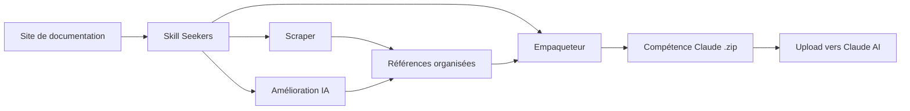

<p align="center">
  
</p>

# Skill Seekers

[English](README.md) | [简体中文](README.zh-CN.md) | [日本語](README.ja.md) | [한국어](README.ko.md) | [Español](README.es.md) | Français | [Deutsch](README.de.md) | [Português](README.pt-BR.md) | [Türkçe](README.tr.md) | [العربية](README.ar.md) | [हिन्दी](README.hi.md) | [Русский](README.ru.md)

> ⚠️ **Avis de traduction automatique**
>
> Ce document a été traduit automatiquement par IA. Bien que nous nous efforcions de garantir la qualité, des expressions inexactes peuvent subsister.
>
> N'hésitez pas à contribuer à l'amélioration de la traduction via [GitHub Issue #260](https://github.com/yusufkaraaslan/Skill_Seekers/issues/260) ! Vos retours nous sont précieux.

[](https://github.com/yusufkaraaslan/Skill_Seekers/releases)
[](https://opensource.org/licenses/MIT)
[](https://www.python.org/downloads/)
[](https://modelcontextprotocol.io)
[](tests/)
[](https://github.com/users/yusufkaraaslan/projects/2)
[](https://pypi.org/project/skill-seekers/)
[](https://pypi.org/project/skill-seekers/)
[](https://pypi.org/project/skill-seekers/)
[](https://skillseekersweb.com/)
[](https://x.com/_yUSyUS_)
[](https://github.com/yusufkaraaslan/Skill_Seekers)

**🧠 La couche de données pour les systèmes d'IA.** Skill Seekers transforme les sites de documentation, dépôts GitHub, PDF, vidéos, notebooks Jupyter, wikis et plus de 10 autres types de sources en ressources de connaissances structurées — prêtes à alimenter les compétences IA (Claude, Gemini, OpenAI), les pipelines RAG (LangChain, LlamaIndex, Pinecone) et les assistants de codage IA (Cursor, Windsurf, Cline) en quelques minutes, pas en heures.

> 🌐 **[Visitez SkillSeekersWeb.com](https://skillseekersweb.com/)** - Parcourez plus de 24 configurations prédéfinies, partagez vos configurations et accédez à la documentation complète !

> 📋 **[Consultez la feuille de route et les tâches](https://github.com/users/yusufkaraaslan/projects/2)** - 134 tâches réparties en 10 catégories, choisissez-en une pour contribuer !

## 🧠 La couche de données pour les systèmes d'IA

**Skill Seekers est la couche de prétraitement universelle** qui se situe entre la documentation brute et tous les systèmes d'IA qui la consomment. Que vous construisiez des compétences Claude, un pipeline RAG LangChain ou un fichier `.cursorrules` pour Cursor — la préparation des données est identique. Vous le faites une seule fois, et exportez vers toutes les cibles.

```bash
# Une commande → ressource de connaissances structurée
skill-seekers create https://docs.react.dev/
# ou : skill-seekers create facebook/react
# ou : skill-seekers create ./my-project

# Exporter vers n'importe quel système d'IA
skill-seekers package output/react --target claude      # → Compétence Claude AI (ZIP)
skill-seekers package output/react --target langchain   # → LangChain Documents
skill-seekers package output/react --target llama-index # → LlamaIndex TextNodes
skill-seekers package output/react --target cursor      # → .cursorrules
```

### Ce qui est généré

| Sortie | Cible | Utilisation |
|--------|-------|-------------|
| **Compétence Claude** (ZIP + YAML) | `--target claude` | Claude Code, Claude API |
| **Compétence Gemini** (tar.gz) | `--target gemini` | Google Gemini |
| **OpenAI / Custom GPT** (ZIP) | `--target openai` | GPT-4o, assistants personnalisés |
| **LangChain Documents** | `--target langchain` | Chaînes QA, agents, récupérateurs |
| **LlamaIndex TextNodes** | `--target llama-index` | Moteurs de requêtes, moteurs de chat |
| **Haystack Documents** | `--target haystack` | Pipelines RAG d'entreprise |
| **Prêt pour Pinecone** (Markdown) | `--target markdown` | Insertion vectorielle |
| **ChromaDB / FAISS / Qdrant** | `--format chroma/faiss/qdrant` | Bases vectorielles locales |
| **Cursor** `.cursorrules` | `--target claude` → copier | Contexte IA de l'IDE Cursor |
| **Windsurf / Cline / Continue** | `--target claude` → copier | VS Code, IntelliJ, Vim |

### Pourquoi c'est important

- ⚡ **99 % plus rapide** — Des jours de préparation manuelle → 15–45 minutes
- 🎯 **Qualité des compétences IA** — Fichiers SKILL.md de 500+ lignes avec exemples, patterns et guides
- 📊 **Fragments prêts pour le RAG** — Découpage intelligent préservant les blocs de code et le contexte
- 🎬 **Vidéos** — Extraction de code, transcriptions et connaissances structurées depuis YouTube et vidéos locales
- 🔄 **Multi-sources** — Combinez 17 types de sources (docs, GitHub, PDF, vidéos, notebooks, wikis, etc.) en une seule ressource
- 🌐 **Une préparation, toutes les cibles** — Exportez la même ressource vers 16 plateformes sans re-scraping
- ✅ **Éprouvé en production** — 2 540+ tests, 24+ préréglages de frameworks, prêt pour la production

## 🚀 Démarrage rapide (3 commandes)

```bash
# 1. Installer
pip install skill-seekers

# 2. Créer une compétence depuis n'importe quelle source
skill-seekers create https://docs.django.com/

# 3. Empaqueter pour votre plateforme IA
skill-seekers package output/django --target claude
```

**C'est tout !** Vous avez maintenant `output/django-claude.zip` prêt à l'emploi.

### Autres sources (17 prises en charge)

```bash
# Dépôt GitHub
skill-seekers create facebook/react

# Projet local
skill-seekers create ./my-project

# Document PDF
skill-seekers create manual.pdf

# Document Word
skill-seekers create report.docx

# Livre numérique EPUB
skill-seekers create book.epub

# Notebook Jupyter
skill-seekers create notebook.ipynb

# Spécification OpenAPI
skill-seekers create openapi.yaml

# Présentation PowerPoint
skill-seekers create presentation.pptx

# Document AsciiDoc
skill-seekers create guide.adoc

# Fichier HTML local
skill-seekers create page.html

# Flux RSS/Atom
skill-seekers create feed.rss

# Page de manuel
skill-seekers create curl.1

# Vidéo (YouTube, Vimeo ou fichier local — nécessite skill-seekers[video])
skill-seekers video --url https://www.youtube.com/watch?v=... --name mytutorial
# Première utilisation ? Installation automatique des dépendances visuelles GPU :
skill-seekers video --setup

# Wiki Confluence
skill-seekers confluence --space TEAM --name wiki

# Pages Notion
skill-seekers notion --database-id ... --name docs

# Export chat Slack/Discord
skill-seekers chat --export-dir ./slack-export --name team-chat
```

### Exporter partout

```bash
# Empaqueter pour plusieurs plateformes
for platform in claude gemini openai langchain; do
  skill-seekers package output/django --target $platform
done
```

## Qu'est-ce que Skill Seekers ?

Skill Seekers est la **couche de données pour les systèmes d'IA**. Il transforme 17 types de sources — sites de documentation, dépôts GitHub, PDF, vidéos, notebooks Jupyter, documents Word/EPUB/AsciiDoc, spécifications OpenAPI, présentations PowerPoint, flux RSS, pages de manuel, wikis Confluence, pages Notion, exports Slack/Discord, et plus encore — en ressources de connaissances structurées pour toutes les cibles IA :

| Cas d'usage | Ce que vous obtenez | Exemples |
|-------------|---------------------|----------|
| **Compétences IA** | SKILL.md complet + références | Claude Code, Gemini, GPT |
| **Pipelines RAG** | Documents découpés avec métadonnées riches | LangChain, LlamaIndex, Haystack |
| **Bases vectorielles** | Données pré-formatées prêtes à l'insertion | Pinecone, Chroma, Weaviate, FAISS |
| **Assistants de codage IA** | Fichiers de contexte lus automatiquement par l'IA de votre IDE | Cursor, Windsurf, Cline, Continue.dev |

## 📚 Documentation

| Je veux... | Lire ceci |
|------------|-----------|
| **Démarrer rapidement** | [Démarrage rapide](docs/getting-started/02-quick-start.md) - 3 commandes pour une première compétence |
| **Comprendre les concepts** | [Concepts fondamentaux](docs/user-guide/01-core-concepts.md) - Comment ça marche |
| **Scraper des sources** | [Guide de scraping](docs/user-guide/02-scraping.md) - Tous les types de sources |
| **Améliorer les compétences** | [Guide d'amélioration](docs/user-guide/03-enhancement.md) - Amélioration par IA |
| **Exporter les compétences** | [Guide d'empaquetage](docs/user-guide/04-packaging.md) - Export vers les plateformes |
| **Consulter les commandes** | [Référence CLI](docs/reference/CLI_REFERENCE.md) - Les 20 commandes |
| **Configurer** | [Format de configuration](docs/reference/CONFIG_FORMAT.md) - Spécification JSON |
| **Résoudre des problèmes** | [Dépannage](docs/user-guide/06-troubleshooting.md) - Problèmes courants |

**Documentation complète :** [docs/README.md](docs/README.md)

Au lieu de passer des jours en prétraitement manuel, Skill Seekers :

1. **Ingère** — docs, dépôts GitHub, bases de code locales, PDF, vidéos, notebooks, wikis et plus de 10 autres types de sources
2. **Analyse** — analyse AST approfondie, détection de patterns, extraction d'API
3. **Structure** — fichiers de référence catégorisés avec métadonnées
4. **Améliore** — génération de SKILL.md par IA (Claude, Gemini ou local)
5. **Exporte** — 16 formats spécifiques à chaque plateforme depuis une seule ressource

## Pourquoi l'utiliser ?

### Pour les créateurs de compétences IA (Claude, Gemini, OpenAI)

- 🎯 **Compétences de qualité production** — Fichiers SKILL.md de 500+ lignes avec exemples de code, patterns et guides
- 🔄 **Workflows d'amélioration** — Appliquez `security-focus`, `architecture-comprehensive` ou des préréglages YAML personnalisés
- 🎮 **N'importe quel domaine** — Moteurs de jeux (Godot, Unity), frameworks (React, Django), outils internes
- 🔧 **Équipes** — Combinez documentation interne + code en une source de vérité unique
- 📚 **Qualité** — Amélioré par IA avec exemples, référence rapide et guide de navigation

### Pour les développeurs RAG et ingénieurs IA

- 🤖 **Données prêtes pour le RAG** — `Documents` LangChain, `TextNodes` LlamaIndex, `Documents` Haystack pré-découpés
- 🚀 **99 % plus rapide** — Des jours de prétraitement → 15–45 minutes
- 📊 **Métadonnées intelligentes** — Catégories, sources, types → meilleure précision de récupération
- 🔄 **Multi-sources** — Combinez docs + GitHub + PDF + vidéos dans un seul pipeline
- 🌐 **Indépendant de la plateforme** — Exportez vers n'importe quelle base vectorielle ou framework sans re-scraping

### Pour les utilisateurs d'assistants de codage IA

- 💻 **Cursor / Windsurf / Cline** — Générez automatiquement `.cursorrules` / `.windsurfrules` / `.clinerules`
- 🎯 **Contexte persistant** — L'IA « connaît » vos frameworks sans prompts répétitifs
- 📚 **Toujours à jour** — Mettez à jour le contexte en quelques minutes quand la documentation change

## Fonctionnalités clés

### 🌐 Scraping de documentation
- ✅ **Support llms.txt** - Détecte et utilise automatiquement les fichiers de documentation prêts pour les LLM (10x plus rapide)
- ✅ **Scraper universel** - Fonctionne avec N'IMPORTE QUEL site de documentation
- ✅ **Catégorisation intelligente** - Organise automatiquement le contenu par sujet
- ✅ **Détection du langage de code** - Reconnaît Python, JavaScript, C++, GDScript, etc.
- ✅ **24+ préréglages prêts à l'emploi** - Godot, React, Vue, Django, FastAPI, et plus

### 📄 Support PDF
- ✅ **Extraction PDF basique** - Extraction de texte, code et images depuis les fichiers PDF
- ✅ **OCR pour PDF scannés** - Extraction de texte depuis les documents numérisés
- ✅ **PDF protégés par mot de passe** - Gestion des PDF chiffrés
- ✅ **Extraction de tableaux** - Extraction de tableaux complexes depuis les PDF
- ✅ **Traitement parallèle** - 3x plus rapide pour les gros PDF
- ✅ **Cache intelligent** - 50 % plus rapide lors des ré-exécutions

### 🎬 Extraction vidéo
- ✅ **YouTube et vidéos locales** - Extraction de transcriptions, code à l'écran et connaissances structurées depuis les vidéos
- ✅ **Analyse visuelle des images** - Extraction OCR depuis éditeurs de code, terminaux, diapositives et diagrammes
- ✅ **Détection automatique du GPU** - Installation automatique de la bonne version de PyTorch (CUDA/ROCm/MPS/CPU)
- ✅ **Amélioration par IA** - Deux passes : nettoyage OCR + génération d'un SKILL.md soigné
- ✅ **Découpage temporel** - Extraction de sections spécifiques avec `--start-time` et `--end-time`
- ✅ **Support des playlists** - Traitement par lots de toutes les vidéos d'une playlist YouTube
- ✅ **Fallback Vision API** - Utilisation de Claude Vision pour les images OCR à faible confiance

### 🐙 Analyse de dépôts GitHub
- ✅ **Analyse approfondie du code** - Analyse AST pour Python, JavaScript, TypeScript, Java, C++, Go
- ✅ **Extraction d'API** - Fonctions, classes, méthodes avec paramètres et types
- ✅ **Métadonnées du dépôt** - README, arborescence, répartition des langages, étoiles/forks
- ✅ **Issues et PR GitHub** - Récupération des issues ouvertes/fermées avec labels et jalons
- ✅ **CHANGELOG et versions** - Extraction automatique de l'historique des versions
- ✅ **Détection de conflits** - Comparaison entre les API documentées et l'implémentation réelle
- ✅ **Intégration MCP** - En langage naturel : « Scraper le dépôt GitHub facebook/react »

### 🔄 Scraping multi-sources unifié
- ✅ **Combinaison de sources multiples** - Mélangez documentation + GitHub + PDF dans une seule compétence
- ✅ **Détection de conflits** - Détection automatique des divergences entre docs et code
- ✅ **Fusion intelligente** - Résolution de conflits par règles ou par IA
- ✅ **Rapports transparents** - Comparaison côte à côte avec avertissements ⚠️
- ✅ **Analyse des lacunes documentaires** - Identification des docs obsolètes et fonctionnalités non documentées
- ✅ **Source de vérité unique** - Une seule compétence montrant à la fois l'intention (docs) et la réalité (code)
- ✅ **Rétrocompatibilité** - Les configurations à source unique héritées fonctionnent toujours

### 🤖 Support multi-plateformes LLM
- ✅ **12 plateformes LLM** - Claude AI, Google Gemini, OpenAI ChatGPT, MiniMax AI, Markdown générique, OpenCode, Kimi, DeepSeek, Qwen, OpenRouter, Together AI, Fireworks AI
- ✅ **Scraping universel** - La même documentation fonctionne pour toutes les plateformes
- ✅ **Empaquetage spécifique** - Formats optimisés pour chaque LLM
- ✅ **Export en une commande** - Le flag `--target` sélectionne la plateforme
- ✅ **Dépendances optionnelles** - Installez seulement ce dont vous avez besoin
- ✅ **100 % rétrocompatible** - Les workflows Claude existants restent inchangés

| Plateforme | Format | Upload | Amélioration | API Key | Endpoint personnalisé |
|------------|--------|--------|--------------|---------|----------------------|
| **Claude AI** | ZIP + YAML | ✅ Auto | ✅ Oui | ANTHROPIC_API_KEY | ANTHROPIC_BASE_URL |
| **Google Gemini** | tar.gz | ✅ Auto | ✅ Oui | GOOGLE_API_KEY | - |
| **OpenAI ChatGPT** | ZIP + Vector Store | ✅ Auto | ✅ Oui | OPENAI_API_KEY | - |
| **Markdown générique** | ZIP | ❌ Manuel | ❌ Non | - | - |

```bash
# Claude (par défaut - aucune modification nécessaire !)
skill-seekers package output/react/
skill-seekers upload react.zip

# Google Gemini
pip install skill-seekers[gemini]
skill-seekers package output/react/ --target gemini
skill-seekers upload react-gemini.tar.gz --target gemini

# OpenAI ChatGPT
pip install skill-seekers[openai]
skill-seekers package output/react/ --target openai
skill-seekers upload react-openai.zip --target openai

# Markdown générique (export universel)
skill-seekers package output/react/ --target markdown
# Utilisez les fichiers markdown directement dans n'importe quel LLM
```

<details>
<summary>🔧 <strong>Variables d'environnement pour les API compatibles Claude (ex. GLM-4.7)</strong></summary>

Skill Seekers prend en charge n'importe quel endpoint d'API compatible Claude :

```bash
# Option 1 : API Anthropic officielle (par défaut)
export ANTHROPIC_API_KEY=sk-ant-...

# Option 2 : API compatible Claude GLM-4.7
export ANTHROPIC_API_KEY=your-glm-47-api-key
export ANTHROPIC_BASE_URL=https://glm-4-7-endpoint.com/v1

# Toutes les fonctionnalités d'amélioration IA utiliseront l'endpoint configuré
skill-seekers enhance output/react/
skill-seekers analyze --directory . --enhance
```

**Note** : Définir `ANTHROPIC_BASE_URL` vous permet d'utiliser n'importe quel endpoint d'API compatible Claude, comme GLM-4.7 (智谱 AI) ou d'autres services compatibles.

</details>

**Installation :**
```bash
# Installer le support Gemini
pip install skill-seekers[gemini]

# Installer le support OpenAI
pip install skill-seekers[openai]

# Installer toutes les plateformes LLM
pip install skill-seekers[all-llms]
```

### 🔗 Intégrations de frameworks RAG

- ✅ **LangChain Documents** - Export direct au format `Document` avec `page_content` + métadonnées
  - Idéal pour : chaînes QA, récupérateurs, stores vectoriels, agents
  - Exemple : [Pipeline RAG LangChain](examples/langchain-rag-pipeline/)
  - Guide : [Intégration LangChain](docs/integrations/LANGCHAIN.md)

- ✅ **LlamaIndex TextNodes** - Export au format `TextNode` avec IDs uniques + embeddings
  - Idéal pour : moteurs de requêtes, moteurs de chat, contexte de stockage
  - Exemple : [Moteur de requêtes LlamaIndex](examples/llama-index-query-engine/)
  - Guide : [Intégration LlamaIndex](docs/integrations/LLAMA_INDEX.md)

- ✅ **Format prêt pour Pinecone** - Optimisé pour l'insertion dans les bases vectorielles
  - Idéal pour : recherche vectorielle en production, recherche sémantique, recherche hybride
  - Exemple : [Insertion Pinecone](examples/pinecone-upsert/)
  - Guide : [Intégration Pinecone](docs/integrations/PINECONE.md)

**Export rapide :**
```bash
# LangChain Documents (JSON)
skill-seekers package output/django --target langchain
# → output/django-langchain.json

# LlamaIndex TextNodes (JSON)
skill-seekers package output/django --target llama-index
# → output/django-llama-index.json

# Markdown (universel)
skill-seekers package output/django --target markdown
# → output/django-markdown/SKILL.md + references/
```

**Guide complet des pipelines RAG :** [Documentation des pipelines RAG](docs/integrations/RAG_PIPELINES.md)

---

### 🧠 Intégrations d'assistants de codage IA

Transformez n'importe quelle documentation de framework en contexte de codage expert pour plus de 4 assistants IA :

- ✅ **Cursor IDE** - Génération de `.cursorrules` pour des suggestions de code alimentées par l'IA
  - Idéal pour : génération de code spécifique au framework, patterns cohérents
  - Fonctionne avec : Cursor IDE (fork de VS Code)
  - Guide : [Intégration Cursor](docs/integrations/CURSOR.md)
  - Exemple : [Compétence Cursor React](examples/cursor-react-skill/)

- ✅ **Windsurf** - Personnalisation du contexte de l'assistant IA Windsurf avec `.windsurfrules`
  - Idéal pour : assistance IA native dans l'IDE, codage en flux
  - Fonctionne avec : Windsurf IDE par Codeium
  - Guide : [Intégration Windsurf](docs/integrations/WINDSURF.md)
  - Exemple : [Contexte FastAPI Windsurf](examples/windsurf-fastapi-context/)

- ✅ **Cline (VS Code)** - Prompts système + MCP pour l'agent VS Code
  - Idéal pour : génération de code agentique dans VS Code
  - Fonctionne avec : extension Cline pour VS Code
  - Guide : [Intégration Cline](docs/integrations/CLINE.md)
  - Exemple : [Assistant Django Cline](examples/cline-django-assistant/)

- ✅ **Continue.dev** - Serveurs de contexte pour une IA indépendante de l'IDE
  - Idéal pour : environnements multi-IDE (VS Code, JetBrains, Vim), fournisseurs LLM personnalisés
  - Fonctionne avec : tout IDE disposant du plugin Continue.dev
  - Guide : [Intégration Continue](docs/integrations/CONTINUE_DEV.md)
  - Exemple : [Contexte universel Continue](examples/continue-dev-universal/)

**Export rapide pour les outils de codage IA :**
```bash
# Pour n'importe quel assistant de codage IA (Cursor, Windsurf, Cline, Continue.dev)
skill-seekers scrape --config configs/django.json
skill-seekers package output/django --target claude  # ou --target markdown

# Copier dans votre projet (exemple pour Cursor)
cp output/django-claude/SKILL.md my-project/.cursorrules

# Ou pour Windsurf
cp output/django-claude/SKILL.md my-project/.windsurf/rules/django.md

# Ou pour Cline
cp output/django-claude/SKILL.md my-project/.clinerules

# Ou pour Continue.dev (serveur HTTP)
python examples/continue-dev-universal/context_server.py
# Configurer dans ~/.continue/config.json
```

**Hub d'intégrations :** [Toutes les intégrations de systèmes IA](docs/integrations/INTEGRATIONS.md)

---

### 🌊 Architecture GitHub à trois flux
- ✅ **Analyse à triple flux** - Division des dépôts GitHub en flux Code, Docs et Insights
- ✅ **Analyseur de base de code unifié** - Fonctionne avec les URL GitHub ET les chemins locaux
- ✅ **C3.x comme profondeur d'analyse** - Choisissez 'basic' (1–2 min) ou 'c3x' (20–60 min)
- ✅ **Génération de routeur améliorée** - Métadonnées GitHub, démarrage rapide README, problèmes courants
- ✅ **Intégration des Issues** - Principaux problèmes et solutions depuis les issues GitHub
- ✅ **Mots-clés de routage intelligents** - Labels GitHub pondérés 2x pour une meilleure détection des sujets

**Les trois flux expliqués :**
- **Flux 1 : Code** - Analyse approfondie C3.x (patterns, exemples, guides, configurations, architecture)
- **Flux 2 : Docs** - Documentation du dépôt (README, CONTRIBUTING, docs/*.md)
- **Flux 3 : Insights** - Connaissances communautaires (issues, labels, étoiles, forks)

```python
from skill_seekers.cli.unified_codebase_analyzer import UnifiedCodebaseAnalyzer

# Analyser un dépôt GitHub avec les trois flux
analyzer = UnifiedCodebaseAnalyzer()
result = analyzer.analyze(
    source="https://github.com/facebook/react",
    depth="c3x",  # ou "basic" pour une analyse rapide
    fetch_github_metadata=True
)

# Accéder au flux code (analyse C3.x)
print(f"Design patterns : {len(result.code_analysis['c3_1_patterns'])}")
print(f"Exemples de tests : {result.code_analysis['c3_2_examples_count']}")

# Accéder au flux docs (documentation du dépôt)
print(f"README : {result.github_docs['readme'][:100]}")

# Accéder au flux insights (métadonnées GitHub)
print(f"Étoiles : {result.github_insights['metadata']['stars']}")
print(f"Problèmes courants : {len(result.github_insights['common_problems'])}")
```

**Documentation complète** : [Résumé de l'implémentation à trois flux](docs/IMPLEMENTATION_SUMMARY_THREE_STREAM.md)

### 🔐 Gestion intelligente des limites de débit et configuration
- ✅ **Système de configuration multi-tokens** - Gérez plusieurs comptes GitHub (personnel, professionnel, OSS)
  - Stockage sécurisé de la configuration dans `~/.config/skill-seekers/config.json` (permissions 600)
  - Stratégies de limite de débit par profil : `prompt`, `wait`, `switch`, `fail`
  - Délai d'expiration configurable par profil (défaut : 30 min, évite les attentes indéfinies)
  - Chaîne de repli intelligente : argument CLI → variable d'env → fichier de config → prompt
  - Gestion des clés API pour Claude, Gemini, OpenAI
- ✅ **Assistant de configuration interactif** - Interface terminal élégante pour une configuration facile
  - Intégration navigateur pour la création de tokens (ouverture automatique de GitHub, etc.)
  - Validation des tokens et test de connexion
  - Affichage visuel du statut avec code couleur
- ✅ **Gestionnaire intelligent de limites de débit** - Plus d'attentes indéfinies !
  - Avertissement préalable sur les limites de débit (60/heure vs 5000/heure)
  - Détection en temps réel depuis les réponses de l'API GitHub
  - Compteurs à rebours en direct avec progression
  - Basculement automatique de profil en cas de limite atteinte
  - Quatre stratégies : prompt (demander), wait (compte à rebours), switch (essayer un autre), fail (abandonner)
- ✅ **Capacité de reprise** - Continuez les tâches interrompues
  - Sauvegarde automatique à intervalles configurables (défaut : 60 sec)
  - Liste de toutes les tâches reprises avec détails de progression
  - Nettoyage automatique des anciennes tâches (défaut : 7 jours)
- ✅ **Support CI/CD** - Mode non-interactif pour l'automatisation
  - Flag `--non-interactive` pour un échec rapide sans prompts
  - Flag `--profile` pour sélectionner un compte GitHub spécifique
  - Messages d'erreur clairs pour les logs de pipeline

**Configuration rapide :**
```bash
# Configuration unique (5 minutes)
skill-seekers config --github

# Utiliser un profil spécifique pour les dépôts privés
skill-seekers github --repo mycompany/private-repo --profile work

# Mode CI/CD (échec rapide, sans prompts)
skill-seekers github --repo owner/repo --non-interactive

# Reprendre une tâche interrompue
skill-seekers resume --list
skill-seekers resume github_react_20260117_143022
```

**Stratégies de limite de débit :**
- **prompt** (par défaut) - Demande quoi faire en cas de limite (attendre, basculer, configurer un token, annuler)
- **wait** - Attend automatiquement avec un compte à rebours (respecte le délai d'expiration)
- **switch** - Essaie automatiquement le profil disponible suivant (pour les configurations multi-comptes)
- **fail** - Échoue immédiatement avec un message d'erreur clair (parfait pour le CI/CD)

### 🎯 Compétence Bootstrap - Auto-hébergement

Générez skill-seekers lui-même en tant que compétence Claude Code pour l'utiliser dans Claude :

```bash
# Générer la compétence
./scripts/bootstrap_skill.sh

# Installer dans Claude Code
cp -r output/skill-seekers ~/.claude/skills/
```

**Ce que vous obtenez :**
- ✅ **Documentation complète de la compétence** - Toutes les commandes CLI et patterns d'utilisation
- ✅ **Référence des commandes CLI** - Chaque outil et ses options documentés
- ✅ **Exemples de démarrage rapide** - Workflows courants et bonnes pratiques
- ✅ **Documentation API auto-générée** - Analyse de code, patterns et exemples

### 🔐 Dépôts de configuration privés
- ✅ **Sources de configuration basées sur Git** - Récupérez les configurations depuis des dépôts Git privés/d'équipe
- ✅ **Gestion multi-sources** - Enregistrez un nombre illimité de dépôts GitHub, GitLab, Bitbucket
- ✅ **Collaboration d'équipe** - Partagez des configurations personnalisées au sein d'équipes de 3 à 5 personnes
- ✅ **Support entreprise** - Montée en charge jusqu'à 500+ développeurs avec résolution par priorité
- ✅ **Authentification sécurisée** - Tokens via variables d'environnement (GITHUB_TOKEN, GITLAB_TOKEN)
- ✅ **Cache intelligent** - Clonage unique, mises à jour automatiques par pull
- ✅ **Mode hors ligne** - Travaillez avec les configurations en cache en l'absence de connexion

### 🤖 Analyse de base de code (C3.x)

**C3.4 : Extraction de patterns de configuration avec amélioration IA**
- ✅ **9 formats de configuration** - JSON, YAML, TOML, ENV, INI, Python, JavaScript, Dockerfile, Docker Compose
- ✅ **7 types de patterns** - Configurations de base de données, API, journalisation, cache, e-mail, authentification, serveur
- ✅ **Amélioration par IA** - Analyse IA optionnelle en mode double (API + LOCAL)
  - Explique ce que fait chaque configuration
  - Suggère des bonnes pratiques et améliorations
  - **Analyse de sécurité** - Détecte les secrets codés en dur, les identifiants exposés
- ✅ **Documentation automatique** - Génère une documentation JSON + Markdown de toutes les configurations
- ✅ **Intégration MCP** - Outil `extract_config_patterns` avec support d'amélioration

**C3.3 : Guides pratiques améliorés par IA**
- ✅ **Amélioration IA complète** - Transforme les guides basiques en tutoriels professionnels
- ✅ **5 améliorations automatiques** - Descriptions d'étapes, dépannage, prérequis, étapes suivantes, cas d'usage
- ✅ **Support en mode double** - Mode API (Claude API) ou mode LOCAL (CLI Claude Code)
- ✅ **Aucun coût en mode LOCAL** - Amélioration GRATUITE avec votre abonnement Claude Code Max
- ✅ **Transformation qualitative** - Templates de 75 lignes → guides complets de 500+ lignes

**Utilisation :**
```bash
# Analyse rapide (1–2 min, fonctionnalités basiques uniquement)
skill-seekers analyze --directory tests/ --quick

# Analyse complète avec IA (20–60 min, toutes les fonctionnalités)
skill-seekers analyze --directory tests/ --comprehensive

# Avec amélioration par IA
skill-seekers analyze --directory tests/ --enhance
```

**Documentation complète :** [docs/HOW_TO_GUIDES.md](docs/HOW_TO_GUIDES.md#ai-enhancement-new)

### 🔄 Préréglages de workflow d'amélioration

Pipelines d'amélioration réutilisables définis en YAML qui contrôlent comment l'IA transforme votre documentation brute en une compétence soignée.

- ✅ **5 préréglages intégrés** — `default`, `minimal`, `security-focus`, `architecture-comprehensive`, `api-documentation`
- ✅ **Préréglages définis par l'utilisateur** — Ajoutez des workflows personnalisés dans `~/.config/skill-seekers/workflows/`
- ✅ **Chaînage de workflows** — Chaînez deux workflows ou plus dans une seule commande
- ✅ **CLI complet** — Lister, inspecter, copier, ajouter, supprimer et valider les workflows

```bash
# Appliquer un workflow unique
skill-seekers create ./my-project --enhance-workflow security-focus

# Chaîner plusieurs workflows (appliqués dans l'ordre)
skill-seekers create ./my-project \
  --enhance-workflow security-focus \
  --enhance-workflow minimal

# Gérer les préréglages
skill-seekers workflows list                          # Lister tous (intégrés + utilisateur)
skill-seekers workflows show security-focus           # Afficher le contenu YAML
skill-seekers workflows copy security-focus           # Copier dans le répertoire utilisateur pour édition
skill-seekers workflows add ./my-workflow.yaml        # Installer un préréglage personnalisé
skill-seekers workflows remove my-workflow            # Supprimer un préréglage utilisateur
skill-seekers workflows validate security-focus       # Valider la structure du préréglage

# Copier plusieurs à la fois
skill-seekers workflows copy security-focus minimal api-documentation

# Ajouter plusieurs fichiers à la fois
skill-seekers workflows add ./wf-a.yaml ./wf-b.yaml

# Supprimer plusieurs à la fois
skill-seekers workflows remove my-wf-a my-wf-b
```

**Format YAML des préréglages :**
```yaml
name: security-focus
description: "Revue axée sécurité : vulnérabilités, authentification, gestion des données"
version: "1.0"
stages:
  - name: vulnerabilities
    type: custom
    prompt: "Analyser les OWASP Top 10 et les vulnérabilités de sécurité courantes..."
  - name: auth-review
    type: custom
    prompt: "Examiner les patterns d'authentification et d'autorisation..."
    uses_history: true
```

### ⚡ Performance et montée en charge
- ✅ **Mode asynchrone** - Scraping 2–3x plus rapide avec async/await (flag `--async`)
- ✅ **Support des grandes documentations** - Gestion de documents de 10K–40K+ pages avec découpage intelligent
- ✅ **Compétences Router/Hub** - Routage intelligent vers des sous-compétences spécialisées
- ✅ **Scraping parallèle** - Traitement simultané de plusieurs compétences
- ✅ **Points de contrôle/Reprise** - Ne perdez jamais la progression lors de longs scrapings
- ✅ **Système de cache** - Scrapez une fois, reconstruisez instantanément

### ✅ Assurance qualité
- ✅ **Entièrement testé** - 2 540+ tests avec couverture complète

---

## 📦 Installation

```bash
# Installation basique (scraping de documentation, analyse GitHub, PDF, empaquetage)
pip install skill-seekers

# Avec support de toutes les plateformes LLM
pip install skill-seekers[all-llms]

# Avec serveur MCP
pip install skill-seekers[mcp]

# Tout inclus
pip install skill-seekers[all]
```

**Besoin d'aide pour choisir ?** Lancez l'assistant de configuration :
```bash
skill-seekers-setup
```

### Options d'installation

| Installation | Fonctionnalités |
|-------------|-----------------|
| `pip install skill-seekers` | Scraping, analyse GitHub, PDF, toutes les plateformes |
| `pip install skill-seekers[gemini]` | + Support Google Gemini |
| `pip install skill-seekers[openai]` | + Support OpenAI ChatGPT |
| `pip install skill-seekers[all-llms]` | + Toutes les plateformes LLM |
| `pip install skill-seekers[mcp]` | + Serveur MCP pour Claude Code, Cursor, etc. |
| `pip install skill-seekers[video]` | + Extraction de transcriptions et métadonnées YouTube/Vimeo |
| `pip install skill-seekers[video-full]` | + Transcription Whisper et extraction visuelle d'images |
| `pip install skill-seekers[jupyter]` | + Support des notebooks Jupyter |
| `pip install skill-seekers[pptx]` | + Support PowerPoint |
| `pip install skill-seekers[confluence]` | + Support wiki Confluence |
| `pip install skill-seekers[notion]` | + Support des pages Notion |
| `pip install skill-seekers[rss]` | + Support des flux RSS/Atom |
| `pip install skill-seekers[chat]` | + Support des exports chat Slack/Discord |
| `pip install skill-seekers[asciidoc]` | + Support des documents AsciiDoc |
| `pip install skill-seekers[all]` | Tout activé |

> **Dépendances visuelles vidéo (compatibles GPU) :** Après avoir installé `skill-seekers[video-full]`, exécutez
> `skill-seekers video --setup` pour détecter automatiquement votre GPU et installer la bonne variante
> de PyTorch + easyocr. C'est la méthode recommandée pour installer les dépendances d'extraction visuelle.

---

## 🚀 Workflow d'installation en une commande

**Le moyen le plus rapide d'aller de la configuration à la compétence uploadée — automatisation complète :**

```bash
# Installer la compétence React depuis les configurations officielles (upload automatique vers Claude)
skill-seekers install --config react

# Installer depuis un fichier de configuration local
skill-seekers install --config configs/custom.json

# Installer sans uploader (empaquetage uniquement)
skill-seekers install --config django --no-upload

# Prévisualiser le workflow sans l'exécuter
skill-seekers install --config react --dry-run
```

**Durée :** 20–45 minutes au total | **Qualité :** Prêt pour la production (9/10) | **Coût :** Gratuit

**Phases exécutées :**
```
📥 PHASE 1 : Récupération de la configuration (si un nom de config est fourni)
📖 PHASE 2 : Scraping de la documentation
✨ PHASE 3 : Amélioration par IA (OBLIGATOIRE — pas d'option pour passer)
📦 PHASE 4 : Empaquetage de la compétence
☁️  PHASE 5 : Upload vers Claude (optionnel, nécessite une clé API)
```

**Prérequis :**
- Variable d'environnement ANTHROPIC_API_KEY (pour l'upload automatique)
- Abonnement Claude Code Max (pour l'amélioration IA locale)

---

## 📊 Matrice de fonctionnalités

Skill Seekers prend en charge **12 plateformes LLM**, **17 types de sources** et une parité fonctionnelle complète sur toutes les cibles.

**Plateformes :** Claude AI, Google Gemini, OpenAI ChatGPT, MiniMax AI, Markdown générique, OpenCode, Kimi, DeepSeek, Qwen, OpenRouter, Together AI, Fireworks AI
**Types de sources :** Sites de documentation, dépôts GitHub, PDF, Word (.docx), EPUB, Vidéo, Bases de code locales, Notebooks Jupyter, HTML local, OpenAPI/Swagger, AsciiDoc, PowerPoint (.pptx), Flux RSS/Atom, Pages de manuel, Wikis Confluence, Pages Notion, Exports chat Slack/Discord

Consultez la [matrice complète des fonctionnalités](docs/FEATURE_MATRIX.md) pour le support détaillé par plateforme et fonctionnalité.

### Comparaison rapide des plateformes

| Fonctionnalité | Claude | Gemini | OpenAI | Markdown |
|----------------|--------|--------|--------|----------|
| Format | ZIP + YAML | tar.gz | ZIP + Vector | ZIP |
| Upload | ✅ API | ✅ API | ✅ API | ❌ Manuel |
| Amélioration | ✅ Sonnet 4 | ✅ 2.0 Flash | ✅ GPT-4o | ❌ Aucune |
| Tous les modes de compétence | ✅ | ✅ | ✅ | ✅ |

---

## Exemples d'utilisation

### Scraping de documentation

```bash
# Scraper un site de documentation
skill-seekers scrape --config configs/react.json

# Scraping rapide sans configuration
skill-seekers scrape --url https://react.dev --name react

# En mode asynchrone (3x plus rapide)
skill-seekers scrape --config configs/godot.json --async --workers 8
```

### Extraction PDF

```bash
# Extraction PDF basique
skill-seekers pdf --pdf docs/manual.pdf --name myskill

# Fonctionnalités avancées
skill-seekers pdf --pdf docs/manual.pdf --name myskill \
    --extract-tables \        # Extraire les tableaux
    --parallel \              # Traitement parallèle rapide
    --workers 8               # Utiliser 8 cœurs CPU

# PDF scannés (nécessite : pip install pytesseract Pillow)
skill-seekers pdf --pdf docs/scanned.pdf --name myskill --ocr
```

### Extraction vidéo

```bash
# Installer le support vidéo
pip install skill-seekers[video]        # Transcriptions + métadonnées
pip install skill-seekers[video-full]   # + Transcription Whisper + extraction visuelle

# Détecter automatiquement le GPU et installer les dépendances visuelles (PyTorch + easyocr)
skill-seekers video --setup

# Extraire depuis une vidéo YouTube
skill-seekers video --url https://www.youtube.com/watch?v=dQw4w9WgXcQ --name mytutorial

# Extraire depuis une playlist YouTube
skill-seekers video --playlist https://www.youtube.com/playlist?list=... --name myplaylist

# Extraire depuis un fichier vidéo local
skill-seekers video --video-file recording.mp4 --name myrecording

# Extraire avec analyse visuelle des images (nécessite les dépendances video-full)
skill-seekers video --url https://www.youtube.com/watch?v=... --name mytutorial --visual

# Avec amélioration IA (nettoyage OCR + génération d'un SKILL.md soigné)
skill-seekers video --url https://www.youtube.com/watch?v=... --visual --enhance-level 2

# Découper une section spécifique d'une vidéo (supporte les secondes, MM:SS, HH:MM:SS)
skill-seekers video --url https://www.youtube.com/watch?v=... --start-time 1:30 --end-time 5:00

# Utiliser Vision API pour les images OCR à faible confiance (nécessite ANTHROPIC_API_KEY)
skill-seekers video --url https://www.youtube.com/watch?v=... --visual --vision-ocr

# Reconstruire la compétence depuis des données extraites précédemment (sans téléchargement)
skill-seekers video --from-json output/mytutorial/video_data/extracted_data.json --name mytutorial
```

> **Guide complet :** Consultez [docs/VIDEO_GUIDE.md](docs/VIDEO_GUIDE.md) pour la référence CLI complète,
> les détails du pipeline visuel, les options d'amélioration IA et le dépannage.

### Analyse de dépôts GitHub

```bash
# Scraping basique de dépôt
skill-seekers github --repo facebook/react

# Avec authentification (limites de débit plus élevées)
export GITHUB_TOKEN=ghp_your_token_here
skill-seekers github --repo facebook/react

# Personnaliser le contenu inclus
skill-seekers github --repo django/django \
    --include-issues \        # Extraire les issues GitHub
    --max-issues 100 \        # Limiter le nombre d'issues
    --include-changelog       # Extraire CHANGELOG.md
```

### Scraping multi-sources unifié

**Combinez documentation + GitHub + PDF en une compétence unifiée avec détection de conflits :**

```bash
# Utiliser les configurations unifiées existantes
skill-seekers unified --config configs/react_unified.json
skill-seekers unified --config configs/django_unified.json

# Ou créer une configuration unifiée
cat > configs/myframework_unified.json << 'EOF'
{
  "name": "myframework",
  "merge_mode": "rule-based",
  "sources": [
    {
      "type": "documentation",
      "base_url": "https://docs.myframework.com/",
      "max_pages": 200
    },
    {
      "type": "github",
      "repo": "owner/myframework",
      "code_analysis_depth": "surface"
    }
  ]
}
EOF

skill-seekers unified --config configs/myframework_unified.json
```

**La détection de conflits trouve automatiquement :**
- 🔴 **Absent du code** (élevé) : Documenté mais non implémenté
- 🟡 **Absent de la documentation** (moyen) : Implémenté mais non documenté
- ⚠️ **Incompatibilité de signature** : Paramètres/types différents
- ℹ️ **Incompatibilité de description** : Explications différentes

**Guide complet :** Consultez [docs/UNIFIED_SCRAPING.md](docs/UNIFIED_SCRAPING.md) pour la documentation complète.

### Dépôts de configuration privés

**Partagez des configurations personnalisées entre équipes via des dépôts Git privés :**

```bash
# Option 1 : Utilisation des outils MCP (recommandé)
# Enregistrer le dépôt privé de votre équipe
add_config_source(
    name="team",
    git_url="https://github.com/mycompany/skill-configs.git",
    token_env="GITHUB_TOKEN"
)

# Récupérer la configuration depuis le dépôt d'équipe
fetch_config(source="team", config_name="internal-api")
```

**Plateformes supportées :**
- GitHub (`GITHUB_TOKEN`), GitLab (`GITLAB_TOKEN`), Gitea (`GITEA_TOKEN`), Bitbucket (`BITBUCKET_TOKEN`)

**Guide complet :** Consultez [docs/GIT_CONFIG_SOURCES.md](docs/GIT_CONFIG_SOURCES.md) pour la documentation complète.

## Comment ça marche



0. **Détection de llms.txt** - Vérifie d'abord llms-full.txt, llms.txt, llms-small.txt
1. **Scraping** : Extraction de toutes les pages de la documentation
2. **Catégorisation** : Organisation du contenu par thèmes (API, guides, tutoriels, etc.)
3. **Amélioration** : L'IA analyse la documentation et crée un SKILL.md complet avec des exemples
4. **Empaquetage** : Regroupement de tout dans un fichier `.zip` prêt pour Claude

## 📋 Prérequis

**Avant de commencer, assurez-vous d'avoir :**

1. **Python 3.10 ou supérieur** - [Télécharger](https://www.python.org/downloads/) | Vérifier : `python3 --version`
2. **Git** - [Télécharger](https://git-scm.com/) | Vérifier : `git --version`
3. **15 à 30 minutes** pour la première installation

**Première utilisation ?** → **[Commencez ici : Guide de démarrage rapide infaillible](BULLETPROOF_QUICKSTART.md)** 🎯

---

## 📤 Uploader des compétences vers Claude

Une fois votre compétence empaquetée, vous devez l'uploader vers Claude :

### Option 1 : Upload automatique (via API)

```bash
# Définir votre clé API (une seule fois)
export ANTHROPIC_API_KEY=sk-ant-...

# Empaqueter et uploader automatiquement
skill-seekers package output/react/ --upload

# OU uploader un .zip existant
skill-seekers upload output/react.zip
```

### Option 2 : Upload manuel (sans clé API)

```bash
# Empaqueter la compétence
skill-seekers package output/react/
# → Crée output/react.zip

# Puis uploader manuellement :
# - Rendez-vous sur https://claude.ai/skills
# - Cliquez sur « Upload Skill »
# - Sélectionnez output/react.zip
```

### Option 3 : MCP (Claude Code)

```
Dans Claude Code, demandez simplement :
« Empaqueter et uploader la compétence React »
```

---

## 🤖 Installation dans les agents IA

Skill Seekers peut installer automatiquement des compétences dans 18 agents de codage IA.

```bash
# Installer dans un agent spécifique
skill-seekers install-agent output/react/ --agent cursor

# Installer dans tous les agents à la fois
skill-seekers install-agent output/react/ --agent all

# Prévisualiser sans installer
skill-seekers install-agent output/react/ --agent cursor --dry-run
```

### Agents supportés

| Agent | Chemin | Type |
|-------|--------|------|
| **Claude Code** | `~/.claude/skills/` | Global |
| **Cursor** | `.cursor/skills/` | Projet |
| **VS Code / Copilot** | `.github/skills/` | Projet |
| **Amp** | `~/.amp/skills/` | Global |
| **Goose** | `~/.config/goose/skills/` | Global |
| **OpenCode** | `~/.opencode/skills/` | Global |
| **Windsurf** | `~/.windsurf/skills/` | Global |
| **Roo Code** | `.roo/skills/` | Projet |
| **Cline** | `.cline/skills/` | Projet |
| **Aider** | `~/.aider/skills/` | Global |
| **Bolt** | `.bolt/skills/` | Projet |
| **Kilo Code** | `.kilo/skills/` | Projet |
| **Continue** | `~/.continue/skills/` | Global |
| **Kimi Code** | `~/.kimi/skills/` | Global |

---

## 🔌 Intégration MCP (26 outils)

Skill Seekers inclut un serveur MCP utilisable depuis Claude Code, Cursor, Windsurf, VS Code + Cline ou IntelliJ IDEA.

```bash
# Mode stdio (Claude Code, VS Code + Cline)
python -m skill_seekers.mcp.server_fastmcp

# Mode HTTP (Cursor, Windsurf, IntelliJ)
python -m skill_seekers.mcp.server_fastmcp --transport http --port 8765

# Configuration automatique de tous les agents en une fois
./setup_mcp.sh
```

**Les 26 outils disponibles :**
- **Noyau (9) :** `list_configs`, `generate_config`, `validate_config`, `estimate_pages`, `scrape_docs`, `package_skill`, `upload_skill`, `enhance_skill`, `install_skill`
- **Étendu (10) :** `scrape_github`, `scrape_pdf`, `unified_scrape`, `merge_sources`, `detect_conflicts`, `add_config_source`, `fetch_config`, `list_config_sources`, `remove_config_source`, `split_config`
- **Bases vectorielles (4) :** `export_to_chroma`, `export_to_weaviate`, `export_to_faiss`, `export_to_qdrant`
- **Cloud (3) :** `cloud_upload`, `cloud_download`, `cloud_list`

**Guide complet :** [docs/MCP_SETUP.md](docs/MCP_SETUP.md)

---

## ⚙️ Configuration

### Préréglages disponibles (24+)

```bash
# Lister tous les préréglages
skill-seekers list-configs
```

| Catégorie | Préréglages |
|-----------|-------------|
| **Frameworks Web** | `react`, `vue`, `angular`, `svelte`, `nextjs` |
| **Python** | `django`, `flask`, `fastapi`, `sqlalchemy`, `pytest` |
| **Développement de jeux** | `godot`, `pygame`, `unity` |
| **Outils et DevOps** | `docker`, `kubernetes`, `terraform`, `ansible` |
| **Unifié (Docs + GitHub)** | `react-unified`, `vue-unified`, `nextjs-unified`, et plus |

### Créer votre propre configuration

```bash
# Option 1 : Interactif
skill-seekers scrape --interactive

# Option 2 : Copier et modifier un préréglage
cp configs/react.json configs/myframework.json
nano configs/myframework.json
skill-seekers scrape --config configs/myframework.json
```

### Structure du fichier de configuration

```json
{
  "name": "myframework",
  "description": "Quand utiliser cette compétence",
  "base_url": "https://docs.myframework.com/",
  "selectors": {
    "main_content": "article",
    "title": "h1",
    "code_blocks": "pre code"
  },
  "url_patterns": {
    "include": ["/docs", "/guide"],
    "exclude": ["/blog", "/about"]
  },
  "categories": {
    "getting_started": ["intro", "quickstart"],
    "api": ["api", "reference"]
  },
  "rate_limit": 0.5,
  "max_pages": 500
}
```

### Où stocker les configurations

L'outil cherche dans cet ordre :
1. Chemin exact tel que fourni
2. `./configs/` (répertoire courant)
3. `~/.config/skill-seekers/configs/` (répertoire de configuration utilisateur)
4. API SkillSeekersWeb.com (configurations prédéfinies)

---

## 📊 Ce qui est généré

```
output/
├── godot_data/              # Données brutes scrapées
│   ├── pages/              # Fichiers JSON (un par page)
│   └── summary.json        # Vue d'ensemble
│
└── godot/                   # La compétence
    ├── SKILL.md            # Amélioré avec de vrais exemples
    ├── references/         # Documentation catégorisée
    │   ├── index.md
    │   ├── getting_started.md
    │   ├── scripting.md
    │   └── ...
    ├── scripts/            # Vide (ajoutez les vôtres)
    └── assets/             # Vide (ajoutez les vôtres)
```

---

## 🐛 Dépannage

### Aucun contenu extrait ?
- Vérifiez votre sélecteur `main_content`
- Essayez : `article`, `main`, `div[role="main"]`

### Les données existent mais ne sont pas utilisées ?
```bash
# Forcer un nouveau scraping
rm -rf output/myframework_data/
skill-seekers scrape --config configs/myframework.json
```

### Catégorisation insatisfaisante ?
Modifiez la section `categories` de la configuration avec de meilleurs mots-clés.

### Vous voulez mettre à jour la documentation ?
```bash
# Supprimer les anciennes données et re-scraper
rm -rf output/godot_data/
skill-seekers scrape --config configs/godot.json
```

### L'amélioration ne fonctionne pas ?
```bash
# Vérifier si la clé API est définie
echo $ANTHROPIC_API_KEY

# Essayer le mode LOCAL à la place (utilise Claude Code Max, pas besoin de clé API)
skill-seekers enhance output/react/ --mode LOCAL

# Surveiller l'état de l'amélioration en arrière-plan
skill-seekers enhance-status output/react/ --watch
```

### Problèmes de limite de débit GitHub ?
```bash
# Définir un token GitHub (5000 req/heure vs 60/heure en anonyme)
export GITHUB_TOKEN=ghp_your_token_here

# Ou configurer plusieurs profils
skill-seekers config --github
```

---

## 📈 Performance

| Tâche | Durée | Notes |
|-------|-------|-------|
| Scraping (synchrone) | 15–45 min | Première fois uniquement, basé sur les threads |
| Scraping (asynchrone) | 5–15 min | 2–3x plus rapide avec le flag `--async` |
| Construction | 1–3 min | Reconstruction rapide depuis le cache |
| Reconstruction | <1 min | Avec `--skip-scrape` |
| Amélioration (LOCAL) | 30–60 sec | Utilise Claude Code Max |
| Amélioration (API) | 20–40 sec | Nécessite une clé API |
| Vidéo (transcription) | 1–3 min | YouTube/local, transcription uniquement |
| Vidéo (visuel) | 5–15 min | + Extraction OCR d'images |
| Empaquetage | 5–10 sec | Création finale du .zip |

---

## 📚 Documentation

### Premiers pas
- **[BULLETPROOF_QUICKSTART.md](BULLETPROOF_QUICKSTART.md)** - 🎯 **COMMENCEZ ICI** si vous êtes nouveau !
- **[QUICKSTART.md](QUICKSTART.md)** - Démarrage rapide pour utilisateurs expérimentés
- **[TROUBLESHOOTING.md](TROUBLESHOOTING.md)** - Problèmes courants et solutions
- **[docs/QUICK_REFERENCE.md](docs/QUICK_REFERENCE.md)** - Aide-mémoire sur une page

### Guides
- **[docs/LARGE_DOCUMENTATION.md](docs/LARGE_DOCUMENTATION.md)** - Gérer les documentations de 10K–40K+ pages
- **[ASYNC_SUPPORT.md](ASYNC_SUPPORT.md)** - Guide du mode asynchrone (scraping 2–3x plus rapide)
- **[docs/ENHANCEMENT_MODES.md](docs/ENHANCEMENT_MODES.md)** - Guide des modes d'amélioration IA
- **[docs/MCP_SETUP.md](docs/MCP_SETUP.md)** - Configuration de l'intégration MCP
- **[docs/UNIFIED_SCRAPING.md](docs/UNIFIED_SCRAPING.md)** - Scraping multi-sources
- **[docs/VIDEO_GUIDE.md](docs/VIDEO_GUIDE.md)** - Guide d'extraction vidéo

### Guides d'intégration
- **[docs/integrations/LANGCHAIN.md](docs/integrations/LANGCHAIN.md)** - RAG LangChain
- **[docs/integrations/CURSOR.md](docs/integrations/CURSOR.md)** - IDE Cursor
- **[docs/integrations/WINDSURF.md](docs/integrations/WINDSURF.md)** - IDE Windsurf
- **[docs/integrations/CLINE.md](docs/integrations/CLINE.md)** - Cline (VS Code)
- **[docs/integrations/RAG_PIPELINES.md](docs/integrations/RAG_PIPELINES.md)** - Tous les pipelines RAG

---

## 📝 Licence

Licence MIT - voir le fichier [LICENSE](LICENSE) pour plus de détails

---

Bonne création de compétences ! 🚀

---

## 🔒 Sécurité

[](https://mseep.ai/app/yusufkaraaslan-skill-seekers)
