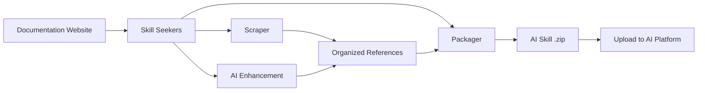

<p align="center">
  
</p>

# Skill Seekers

[English](README.md) | [简体中文](README.zh-CN.md) | [日本語](README.ja.md) | [한국어](README.ko.md) | [Español](README.es.md) | Français | [Deutsch](README.de.md) | [Português](README.pt-BR.md) | [Türkçe](README.tr.md) | [العربية](README.ar.md) | [हिन्दी](README.hi.md) | [Русский](README.ru.md)

> ⚠️ **Avis de traduction automatique**
>
> Ce document a été traduit automatiquement par IA. Bien que nous nous efforcions de garantir la qualité, des expressions inexactes peuvent subsister.
>
> N'hésitez pas à contribuer à l'amélioration de la traduction via [GitHub Issue #260](https://github.com/yusufkaraaslan/Skill_Seekers/issues/260) ! Vos retours nous sont précieux.

[](https://github.com/yusufkaraaslan/Skill_Seekers/releases)
[](https://opensource.org/licenses/MIT)
[](https://www.python.org/downloads/)
[](https://modelcontextprotocol.io)
[](tests/)
[](https://pypi.org/project/skill-seekers/)
[](https://pypi.org/project/skill-seekers/)
[](https://skillseekersweb.com/)
[](https://github.com/yusufkaraaslan/Skill_Seekers)
[](https://pepy.tech/projects/skill-seekers)

<a href="https://trendshift.io/repositories/18329" target="_blank"></a>

**🧠 La couche de données des systèmes d'IA.** Skill Seekers transforme les sites de documentation, les dépôts GitHub, les PDF, les vidéos, les notebooks, les wikis et bien plus encore — **18 types de sources** — en ressources de connaissances structurées, prêtes à alimenter les AI Skills (Claude, Gemini, OpenAI), les pipelines RAG (LangChain, LlamaIndex, Pinecone) et les assistants de code IA (Cursor, Windsurf, Cline). Préparez une seule fois, exportez vers **22 cibles**.

## 💛 Sponsors

<!-- SPONSORS:START -->
### Launch Partner

<p align="center">
  <a href="https://www.atlascloud.ai/"></a><br/><sub><b>Launch Partner</b></sub>
</p>

[Atlas Cloud](https://www.atlascloud.ai/) — A full-modal, OpenAI-compatible AI inference platform. Skill Seekers supports it as a packaging/enhancement target via `--target atlas` with `ATLAS_API_KEY`.

### Silver Sponsors

<p align="center">
  <a href="https://www.rapidproxy.io/?utm_source=skillseekers&utm_medium=sponsor"></a><br/><sub><b>Sponsor — Silver</b></sub>
</p>
<!-- SPONSORS:END -->

**[Devenir sponsor](SPONSORSHIP.md)** · [GitHub Sponsors](https://github.com/sponsors/yusufkaraaslan)

---

## 🚀 Démarrage rapide

```bash
# 1. Installer
pip install skill-seekers

# 2. Créer une skill à partir de n'importe quelle source
skill-seekers create https://docs.djangoproject.com/

# 3. L'empaqueter pour votre plateforme d'IA
skill-seekers package output/django --target claude
```

Vous disposez maintenant de `output/django-claude.zip`, prêt à l'emploi.

```bash
# Choisir un autre agent IA pour l'amélioration (par défaut : claude)
skill-seekers create https://docs.djangoproject.com/ --agent kimi
skill-seekers create https://docs.djangoproject.com/ --agent-cmd "my-custom-agent run"
```

### 🛰️ Analyse de projet pilotée par l'IA

Pointez `scan` vers un projet : un agent IA lit ses manifestes, son README, son Dockerfile/CI et un échantillon des imports du code source — puis génère une configuration par framework détecté, ainsi qu'un `<project>-codebase.json` pour votre propre code :

```bash
skill-seekers scan ./my-react-app --out ./configs/scanned/
# → react.json, vite.json, tailwind.json, jest.json, my-react-app-codebase.json

skill-seekers create ./configs/scanned/react.json
```

Si une détection ne correspond à aucun preset existant, l'IA génère une configuration inédite ; à la sortie, vous pouvez éventuellement la publier dans le [registre communautaire](https://github.com/yusufkaraaslan/skill-seekers-configs).

### Les 18 types de sources

```bash
skill-seekers create facebook/react            # Dépôt GitHub
skill-seekers create ./my-project              # Base de code locale
skill-seekers create manual.pdf                # PDF
skill-seekers create report.docx               # Word
skill-seekers create book.epub                 # EPUB
skill-seekers create notebook.ipynb            # Jupyter
skill-seekers create openapi.yaml              # OpenAPI/Swagger
skill-seekers create presentation.pptx         # PowerPoint
skill-seekers create guide.adoc                # AsciiDoc
skill-seekers create page.html                 # HTML local (ou un répertoire entier)
skill-seekers create feed.rss                  # RSS/Atom
skill-seekers create curl.1                    # Page de manuel

# Vidéo (YouTube, Vimeo ou fichier local — nécessite skill-seekers[video])
skill-seekers create --video-url https://www.youtube.com/watch?v=... --name mytutorial
skill-seekers create --setup                   # installe automatiquement les dépendances visuelles adaptées au GPU

skill-seekers create --space-key TEAM --name wiki               # Confluence
skill-seekers create --database-id ... --name docs              # Notion
skill-seekers create --chat-export-path ./slack-export --name team-chat  # Slack/Discord
```

Consultez le [Guide de scraping](docs/user-guide/02-scraping.md) pour tous les types de sources et leurs options.

---

## 📦 Installation

```bash
pip install skill-seekers              # Cœur : scraping, GitHub, PDF, packaging
pip install skill-seekers[all-llms]    # + toutes les plateformes LLM
pip install skill-seekers[mcp]         # + serveur MCP
pip install skill-seekers[all]         # Tout
```

**Vous ne savez pas ce qu'il vous faut ?** Lancez l'assistant : `skill-seekers-setup`

<details>
<summary><b>Tous les extras d'installation</b></summary>

| Installation | Ajoute |
|---------|------|
| `skill-seekers[gemini]` | Prise en charge de Google Gemini |
| `skill-seekers[openai]` | Prise en charge d'OpenAI ChatGPT |
| `skill-seekers[all-llms]` | Toutes les plateformes LLM |
| `skill-seekers[mcp]` | Serveur MCP pour Claude Code, Cursor, etc. |
| `skill-seekers[video]` | Extraction des transcriptions et métadonnées YouTube/Vimeo |
| `skill-seekers[video-full]` | + Transcription Whisper et extraction visuelle des images |
| `skill-seekers[jupyter]` | Prise en charge des notebooks Jupyter |
| `skill-seekers[pptx]` | Prise en charge de PowerPoint |
| `skill-seekers[confluence]` | Prise en charge du wiki Confluence |
| `skill-seekers[notion]` | Prise en charge des pages Notion |
| `skill-seekers[rss]` | Prise en charge des flux RSS/Atom |
| `skill-seekers[chat]` | Prise en charge des exports de discussions Slack/Discord |
| `skill-seekers[asciidoc]` | Prise en charge d'AsciiDoc |
| `skill-seekers[all]` | Tout |

> **Dépendances visuelles vidéo (adaptées au GPU) :** après avoir installé `skill-seekers[video-full]`, lancez `skill-seekers create --setup` pour détecter automatiquement votre GPU et installer la variante PyTorch correspondante + easyocr.

</details>

**Prérequis :** Python 3.10+, Git. Vous débutez ? → **[Démarrage rapide à toute épreuve](docs/getting-started/BULLETPROOF_QUICKSTART.md)** 🎯

---

## 📚 Documentation

| Je veux... | À lire |
|--------------|-----------|
| **Démarrer rapidement** | [Démarrage rapide](docs/getting-started/02-quick-start.md) — 3 commandes jusqu'à votre première skill |
| **Comprendre les concepts** | [Concepts fondamentaux](docs/user-guide/01-core-concepts.md) |
| **Scraper des sources** | [Guide de scraping](docs/user-guide/02-scraping.md) — les 18 types de sources |
| **Améliorer des skills avec l'IA** | [Guide d'amélioration](docs/user-guide/03-enhancement.md) · [Modes d'amélioration](docs/features/ENHANCEMENT_MODES.md) |
| **Exporter des skills** | [Guide de packaging](docs/user-guide/04-packaging.md) |
| **Construire des workflows** | [Workflows](docs/user-guide/05-workflows.md) |
| **Retrouver une commande** | [Référence CLI](docs/reference/CLI_REFERENCE.md) — les 19 commandes |
| **Configurer** | [Format de configuration](docs/reference/CONFIG_FORMAT.md) · [Variables d'environnement](docs/reference/ENVIRONMENT_VARIABLES.md) |
| **Mettre en place MCP** | [Installation MCP](docs/guides/MCP_SETUP.md) · [Référence MCP](docs/reference/MCP_REFERENCE.md) |
| **Intégrer avec RAG / IDE** | [LangChain](docs/integrations/LANGCHAIN.md) · [Pipelines RAG](docs/integrations/RAG_PIPELINES.md) · [Cursor](docs/integrations/CURSOR.md) · [Windsurf](docs/integrations/WINDSURF.md) · [Cline](docs/integrations/CLINE.md) |
| **Traiter d'énormes ensembles de docs** | [Documentation volumineuse](docs/reference/LARGE_DOCUMENTATION.md) — 10K–40K+ pages |
| **Comprendre l'architecture** | [Architecture UML](docs/UML_ARCHITECTURE.md) — 14 diagrammes |
| **Résoudre un problème** | [Dépannage](docs/user-guide/06-troubleshooting.md) |

**Index complet de la documentation :** [docs/README.md](docs/README.md)

---

## 🎯 Ce que vous obtenez

| Cas d'usage | Résultat | Alimente |
|----------|--------|--------|
| **AI Skills** | Un `SKILL.md` complet + fichiers de référence | Claude Code, Gemini, GPT |
| **Pipelines RAG** | Documents découpés en chunks avec métadonnées riches | LangChain, LlamaIndex, Haystack |
| **Bases de données vectorielles** | Données préformatées prêtes pour l'upsert | Pinecone, Chroma, Weaviate, FAISS, Qdrant |
| **Assistants de code IA** | Fichiers de contexte que l'IA de votre IDE lit automatiquement | Cursor, Windsurf, Cline, Continue.dev |

### Cibles d'export (22)

```bash
skill-seekers package output/react --target claude      # → Skill Claude (ZIP + YAML)
skill-seekers package output/react --target langchain   # → Documents LangChain
skill-seekers package output/react --target llama-index # → TextNodes LlamaIndex
skill-seekers package output/react --target ibm-bob     # → Répertoire de skill IBM Bob
```

**Plateformes LLM (12) :** `claude` · `gemini` · `openai` · `minimax` · `opencode` · `kimi` · `deepseek` · `qwen` · `openrouter` · `together` · `fireworks` · `markdown`
**RAG et vectoriel (8) :** `langchain` · `llama-index` · `haystack` · `chroma` · `faiss` · `weaviate` · `qdrant` · `pinecone`
**Autres (2) :** `atlas` · `ibm-bob`

Consultez la [Matrice des fonctionnalités](docs/reference/FEATURE_MATRIX.md) pour le détail de la prise en charge par plateforme.

### Pourquoi c'est important

- ⚡ **99 % plus rapide** — des jours de préparation manuelle des données → 15–45 minutes
- 🎯 **Une vraie qualité de skill** — des fichiers `SKILL.md` de plus de 500 lignes avec exemples, patterns et guides
- 📊 **Chunks prêts pour le RAG** — un découpage intelligent qui préserve les blocs de code et le contexte
- 🔄 **Multi-source** — combinez docs + GitHub + PDF + vidéos en une seule ressource de connaissances
- 🌐 **Une préparation, toutes les cibles** — exportez vers 22 cibles sans refaire le scraping
- ✅ **Éprouvé sur le terrain** — 3 900+ tests, 68 presets de workflow, prêt pour la production

---

## ✨ Capacités clés

<details>
<summary><b>Scraping de documentation</b> — découverte SPA, llms.txt, catégorisation intelligente</summary>

Découverte à trois niveaux pour les sites SPA JavaScript (`sitemap.xml` → `llms.txt` → rendu par navigateur headless), détection automatique de `llms.txt` (10× plus rapide lorsqu'il est présent), catégorisation intelligente par thème, et un parser HTML tolérant en repli pour que le balisage cassé reste scrapable.

→ [Guide de scraping](docs/user-guide/02-scraping.md) · [Prise en charge de llms.txt](docs/reference/LLMS_TXT_SUPPORT.md)
</details>

<details>
<summary><b>Analyse GitHub et base de code (C3.x)</b> — parsing AST, détection de patterns, guides pratiques</summary>

Architecture à trois flux : analyse de code (AST, design patterns, tests), documentation (README, `docs/`, wiki) et communauté (issues, PR, métadonnées). Le pipeline C3.x ajoute 10 détecteurs de patterns GoF sur 9 langages, des exemples d'utilisation extraits des tests, des guides pratiques rédigés par l'IA, l'extraction de configuration et des vues d'ensemble de l'architecture.

```bash
skill-seekers create ./my-project --preset quick          # 1–2 min, en surface
skill-seekers create ./my-project --preset standard       # équilibré (par défaut)
skill-seekers create ./my-project --preset comprehensive  # approfondi, exhaustif
```

→ [Détection de patterns](docs/features/PATTERN_DETECTION.md) · [Guides pratiques](docs/features/HOW_TO_GUIDES.md) · [Extraction d'exemples depuis les tests](docs/features/TEST_EXAMPLE_EXTRACTION.md)
</details>

<details>
<summary><b>Amélioration par l'IA</b> — API ou agents locaux, 68 presets de workflow</summary>

Chaque appel à l'IA passe par un transport unique, en **mode API** (Anthropic, Google Gemini, OpenAI, Moonshot/Kimi, MiniMax) ou en **mode LOCAL** (Claude Code, Kimi Code, Codex, Copilot, OpenCode, agents personnalisés — sans coût d'API). Réglez la profondeur avec `--enhance-level 0-3` et choisissez un agent avec `--agent`.

→ [Guide d'amélioration](docs/user-guide/03-enhancement.md) · [Modes d'amélioration](docs/features/ENHANCEMENT_MODES.md) · [Configuration multi-agents](docs/guides/MULTI_AGENT_SETUP.md)
</details>

<details>
<summary><b>Scraping unifié multi-source</b> — combinez plusieurs sources en une seule skill</summary>

Une seule configuration peut rassembler documentation, GitHub, PDF, vidéos et bien plus dans une unique ressource de connaissances, avec détection des contradictions et synthèse deux à deux entre les sources.

→ [Scraping unifié](docs/features/UNIFIED_SCRAPING.md)
</details>

<details>
<summary><b>Extraction vidéo</b> — transcriptions, images, code affiché à l'écran</summary>

YouTube, Vimeo et fichiers locaux. Repli de transcription à trois niveaux (sous-titres → API de transcription YouTube → Whisper en local), plus une extraction visuelle optionnelle qui applique l'OCR au code affiché à l'écran sur des images échantillonnées.

→ [Guide vidéo](docs/VIDEO_GUIDE.md)
</details>

<details>
<summary><b>Qualité, synchronisation et passage à l'échelle</b></summary>

Notation de la qualité avec seuil bloquant (`skill-seekers quality output/react/ --threshold 7`), détection des changements de documentation avec re-scraping planifié et notifications, ingestion en streaming pour les très gros ensembles de docs, et mises à jour incrémentales.

→ [Documentation volumineuse](docs/reference/LARGE_DOCUMENTATION.md) · [Qualité du code](docs/reference/CODE_QUALITY.md)
</details>

---

## 🔌 Intégration MCP (40 outils)

Skill Seekers fournit un serveur MCP pour Claude Code, Cursor, Windsurf, VS Code + Cline et IntelliJ IDEA.

```bash
# mode stdio (Claude Code, VS Code + Cline)
python -m skill_seekers.mcp.server_fastmcp

# mode HTTP (Cursor, Windsurf, IntelliJ)
python -m skill_seekers.mcp.server_fastmcp --transport http --port 8765
```

Il vous suffit ensuite de demander à votre assistant : *« Empaquette et téléverse la skill React. »*

→ [Installation MCP](docs/guides/MCP_SETUP.md) · [Référence MCP](docs/reference/MCP_REFERENCE.md) · [Transport HTTP](docs/guides/HTTP_TRANSPORT.md)

---

## 🤖 Installation dans les agents IA

Les skills s'installent automatiquement dans **19 agents de code IA** :

```bash
skill-seekers install-agent output/react/ --agent cursor
skill-seekers install-agent output/react/ --agent all      # tous les agents détectés
skill-seekers install-agent output/react/ --agent cursor --dry-run
```

| Agent | Chemin | Portée |
|-------|------|-------|
| Claude Code | `~/.claude/skills/` | Global |
| Cursor | `.cursor/skills/` | Projet |
| VS Code / Copilot | `.github/skills/` | Projet |
| Amp | `~/.amp/skills/` | Global |
| Goose | `~/.config/goose/skills/` | Global |
| OpenCode | `~/.opencode/skills/` | Global |
| Letta | `~/.letta/skills/` | Global |
| Aide | `~/.aide/skills/` | Global |
| Windsurf | `~/.windsurf/skills/` | Global |
| Neovate | `~/.neovate/skills/` | Global |
| Roo Code | `.roo/skills/` | Projet |
| Cline | `.cline/skills/` | Projet |
| Aider | `~/.aider/skills/` | Global |
| Bolt | `.bolt/skills/` | Projet |
| Kilo Code | `.kilo/skills/` | Projet |
| Continue | `~/.continue/skills/` | Global |
| Kimi Code | `~/.kimi/skills/` | Global |
| IBM Bob | `.bob/skills/` | Projet |

### Téléversement vers Claude

```bash
export ANTHROPIC_API_KEY=sk-ant-...
skill-seekers package output/react/ --upload   # empaqueter + téléverser
skill-seekers upload output/react.zip          # téléverser un zip existant
```

Pas de clé API ? Empaquetez la skill et téléversez `output/react.zip` manuellement sur [claude.ai/skills](https://claude.ai/skills).

→ [Guide de téléversement](docs/guides/UPLOAD_GUIDE.md)

---

## ⚙️ Fonctionnement


```mermaid
graph LR
    A[Documentation Website] --> B[Skill Seekers]
    B --> C[Scraper]
    B --> D[AI Enhancement]
    B --> E[Packager]
    C --> F[Organized References]
    D --> F
    F --> E
    E --> G[AI Skill .zip]
    G --> H[Upload to AI Platform]
```

1. **Scraper** — extraire chaque page (en vérifiant d'abord `llms.txt`)
2. **Catégoriser** — organiser le contenu par thèmes (API, guides, tutoriels, …)
3. **Améliorer** — l'IA rédige un `SKILL.md` complet avec des exemples
4. **Empaqueter** — regrouper le tout dans un artefact prêt pour la plateforme
5. **Téléverser** — l'envoyer vers votre plateforme d'IA (optionnel)

### Architecture

**8 modules cœur + 5 modules utilitaires** (~200 classes) :

| Module | Rôle |
|--------|---------|
| **CLICore** | Répartiteur de commandes façon Git, détection automatique de la source |
| **Scrapers** | 18 extracteurs de types de sources sur une couche de build partagée |
| **Adaptors** | 22 formats de plateformes de sortie derrière une seule ABC `SkillAdaptor` |
| **Analysis** | Pipeline de base de code C3.x, 10 détecteurs de patterns GoF |
| **Enhancement** | Amélioration par l'IA via un transport `AgentClient` unique |
| **Packaging** | Empaqueter, téléverser et installer les skills |
| **MCP** | Serveur FastMCP (40 outils, 10 modules d'outils) |
| **Sync** | Détection des changements de documentation et notification |

→ [Architecture UML](docs/UML_ARCHITECTURE.md) · [Référence API](docs/reference/API_REFERENCE.md) · [Architecture des skills](docs/reference/SKILL_ARCHITECTURE.md)

---

## 🆕 Nouveautés de la v3.9.0

- **Parser HTML de repli pour le balisage cassé** (#96) — les pages gravement malformées ne produisent plus un scraping vide ; les pages bien formées restent identiques à l'octet près.
- **Nouvelles tentatives sur les échecs transitoires** — le scraper de documentation (#97) et le `fetch_config` MCP (#92) réessaient désormais les coupures de connexion et les erreurs 5xx avec backoff ; les 4xx échouent toujours immédiatement.
- **Repli de transcription Whisper** (#420) — les vidéos locales sans sous-titres obtiennent enfin une vraie transcription.
- **OCR d'images MiniMax + fournisseurs multimodaux pilotés par le registre** (#423) — les fournisseurs déclarent leur protocole réseau et leur capacité de traitement d'images ; les clés émises en Chine fonctionnent avec le bon endpoint.
- **Valeurs par défaut économes en tokens pour les issues GitHub** (#169) — les skills GitHub n'embarquent plus par défaut l'historique complet des issues fermées.
- **CORS piloté par l'environnement sur les trois serveurs** (#422, #424) — fini les origines en wildcard avec des identifiants.

Historique complet : **[CHANGELOG.md](CHANGELOG.md)**

---

## 📈 Performances

| Taille de la documentation | Durée | Sortie |
|---|---|---|
| Petite (< 100 pages) | 5–10 min | ~2 MB |
| Moyenne (100–500 pages) | 15–30 min | ~10 MB |
| Grande (500–2 000 pages) | 30–60 min | ~40 MB |
| Énorme (10K–40K+ pages) | Utilisez `stream` | Voir [Documentation volumineuse](docs/reference/LARGE_DOCUMENTATION.md) |

---

## 🐛 Dépannage

```bash
skill-seekers doctor          # diagnostiquer l'installation et l'environnement
skill-seekers sync-config     # détecter les dérives de configuration
```

Problèmes courants et solutions : **[Guide de dépannage](docs/user-guide/06-troubleshooting.md)** · [TROUBLESHOOTING.md](docs/TROUBLESHOOTING.md)

---

## 🤝 Contribuer

Les contributions sont les bienvenues — voir **[CONTRIBUTING.md](CONTRIBUTING.md)**.

- 📋 **[Feuille de route et tâches de développement](https://github.com/users/yusufkaraaslan/projects/2)** — choisissez une tâche
- 💬 **[Discussions](https://github.com/yusufkaraaslan/Skill_Seekers/discussions)** — questions et idées
- 🐛 **[Issues](https://github.com/yusufkaraaslan/Skill_Seekers/issues)** — bugs et demandes de fonctionnalités

---

## 📝 Licence

MIT — voir [LICENSE](LICENSE).

## 🔒 Sécurité

[](https://mseep.ai/app/yusufkaraaslan-skill-seekers)

---

## 🌐 Écosystème

Skill Seekers est un projet multi-dépôts :

| Dépôt | Description | Liens |
|-----------|-------------|-------|
| **[Skill_Seekers](https://github.com/yusufkaraaslan/Skill_Seekers)** | CLI cœur et serveur MCP (ce dépôt) | [PyPI](https://pypi.org/project/skill-seekers/) |
| **[skillseekersweb](https://github.com/yusufkaraaslan/skillseekersweb)** | Site web et documentation | [En ligne](https://skillseekersweb.com/) |
| **[skill-seekers-configs](https://github.com/yusufkaraaslan/skill-seekers-configs)** | Dépôt de configurations communautaires | |
| **[skill-seekers-action](https://github.com/yusufkaraaslan/skill-seekers-action)** | GitHub Action pour la CI/CD | |
| **[skill-seekers-plugin](https://github.com/yusufkaraaslan/skill-seekers-plugin)** | Plugin Claude Code | |
| **[homebrew-skill-seekers](https://github.com/yusufkaraaslan/homebrew-skill-seekers)** | Tap Homebrew pour macOS | |

> **Envie de contribuer ?** Les dépôts du site web et des configurations sont d'excellents points de départ pour les nouveaux contributeurs !
