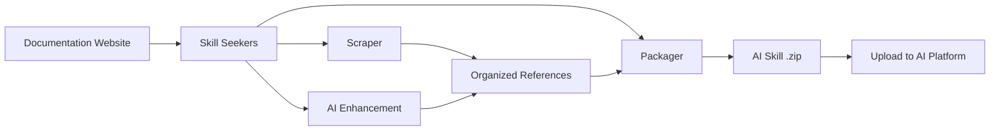

<p align="center">
  
</p>

# Skill Seekers

[English](README.md) | [简体中文](README.zh-CN.md) | [日本語](README.ja.md) | [한국어](README.ko.md) | [Español](README.es.md) | [Français](README.fr.md) | [Deutsch](README.de.md) | [Português](README.pt-BR.md) | [Türkçe](README.tr.md) | [العربية](README.ar.md) | हिन्दी | [Русский](README.ru.md)

> ⚠️ **मशीन अनुवाद सूचना**
>
> यह दस्तावेज़ AI द्वारा स्वचालित रूप से अनुवादित किया गया है। हम गुणवत्ता सुनिश्चित करने का प्रयास करते हैं, लेकिन अशुद्ध अभिव्यक्तियाँ हो सकती हैं।
>
> अनुवाद सुधारने में मदद करने के लिए [GitHub Issue #260](https://github.com/yusufkaraaslan/Skill_Seekers/issues/260) पर सम्पर्क करें! आपकी प्रतिक्रिया हमारे लिए बहुत मूल्यवान है।

[](https://github.com/yusufkaraaslan/Skill_Seekers/releases)
[](https://opensource.org/licenses/MIT)
[](https://www.python.org/downloads/)
[](https://modelcontextprotocol.io)
[](tests/)
[](https://pypi.org/project/skill-seekers/)
[](https://pypi.org/project/skill-seekers/)
[](https://skillseekersweb.com/)
[](https://github.com/yusufkaraaslan/Skill_Seekers)
[](https://pepy.tech/projects/skill-seekers)

<a href="https://trendshift.io/repositories/18329" target="_blank"></a>

**🧠 AI सिस्टम के लिए डेटा लेयर।** Skill Seekers डॉक्यूमेंटेशन साइट्स, GitHub रिपॉजिटरी, PDF, वीडियो, नोटबुक, विकी और बहुत कुछ — **18 सोर्स टाइप** — को संरचित नॉलेज एसेट में बदल देता है, जो AI Skills (Claude, Gemini, OpenAI), RAG पाइपलाइनों (LangChain, LlamaIndex, Pinecone) और AI कोडिंग असिस्टेंट (Cursor, Windsurf, Cline) को चलाने के लिए तैयार रहते हैं। एक बार तैयार करें, **22 टारगेट** पर एक्सपोर्ट करें।

## 💛 प्रायोजक

<!-- SPONSORS:START -->
### Launch Partner

<p align="center">
  <a href="https://www.atlascloud.ai/"></a><br/><sub><b>Launch Partner</b></sub>
</p>

[Atlas Cloud](https://www.atlascloud.ai/) — A full-modal, OpenAI-compatible AI inference platform. Skill Seekers supports it as a packaging/enhancement target via `--target atlas` with `ATLAS_API_KEY`.

### Silver Sponsors

<p align="center">
  <a href="https://www.rapidproxy.io/?utm_source=skillseekers&utm_medium=sponsor"></a><br/><sub><b>Sponsor — Silver</b></sub>
</p>
<!-- SPONSORS:END -->

**[प्रायोजक बनें](SPONSORSHIP.md)** · [GitHub Sponsors](https://github.com/sponsors/yusufkaraaslan)

---

## 🚀 क्विक स्टार्ट

```bash
# 1. इंस्टॉल करें
pip install skill-seekers

# 2. किसी भी सोर्स से एक skill बनाएँ
skill-seekers create https://docs.djangoproject.com/

# 3. अपने AI प्लेटफ़ॉर्म के लिए इसे पैकेज करें
skill-seekers package output/django --target claude
```

अब आपके पास `output/django-claude.zip` है, जो इस्तेमाल के लिए तैयार है।

```bash
# एन्हांसमेंट के लिए कोई दूसरा AI एजेंट चुनें (डिफ़ॉल्ट: claude)
skill-seekers create https://docs.djangoproject.com/ --agent kimi
skill-seekers create https://docs.djangoproject.com/ --agent-cmd "my-custom-agent run"
```

### 🛰️ AI-संचालित प्रोजेक्ट स्कैन

`scan` को किसी प्रोजेक्ट पर चलाएँ और एक AI एजेंट उसके मैनिफ़ेस्ट, README, Dockerfile/CI और सैंपल किए गए सोर्स इम्पोर्ट पढ़ता है — फिर हर पहचाने गए फ़्रेमवर्क के लिए एक config बनाता है, साथ ही आपके अपने कोड के लिए एक `<project>-codebase.json`:

```bash
skill-seekers scan ./my-react-app --out ./configs/scanned/
# → react.json, vite.json, tailwind.json, jest.json, my-react-app-codebase.json

skill-seekers create ./configs/scanned/react.json
```

अगर किसी डिटेक्शन के लिए कोई मौजूदा प्रीसेट नहीं है, तो AI एक नया config जनरेट करता है; बाहर निकलते समय आप चाहें तो उसे [कम्युनिटी रजिस्ट्री](https://github.com/yusufkaraaslan/skill-seekers-configs) में वापस पब्लिश कर सकते हैं।

### सभी 18 सोर्स टाइप

```bash
skill-seekers create facebook/react            # GitHub रिपॉजिटरी
skill-seekers create ./my-project              # लोकल कोडबेस
skill-seekers create manual.pdf                # PDF
skill-seekers create report.docx               # Word
skill-seekers create book.epub                 # EPUB
skill-seekers create notebook.ipynb            # Jupyter
skill-seekers create openapi.yaml              # OpenAPI/Swagger
skill-seekers create presentation.pptx         # PowerPoint
skill-seekers create guide.adoc                # AsciiDoc
skill-seekers create page.html                 # लोकल HTML (या पूरी डायरेक्ट्री)
skill-seekers create feed.rss                  # RSS/Atom
skill-seekers create curl.1                    # Man page

# वीडियो (YouTube, Vimeo, या लोकल — इसके लिए skill-seekers[video] चाहिए)
skill-seekers create --video-url https://www.youtube.com/watch?v=... --name mytutorial
skill-seekers create --setup                   # GPU-अवेयर विज़ुअल डिपेंडेंसी अपने-आप इंस्टॉल करें

skill-seekers create --space-key TEAM --name wiki               # Confluence
skill-seekers create --database-id ... --name docs              # Notion
skill-seekers create --chat-export-path ./slack-export --name team-chat  # Slack/Discord
```

हर सोर्स टाइप और उसके विकल्पों के लिए [स्क्रैपिंग गाइड](docs/user-guide/02-scraping.md) देखें।

---

## 📦 इंस्टॉलेशन

```bash
pip install skill-seekers              # कोर: scraping, GitHub, PDF, पैकेजिंग
pip install skill-seekers[all-llms]    # + हर LLM प्लेटफ़ॉर्म
pip install skill-seekers[mcp]         # + MCP सर्वर
pip install skill-seekers[all]         # सब कुछ
```

**पक्का नहीं कि आपको क्या चाहिए?** विज़ार्ड चलाएँ: `skill-seekers-setup`

<details>
<summary><b>सभी इंस्टॉलेशन एक्स्ट्रा</b></summary>

| इंस्टॉल | क्या जोड़ता है |
|---------|------|
| `skill-seekers[gemini]` | Google Gemini सपोर्ट |
| `skill-seekers[openai]` | OpenAI ChatGPT सपोर्ट |
| `skill-seekers[all-llms]` | सभी LLM प्लेटफ़ॉर्म |
| `skill-seekers[mcp]` | Claude Code, Cursor आदि के लिए MCP सर्वर |
| `skill-seekers[video]` | YouTube/Vimeo ट्रांसक्रिप्ट और मेटाडेटा एक्सट्रैक्शन |
| `skill-seekers[video-full]` | + Whisper ट्रांसक्रिप्शन और विज़ुअल फ़्रेम एक्सट्रैक्शन |
| `skill-seekers[jupyter]` | Jupyter Notebook सपोर्ट |
| `skill-seekers[pptx]` | PowerPoint सपोर्ट |
| `skill-seekers[confluence]` | Confluence विकी सपोर्ट |
| `skill-seekers[notion]` | Notion पेज सपोर्ट |
| `skill-seekers[rss]` | RSS/Atom फ़ीड सपोर्ट |
| `skill-seekers[chat]` | Slack/Discord चैट एक्सपोर्ट सपोर्ट |
| `skill-seekers[asciidoc]` | AsciiDoc सपोर्ट |
| `skill-seekers[all]` | सब कुछ |

> **वीडियो विज़ुअल डिपेंडेंसी (GPU-अवेयर):** `skill-seekers[video-full]` इंस्टॉल करने के बाद `skill-seekers create --setup` चलाएँ ताकि आपका GPU अपने-आप पहचाना जाए और उससे मेल खाने वाला PyTorch वेरिएंट + easyocr इंस्टॉल हो जाए।

</details>

**पूर्वापेक्षाएँ:** Python 3.10+, Git. यहाँ नए हैं? → **[बुलेटप्रूफ़ क्विक स्टार्ट](docs/getting-started/BULLETPROOF_QUICKSTART.md)** 🎯

---

## 📚 डॉक्यूमेंटेशन

| मुझे यह करना है... | यह पढ़ें |
|--------------|-----------|
| **जल्दी शुरुआत करना** | [क्विक स्टार्ट](docs/getting-started/02-quick-start.md) — आपकी पहली skill तक 3 कमांड |
| **अवधारणाएँ समझना** | [कोर कॉन्सेप्ट्स](docs/user-guide/01-core-concepts.md) |
| **सोर्स स्क्रैप करना** | [स्क्रैपिंग गाइड](docs/user-guide/02-scraping.md) — सभी 18 सोर्स टाइप |
| **AI से skills बेहतर बनाना** | [एन्हांसमेंट गाइड](docs/user-guide/03-enhancement.md) · [एन्हांसमेंट मोड्स](docs/features/ENHANCEMENT_MODES.md) |
| **skills एक्सपोर्ट करना** | [पैकेजिंग गाइड](docs/user-guide/04-packaging.md) |
| **वर्कफ़्लो बनाना** | [वर्कफ़्लो](docs/user-guide/05-workflows.md) |
| **कोई कमांड ढूँढना** | [CLI रेफ़रेंस](docs/reference/CLI_REFERENCE.md) — सभी 19 कमांड |
| **कॉन्फ़िगर करना** | [Config फ़ॉर्मैट](docs/reference/CONFIG_FORMAT.md) · [एनवायरनमेंट वेरिएबल](docs/reference/ENVIRONMENT_VARIABLES.md) |
| **MCP सेट अप करना** | [MCP सेटअप](docs/guides/MCP_SETUP.md) · [MCP रेफ़रेंस](docs/reference/MCP_REFERENCE.md) |
| **RAG / IDE के साथ इंटीग्रेट करना** | [LangChain](docs/integrations/LANGCHAIN.md) · [RAG पाइपलाइन](docs/integrations/RAG_PIPELINES.md) · [Cursor](docs/integrations/CURSOR.md) · [Windsurf](docs/integrations/WINDSURF.md) · [Cline](docs/integrations/CLINE.md) |
| **विशाल डॉक सेट संभालना** | [बड़ी डॉक्यूमेंटेशन](docs/reference/LARGE_DOCUMENTATION.md) — 10K–40K+ पेज |
| **आर्किटेक्चर समझना** | [UML आर्किटेक्चर](docs/UML_ARCHITECTURE.md) — 14 डायग्राम |
| **कोई समस्या ठीक करना** | [ट्रबलशूटिंग](docs/user-guide/06-troubleshooting.md) |

**पूरा डॉक्यूमेंटेशन इंडेक्स:** [docs/README.md](docs/README.md)

---

## 🎯 आपको क्या मिलता है

| उपयोग | आउटपुट | किसे चलाता है |
|----------|--------|--------|
| **AI Skills** | विस्तृत `SKILL.md` + रेफ़रेंस फ़ाइलें | Claude Code, Gemini, GPT |
| **RAG पाइपलाइन** | समृद्ध मेटाडेटा वाले चंक किए गए डॉक्यूमेंट | LangChain, LlamaIndex, Haystack |
| **वेक्टर डेटाबेस** | upsert के लिए तैयार पूर्व-फ़ॉर्मैट किया गया डेटा | Pinecone, Chroma, Weaviate, FAISS, Qdrant |
| **AI कोडिंग असिस्टेंट** | कॉन्टेक्स्ट फ़ाइलें जिन्हें आपका IDE AI अपने-आप पढ़ता है | Cursor, Windsurf, Cline, Continue.dev |

### एक्सपोर्ट टारगेट (22)

```bash
skill-seekers package output/react --target claude      # → Claude Skill (ZIP + YAML)
skill-seekers package output/react --target langchain   # → LangChain Documents
skill-seekers package output/react --target llama-index # → LlamaIndex TextNodes
skill-seekers package output/react --target ibm-bob     # → IBM Bob skill directory
```

**LLM प्लेटफ़ॉर्म (12):** `claude` · `gemini` · `openai` · `minimax` · `opencode` · `kimi` · `deepseek` · `qwen` · `openrouter` · `together` · `fireworks` · `markdown`
**RAG और वेक्टर (8):** `langchain` · `llama-index` · `haystack` · `chroma` · `faiss` · `weaviate` · `qdrant` · `pinecone`
**अन्य (2):** `atlas` · `ibm-bob`

प्रति-प्लेटफ़ॉर्म सपोर्ट की जानकारी के लिए [फ़ीचर मैट्रिक्स](docs/reference/FEATURE_MATRIX.md) देखें।

### यह क्यों मायने रखता है

- ⚡ **99% तेज़** — कई दिनों की मैन्युअल डेटा तैयारी → 15–45 मिनट
- 🎯 **असली skill क्वालिटी** — उदाहरण, पैटर्न और गाइड के साथ 500+ लाइन वाली `SKILL.md` फ़ाइलें
- 📊 **RAG-रेडी चंक** — स्मार्ट चंकिंग कोड ब्लॉक और कॉन्टेक्स्ट को बरकरार रखती है
- 🔄 **मल्टी-सोर्स** — docs + GitHub + PDF + वीडियो को एक ही नॉलेज एसेट में जोड़ें
- 🌐 **एक बार तैयारी, हर टारगेट** — दोबारा scraping किए बिना 22 टारगेट पर एक्सपोर्ट करें
- ✅ **आज़माया-परखा** — 3,900+ टेस्ट, 68 वर्कफ़्लो प्रीसेट, प्रोडक्शन-रेडी

---

## ✨ मुख्य क्षमताएँ

<details>
<summary><b>डॉक्यूमेंटेशन scraping</b> — SPA डिस्कवरी, llms.txt, स्मार्ट कैटेगराइज़ेशन</summary>

JavaScript SPA साइटों के लिए तीन-परत डिस्कवरी (`sitemap.xml` → `llms.txt` → हेडलेस ब्राउज़र रेंडरिंग), स्वचालित `llms.txt` डिटेक्शन (मौजूद होने पर 10× तेज़), स्मार्ट टॉपिक कैटेगराइज़ेशन, और एक लचीला HTML पार्सर फ़ॉलबैक ताकि टूटी हुई मार्कअप भी स्क्रैप हो सके।

→ [स्क्रैपिंग गाइड](docs/user-guide/02-scraping.md) · [llms.txt सपोर्ट](docs/reference/LLMS_TXT_SUPPORT.md)
</details>

<details>
<summary><b>GitHub और कोडबेस विश्लेषण (C3.x)</b> — AST पार्सिंग, पैटर्न डिटेक्शन, हाउ-टू गाइड</summary>

तीन-स्ट्रीम आर्किटेक्चर: कोड विश्लेषण (AST, डिज़ाइन पैटर्न, टेस्ट), डॉक्यूमेंटेशन (README, `docs/`, विकी), और कम्युनिटी (issues, PR, मेटाडेटा)। C3.x पाइपलाइन 9 भाषाओं में 10 GoF पैटर्न डिटेक्टर, टेस्ट से निकाले गए उपयोग उदाहरण, AI द्वारा लिखी गई हाउ-टू गाइड, config एक्सट्रैक्शन और आर्किटेक्चर ओवरव्यू जोड़ती है।

```bash
skill-seekers create ./my-project --preset quick          # 1–2 मिनट, सतही स्तर
skill-seekers create ./my-project --preset standard       # संतुलित (डिफ़ॉल्ट)
skill-seekers create ./my-project --preset comprehensive  # गहन, विस्तृत
```

→ [पैटर्न डिटेक्शन](docs/features/PATTERN_DETECTION.md) · [हाउ-टू गाइड](docs/features/HOW_TO_GUIDES.md) · [टेस्ट उदाहरण एक्सट्रैक्शन](docs/features/TEST_EXAMPLE_EXTRACTION.md)
</details>

<details>
<summary><b>AI एन्हांसमेंट</b> — API या लोकल एजेंट, 68 वर्कफ़्लो प्रीसेट</summary>

हर AI कॉल एक ही ट्रांसपोर्ट से होकर गुज़रता है — या तो **API मोड** (Anthropic, Google Gemini, OpenAI, Moonshot/Kimi, MiniMax) में या **LOCAL मोड** (Claude Code, Kimi Code, Codex, Copilot, OpenCode, कस्टम एजेंट — कोई API लागत नहीं) में। गहराई `--enhance-level 0-3` से नियंत्रित करें और `--agent` से एजेंट चुनें।

→ [एन्हांसमेंट गाइड](docs/user-guide/03-enhancement.md) · [एन्हांसमेंट मोड्स](docs/features/ENHANCEMENT_MODES.md) · [मल्टी-एजेंट सेटअप](docs/guides/MULTI_AGENT_SETUP.md)
</details>

<details>
<summary><b>यूनिफ़ाइड मल्टी-सोर्स scraping</b> — कई सोर्स को एक skill में मिलाएँ</summary>

एक ही config डॉक्यूमेंटेशन, GitHub, PDF, वीडियो और बहुत कुछ को एक ही नॉलेज एसेट में खींच सकता है, साथ में सोर्स के बीच कॉन्फ़्लिक्ट डिटेक्शन और जोड़ीवार संश्लेषण भी।

→ [यूनिफ़ाइड scraping](docs/features/UNIFIED_SCRAPING.md)
</details>

<details>
<summary><b>वीडियो एक्सट्रैक्शन</b> — ट्रांसक्रिप्ट, फ़्रेम, ऑन-स्क्रीन कोड</summary>

YouTube, Vimeo और लोकल फ़ाइलें। तीन-स्तरीय ट्रांसक्रिप्ट फ़ॉलबैक (सबटाइटल → YouTube transcript API → लोकल Whisper), साथ में वैकल्पिक विज़ुअल एक्सट्रैक्शन जो सैंपल किए गए फ़्रेम से ऑन-स्क्रीन कोड का OCR करता है।

→ [वीडियो गाइड](docs/VIDEO_GUIDE.md)
</details>

<details>
<summary><b>क्वालिटी, sync और स्केल</b></summary>

गेट के साथ क्वालिटी स्कोरिंग (`skill-seekers quality output/react/ --threshold 7`), शेड्यूल किए गए री-स्क्रैप और नोटिफ़िकेशन के साथ डॉक-बदलाव डिटेक्शन, बहुत बड़े डॉक सेट के लिए स्ट्रीमिंग इन्जेशन, और इंक्रीमेंटल अपडेट।

→ [बड़ी डॉक्यूमेंटेशन](docs/reference/LARGE_DOCUMENTATION.md) · [कोड क्वालिटी](docs/reference/CODE_QUALITY.md)
</details>

---

## 🔌 MCP इंटीग्रेशन (40 टूल)

Skill Seekers, Claude Code, Cursor, Windsurf, VS Code + Cline और IntelliJ IDEA के लिए एक MCP सर्वर के साथ आता है।

```bash
# stdio मोड (Claude Code, VS Code + Cline)
python -m skill_seekers.mcp.server_fastmcp

# HTTP मोड (Cursor, Windsurf, IntelliJ)
python -m skill_seekers.mcp.server_fastmcp --transport http --port 8765
```

फिर बस अपने असिस्टेंट से कहें: *"React skill को पैकेज करके अपलोड कर दो।"*

→ [MCP सेटअप](docs/guides/MCP_SETUP.md) · [MCP रेफ़रेंस](docs/reference/MCP_REFERENCE.md) · [HTTP ट्रांसपोर्ट](docs/guides/HTTP_TRANSPORT.md)

---

## 🤖 AI एजेंट्स में इंस्टॉल करना

Skills अपने-आप **19 AI कोडिंग एजेंट्स** में इंस्टॉल हो जाती हैं:

```bash
skill-seekers install-agent output/react/ --agent cursor
skill-seekers install-agent output/react/ --agent all      # हर पहचाना गया एजेंट
skill-seekers install-agent output/react/ --agent cursor --dry-run
```

| एजेंट | पाथ | स्कोप |
|-------|------|-------|
| Claude Code | `~/.claude/skills/` | ग्लोबल |
| Cursor | `.cursor/skills/` | प्रोजेक्ट |
| VS Code / Copilot | `.github/skills/` | प्रोजेक्ट |
| Amp | `~/.amp/skills/` | ग्लोबल |
| Goose | `~/.config/goose/skills/` | ग्लोबल |
| OpenCode | `~/.opencode/skills/` | ग्लोबल |
| Letta | `~/.letta/skills/` | ग्लोबल |
| Aide | `~/.aide/skills/` | ग्लोबल |
| Windsurf | `~/.windsurf/skills/` | ग्लोबल |
| Neovate | `~/.neovate/skills/` | ग्लोबल |
| Roo Code | `.roo/skills/` | प्रोजेक्ट |
| Cline | `.cline/skills/` | प्रोजेक्ट |
| Aider | `~/.aider/skills/` | ग्लोबल |
| Bolt | `.bolt/skills/` | प्रोजेक्ट |
| Kilo Code | `.kilo/skills/` | प्रोजेक्ट |
| Continue | `~/.continue/skills/` | ग्लोबल |
| Kimi Code | `~/.kimi/skills/` | ग्लोबल |
| IBM Bob | `.bob/skills/` | प्रोजेक्ट |

### Claude पर अपलोड करना

```bash
export ANTHROPIC_API_KEY=sk-ant-...
skill-seekers package output/react/ --upload   # पैकेज + अपलोड
skill-seekers upload output/react.zip          # किसी मौजूदा zip को अपलोड करें
```

API key नहीं है? इसे पैकेज करें और `output/react.zip` को [claude.ai/skills](https://claude.ai/skills) पर मैन्युअली अपलोड करें।

→ [अपलोड गाइड](docs/guides/UPLOAD_GUIDE.md)

---

## ⚙️ यह कैसे काम करता है



1. **स्क्रैप** — हर पेज निकालें (पहले `llms.txt` जाँचते हुए)
2. **कैटेगराइज़** — कॉन्टेंट को विषयों में व्यवस्थित करें (API, गाइड, ट्यूटोरियल, …)
3. **एन्हांस** — AI उदाहरणों के साथ एक विस्तृत `SKILL.md` लिखता है
4. **पैकेज** — प्लेटफ़ॉर्म-रेडी आर्टिफ़ैक्ट में बंडल करें
5. **अपलोड** — इसे अपने AI प्लेटफ़ॉर्म पर भेजें (वैकल्पिक)

### आर्किटेक्चर

**8 कोर मॉड्यूल + 5 यूटिलिटी मॉड्यूल** (~200 क्लास):

| मॉड्यूल | उद्देश्य |
|--------|---------|
| **CLICore** | Git-शैली का कमांड डिस्पैचर, सोर्स ऑटो-डिटेक्शन |
| **Scrapers** | एक साझा बिल्ड लेयर पर 18 सोर्स-टाइप एक्सट्रैक्टर |
| **Adaptors** | एक ही `SkillAdaptor` ABC के पीछे 22 आउटपुट प्लेटफ़ॉर्म फ़ॉर्मैट |
| **Analysis** | C3.x कोडबेस पाइपलाइन, 10 GoF पैटर्न डिटेक्टर |
| **Enhancement** | एकल `AgentClient` ट्रांसपोर्ट के ज़रिए AI सुधार |
| **Packaging** | skills को पैकेज, अपलोड और इंस्टॉल करना |
| **MCP** | FastMCP सर्वर (40 टूल, 10 टूल मॉड्यूल) |
| **Sync** | डॉक बदलाव की पहचान और नोटिफ़िकेशन |

→ [UML आर्किटेक्चर](docs/UML_ARCHITECTURE.md) · [API रेफ़रेंस](docs/reference/API_REFERENCE.md) · [Skill आर्किटेक्चर](docs/reference/SKILL_ARCHITECTURE.md)

---

## 🆕 v3.9.0 में नया

- **टूटी हुई मार्कअप के लिए HTML पार्सर फ़ॉलबैक** (#96) — बुरी तरह ख़राब पेज अब खाली स्क्रैप नहीं होते; सही बनावट वाले पेज बाइट-दर-बाइट समान रहते हैं।
- **अस्थायी विफलताओं पर पुनःप्रयास** — डॉक स्क्रैपर (#97) और MCP `fetch_config` (#92) अब कनेक्शन की क्षणिक गड़बड़ियों और 5xx पर बैकऑफ़ के साथ दोबारा कोशिश करते हैं; 4xx अब भी तुरंत फेल होता है।
- **Whisper ट्रांसक्रिप्शन फ़ॉलबैक** (#420) — बिना सबटाइटल वाले लोकल वीडियो को आख़िरकार एक असली ट्रांसक्रिप्ट मिलता है।
- **MiniMax इमेज OCR + रजिस्ट्री-संचालित मल्टीमोडल प्रोवाइडर** (#423) — प्रोवाइडर अपना वायर प्रोटोकॉल और इमेज क्षमता घोषित करते हैं; चीन में जारी की गई keys सही एंडपॉइंट के साथ काम करती हैं।
- **टोकन-किफ़ायती GitHub issue डिफ़ॉल्ट** (#169) — GitHub skills अब डिफ़ॉल्ट रूप से बंद हो चुके issues का पूरा इतिहास बंडल नहीं करतीं।
- **तीनों सर्वरों में env-संचालित CORS** (#422, #424) — क्रेडेंशियल के साथ वाइल्डकार्ड ऑरिजिन अब नहीं।

पूरा इतिहास: **[CHANGELOG.md](CHANGELOG.md)**

---

## 📈 प्रदर्शन

| डॉक्यूमेंटेशन का आकार | समय | आउटपुट |
|---|---|---|
| छोटा (< 100 पेज) | 5–10 मिनट | ~2 MB |
| मध्यम (100–500 पेज) | 15–30 मिनट | ~10 MB |
| बड़ा (500–2,000 पेज) | 30–60 मिनट | ~40 MB |
| विशाल (10K–40K+ पेज) | `stream` इस्तेमाल करें | [बड़ी डॉक्यूमेंटेशन](docs/reference/LARGE_DOCUMENTATION.md) देखें |

---

## 🐛 ट्रबलशूटिंग

```bash
skill-seekers doctor          # इंस्टॉलेशन और एनवायरनमेंट की जाँच करें
skill-seekers sync-config     # config ड्रिफ़्ट का पता लगाएँ
```

आम समस्याएँ और उनके समाधान: **[ट्रबलशूटिंग गाइड](docs/user-guide/06-troubleshooting.md)** · [TROUBLESHOOTING.md](docs/TROUBLESHOOTING.md)

---

## 🤝 योगदान

योगदान का स्वागत है — देखें **[CONTRIBUTING.md](CONTRIBUTING.md)**।

- 📋 **[डेवलपमेंट रोडमैप और टास्क](https://github.com/users/yusufkaraaslan/projects/2)** — कोई भी टास्क चुनें
- 💬 **[चर्चाएँ](https://github.com/yusufkaraaslan/Skill_Seekers/discussions)** — सवाल और सुझाव
- 🐛 **[Issues](https://github.com/yusufkaraaslan/Skill_Seekers/issues)** — बग और फ़ीचर अनुरोध

---

## 📝 लाइसेंस

MIT — देखें [LICENSE](LICENSE)।

## 🔒 सुरक्षा

[](https://mseep.ai/app/yusufkaraaslan-skill-seekers)

---

## 🌐 इकोसिस्टम

Skill Seekers एक मल्टी-रिपो प्रोजेक्ट है:

| रिपॉजिटरी | विवरण | लिंक |
|-----------|-------------|-------|
| **[Skill_Seekers](https://github.com/yusufkaraaslan/Skill_Seekers)** | कोर CLI और MCP सर्वर (यही रिपो) | [PyPI](https://pypi.org/project/skill-seekers/) |
| **[skillseekersweb](https://github.com/yusufkaraaslan/skillseekersweb)** | वेबसाइट और डॉक्यूमेंटेशन | [लाइव](https://skillseekersweb.com/) |
| **[skill-seekers-configs](https://github.com/yusufkaraaslan/skill-seekers-configs)** | कम्युनिटी config रिपॉजिटरी | |
| **[skill-seekers-action](https://github.com/yusufkaraaslan/skill-seekers-action)** | CI/CD के लिए GitHub Action | |
| **[skill-seekers-plugin](https://github.com/yusufkaraaslan/skill-seekers-plugin)** | Claude Code प्लगइन | |
| **[homebrew-skill-seekers](https://github.com/yusufkaraaslan/homebrew-skill-seekers)** | macOS के लिए Homebrew tap | |

> **योगदान देना चाहते हैं?** वेबसाइट और configs रिपो नए योगदानकर्ताओं के लिए बेहतरीन शुरुआती जगह हैं!
