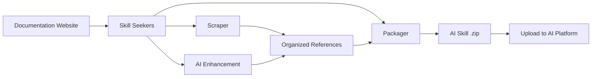

<p align="center">
  
</p>

# Skill Seekers

[English](README.md) | [简体中文](README.zh-CN.md) | 日本語 | [한국어](README.ko.md) | [Español](README.es.md) | [Français](README.fr.md) | [Deutsch](README.de.md) | [Português](README.pt-BR.md) | [Türkçe](README.tr.md) | [العربية](README.ar.md) | [हिन्दी](README.hi.md) | [Русский](README.ru.md)

> ⚠️ **機械翻訳に関する注意**
>
> この文書はAIによって自動翻訳されたものです。翻訳の品質向上に努めていますが、不正確な表現が含まれる場合があります。
>
> 翻訳の改善にご協力いただける方は、[GitHub Issue #260](https://github.com/yusufkaraaslan/Skill_Seekers/issues/260) からフィードバックをお寄せください。

[](https://github.com/yusufkaraaslan/Skill_Seekers/releases)
[](https://opensource.org/licenses/MIT)
[](https://www.python.org/downloads/)
[](https://modelcontextprotocol.io)
[](tests/)
[](https://pypi.org/project/skill-seekers/)
[](https://pypi.org/project/skill-seekers/)
[](https://skillseekersweb.com/)
[](https://github.com/yusufkaraaslan/Skill_Seekers)
[](https://pepy.tech/projects/skill-seekers)

<a href="https://trendshift.io/repositories/18329" target="_blank"></a>

**🧠 AI システムのためのデータレイヤー。** Skill Seekers は、ドキュメントサイト、GitHub リポジトリ、PDF、動画、ノートブック、Wiki など **18 種類のソース** を構造化されたナレッジアセットへと変換し、AI スキル（Claude、Gemini、OpenAI）、RAG パイプライン（LangChain、LlamaIndex、Pinecone）、AI コーディングアシスタント（Cursor、Windsurf、Cline）をすぐに動かせる状態にします。一度準備すれば、**22 のターゲット** へエクスポートできます。

## 💛 スポンサー

<!-- SPONSORS:START -->
### Launch Partner

<p align="center">
  <a href="https://www.atlascloud.ai/"></a><br/><sub><b>Launch Partner</b></sub>
</p>

[Atlas Cloud](https://www.atlascloud.ai/) — A full-modal, OpenAI-compatible AI inference platform. Skill Seekers supports it as a packaging/enhancement target via `--target atlas` with `ATLAS_API_KEY`.

### Silver Sponsors

<p align="center">
  <a href="https://www.rapidproxy.io/?utm_source=skillseekers&utm_medium=sponsor"></a><br/><sub><b>Sponsor — Silver</b></sub>
</p>
<!-- SPONSORS:END -->

**[スポンサーになる](SPONSORSHIP.md)** · [GitHub Sponsors](https://github.com/sponsors/yusufkaraaslan)

---

## 🚀 クイックスタート

```bash
# 1. インストール
pip install skill-seekers

# 2. 任意のソースからスキルを作成
skill-seekers create https://docs.djangoproject.com/

# 3. 利用する AI プラットフォーム向けにパッケージ化
skill-seekers package output/django --target claude
```

これで `output/django-claude.zip` が生成され、すぐに利用できます。

```bash
# エンハンスに使う AI エージェントを変更（デフォルト: claude）
skill-seekers create https://docs.djangoproject.com/ --agent kimi
skill-seekers create https://docs.djangoproject.com/ --agent-cmd "my-custom-agent run"
```

### 🛰️ AI によるプロジェクトスキャン

`scan` にプロジェクトを指定すると、AI エージェントがマニフェスト、README、Dockerfile／CI、サンプリングしたソースの import を読み取り、検出したフレームワークごとに 1 つずつ設定ファイルを出力します。さらに、あなた自身のコード用に `<project>-codebase.json` も生成されます。

```bash
skill-seekers scan ./my-react-app --out ./configs/scanned/
# → react.json, vite.json, tailwind.json, jest.json, my-react-app-codebase.json

skill-seekers create ./configs/scanned/react.json
```

検出結果に対応する既存のプリセットがない場合、AI が新しい設定を生成します。終了時には、その設定を[コミュニティレジストリ](https://github.com/yusufkaraaslan/skill-seekers-configs)へ公開することもできます。

### 18 種類すべてのソースタイプ

```bash
skill-seekers create facebook/react            # GitHub リポジトリ
skill-seekers create ./my-project              # ローカルコードベース
skill-seekers create manual.pdf                # PDF
skill-seekers create report.docx               # Word
skill-seekers create book.epub                 # EPUB
skill-seekers create notebook.ipynb            # Jupyter
skill-seekers create openapi.yaml              # OpenAPI/Swagger
skill-seekers create presentation.pptx         # PowerPoint
skill-seekers create guide.adoc                # AsciiDoc
skill-seekers create page.html                 # ローカル HTML（ディレクトリ全体も可）
skill-seekers create feed.rss                  # RSS/Atom
skill-seekers create curl.1                    # man ページ

# 動画（YouTube、Vimeo、ローカル — skill-seekers[video] が必要）
skill-seekers create --video-url https://www.youtube.com/watch?v=... --name mytutorial
skill-seekers create --setup                   # GPU を判別して視覚系依存関係を自動インストール

skill-seekers create --space-key TEAM --name wiki               # Confluence
skill-seekers create --database-id ... --name docs              # Notion
skill-seekers create --chat-export-path ./slack-export --name team-chat  # Slack/Discord
```

各ソースタイプとそのオプションについては[スクレイピングガイド](docs/user-guide/02-scraping.md)をご覧ください。

---

## 📦 インストール

```bash
pip install skill-seekers              # コア: スクレイピング、GitHub、PDF、パッケージング
pip install skill-seekers[all-llms]    # + すべての LLM プラットフォーム
pip install skill-seekers[mcp]         # + MCP サーバー
pip install skill-seekers[all]         # すべて
```

**何が必要か分からない場合は？** ウィザードを実行してください: `skill-seekers-setup`

<details>
<summary><b>インストール用エクストラ一覧</b></summary>

| インストール | 追加される機能 |
|---------|------|
| `skill-seekers[gemini]` | Google Gemini サポート |
| `skill-seekers[openai]` | OpenAI ChatGPT サポート |
| `skill-seekers[all-llms]` | すべての LLM プラットフォーム |
| `skill-seekers[mcp]` | Claude Code や Cursor などのための MCP サーバー |
| `skill-seekers[video]` | YouTube/Vimeo の文字起こしとメタデータ抽出 |
| `skill-seekers[video-full]` | + Whisper による文字起こしと映像フレーム抽出 |
| `skill-seekers[jupyter]` | Jupyter Notebook サポート |
| `skill-seekers[pptx]` | PowerPoint サポート |
| `skill-seekers[confluence]` | Confluence Wiki サポート |
| `skill-seekers[notion]` | Notion ページサポート |
| `skill-seekers[rss]` | RSS/Atom フィードサポート |
| `skill-seekers[chat]` | Slack/Discord チャットエクスポートサポート |
| `skill-seekers[asciidoc]` | AsciiDoc サポート |
| `skill-seekers[all]` | すべて |

> **動画の視覚系依存関係（GPU 対応）:** `skill-seekers[video-full]` をインストールしたあとに `skill-seekers create --setup` を実行すると、GPU を自動検出して対応する PyTorch と easyocr をインストールします。

</details>

**前提条件:** Python 3.10+、Git。はじめての方は → **[Bulletproof Quick Start](docs/getting-started/BULLETPROOF_QUICKSTART.md)** 🎯

---

## 📚 ドキュメント

| やりたいこと | 読むべきドキュメント |
|--------------|-----------|
| **すぐに使い始める** | [クイックスタート](docs/getting-started/02-quick-start.md) — 3 コマンドで最初のスキルを作成 |
| **概念を理解する** | [コアコンセプト](docs/user-guide/01-core-concepts.md) |
| **ソースをスクレイピングする** | [スクレイピングガイド](docs/user-guide/02-scraping.md) — 18 種類すべてのソースタイプ |
| **AI でスキルを強化する** | [エンハンスガイド](docs/user-guide/03-enhancement.md) · [エンハンスモード](docs/features/ENHANCEMENT_MODES.md) |
| **スキルをエクスポートする** | [パッケージングガイド](docs/user-guide/04-packaging.md) |
| **ワークフローを構築する** | [ワークフロー](docs/user-guide/05-workflows.md) |
| **コマンドを調べる** | [CLI リファレンス](docs/reference/CLI_REFERENCE.md) — 19 コマンドすべて |
| **設定する** | [設定フォーマット](docs/reference/CONFIG_FORMAT.md) · [環境変数](docs/reference/ENVIRONMENT_VARIABLES.md) |
| **MCP をセットアップする** | [MCP セットアップ](docs/guides/MCP_SETUP.md) · [MCP リファレンス](docs/reference/MCP_REFERENCE.md) |
| **RAG / IDE と連携する** | [LangChain](docs/integrations/LANGCHAIN.md) · [RAG パイプライン](docs/integrations/RAG_PIPELINES.md) · [Cursor](docs/integrations/CURSOR.md) · [Windsurf](docs/integrations/WINDSURF.md) · [Cline](docs/integrations/CLINE.md) |
| **巨大なドキュメント群を扱う** | [大規模ドキュメント](docs/reference/LARGE_DOCUMENTATION.md) — 1 万〜4 万ページ以上 |
| **アーキテクチャを理解する** | [UML アーキテクチャ](docs/UML_ARCHITECTURE.md) — 14 個の図 |
| **問題を解決する** | [トラブルシューティング](docs/user-guide/06-troubleshooting.md) |

**ドキュメント総合インデックス:** [docs/README.md](docs/README.md)

---

## 🎯 得られるもの

| ユースケース | 出力 | 活用先 |
|----------|--------|--------|
| **AI スキル** | 網羅的な `SKILL.md` + リファレンスファイル | Claude Code、Gemini、GPT |
| **RAG パイプライン** | 豊富なメタデータ付きのチャンク化ドキュメント | LangChain、LlamaIndex、Haystack |
| **ベクトルデータベース** | upsert にそのまま使える整形済みデータ | Pinecone、Chroma、Weaviate、FAISS、Qdrant |
| **AI コーディングアシスタント** | IDE の AI が自動で読み込むコンテキストファイル | Cursor、Windsurf、Cline、Continue.dev |

### エクスポートターゲット（22）

```bash
skill-seekers package output/react --target claude      # → Claude スキル（ZIP + YAML）
skill-seekers package output/react --target langchain   # → LangChain Documents
skill-seekers package output/react --target llama-index # → LlamaIndex TextNodes
skill-seekers package output/react --target ibm-bob     # → IBM Bob スキルディレクトリ
```

**LLM プラットフォーム（12）:** `claude` · `gemini` · `openai` · `minimax` · `opencode` · `kimi` · `deepseek` · `qwen` · `openrouter` · `together` · `fireworks` · `markdown`
**RAG・ベクトル（8）:** `langchain` · `llama-index` · `haystack` · `chroma` · `faiss` · `weaviate` · `qdrant` · `pinecone`
**その他（2）:** `atlas` · `ibm-bob`

プラットフォームごとの対応状況は[機能マトリクス](docs/reference/FEATURE_MATRIX.md)をご覧ください。

### 導入するメリット

- ⚡ **99% の高速化** — 何日もかかる手作業のデータ準備が 15〜45 分に
- 🎯 **実用レベルのスキル品質** — 例・パターン・ガイドを備えた 500 行超の `SKILL.md`
- 📊 **RAG にすぐ使えるチャンク** — スマートなチャンク分割がコードブロックと文脈を保持
- 🔄 **マルチソース** — ドキュメント + GitHub + PDF + 動画を 1 つのナレッジアセットに統合
- 🌐 **一度の準備であらゆるターゲットへ** — 再スクレイピングなしで 22 ターゲットにエクスポート
- ✅ **実戦で検証済み** — 3,900 以上のテスト、68 のワークフロープリセット、プロダクション対応

---

## ✨ 主な機能

<details>
<summary><b>ドキュメントのスクレイピング</b> — SPA の探索、llms.txt、スマートな分類</summary>

JavaScript ベースの SPA サイト向けの 3 層探索（`sitemap.xml` → `llms.txt` → ヘッドレスブラウザによるレンダリング）、`llms.txt` の自動検出（存在する場合は 10 倍高速）、スマートなトピック分類、そして壊れたマークアップでもスクレイピングできる寛容な HTML パーサーのフォールバックを備えています。

→ [スクレイピングガイド](docs/user-guide/02-scraping.md) · [llms.txt サポート](docs/reference/LLMS_TXT_SUPPORT.md)
</details>

<details>
<summary><b>GitHub・コードベース解析（C3.x）</b> — AST パース、パターン検出、How-To ガイド</summary>

3 ストリーム構成のアーキテクチャ: コード解析（AST、デザインパターン、テスト）、ドキュメント（README、`docs/`、Wiki）、コミュニティ（Issue、PR、メタデータ）。C3.x パイプラインでは、9 言語にわたる 10 種類の GoF パターン検出、テストから抽出した使用例、AI が執筆する How-To ガイド、設定の抽出、アーキテクチャ概要の生成が追加されます。

```bash
skill-seekers create ./my-project --preset quick          # 1〜2 分、表面的な解析
skill-seekers create ./my-project --preset standard       # バランス型（デフォルト）
skill-seekers create ./my-project --preset comprehensive  # 深く網羅的な解析
```

→ [パターン検出](docs/features/PATTERN_DETECTION.md) · [How-To ガイド](docs/features/HOW_TO_GUIDES.md) · [テストからの使用例抽出](docs/features/TEST_EXAMPLE_EXTRACTION.md)
</details>

<details>
<summary><b>AI によるエンハンス</b> — API またはローカルエージェント、68 のワークフロープリセット</summary>

すべての AI 呼び出しは単一のトランスポートを経由し、**API モード**（Anthropic、Google Gemini、OpenAI、Moonshot/Kimi、MiniMax）または **LOCAL モード**（Claude Code、Kimi Code、Codex、Copilot、OpenCode、カスタムエージェント — API 費用なし）で動作します。`--enhance-level 0-3` で深さを制御し、`--agent` でエージェントを選択できます。

→ [エンハンスガイド](docs/user-guide/03-enhancement.md) · [エンハンスモード](docs/features/ENHANCEMENT_MODES.md) · [マルチエージェント設定](docs/guides/MULTI_AGENT_SETUP.md)
</details>

<details>
<summary><b>統合マルチソーススクレイピング</b> — 複数のソースを 1 つのスキルにまとめる</summary>

1 つの設定ファイルで、ドキュメント、GitHub、PDF、動画などを単一のナレッジアセットに取り込めます。ソース間の矛盾検出とペアワイズの統合も行われます。

→ [統合スクレイピング](docs/features/UNIFIED_SCRAPING.md)
</details>

<details>
<summary><b>動画からの抽出</b> — 文字起こし、フレーム、画面上のコード</summary>

YouTube、Vimeo、ローカルファイルに対応しています。3 段階の文字起こしフォールバック（字幕 → YouTube transcript API → ローカルの Whisper）に加え、サンプリングしたフレームから画面上のコードを OCR するオプションの視覚抽出も利用できます。

→ [動画ガイド](docs/VIDEO_GUIDE.md)
</details>

<details>
<summary><b>品質・同期・スケール</b></summary>

ゲート付きの品質スコアリング（`skill-seekers quality output/react/ --threshold 7`）、スケジュール実行の再スクレイピングと通知を伴うドキュメント変更検出、非常に大規模なドキュメント群向けのストリーミング取り込み、そして増分更新に対応しています。

→ [大規模ドキュメント](docs/reference/LARGE_DOCUMENTATION.md) · [コード品質](docs/reference/CODE_QUALITY.md)
</details>

---

## 🔌 MCP 連携（40 ツール）

Skill Seekers は、Claude Code、Cursor、Windsurf、VS Code + Cline、IntelliJ IDEA 向けの MCP サーバーを同梱しています。

```bash
# stdio モード（Claude Code、VS Code + Cline）
python -m skill_seekers.mcp.server_fastmcp

# HTTP モード（Cursor、Windsurf、IntelliJ）
python -m skill_seekers.mcp.server_fastmcp --transport http --port 8765
```

あとはアシスタントにこう頼むだけです: *「React のスキルをパッケージ化してアップロードして。」*

→ [MCP セットアップ](docs/guides/MCP_SETUP.md) · [MCP リファレンス](docs/reference/MCP_REFERENCE.md) · [HTTP トランスポート](docs/guides/HTTP_TRANSPORT.md)

---

## 🤖 AI エージェントへのインストール

スキルは **19 種類の AI コーディングエージェント** へ自動的にインストールされます。

```bash
skill-seekers install-agent output/react/ --agent cursor
skill-seekers install-agent output/react/ --agent all      # 検出されたすべてのエージェント
skill-seekers install-agent output/react/ --agent cursor --dry-run
```

| エージェント | パス | スコープ |
|-------|------|-------|
| Claude Code | `~/.claude/skills/` | グローバル |
| Cursor | `.cursor/skills/` | プロジェクト |
| VS Code / Copilot | `.github/skills/` | プロジェクト |
| Amp | `~/.amp/skills/` | グローバル |
| Goose | `~/.config/goose/skills/` | グローバル |
| OpenCode | `~/.opencode/skills/` | グローバル |
| Letta | `~/.letta/skills/` | グローバル |
| Aide | `~/.aide/skills/` | グローバル |
| Windsurf | `~/.windsurf/skills/` | グローバル |
| Neovate | `~/.neovate/skills/` | グローバル |
| Roo Code | `.roo/skills/` | プロジェクト |
| Cline | `.cline/skills/` | プロジェクト |
| Aider | `~/.aider/skills/` | グローバル |
| Bolt | `.bolt/skills/` | プロジェクト |
| Kilo Code | `.kilo/skills/` | プロジェクト |
| Continue | `~/.continue/skills/` | グローバル |
| Kimi Code | `~/.kimi/skills/` | グローバル |
| IBM Bob | `.bob/skills/` | プロジェクト |

### Claude へのアップロード

```bash
export ANTHROPIC_API_KEY=sk-ant-...
skill-seekers package output/react/ --upload   # パッケージ化 + アップロード
skill-seekers upload output/react.zip          # 既存の zip をアップロード
```

API キーがない場合は、パッケージ化したうえで [claude.ai/skills](https://claude.ai/skills) から `output/react.zip` を手動でアップロードしてください。

→ [アップロードガイド](docs/guides/UPLOAD_GUIDE.md)

---

## ⚙️ 仕組み



1. **スクレイピング** — 全ページを抽出（最初に `llms.txt` を確認）
2. **分類** — コンテンツをトピック（API、ガイド、チュートリアルなど）に整理
3. **エンハンス** — AI が例を含む網羅的な `SKILL.md` を作成
4. **パッケージング** — プラットフォーム対応の成果物にまとめる
5. **アップロード** — AI プラットフォームへ配信（任意）

### アーキテクチャ

**8 個のコアモジュール + 5 個のユーティリティモジュール**（約 200 クラス）:

| モジュール | 役割 |
|--------|---------|
| **CLICore** | Git スタイルのコマンドディスパッチャ、ソースの自動検出 |
| **Scrapers** | 共通のビルド層に載る 18 種類のソースタイプ抽出器 |
| **Adaptors** | 単一の `SkillAdaptor` ABC の背後にある 22 種類の出力フォーマット |
| **Analysis** | C3.x コードベースパイプライン、10 種類の GoF パターン検出器 |
| **Enhancement** | 単一の `AgentClient` トランスポート経由の AI 改善 |
| **Packaging** | スキルのパッケージ化・アップロード・インストール |
| **MCP** | FastMCP サーバー（40 ツール、10 ツールモジュール） |
| **Sync** | ドキュメント変更の検出と通知 |

→ [UML アーキテクチャ](docs/UML_ARCHITECTURE.md) · [API リファレンス](docs/reference/API_REFERENCE.md) · [スキルアーキテクチャ](docs/reference/SKILL_ARCHITECTURE.md)

---

## 🆕 v3.9.0 の新機能

- **壊れたマークアップ向けの HTML パーサーフォールバック**（#96） — 極端に崩れたページでもスクレイピング結果が空になりません。正常なページの出力はバイト単位で従来どおりです。
- **一時的な失敗のリトライ** — ドキュメントスクレイパー（#97）と MCP の `fetch_config`（#92）が、接続の瞬断や 5xx をバックオフ付きで再試行するようになりました。4xx は従来どおり即座に失敗します。
- **Whisper による文字起こしのフォールバック**（#420） — 字幕のないローカル動画でも、ようやく実用的な文字起こしが得られます。
- **MiniMax の画像 OCR とレジストリ駆動のマルチモーダルプロバイダ**（#423） — 各プロバイダがワイヤプロトコルと画像対応能力を宣言するようになり、中国発行のキーでも正しいエンドポイントで動作します。
- **トークンを節約する GitHub Issue のデフォルト**（#169） — GitHub スキルがクローズ済み Issue の全履歴をデフォルトで同梱しなくなりました。
- **3 つのサーバーすべてで環境変数による CORS 設定**（#422、#424） — 認証情報付きのワイルドカードオリジンはなくなりました。

すべての変更履歴: **[CHANGELOG.md](CHANGELOG.md)**

---

## 📈 パフォーマンス

| ドキュメント規模 | 所要時間 | 出力サイズ |
|---|---|---|
| 小規模（100 ページ未満） | 5〜10 分 | 約 2 MB |
| 中規模（100〜500 ページ） | 15〜30 分 | 約 10 MB |
| 大規模（500〜2,000 ページ） | 30〜60 分 | 約 40 MB |
| 超大規模（1 万〜4 万ページ以上） | `stream` を使用 | [大規模ドキュメント](docs/reference/LARGE_DOCUMENTATION.md)を参照 |

---

## 🐛 トラブルシューティング

```bash
skill-seekers doctor          # インストール状況と環境を診断
skill-seekers sync-config     # 設定のずれを検出
```

よくある問題と対処法: **[トラブルシューティングガイド](docs/user-guide/06-troubleshooting.md)** · [TROUBLESHOOTING.md](docs/TROUBLESHOOTING.md)

---

## 🤝 コントリビュート

コントリビュートは大歓迎です — **[CONTRIBUTING.md](CONTRIBUTING.md)** をご覧ください。

- 📋 **[開発ロードマップとタスク](https://github.com/users/yusufkaraaslan/projects/2)** — 好きなタスクを選んでください
- 💬 **[ディスカッション](https://github.com/yusufkaraaslan/Skill_Seekers/discussions)** — 質問やアイデア
- 🐛 **[Issue](https://github.com/yusufkaraaslan/Skill_Seekers/issues)** — バグ報告と機能リクエスト

---

## 📝 ライセンス

MIT — [LICENSE](LICENSE) をご覧ください。

## 🔒 セキュリティ

[](https://mseep.ai/app/yusufkaraaslan-skill-seekers)

---

## 🌐 エコシステム

Skill Seekers は複数のリポジトリで構成されるプロジェクトです:

| リポジトリ | 説明 | リンク |
|-----------|-------------|-------|
| **[Skill_Seekers](https://github.com/yusufkaraaslan/Skill_Seekers)** | コア CLI と MCP サーバー（本リポジトリ） | [PyPI](https://pypi.org/project/skill-seekers/) |
| **[skillseekersweb](https://github.com/yusufkaraaslan/skillseekersweb)** | ウェブサイトとドキュメント | [Live](https://skillseekersweb.com/) |
| **[skill-seekers-configs](https://github.com/yusufkaraaslan/skill-seekers-configs)** | コミュニティ設定リポジトリ | |
| **[skill-seekers-action](https://github.com/yusufkaraaslan/skill-seekers-action)** | CI/CD 向け GitHub Action | |
| **[skill-seekers-plugin](https://github.com/yusufkaraaslan/skill-seekers-plugin)** | Claude Code プラグイン | |
| **[homebrew-skill-seekers](https://github.com/yusufkaraaslan/homebrew-skill-seekers)** | macOS 向け Homebrew tap | |

> **コントリビュートしませんか？** ウェブサイトと設定リポジトリは、新しいコントリビューターにとって最適な出発点です！
