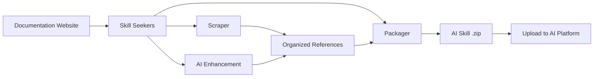

<p align="center">
  
</p>

# Skill Seekers

[English](README.md) | [简体中文](README.zh-CN.md) | [日本語](README.ja.md) | 한국어 | [Español](README.es.md) | [Français](README.fr.md) | [Deutsch](README.de.md) | [Português](README.pt-BR.md) | [Türkçe](README.tr.md) | [العربية](README.ar.md) | [हिन्दी](README.hi.md) | [Русский](README.ru.md)

> ⚠️ **기계 번역 안내**
>
> 이 문서는 AI에 의해 자동 번역되었습니다. 번역 품질 향상을 위해 노력하고 있으나 부정확한 표현이 포함될 수 있습니다.
>
> 번역 개선에 도움을 주시려면 [GitHub Issue #260](https://github.com/yusufkaraaslan/Skill_Seekers/issues/260)에 참여해 주세요! 여러분의 피드백은 매우 소중합니다.

[](https://github.com/yusufkaraaslan/Skill_Seekers/releases)
[](https://opensource.org/licenses/MIT)
[](https://www.python.org/downloads/)
[](https://modelcontextprotocol.io)
[](tests/)
[](https://pypi.org/project/skill-seekers/)
[](https://pypi.org/project/skill-seekers/)
[](https://skillseekersweb.com/)
[](https://github.com/yusufkaraaslan/Skill_Seekers)
[](https://pepy.tech/projects/skill-seekers)

<a href="https://trendshift.io/repositories/18329" target="_blank"></a>

**🧠 AI 시스템을 위한 데이터 레이어.** Skill Seekers는 문서 사이트, GitHub 저장소, PDF, 영상, 노트북, 위키 등 **18가지 소스 타입**을 구조화된 지식 자산으로 변환합니다. 이렇게 만든 자산은 AI 스킬(Claude, Gemini, OpenAI), RAG 파이프라인(LangChain, LlamaIndex, Pinecone), AI 코딩 어시스턴트(Cursor, Windsurf, Cline)에 바로 투입할 수 있습니다. 한 번 준비해서 **22가지 타깃**으로 내보내세요.

## 💛 스폰서

<!-- SPONSORS:START -->
### Launch Partner

<p align="center">
  <a href="https://www.atlascloud.ai/"></a><br/><sub><b>Launch Partner</b></sub>
</p>

[Atlas Cloud](https://www.atlascloud.ai/) — A full-modal, OpenAI-compatible AI inference platform. Skill Seekers supports it as a packaging/enhancement target via `--target atlas` with `ATLAS_API_KEY`.

### Silver Sponsors

<p align="center">
  <a href="https://www.rapidproxy.io/?utm_source=skillseekers&utm_medium=sponsor"></a><br/><sub><b>Sponsor — Silver</b></sub>
</p>
<!-- SPONSORS:END -->

**[스폰서 되기](SPONSORSHIP.md)** · [GitHub Sponsors](https://github.com/sponsors/yusufkaraaslan)

---

## 🚀 빠른 시작

```bash
# 1. 설치
pip install skill-seekers

# 2. 임의의 소스에서 스킬 생성
skill-seekers create https://docs.djangoproject.com/

# 3. 사용하는 AI 플랫폼용으로 패키징
skill-seekers package output/django --target claude
```

이제 바로 사용할 수 있는 `output/django-claude.zip`이 준비되었습니다.

```bash
# 개선에 사용할 AI 에이전트 선택 (기본값: claude)
skill-seekers create https://docs.djangoproject.com/ --agent kimi
skill-seekers create https://docs.djangoproject.com/ --agent-cmd "my-custom-agent run"
```

### 🛰️ AI 기반 프로젝트 스캔

프로젝트에 `scan`을 실행하면 AI 에이전트가 매니페스트, README, Dockerfile/CI, 샘플링한 소스의 import를 읽고, 감지된 프레임워크마다 설정 파일을 하나씩 생성합니다. 여기에 직접 작성한 코드를 위한 `<project>-codebase.json`도 함께 만들어집니다:

```bash
skill-seekers scan ./my-react-app --out ./configs/scanned/
# → react.json, vite.json, tailwind.json, jest.json, my-react-app-codebase.json

skill-seekers create ./configs/scanned/react.json
```

감지된 항목에 기존 프리셋이 없으면 AI가 새 설정을 생성하며, 종료 시 이를 [커뮤니티 레지스트리](https://github.com/yusufkaraaslan/skill-seekers-configs)에 선택적으로 게시할 수 있습니다.

### 18가지 소스 타입 전체

```bash
skill-seekers create facebook/react            # GitHub 저장소
skill-seekers create ./my-project              # 로컬 코드베이스
skill-seekers create manual.pdf                # PDF
skill-seekers create report.docx               # Word
skill-seekers create book.epub                 # EPUB
skill-seekers create notebook.ipynb            # Jupyter
skill-seekers create openapi.yaml              # OpenAPI/Swagger
skill-seekers create presentation.pptx         # PowerPoint
skill-seekers create guide.adoc                # AsciiDoc
skill-seekers create page.html                 # 로컬 HTML (또는 디렉터리 전체)
skill-seekers create feed.rss                  # RSS/Atom
skill-seekers create curl.1                    # man 페이지

# 영상 (YouTube, Vimeo, 로컬 파일 — skill-seekers[video] 필요)
skill-seekers create --video-url https://www.youtube.com/watch?v=... --name mytutorial
skill-seekers create --setup                   # GPU를 인식해 시각 처리 의존성 자동 설치

skill-seekers create --space-key TEAM --name wiki               # Confluence
skill-seekers create --database-id ... --name docs              # Notion
skill-seekers create --chat-export-path ./slack-export --name team-chat  # Slack/Discord
```

모든 소스 타입과 옵션은 [스크래핑 가이드](docs/user-guide/02-scraping.md)를 참고하세요.

---

## 📦 설치

```bash
pip install skill-seekers              # 핵심: 스크래핑, GitHub, PDF, 패키징
pip install skill-seekers[all-llms]    # + 모든 LLM 플랫폼
pip install skill-seekers[mcp]         # + MCP 서버
pip install skill-seekers[all]         # 전체
```

**무엇이 필요한지 모르겠다면?** 마법사를 실행하세요: `skill-seekers-setup`

<details>
<summary><b>설치 extras 전체</b></summary>

| 설치 | 추가되는 기능 |
|---------|------|
| `skill-seekers[gemini]` | Google Gemini 지원 |
| `skill-seekers[openai]` | OpenAI ChatGPT 지원 |
| `skill-seekers[all-llms]` | 모든 LLM 플랫폼 |
| `skill-seekers[mcp]` | Claude Code, Cursor 등을 위한 MCP 서버 |
| `skill-seekers[video]` | YouTube/Vimeo 자막 및 메타데이터 추출 |
| `skill-seekers[video-full]` | + Whisper 전사 및 시각 프레임 추출 |
| `skill-seekers[jupyter]` | Jupyter Notebook 지원 |
| `skill-seekers[pptx]` | PowerPoint 지원 |
| `skill-seekers[confluence]` | Confluence 위키 지원 |
| `skill-seekers[notion]` | Notion 페이지 지원 |
| `skill-seekers[rss]` | RSS/Atom 피드 지원 |
| `skill-seekers[chat]` | Slack/Discord 채팅 익스포트 지원 |
| `skill-seekers[asciidoc]` | AsciiDoc 지원 |
| `skill-seekers[all]` | 전체 |

> **영상 시각 처리 의존성 (GPU 인식):** `skill-seekers[video-full]` 설치 후 `skill-seekers create --setup`을 실행하면 GPU를 자동 감지해 알맞은 PyTorch 빌드와 easyocr을 설치합니다.

</details>

**사전 요구사항:** Python 3.10+, Git. 처음 사용하시나요? → **[확실한 빠른 시작](docs/getting-started/BULLETPROOF_QUICKSTART.md)** 🎯

---

## 📚 문서

| 하고 싶은 일 | 참고할 문서 |
|--------------|-----------|
| **빠르게 시작하기** | [빠른 시작](docs/getting-started/02-quick-start.md) — 명령어 3개로 첫 스킬 만들기 |
| **개념 이해하기** | [핵심 개념](docs/user-guide/01-core-concepts.md) |
| **소스 스크래핑하기** | [스크래핑 가이드](docs/user-guide/02-scraping.md) — 18가지 소스 타입 전체 |
| **AI로 스킬 개선하기** | [개선 가이드](docs/user-guide/03-enhancement.md) · [개선 모드](docs/features/ENHANCEMENT_MODES.md) |
| **스킬 내보내기** | [패키징 가이드](docs/user-guide/04-packaging.md) |
| **워크플로 구성하기** | [워크플로](docs/user-guide/05-workflows.md) |
| **명령어 찾아보기** | [CLI 레퍼런스](docs/reference/CLI_REFERENCE.md) — 19개 명령어 전체 |
| **설정하기** | [설정 포맷](docs/reference/CONFIG_FORMAT.md) · [환경 변수](docs/reference/ENVIRONMENT_VARIABLES.md) |
| **MCP 설정하기** | [MCP 설정](docs/guides/MCP_SETUP.md) · [MCP 레퍼런스](docs/reference/MCP_REFERENCE.md) |
| **RAG / IDE와 연동하기** | [LangChain](docs/integrations/LANGCHAIN.md) · [RAG 파이프라인](docs/integrations/RAG_PIPELINES.md) · [Cursor](docs/integrations/CURSOR.md) · [Windsurf](docs/integrations/WINDSURF.md) · [Cline](docs/integrations/CLINE.md) |
| **대규모 문서 집합 다루기** | [대규모 문서](docs/reference/LARGE_DOCUMENTATION.md) — 1만~4만+ 페이지 |
| **아키텍처 이해하기** | [UML 아키텍처](docs/UML_ARCHITECTURE.md) — 다이어그램 14종 |
| **문제 해결하기** | [문제 해결](docs/user-guide/06-troubleshooting.md) |

**전체 문서 색인:** [docs/README.md](docs/README.md)

---

## 🎯 얻을 수 있는 결과물

| 활용 사례 | 산출물 | 활용 대상 |
|----------|--------|--------|
| **AI 스킬** | 포괄적인 `SKILL.md` + 레퍼런스 파일 | Claude Code, Gemini, GPT |
| **RAG 파이프라인** | 풍부한 메타데이터가 포함된 청크 문서 | LangChain, LlamaIndex, Haystack |
| **벡터 데이터베이스** | upsert에 바로 쓸 수 있는 사전 포맷 데이터 | Pinecone, Chroma, Weaviate, FAISS, Qdrant |
| **AI 코딩 어시스턴트** | IDE의 AI가 자동으로 읽는 컨텍스트 파일 | Cursor, Windsurf, Cline, Continue.dev |

### 내보내기 타깃 (22)

```bash
skill-seekers package output/react --target claude      # → Claude Skill (ZIP + YAML)
skill-seekers package output/react --target langchain   # → LangChain Documents
skill-seekers package output/react --target llama-index # → LlamaIndex TextNodes
skill-seekers package output/react --target ibm-bob     # → IBM Bob 스킬 디렉터리
```

**LLM 플랫폼 (12):** `claude` · `gemini` · `openai` · `minimax` · `opencode` · `kimi` · `deepseek` · `qwen` · `openrouter` · `together` · `fireworks` · `markdown`
**RAG 및 벡터 (8):** `langchain` · `llama-index` · `haystack` · `chroma` · `faiss` · `weaviate` · `qdrant` · `pinecone`
**기타 (2):** `atlas` · `ibm-bob`

플랫폼별 지원 상세는 [기능 매트릭스](docs/reference/FEATURE_MATRIX.md)를 참고하세요.

### 왜 중요한가

- ⚡ **99% 더 빠름** — 며칠씩 걸리던 수작업 데이터 준비를 15~45분으로
- 🎯 **실전 수준의 스킬 품질** — 예제, 패턴, 가이드를 담은 500줄 이상의 `SKILL.md` 파일
- 📊 **RAG에 바로 쓰는 청크** — 스마트 청킹이 코드 블록과 문맥을 보존
- 🔄 **멀티 소스** — 문서 + GitHub + PDF + 영상을 하나의 지식 자산으로 결합
- 🌐 **한 번 준비, 모든 타깃** — 다시 스크래핑하지 않고 22가지 타깃으로 내보내기
- ✅ **검증된 안정성** — 3,900개 이상의 테스트, 68개 워크플로 프리셋, 프로덕션 준비 완료

---

## ✨ 주요 기능

<details>
<summary><b>문서 스크래핑</b> — SPA 탐색, llms.txt, 스마트 분류</summary>

JavaScript SPA 사이트를 위한 3단계 탐색(`sitemap.xml` → `llms.txt` → 헤드리스 브라우저 렌더링), 자동 `llms.txt` 감지(존재할 경우 10배 빠름), 스마트 토픽 분류, 그리고 깨진 마크업도 스크래핑되도록 하는 관대한 HTML 파서 폴백을 제공합니다.

→ [스크래핑 가이드](docs/user-guide/02-scraping.md) · [llms.txt 지원](docs/reference/LLMS_TXT_SUPPORT.md)
</details>

<details>
<summary><b>GitHub 및 코드베이스 분석 (C3.x)</b> — AST 파싱, 패턴 감지, 하우투 가이드</summary>

3개 스트림 아키텍처: 코드 분석(AST, 디자인 패턴, 테스트), 문서(README, `docs/`, 위키), 커뮤니티(이슈, PR, 메타데이터). C3.x 파이프라인은 9개 언어에 걸친 10가지 GoF 패턴 감지기, 테스트에서 추출한 사용 예제, AI가 작성한 하우투 가이드, 설정 추출, 아키텍처 개요를 추가로 제공합니다.

```bash
skill-seekers create ./my-project --preset quick          # 1~2분, 표면 수준
skill-seekers create ./my-project --preset standard       # 균형 (기본값)
skill-seekers create ./my-project --preset comprehensive  # 심층, 철저
```

→ [패턴 감지](docs/features/PATTERN_DETECTION.md) · [하우투 가이드](docs/features/HOW_TO_GUIDES.md) · [테스트 예제 추출](docs/features/TEST_EXAMPLE_EXTRACTION.md)
</details>

<details>
<summary><b>AI 개선</b> — API 또는 로컬 에이전트, 68개 워크플로 프리셋</summary>

모든 AI 호출은 하나의 전송 계층을 거치며, **API 모드**(Anthropic, Google Gemini, OpenAI, Moonshot/Kimi, MiniMax) 또는 **LOCAL 모드**(Claude Code, Kimi Code, Codex, Copilot, OpenCode, 커스텀 에이전트 — API 비용 없음)로 동작합니다. `--enhance-level 0-3`으로 깊이를 조절하고 `--agent`로 에이전트를 선택하세요.

→ [개선 가이드](docs/user-guide/03-enhancement.md) · [개선 모드](docs/features/ENHANCEMENT_MODES.md) · [멀티 에이전트 설정](docs/guides/MULTI_AGENT_SETUP.md)
</details>

<details>
<summary><b>통합 멀티 소스 스크래핑</b> — 여러 소스를 하나의 스킬로 결합</summary>

설정 파일 하나로 문서, GitHub, PDF, 영상 등을 단일 지식 자산으로 가져올 수 있으며, 소스 간 충돌 감지와 쌍별(pairwise) 종합을 지원합니다.

→ [통합 스크래핑](docs/features/UNIFIED_SCRAPING.md)
</details>

<details>
<summary><b>영상 추출</b> — 전사, 프레임, 화면 속 코드</summary>

YouTube, Vimeo, 로컬 파일을 지원합니다. 3단계 전사 폴백(자막 → YouTube 자막 API → 로컬 Whisper)과 함께, 샘플링한 프레임에서 화면 속 코드를 OCR로 읽어내는 선택적 시각 추출 기능을 제공합니다.

→ [영상 가이드](docs/VIDEO_GUIDE.md)
</details>

<details>
<summary><b>품질, 동기화, 확장성</b></summary>

게이트를 갖춘 품질 점수 산정(`skill-seekers quality output/react/ --threshold 7`), 예약 재스크래핑과 알림을 포함한 문서 변경 감지, 초대형 문서 집합을 위한 스트리밍 수집, 증분 업데이트를 제공합니다.

→ [대규모 문서](docs/reference/LARGE_DOCUMENTATION.md) · [코드 품질](docs/reference/CODE_QUALITY.md)
</details>

---

## 🔌 MCP 연동 (40개 도구)

Skill Seekers는 Claude Code, Cursor, Windsurf, VS Code + Cline, IntelliJ IDEA를 위한 MCP 서버를 함께 제공합니다.

```bash
# stdio 모드 (Claude Code, VS Code + Cline)
python -m skill_seekers.mcp.server_fastmcp

# HTTP 모드 (Cursor, Windsurf, IntelliJ)
python -m skill_seekers.mcp.server_fastmcp --transport http --port 8765
```

그다음에는 어시스턴트에게 이렇게 요청하기만 하면 됩니다: *"React 스킬을 패키징해서 업로드해 줘."*

→ [MCP 설정](docs/guides/MCP_SETUP.md) · [MCP 레퍼런스](docs/reference/MCP_REFERENCE.md) · [HTTP 전송](docs/guides/HTTP_TRANSPORT.md)

---

## 🤖 AI 에이전트에 설치하기

스킬은 **19개 AI 코딩 에이전트**에 자동으로 설치됩니다:

```bash
skill-seekers install-agent output/react/ --agent cursor
skill-seekers install-agent output/react/ --agent all      # 감지된 모든 에이전트
skill-seekers install-agent output/react/ --agent cursor --dry-run
```

| 에이전트 | 경로 | 범위 |
|-------|------|-------|
| Claude Code | `~/.claude/skills/` | 전역 |
| Cursor | `.cursor/skills/` | 프로젝트 |
| VS Code / Copilot | `.github/skills/` | 프로젝트 |
| Amp | `~/.amp/skills/` | 전역 |
| Goose | `~/.config/goose/skills/` | 전역 |
| OpenCode | `~/.opencode/skills/` | 전역 |
| Letta | `~/.letta/skills/` | 전역 |
| Aide | `~/.aide/skills/` | 전역 |
| Windsurf | `~/.windsurf/skills/` | 전역 |
| Neovate | `~/.neovate/skills/` | 전역 |
| Roo Code | `.roo/skills/` | 프로젝트 |
| Cline | `.cline/skills/` | 프로젝트 |
| Aider | `~/.aider/skills/` | 전역 |
| Bolt | `.bolt/skills/` | 프로젝트 |
| Kilo Code | `.kilo/skills/` | 프로젝트 |
| Continue | `~/.continue/skills/` | 전역 |
| Kimi Code | `~/.kimi/skills/` | 전역 |
| IBM Bob | `.bob/skills/` | 프로젝트 |

### Claude에 업로드하기

```bash
export ANTHROPIC_API_KEY=sk-ant-...
skill-seekers package output/react/ --upload   # 패키징 + 업로드
skill-seekers upload output/react.zip          # 기존 zip 업로드
```

API 키가 없나요? 패키징한 뒤 [claude.ai/skills](https://claude.ai/skills)에서 `output/react.zip`을 직접 업로드하세요.

→ [업로드 가이드](docs/guides/UPLOAD_GUIDE.md)

---

## ⚙️ 동작 방식



1. **스크래핑** — 모든 페이지를 추출합니다 (`llms.txt`를 먼저 확인)
2. **분류** — 콘텐츠를 토픽(API, 가이드, 튜토리얼 등)으로 정리합니다
3. **개선** — AI가 예제를 포함한 포괄적인 `SKILL.md`를 작성합니다
4. **패키징** — 플랫폼에 바로 쓸 수 있는 산출물로 묶습니다
5. **업로드** — 사용하는 AI 플랫폼으로 배포합니다 (선택)

### 아키텍처

**8개 핵심 모듈 + 5개 유틸리티 모듈** (약 200개 클래스):

| 모듈 | 역할 |
|--------|---------|
| **CLICore** | Git 스타일 명령 디스패처, 소스 자동 감지 |
| **Scrapers** | 공통 빌드 레이어 위에서 동작하는 18가지 소스 타입 추출기 |
| **Adaptors** | 단일 `SkillAdaptor` ABC 뒤에 놓인 22가지 출력 플랫폼 포맷 |
| **Analysis** | C3.x 코드베이스 파이프라인, 10가지 GoF 패턴 감지기 |
| **Enhancement** | 단일 `AgentClient` 전송 계층을 통한 AI 개선 |
| **Packaging** | 스킬 패키징, 업로드, 설치 |
| **MCP** | FastMCP 서버 (40개 도구, 10개 도구 모듈) |
| **Sync** | 문서 변경 감지 및 알림 |

→ [UML 아키텍처](docs/UML_ARCHITECTURE.md) · [API 레퍼런스](docs/reference/API_REFERENCE.md) · [스킬 아키텍처](docs/reference/SKILL_ARCHITECTURE.md)

---

## 🆕 v3.9.0의 새로운 기능

- **깨진 마크업을 위한 HTML 파서 폴백** (#96) — 심하게 손상된 페이지도 더 이상 빈 결과로 스크래핑되지 않으며, 정상적인 페이지는 바이트 단위로 동일한 결과를 유지합니다.
- **일시적 실패 재시도** — 문서 스크래퍼(#97)와 MCP `fetch_config`(#92)가 이제 연결 끊김과 5xx 응답을 백오프와 함께 재시도합니다. 4xx는 여전히 즉시 실패합니다.
- **Whisper 전사 폴백** (#420) — 자막이 없는 로컬 영상에서도 드디어 제대로 된 전사를 얻을 수 있습니다.
- **MiniMax 이미지 OCR + 레지스트리 기반 멀티모달 제공자** (#423) — 제공자가 자신의 와이어 프로토콜과 이미지 처리 능력을 선언하며, 중국에서 발급된 키도 올바른 엔드포인트로 동작합니다.
- **토큰을 아끼는 GitHub 이슈 기본값** (#169) — GitHub 스킬이 더 이상 종료된 이슈 전체 이력을 기본으로 포함하지 않습니다.
- **세 개 서버 전체에 환경 변수 기반 CORS 적용** (#422, #424) — 자격 증명과 함께 와일드카드 오리진을 사용하는 일이 없어졌습니다.

전체 변경 이력: **[CHANGELOG.md](CHANGELOG.md)**

---

## 📈 성능

| 문서 규모 | 소요 시간 | 산출물 |
|---|---|---|
| 소형 (100페이지 미만) | 5~10분 | 약 2 MB |
| 중형 (100~500페이지) | 15~30분 | 약 10 MB |
| 대형 (500~2,000페이지) | 30~60분 | 약 40 MB |
| 초대형 (1만~4만+ 페이지) | `stream` 사용 | [대규모 문서](docs/reference/LARGE_DOCUMENTATION.md) 참고 |

---

## 🐛 문제 해결

```bash
skill-seekers doctor          # 설치 및 환경 진단
skill-seekers sync-config     # 설정 드리프트 감지
```

자주 발생하는 문제와 해결 방법: **[문제 해결 가이드](docs/user-guide/06-troubleshooting.md)** · [TROUBLESHOOTING.md](docs/TROUBLESHOOTING.md)

---

## 🤝 기여하기

기여를 언제나 환영합니다 — **[CONTRIBUTING.md](CONTRIBUTING.md)**를 참고하세요.

- 📋 **[개발 로드맵 및 작업 목록](https://github.com/users/yusufkaraaslan/projects/2)** — 원하는 작업을 골라보세요
- 💬 **[디스커션](https://github.com/yusufkaraaslan/Skill_Seekers/discussions)** — 질문과 아이디어
- 🐛 **[이슈](https://github.com/yusufkaraaslan/Skill_Seekers/issues)** — 버그 제보와 기능 요청

---

## 📝 라이선스

MIT — [LICENSE](LICENSE)를 참고하세요.

## 🔒 보안

[](https://mseep.ai/app/yusufkaraaslan-skill-seekers)

---

## 🌐 에코시스템

Skill Seekers는 여러 저장소로 구성된 프로젝트입니다:

| 저장소 | 설명 | 링크 |
|-----------|-------------|-------|
| **[Skill_Seekers](https://github.com/yusufkaraaslan/Skill_Seekers)** | 핵심 CLI 및 MCP 서버 (이 저장소) | [PyPI](https://pypi.org/project/skill-seekers/) |
| **[skillseekersweb](https://github.com/yusufkaraaslan/skillseekersweb)** | 웹사이트 및 문서 | [바로가기](https://skillseekersweb.com/) |
| **[skill-seekers-configs](https://github.com/yusufkaraaslan/skill-seekers-configs)** | 커뮤니티 설정 저장소 | |
| **[skill-seekers-action](https://github.com/yusufkaraaslan/skill-seekers-action)** | CI/CD용 GitHub Action | |
| **[skill-seekers-plugin](https://github.com/yusufkaraaslan/skill-seekers-plugin)** | Claude Code 플러그인 | |
| **[homebrew-skill-seekers](https://github.com/yusufkaraaslan/homebrew-skill-seekers)** | macOS용 Homebrew tap | |

> **기여하고 싶으신가요?** 웹사이트와 configs 저장소는 새로운 기여자가 시작하기에 아주 좋은 출발점입니다!
