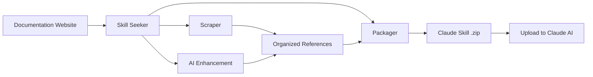

[](https://mseep.ai/app/yusufkaraaslan-skill-seekers)

# Skill Seeker

[](https://github.com/yusufkaraaslan/Skill_Seekers/releases/tag/v2.7.0)
[](https://opensource.org/licenses/MIT)
[](https://www.python.org/downloads/)
[](https://modelcontextprotocol.io)
[](tests/)
[](https://github.com/users/yusufkaraaslan/projects/2)
[](https://pypi.org/project/skill-seekers/)
[](https://pypi.org/project/skill-seekers/)
[](https://pypi.org/project/skill-seekers/)

**Automatically convert documentation websites, GitHub repositories, and PDFs into Claude AI skills in minutes.**

> 📋 **[View Development Roadmap & Tasks](https://github.com/users/yusufkaraaslan/projects/2)** - 134 tasks across 10 categories, pick any to contribute!

## What is Skill Seeker?

Skill Seeker is an automated tool that transforms documentation websites, GitHub repositories, and PDF files into production-ready [Claude AI skills](https://www.anthropic.com/news/skills). Instead of manually reading and summarizing documentation, Skill Seeker:

1. **Scrapes** multiple sources (docs, GitHub repos, PDFs) automatically
2. **Analyzes** code repositories with deep AST parsing
3. **Detects** conflicts between documentation and code implementation
4. **Organizes** content into categorized reference files
5. **Enhances** with AI to extract best examples and key concepts
6. **Packages** everything into an uploadable `.zip` file for Claude

**Result:** Get comprehensive Claude skills for any framework, API, or tool in 20-40 minutes instead of hours of manual work.

## Why Use This?

- 🎯 **For Developers**: Create skills from documentation + GitHub repos with conflict detection
- 🎮 **For Game Devs**: Generate skills for game engines (Godot docs + GitHub, Unity, etc.)
- 🔧 **For Teams**: Combine internal docs + code repositories into single source of truth
- 📚 **For Learners**: Build comprehensive skills from docs, code examples, and PDFs
- 🔍 **For Open Source**: Analyze repos to find documentation gaps and outdated examples

## Key Features

### 🌐 Documentation Scraping
- ✅ **llms.txt Support** - Automatically detects and uses LLM-ready documentation files (10x faster)
- ✅ **Universal Scraper** - Works with ANY documentation website
- ✅ **Smart Categorization** - Automatically organizes content by topic
- ✅ **Code Language Detection** - Recognizes Python, JavaScript, C++, GDScript, etc.
- ✅ **8 Ready-to-Use Presets** - Godot, React, Vue, Django, FastAPI, and more

### 📄 PDF Support (**v1.2.0**)
- ✅ **Basic PDF Extraction** - Extract text, code, and images from PDF files
- ✅ **OCR for Scanned PDFs** - Extract text from scanned documents
- ✅ **Password-Protected PDFs** - Handle encrypted PDFs
- ✅ **Table Extraction** - Extract complex tables from PDFs
- ✅ **Parallel Processing** - 3x faster for large PDFs
- ✅ **Intelligent Caching** - 50% faster on re-runs

### 🐙 GitHub Repository Scraping (**v2.0.0**)
- ✅ **Deep Code Analysis** - AST parsing for Python, JavaScript, TypeScript, Java, C++, Go
- ✅ **API Extraction** - Functions, classes, methods with parameters and types
- ✅ **Repository Metadata** - README, file tree, language breakdown, stars/forks
- ✅ **GitHub Issues & PRs** - Fetch open/closed issues with labels and milestones
- ✅ **CHANGELOG & Releases** - Automatically extract version history
- ✅ **Conflict Detection** - Compare documented APIs vs actual code implementation
- ✅ **MCP Integration** - Natural language: "Scrape GitHub repo facebook/react"

### 🔄 Unified Multi-Source Scraping (**NEW - v2.0.0**)
- ✅ **Combine Multiple Sources** - Mix documentation + GitHub + PDF in one skill
- ✅ **Conflict Detection** - Automatically finds discrepancies between docs and code
- ✅ **Intelligent Merging** - Rule-based or AI-powered conflict resolution
- ✅ **Transparent Reporting** - Side-by-side comparison with ⚠️ warnings
- ✅ **Documentation Gap Analysis** - Identifies outdated docs and undocumented features
- ✅ **Single Source of Truth** - One skill showing both intent (docs) and reality (code)
- ✅ **Backward Compatible** - Legacy single-source configs still work

### 🤖 Multi-LLM Platform Support (**NEW - v2.5.0**)
- ✅ **4 LLM Platforms** - Claude AI, Google Gemini, OpenAI ChatGPT, Generic Markdown
- ✅ **Universal Scraping** - Same documentation works for all platforms
- ✅ **Platform-Specific Packaging** - Optimized formats for each LLM
- ✅ **One-Command Export** - `--target` flag selects platform
- ✅ **Optional Dependencies** - Install only what you need
- ✅ **100% Backward Compatible** - Existing Claude workflows unchanged

| Platform | Format | Upload | Enhancement | API Key |
|----------|--------|--------|-------------|---------|
| **Claude AI** | ZIP + YAML | ✅ Auto | ✅ Yes | ANTHROPIC_API_KEY |
| **Google Gemini** | tar.gz | ✅ Auto | ✅ Yes | GOOGLE_API_KEY |
| **OpenAI ChatGPT** | ZIP + Vector Store | ✅ Auto | ✅ Yes | OPENAI_API_KEY |
| **Generic Markdown** | ZIP | ❌ Manual | ❌ No | None |

```bash
# Claude (default - no changes needed!)
skill-seekers package output/react/
skill-seekers upload react.zip

# Google Gemini
pip install skill-seekers[gemini]
skill-seekers package output/react/ --target gemini
skill-seekers upload react-gemini.tar.gz --target gemini

# OpenAI ChatGPT
pip install skill-seekers[openai]
skill-seekers package output/react/ --target openai
skill-seekers upload react-openai.zip --target openai

# Generic Markdown (universal export)
skill-seekers package output/react/ --target markdown
# Use the markdown files directly in any LLM
```

**Installation:**
```bash
# Install with Gemini support
pip install skill-seekers[gemini]

# Install with OpenAI support
pip install skill-seekers[openai]

# Install with all LLM platforms
pip install skill-seekers[all-llms]
```

### 🌊 Three-Stream GitHub Architecture (**NEW - v2.6.0**)
- ✅ **Triple-Stream Analysis** - Split GitHub repos into Code, Docs, and Insights streams
- ✅ **Unified Codebase Analyzer** - Works with GitHub URLs AND local paths
- ✅ **C3.x as Analysis Depth** - Choose 'basic' (1-2 min) or 'c3x' (20-60 min) analysis
- ✅ **Enhanced Router Generation** - GitHub metadata, README quick start, common issues
- ✅ **Issue Integration** - Top problems and solutions from GitHub issues
- ✅ **Smart Routing Keywords** - GitHub labels weighted 2x for better topic detection
- ✅ **81 Tests Passing** - Comprehensive E2E validation (0.44 seconds)

**Three Streams Explained:**
- **Stream 1: Code** - Deep C3.x analysis (patterns, examples, guides, configs, architecture)
- **Stream 2: Docs** - Repository documentation (README, CONTRIBUTING, docs/*.md)
- **Stream 3: Insights** - Community knowledge (issues, labels, stars, forks)

```python
from skill_seekers.cli.unified_codebase_analyzer import UnifiedCodebaseAnalyzer

# Analyze GitHub repo with all three streams
analyzer = UnifiedCodebaseAnalyzer()
result = analyzer.analyze(
    source="https://github.com/facebook/react",
    depth="c3x",  # or "basic" for fast analysis
    fetch_github_metadata=True
)

# Access code stream (C3.x analysis)
print(f"Design patterns: {len(result.code_analysis['c3_1_patterns'])}")
print(f"Test examples: {result.code_analysis['c3_2_examples_count']}")

# Access docs stream (repository docs)
print(f"README: {result.github_docs['readme'][:100]}")

# Access insights stream (GitHub metadata)
print(f"Stars: {result.github_insights['metadata']['stars']}")
print(f"Common issues: {len(result.github_insights['common_problems'])}")
```

**See complete documentation**: [Three-Stream Implementation Summary](docs/IMPLEMENTATION_SUMMARY_THREE_STREAM.md)

### 🔐 Smart Rate Limit Management & Configuration (**NEW - v2.7.0**)
- ✅ **Multi-Token Configuration System** - Manage multiple GitHub accounts (personal, work, OSS)
  - Secure config storage at `~/.config/skill-seekers/config.json` (600 permissions)
  - Per-profile rate limit strategies: `prompt`, `wait`, `switch`, `fail`
  - Configurable timeout per profile (default: 30 min, prevents indefinite waits)
  - Smart fallback chain: CLI arg → Env var → Config file → Prompt
  - API key management for Claude, Gemini, OpenAI
- ✅ **Interactive Configuration Wizard** - Beautiful terminal UI for easy setup
  - Browser integration for token creation (auto-opens GitHub, etc.)
  - Token validation and connection testing
  - Visual status display with color coding
- ✅ **Intelligent Rate Limit Handler** - No more indefinite waits!
  - Upfront warning about rate limits (60/hour vs 5000/hour)
  - Real-time detection from GitHub API responses
  - Live countdown timers with progress
  - Automatic profile switching when rate limited
  - Four strategies: prompt (ask), wait (countdown), switch (try another), fail (abort)
- ✅ **Resume Capability** - Continue interrupted jobs
  - Auto-save progress at configurable intervals (default: 60 sec)
  - List all resumable jobs with progress details
  - Auto-cleanup of old jobs (default: 7 days)
- ✅ **CI/CD Support** - Non-interactive mode for automation
  - `--non-interactive` flag fails fast without prompts
  - `--profile` flag to select specific GitHub account
  - Clear error messages for pipeline logs
  - Exit codes for automation integration

**Quick Setup:**
```bash
# One-time configuration (5 minutes)
skill-seekers config --github

# Add multiple GitHub profiles
skill-seekers config
# → Select "1. GitHub Token Setup"
# → Add profiles for personal, work, OSS accounts

# Use specific profile for private repos
skill-seekers github --repo mycompany/private-repo --profile work

# CI/CD mode (fail fast, no prompts)
skill-seekers github --repo owner/repo --non-interactive

# View current configuration
skill-seekers config --show

# Test connections
skill-seekers config --test

# Resume interrupted job
skill-seekers resume --list
skill-seekers resume github_react_20260117_143022
```

**Rate Limit Strategies Explained:**
- **prompt** (default) - Ask what to do when rate limited (wait, switch, setup token, cancel)
- **wait** - Automatically wait with countdown timer (respects timeout)
- **switch** - Automatically try next available profile (for multi-account setups)
- **fail** - Fail immediately with clear error (perfect for CI/CD)

**See complete documentation**: [Configuration Guide](docs/guides/CONFIGURATION.md) (coming soon)

### 🎯 Bootstrap Skill - Self-Hosting (**NEW - v2.7.0**)

Generate skill-seekers as a Claude Code skill to use within Claude:

```bash
# Generate the skill
./scripts/bootstrap_skill.sh

# Install to Claude Code
cp -r output/skill-seekers ~/.claude/skills/

# Verify
ls ~/.claude/skills/skill-seekers/SKILL.md
```

**What you get:**
- ✅ **Complete skill documentation** - All CLI commands and usage patterns
- ✅ **CLI command reference** - Every tool and its options documented
- ✅ **Quick start examples** - Common workflows and best practices
- ✅ **Auto-generated API docs** - Code analysis, patterns, and examples
- ✅ **Robust validation** - YAML frontmatter and required fields checked
- ✅ **One-command bootstrap** - Combines manual header with auto-generated analysis

**How it works:**
1. Runs codebase analysis on skill-seekers itself (dogfooding!)
2. Combines handcrafted header (prerequisites, commands) with auto-generated content
3. Validates SKILL.md structure (frontmatter, required fields)
4. Outputs ready-to-use skill directory

**Result:** Use skill-seekers to create skills, from within Claude Code!

### 🔐 Private Config Repositories (**NEW - v2.2.0**)
- ✅ **Git-Based Config Sources** - Fetch configs from private/team git repositories
- ✅ **Multi-Source Management** - Register unlimited GitHub, GitLab, Bitbucket repos
- ✅ **Team Collaboration** - Share custom configs across 3-5 person teams
- ✅ **Enterprise Support** - Scale to 500+ developers with priority-based resolution
- ✅ **Secure Authentication** - Environment variable tokens (GITHUB_TOKEN, GITLAB_TOKEN)
- ✅ **Intelligent Caching** - Clone once, pull updates automatically
- ✅ **Offline Mode** - Work with cached configs when offline
- ✅ **Backward Compatible** - Existing API-based configs still work

### 🤖 Codebase Analysis & AI Enhancement (**C3.x - NEW!**)

**C3.4: Configuration Pattern Extraction with AI Enhancement**
- ✅ **9 Config Formats** - JSON, YAML, TOML, ENV, INI, Python, JavaScript, Dockerfile, Docker Compose
- ✅ **7 Pattern Types** - Database, API, logging, cache, email, auth, server configurations
- ✅ **AI Enhancement (NEW!)** - Optional dual-mode AI analysis (API + LOCAL, like C3.3)
  - Explains what each config does
  - Suggests best practices and improvements
  - **Security analysis** - Finds hardcoded secrets, exposed credentials
  - Migration suggestions - Consolidation opportunities
  - Context-aware documentation
- ✅ **Auto-Documentation** - Generates JSON + Markdown documentation of all configs
- ✅ **Type Inference** - Automatically detects setting types and environment variables
- ✅ **MCP Integration** - `extract_config_patterns` tool with enhancement support

**C3.3: AI-Enhanced How-To Guides**
- ✅ **Comprehensive AI Enhancement** - Transforms basic guides (⭐⭐) into professional tutorials (⭐⭐⭐⭐⭐)
- ✅ **5 Automatic Improvements** - Step descriptions, troubleshooting, prerequisites, next steps, use cases
- ✅ **Dual-Mode Support** - API mode (Claude API) or LOCAL mode (Claude Code CLI)
- ✅ **No API Costs with LOCAL Mode** - FREE enhancement using your Claude Code Max plan
- ✅ **Quality Transformation** - 75-line templates → 500+ line comprehensive guides

**What Gets Enhanced:**
- 🔍 **Step Descriptions** - Natural language explanations (not just syntax!)
- 🔧 **Troubleshooting** - Diagnostic flows + solutions for common errors
- 📋 **Prerequisites** - Why needed + setup instructions
- 🔗 **Next Steps** - Related guides, variations, learning paths
- 💡 **Use Cases** - Real-world scenarios showing when to use guide

**Usage:**
```bash
# AUTO mode (default) - automatically detects best option
skill-seekers-codebase tests/ --build-how-to-guides --ai-mode auto

# API mode - fast, efficient (requires ANTHROPIC_API_KEY)
skill-seekers-codebase tests/ --build-how-to-guides --ai-mode api

# LOCAL mode - FREE using Claude Code Max (no API key needed)
skill-seekers-codebase tests/ --build-how-to-guides --ai-mode local

# Disable enhancement - basic guides only
skill-seekers-codebase tests/ --build-how-to-guides --ai-mode none
```

**Full Documentation:** [docs/HOW_TO_GUIDES.md](docs/HOW_TO_GUIDES.md#ai-enhancement-new)

### ⚡ Performance & Scale
- ✅ **Async Mode** - 2-3x faster scraping with async/await (use `--async` flag)
- ✅ **Large Documentation Support** - Handle 10K-40K+ page docs with intelligent splitting
- ✅ **Router/Hub Skills** - Intelligent routing to specialized sub-skills
- ✅ **Parallel Scraping** - Process multiple skills simultaneously
- ✅ **Checkpoint/Resume** - Never lose progress on long scrapes
- ✅ **Caching System** - Scrape once, rebuild instantly

### ✅ Quality Assurance
- ✅ **Fully Tested** - 1200+ tests with comprehensive coverage

---

## 📦 Now Available on PyPI!

**Skill Seekers is now published on the Python Package Index!** Install with a single command:

```bash
pip install skill-seekers
```

### Installation Options

Choose your installation profile based on which features you need:

```bash
# 1️⃣ CLI Only (Skill Generation)
pip install skill-seekers

# Features:
# • Scrape documentation websites
# • Analyze GitHub repositories
# • Extract from PDFs
# • Package skills for all platforms

# 2️⃣ MCP Integration (Claude Code, Cursor, Windsurf)
pip install skill-seekers[mcp]

# Features:
# • Everything from CLI Only
# • MCP server for Claude Code
# • One-command skill installation
# • HTTP/stdio transport modes

# 3️⃣ Multi-LLM Support (Gemini, OpenAI)
pip install skill-seekers[all-llms]

# Features:
# • Everything from CLI Only
# • Google Gemini support
# • OpenAI ChatGPT support
# • Enhanced AI features

# 4️⃣ Everything
pip install skill-seekers[all]

# Features:
# • All features enabled
# • Maximum flexibility
```

**Need help choosing?** Run the setup wizard:
```bash
skill-seekers-setup
```

The wizard shows all options with detailed feature lists and guides you through configuration.

Get started in seconds. No cloning, no setup - just install and run. See installation options below.

---

## Quick Start

### Option 1: Install from PyPI (Recommended)

```bash
# Install from PyPI (easiest method!)
pip install skill-seekers

# Use the unified CLI
skill-seekers scrape --config configs/react.json
skill-seekers github --repo facebook/react
skill-seekers enhance output/react/
skill-seekers package output/react/
```

**Time:** ~25 minutes | **Quality:** Production-ready | **Cost:** Free

📖 **New to Skill Seekers?** Check out our [Quick Start Guide](QUICKSTART.md) or [Bulletproof Guide](BULLETPROOF_QUICKSTART.md)

### Option 2: Install via uv (Modern Python Tool)

```bash
# Install with uv (fast, modern alternative)
uv tool install skill-seekers

# Or run directly without installing
uv tool run --from skill-seekers skill-seekers scrape --config https://raw.githubusercontent.com/yusufkaraaslan/Skill_Seekers/main/configs/react.json

# Unified CLI - simple commands
skill-seekers scrape --config configs/react.json
skill-seekers github --repo facebook/react
skill-seekers package output/react/
```

**Time:** ~25 minutes | **Quality:** Production-ready | **Cost:** Free

### Option 3: Development Install (From Source)

```bash
# Clone and install in editable mode
git clone https://github.com/yusufkaraaslan/Skill_Seekers.git
cd Skill_Seekers
pip install -e .

# Use the unified CLI
skill-seekers scrape --config configs/react.json
```

### Option 4: Use from Claude Code & 4 Other AI Agents (MCP Integration)

```bash
# One-time setup (5 minutes) - Auto-configures 5 AI agents!
./setup_mcp.sh

# Then in Claude Code, Cursor, Windsurf, VS Code + Cline, or IntelliJ IDEA, just ask:
"Generate a React skill from https://react.dev/"
"Scrape PDF at docs/manual.pdf and create skill"
```

**Time:** Automated | **Quality:** Production-ready | **Cost:** Free

**NEW in v2.4.0:** MCP server now supports 5 AI coding agents with automatic configuration!

### Option 5: Legacy CLI (Backwards Compatible)

```bash
# Install dependencies
pip3 install requests beautifulsoup4

# Run scripts directly (old method)
python3 src/skill_seekers/cli/doc_scraper.py --config configs/react.json

# Upload output/react.zip to Claude - Done!
```

**Time:** ~25 minutes | **Quality:** Production-ready | **Cost:** Free

---

## 🚀 **NEW!** One-Command Install Workflow (v2.1.1)

**The fastest way to go from config to uploaded skill - complete automation:**

```bash
# Install React skill from official configs (auto-uploads to Claude)
skill-seekers install --config react

# Install from local config file
skill-seekers install --config configs/custom.json

# Install without uploading (package only)
skill-seekers install --config django --no-upload

# Unlimited scraping (no page limits)
skill-seekers install --config godot --unlimited

# Preview workflow without executing
skill-seekers install --config react --dry-run
```

**Time:** 20-45 minutes total | **Quality:** Production-ready (9/10) | **Cost:** Free

### What it does automatically:

1. ✅ **Fetches config** from API (if config name provided)
2. ✅ **Scrapes documentation** (respects rate limits, handles pagination)
3. ✅ **AI Enhancement (MANDATORY)** - 30-60 sec, quality boost from 3/10 → 9/10
4. ✅ **Packages skill** to .zip file
5. ✅ **Uploads to Claude** (if ANTHROPIC_API_KEY set)

### Why use this?

- **Zero friction** - One command instead of 5 separate steps
- **Quality guaranteed** - Enhancement is mandatory, ensures professional output
- **Complete automation** - From config name to uploaded skill in Claude
- **Time savings** - Fully automated end-to-end workflow

### Phases executed:

```
📥 PHASE 1: Fetch Config (if config name provided)
📖 PHASE 2: Scrape Documentation
✨ PHASE 3: AI Enhancement (MANDATORY - no skip option)
📦 PHASE 4: Package Skill
☁️  PHASE 5: Upload to Claude (optional, requires API key)
```

**Requirements:**
- ANTHROPIC_API_KEY environment variable (for auto-upload)
- Claude Code Max plan (for local AI enhancement)

**Example:**
```bash
# Set API key once
export ANTHROPIC_API_KEY=sk-ant-your-key-here

# Run one command - sit back and relax!
skill-seekers install --config react

# Result: React skill uploaded to Claude in 20-45 minutes
```

---

## 📊 Feature Matrix

Skill Seekers supports **4 platforms** and **5 skill modes** with full feature parity.

**Platforms:** Claude AI, Google Gemini, OpenAI ChatGPT, Generic Markdown
**Skill Modes:** Documentation, GitHub, PDF, Unified Multi-Source, Local Repository

See [Complete Feature Matrix](docs/FEATURE_MATRIX.md) for detailed platform and feature support.

### Quick Platform Comparison

| Feature | Claude | Gemini | OpenAI | Markdown |
|---------|--------|--------|--------|----------|
| Format | ZIP + YAML | tar.gz | ZIP + Vector | ZIP |
| Upload | ✅ API | ✅ API | ✅ API | ❌ Manual |
| Enhancement | ✅ Sonnet 4 | ✅ 2.0 Flash | ✅ GPT-4o | ❌ None |
| All Skill Modes | ✅ | ✅ | ✅ | ✅ |

**Examples:**
```bash
# Package for all platforms (same skill)
skill-seekers package output/react/ --target claude
skill-seekers package output/react/ --target gemini
skill-seekers package output/react/ --target openai
skill-seekers package output/react/ --target markdown

# Install for specific platform
skill-seekers install --config django --target gemini
skill-seekers install --config fastapi --target openai
```

---

## Usage Examples

### Documentation Scraping

```bash
# Scrape documentation website
skill-seekers scrape --config configs/react.json

# Quick scrape without config
skill-seekers scrape --url https://react.dev --name react

# With async mode (3x faster)
skill-seekers scrape --config configs/godot.json --async --workers 8
```

### PDF Extraction

```bash
# Basic PDF extraction
skill-seekers pdf --pdf docs/manual.pdf --name myskill

# Advanced features
skill-seekers pdf --pdf docs/manual.pdf --name myskill \
    --extract-tables \        # Extract tables
    --parallel \              # Fast parallel processing
    --workers 8               # Use 8 CPU cores

# Scanned PDFs (requires: pip install pytesseract Pillow)
skill-seekers pdf --pdf docs/scanned.pdf --name myskill --ocr

# Password-protected PDFs
skill-seekers pdf --pdf docs/encrypted.pdf --name myskill --password mypassword
```

**Time:** ~5-15 minutes (or 2-5 minutes with parallel) | **Quality:** Production-ready | **Cost:** Free

### GitHub Repository Scraping

```bash
# Basic repository scraping
skill-seekers github --repo facebook/react

# Using a config file
skill-seekers github --config configs/react_github.json

# With authentication (higher rate limits)
export GITHUB_TOKEN=ghp_your_token_here
skill-seekers github --repo facebook/react

# Customize what to include
skill-seekers github --repo django/django \
    --include-issues \        # Extract GitHub Issues
    --max-issues 100 \        # Limit issue count
    --include-changelog \     # Extract CHANGELOG.md
    --include-releases        # Extract GitHub Releases
```

**Time:** ~5-10 minutes | **Quality:** Production-ready | **Cost:** Free

### Unified Multi-Source Scraping (**NEW - v2.0.0**)

**The Problem:** Documentation and code often drift apart. Docs might be outdated, missing features that exist in code, or documenting features that were removed.

**The Solution:** Combine documentation + GitHub + PDF into one unified skill that shows BOTH what's documented AND what actually exists, with clear warnings about discrepancies.

```bash
# Use existing unified configs
skill-seekers unified --config configs/react_unified.json
skill-seekers unified --config configs/django_unified.json

# Or create unified config (mix documentation + GitHub)
cat > configs/myframework_unified.json << 'EOF'
{
  "name": "myframework",
  "description": "Complete framework knowledge from docs + code",
  "merge_mode": "rule-based",
  "sources": [
    {
      "type": "documentation",
      "base_url": "https://docs.myframework.com/",
      "extract_api": true,
      "max_pages": 200
    },
    {
      "type": "github",
      "repo": "owner/myframework",
      "include_code": true,
      "code_analysis_depth": "surface"
    }
  ]
}
EOF

# Run unified scraper
skill-seekers unified --config configs/myframework_unified.json

# Package and upload
skill-seekers package output/myframework/
# Upload output/myframework.zip to Claude - Done!
```

**Time:** ~30-45 minutes | **Quality:** Production-ready with conflict detection | **Cost:** Free

**What Makes It Special:**

✅ **Conflict Detection** - Automatically finds 4 types of discrepancies:
- 🔴 **Missing in code** (high): Documented but not implemented
- 🟡 **Missing in docs** (medium): Implemented but not documented
- ⚠️ **Signature mismatch**: Different parameters/types
- ℹ️ **Description mismatch**: Different explanations

✅ **Transparent Reporting** - Shows both versions side-by-side:
```markdown
#### `move_local_x(delta: float)`

⚠️ **Conflict**: Documentation signature differs from implementation

**Documentation says:**
```
def move_local_x(delta: float)
```

**Code implementation:**
```python
def move_local_x(delta: float, snap: bool = False) -> None
```
```

✅ **Advantages:**
- **Identifies documentation gaps** - Find outdated or missing docs automatically
- **Catches code changes** - Know when APIs change without docs being updated
- **Single source of truth** - One skill showing intent (docs) AND reality (code)
- **Actionable insights** - Get suggestions for fixing each conflict
- **Development aid** - See what's actually in the codebase vs what's documented

**Example Unified Configs:**
- `configs/react_unified.json` - React docs + GitHub repo
- `configs/django_unified.json` - Django docs + GitHub repo
- `configs/fastapi_unified.json` - FastAPI docs + GitHub repo

**Full Guide:** See [docs/UNIFIED_SCRAPING.md](docs/UNIFIED_SCRAPING.md) for complete documentation.

### Private Config Repositories (**NEW - v2.2.0**)

**The Problem:** Teams need to share custom configs for internal documentation, but don't want to publish them publicly.

**The Solution:** Register private git repositories as config sources. Fetch configs from team repos just like the public API, with full authentication support.

```bash
# Setup: Set your GitHub token (one-time)
export GITHUB_TOKEN=ghp_your_token_here

# Option 1: Using MCP tools (recommended)
# Register your team's private repo
add_config_source(
    name="team",
    git_url="https://github.com/mycompany/skill-configs.git",
    token_env="GITHUB_TOKEN"
)

# Fetch config from team repo
fetch_config(source="team", config_name="internal-api")

# List all registered sources
list_config_sources()

# Remove source when no longer needed
remove_config_source(name="team")
```

**Direct Git URL mode** (no registration):
```bash
# Fetch directly from git URL
fetch_config(
    git_url="https://github.com/mycompany/configs.git",
    config_name="react-custom",
    token="ghp_your_token_here"
)
```

**Supported Platforms:**
- GitHub (token env: `GITHUB_TOKEN`)
- GitLab (token env: `GITLAB_TOKEN`)
- Gitea (token env: `GITEA_TOKEN`)
- Bitbucket (token env: `BITBUCKET_TOKEN`)
- Any git server (token env: `GIT_TOKEN`)

**Use Cases:**

📋 **Small Teams (3-5 people)**
```bash
# Team lead creates repo
gh repo create myteam/skill-configs --private

# Add configs to repo
cd myteam-skill-configs
cp ../Skill_Seekers/configs/react.json ./react-custom.json
# Edit selectors, categories for your internal docs...
git add . && git commit -m "Add custom React config" && git push

# Team members register (one-time)
add_config_source(name="team", git_url="https://github.com/myteam/skill-configs.git")

# Everyone can now fetch
fetch_config(source="team", config_name="react-custom")
```

🏢 **Enterprise (500+ developers)**
```bash
# IT pre-configures sources for everyone
add_config_source(name="platform", git_url="gitlab.company.com/platform/configs", priority=1)
add_config_source(name="mobile", git_url="gitlab.company.com/mobile/configs", priority=2)
add_config_source(name="official", git_url="api.skillseekersweb.com", priority=3)

# Developers use transparently
fetch_config(config_name="internal-platform")  # Finds in platform source
fetch_config(config_name="react")              # Falls back to official API
```

**Storage Locations:**
- Registry: `~/.skill-seekers/sources.json`
- Cache: `$SKILL_SEEKERS_CACHE_DIR` (default: `~/.skill-seekers/cache/`)

**Features:**
- ✅ **Shallow clone** - 10-50x faster, minimal disk space
- ✅ **Auto-pull** - Fetches latest changes automatically
- ✅ **Offline mode** - Works with cached repos when offline
- ✅ **Priority resolution** - Multiple sources with conflict resolution
- ✅ **Secure** - Tokens via environment variables only

**Example Team Repository:**

Try the included example:
```bash
# Test with file:// URL (no auth needed)
cd /path/to/Skill_Seekers

# Run the E2E test
python3 configs/example-team/test_e2e.py

# Or test manually
add_config_source(
    name="example",
    git_url="file://$(pwd)/configs/example-team",
    branch="master"
)

fetch_config(source="example", config_name="react-custom")
```

**Full Guide:** See [docs/GIT_CONFIG_SOURCES.md](docs/GIT_CONFIG_SOURCES.md) for complete documentation.

## How It Works



0. **Detect llms.txt** - Checks for llms-full.txt, llms.txt, llms-small.txt first
1. **Scrape**: Extracts all pages from documentation
2. **Categorize**: Organizes content into topics (API, guides, tutorials, etc.)
3. **Enhance**: AI analyzes docs and creates comprehensive SKILL.md with examples
4. **Package**: Bundles everything into a Claude-ready `.zip` file

## 📋 Prerequisites

**Before you start, make sure you have:**

1. **Python 3.10 or higher** - [Download](https://www.python.org/downloads/) | Check: `python3 --version`
2. **Git** - [Download](https://git-scm.com/) | Check: `git --version`
3. **15-30 minutes** for first-time setup

**First time user?** → **[Start Here: Bulletproof Quick Start Guide](BULLETPROOF_QUICKSTART.md)** 🎯

This guide walks you through EVERYTHING step-by-step (Python install, git clone, first skill creation).

---

## 🚀 Quick Start

### Method 1: MCP Server for 5 AI Agents (Easiest - **NEW v2.4.0!**)

Use Skill Seeker directly from **Claude Code, Cursor, Windsurf, VS Code + Cline, or IntelliJ IDEA** with natural language!

```bash
# Clone repository
git clone https://github.com/yusufkaraaslan/Skill_Seekers.git
cd Skill_Seekers

# One-time setup (5 minutes) - Auto-configures ALL 5 agents!
./setup_mcp.sh

# Restart your AI agent, then just ask:
```

**In Claude Code, Cursor, Windsurf, VS Code + Cline, or IntelliJ IDEA:**
```
List all available configs
Generate config for Tailwind at https://tailwindcss.com/docs
Scrape docs using configs/react.json
Package skill at output/react/
```

**Benefits:**
- ✅ No manual CLI commands
- ✅ Natural language interface
- ✅ Integrated with your workflow
- ✅ **18 tools** available instantly (up from 9!)
- ✅ **5 AI agents supported** - auto-configured with one command
- ✅ **Tested and working** in production

**NEW in v2.4.0:**
- ✅ **Upgraded to MCP SDK v1.25.0** - Latest features and performance
- ✅ **FastMCP Framework** - Modern, maintainable MCP implementation
- ✅ **HTTP + stdio transport** - Works with more AI agents
- ✅ **18 tools** (up from 9) - More capabilities
- ✅ **Multi-agent auto-configuration** - Setup all agents with one command

**Full guides:**
- 📘 [MCP Setup Guide](docs/MCP_SETUP.md) - Complete installation instructions
- 🧪 [MCP Testing Guide](docs/TEST_MCP_IN_CLAUDE_CODE.md) - Test all 18 tools
- 📦 [Large Documentation Guide](docs/LARGE_DOCUMENTATION.md) - Handle 10K-40K+ pages
- 📤 [Upload Guide](docs/UPLOAD_GUIDE.md) - How to upload skills to Claude

### Method 2: CLI (Traditional)

#### One-Time Setup: Create Virtual Environment

```bash
# Clone repository
git clone https://github.com/yusufkaraaslan/Skill_Seekers.git
cd Skill_Seekers

# Create virtual environment
python3 -m venv venv

# Activate virtual environment
source venv/bin/activate  # macOS/Linux
# OR on Windows: venv\Scripts\activate

# Install dependencies
pip install requests beautifulsoup4 pytest

# Save dependencies
pip freeze > requirements.txt

# Optional: Install anthropic for API-based enhancement (not needed for LOCAL enhancement)
# pip install anthropic
```

**Always activate the virtual environment before using Skill Seeker:**
```bash
source venv/bin/activate  # Run this each time you start a new terminal session
```

#### Easiest: Use a Preset

```bash
# Make sure venv is activated (you should see (venv) in your prompt)
source venv/bin/activate

# Optional: Estimate pages first (fast, 1-2 minutes)
skill-seekers estimate configs/godot.json

# Use Godot preset
skill-seekers scrape --config configs/godot.json

# Use React preset
skill-seekers scrape --config configs/react.json

# See all presets
ls configs/
```

### Interactive Mode

```bash
skill-seekers scrape --interactive
```

### Quick Mode

```bash
skill-seekers scrape \
  --name react \
  --url https://react.dev/ \
  --description "React framework for UIs"
```

## 📤 Uploading Skills to Claude

Once your skill is packaged, you need to upload it to Claude:

### Option 1: Automatic Upload (API-based)

```bash
# Set your API key (one-time)
export ANTHROPIC_API_KEY=sk-ant-...

# Package and upload automatically
skill-seekers package output/react/ --upload

# OR upload existing .zip
skill-seekers upload output/react.zip
```

**Benefits:**
- ✅ Fully automatic
- ✅ No manual steps
- ✅ Works from command line

**Requirements:**
- Anthropic API key (get from https://console.anthropic.com/)

### Option 2: Manual Upload (No API Key)

```bash
# Package skill
skill-seekers package output/react/

# This will:
# 1. Create output/react.zip
# 2. Open the output/ folder automatically
# 3. Show upload instructions

# Then manually upload:
# - Go to https://claude.ai/skills
# - Click "Upload Skill"
# - Select output/react.zip
# - Done!
```

**Benefits:**
- ✅ No API key needed
- ✅ Works for everyone
- ✅ Folder opens automatically

### Option 3: Claude Code (MCP) - Smart & Automatic

```
In Claude Code, just ask:
"Package and upload the React skill"

# With API key set:
# - Packages the skill
# - Uploads to Claude automatically
# - Done! ✅

# Without API key:
# - Packages the skill
# - Shows where to find the .zip
# - Provides manual upload instructions
```

**Benefits:**
- ✅ Natural language
- ✅ Smart auto-detection (uploads if API key available)
- ✅ Works with or without API key
- ✅ No errors or failures

---

## 🤖 Installing to AI Agents

Skill Seekers can automatically install skills to 10+ AI coding agents.

### Quick Start

```bash
# Install to specific agent
skill-seekers install-agent output/react/ --agent cursor

# Install to all agents at once
skill-seekers install-agent output/react/ --agent all

# Overwrite existing installation
skill-seekers install-agent output/react/ --agent claude --force

# Preview without installing
skill-seekers install-agent output/react/ --agent cursor --dry-run
```

### Supported Agents

| Agent | Path | Type |
|-------|------|------|
| **Claude Code** | `~/.claude/skills/` | Global |
| **Cursor** | `.cursor/skills/` | Project |
| **VS Code / Copilot** | `.github/skills/` | Project |
| **Amp** | `~/.amp/skills/` | Global |
| **Goose** | `~/.config/goose/skills/` | Global |
| **OpenCode** | `~/.opencode/skills/` | Global |
| **Letta** | `~/.letta/skills/` | Global |
| **Aide** | `~/.aide/skills/` | Global |
| **Windsurf** | `~/.windsurf/skills/` | Global |
| **Neovate Code** | `~/.neovate/skills/` | Global |

**Global paths** install to user's home directory (~/).
**Project paths** install to current project's root directory.

### Complete Workflow

```bash
# 1. Scrape documentation
skill-seekers scrape --config configs/react.json --enhance-local

# 2. Package skill
skill-seekers package output/react/

# 3. Install to your agent
skill-seekers install-agent output/react/ --agent cursor

# 4. Restart Cursor to load the skill
```

---

## 🤖 Multi-Agent MCP Support (NEW in v2.4.0)

**Skill Seekers MCP server now works with 5 leading AI coding agents!**

### Supported AI Agents

| Agent | Transport | Setup Difficulty | Auto-Configured |
|-------|-----------|------------------|-----------------|
| **Claude Code** | stdio | Easy | ✅ Yes |
| **VS Code + Cline** | stdio | Easy | ✅ Yes |
| **Cursor** | HTTP | Medium | ✅ Yes |
| **Windsurf** | HTTP | Medium | ✅ Yes |
| **IntelliJ IDEA** | HTTP | Medium | ✅ Yes |

### Quick Setup - All Agents at Once

```bash
# Clone repository
git clone https://github.com/yusufkaraaslan/Skill_Seekers.git
cd Skill_Seekers

# Run one command - auto-configures ALL 5 agents!
./setup_mcp.sh

# Restart your AI agent and start using natural language:
"List all available configs"
"Generate a React skill from https://react.dev/"
"Package the skill at output/react/"
```

**What `setup_mcp.sh` does:**
1. ✅ Installs MCP server dependencies
2. ✅ Configures Claude Code (stdio transport)
3. ✅ Configures VS Code + Cline (stdio transport)
4. ✅ Configures Cursor (HTTP transport)
5. ✅ Configures Windsurf (HTTP transport)
6. ✅ Configures IntelliJ IDEA (HTTP transport)
7. ✅ Shows next steps for each agent

**Time:** 5 minutes | **Result:** All agents configured and ready to use

### Transport Modes

Skill Seekers MCP server supports 2 transport modes:

#### stdio Transport (Claude Code, VS Code + Cline)

**How it works:** Agent launches MCP server as subprocess and communicates via stdin/stdout

**Benefits:**
- ✅ More secure (no network ports)
- ✅ Automatic lifecycle management
- ✅ Simpler configuration
- ✅ Better for single-user development

**Configuration example (Claude Code):**
```json
{
  "mcpServers": {
    "skill-seeker": {
      "command": "python3",
      "args": ["-m", "skill_seekers.mcp.server_fastmcp"],
      "cwd": "/path/to/Skill_Seekers"
    }
  }
}
```

#### HTTP Transport (Cursor, Windsurf, IntelliJ IDEA)

**How it works:** MCP server runs as HTTP service, agents connect as clients

**Benefits:**
- ✅ Multi-agent support (one server, multiple clients)
- ✅ Server can run independently
- ✅ Better for team collaboration
- ✅ Easier debugging and monitoring

**Configuration example (Cursor):**
```json
{
  "mcpServers": {
    "skill-seeker": {
      "url": "http://localhost:8765/sse"
    }
  }
}
```

**Starting HTTP server:**
```bash
# Start server manually (runs in background)
cd /path/to/Skill_Seekers
python3 -m skill_seekers.mcp.server_fastmcp --transport http --port 8765

# Or use auto-start script
./scripts/start_mcp_server.sh
```

### Agent-Specific Instructions

#### Claude Code (stdio)

```bash
# Already configured by setup_mcp.sh!
# Just restart Claude Code

# Config location: ~/.claude/claude_code_config.json
```

**Usage:**
```
In Claude Code:
"List all available configs"
"Scrape React docs at https://react.dev/"
```

#### VS Code + Cline Extension (stdio)

```bash
# Already configured by setup_mcp.sh!
# Just restart VS Code

# Config location: ~/Library/Application Support/Code/User/globalStorage/saoudrizwan.claude-dev/settings/cline_mcp_settings.json
```

**Usage:**
```
In Cline:
"Generate config for Tailwind"
"Package skill at output/tailwind/"
```

#### Cursor (HTTP)

```bash
# 1. Setup already configured HTTP settings
# Config location: ~/.cursor/mcp_settings.json

# 2. Start HTTP server (one-time per session)
./scripts/start_mcp_server.sh

# 3. Restart Cursor
```

**Usage:**
```
In Cursor:
"Show me all skill-seeker configs"
"Create Django skill from docs"
```

#### Windsurf (HTTP)

```bash
# 1. Setup already configured HTTP settings
# Config location: ~/.windsurf/mcp_settings.json

# 2. Start HTTP server (one-time per session)
./scripts/start_mcp_server.sh

# 3. Restart Windsurf
```

**Usage:**
```
In Windsurf:
"Estimate pages for Godot config"
"Build unified skill for FastAPI"
```

#### IntelliJ IDEA (HTTP)

```bash
# 1. Setup already configured HTTP settings
# Config location: ~/.intellij/mcp_settings.json

# 2. Start HTTP server (one-time per session)
./scripts/start_mcp_server.sh

# 3. Restart IntelliJ IDEA
```

**Usage:**
```
In IntelliJ IDEA:
"Validate my config file"
"Split large Godot config"
```

### Available MCP Tools (18 Total)

All agents have access to these 18 tools:

**Core Tools (9):**
1. `list_configs` - List all available preset configurations
2. `generate_config` - Generate new config for any docs site
3. `validate_config` - Validate config structure
4. `estimate_pages` - Estimate page count before scraping
5. `scrape_docs` - Scrape and build skill
6. `package_skill` - Package skill into .zip
7. `upload_skill` - Upload .zip to Claude
8. `split_config` - Split large documentation configs
9. `generate_router` - Generate router/hub skills

**Extended Tools (8 - NEW!):**
10. `scrape_github` - Scrape GitHub repositories
11. `scrape_pdf` - Extract content from PDFs
12. `unified_scrape` - Combine multiple sources
13. `merge_sources` - Merge documentation + code
14. `detect_conflicts` - Find doc/code discrepancies
15. `add_config_source` - Register private git repos
16. `fetch_config` - Fetch configs from git
17. `list_config_sources` - List registered sources

### What's New in v2.4.0

**MCP Infrastructure:**
- ✅ **Upgraded to MCP SDK v1.25.0** - Latest stable version
- ✅ **FastMCP Framework** - Modern, maintainable implementation
- ✅ **Dual Transport** - stdio + HTTP support
- ✅ **18 Tools** - Up from 9 (exactly 2x!)
- ✅ **Auto-Configuration** - One script configures all agents

**Agent Support:**
- ✅ **5 Agents Supported** - Claude Code, VS Code + Cline, Cursor, Windsurf, IntelliJ IDEA
- ✅ **Automatic Setup** - `./setup_mcp.sh` configures everything
- ✅ **Transport Detection** - Auto-selects stdio vs HTTP per agent
- ✅ **Config Management** - Handles all agent-specific config formats

**Developer Experience:**
- ✅ **One Setup Command** - Works for all agents
- ✅ **Natural Language** - Use plain English in any agent
- ✅ **No CLI Required** - All features via MCP tools
- ✅ **Full Testing** - All 18 tools tested and working

### Troubleshooting Multi-Agent Setup

**HTTP server not starting?**
```bash
# Check if port 8765 is in use
lsof -i :8765

# Use different port
python3 -m skill_seekers.mcp.server_fastmcp --transport http --port 9000

# Update agent config with new port
```

**Agent not finding MCP server?**
```bash
# Verify config file exists
cat ~/.claude/claude_code_config.json
cat ~/.cursor/mcp_settings.json

# Re-run setup
./setup_mcp.sh

# Check server logs
tail -f logs/mcp_server.log
```

**Tools not appearing in agent?**
```bash
# Restart agent completely (quit and relaunch)
# For HTTP transport, ensure server is running:
ps aux | grep "skill_seekers.mcp.server_fastmcp"

# Test server directly
curl http://localhost:8765/health
```

### Complete Multi-Agent Workflow

```bash
# 1. One-time setup (5 minutes)
git clone https://github.com/yusufkaraaslan/Skill_Seekers.git
cd Skill_Seekers
./setup_mcp.sh

# 2. For HTTP agents (Cursor/Windsurf/IntelliJ), start server
./scripts/start_mcp_server.sh

# 3. Restart your AI agent

# 4. Use natural language in ANY agent:
"List all available configs"
"Generate React skill from https://react.dev/"
"Estimate pages for Godot config"
"Package and upload skill at output/react/"

# 5. Result: Skills created without touching CLI!
```

**Full Guide:** See [docs/MCP_SETUP.md](docs/MCP_SETUP.md) for detailed multi-agent setup instructions.

---

## 📁 Simple Structure

```
doc-to-skill/
├── cli/
│   ├── doc_scraper.py      # Main scraping tool
│   ├── package_skill.py    # Package to .zip
│   ├── upload_skill.py     # Auto-upload (API)
│   └── enhance_skill.py    # AI enhancement
├── mcp/                    # MCP server for 5 AI agents
│   └── server.py           # 18 MCP tools (v2.7.0)
├── configs/                # Preset configurations
│   ├── godot.json         # Godot Engine
│   ├── react.json         # React
│   ├── vue.json           # Vue.js
│   ├── django.json        # Django
│   └── fastapi.json       # FastAPI
└── output/                 # All output (auto-created)
    ├── godot_data/        # Scraped data
    ├── godot/             # Built skill
    └── godot.zip          # Packaged skill
```

## ✨ Features

### 1. Fast Page Estimation (NEW!)

```bash
skill-seekers estimate configs/react.json

# Output:
📊 ESTIMATION RESULTS
✅ Pages Discovered: 180
📈 Estimated Total: 230
⏱️  Time Elapsed: 1.2 minutes
💡 Recommended max_pages: 280
```

**Benefits:**
- Know page count BEFORE scraping (saves time)
- Validates URL patterns work correctly
- Estimates total scraping time
- Recommends optimal `max_pages` setting
- Fast (1-2 minutes vs 20-40 minutes full scrape)

### 2. Auto-Detect Existing Data

```bash
skill-seekers scrape --config configs/godot.json

# If data exists:
✓ Found existing data: 245 pages
Use existing data? (y/n): y
⏭️  Skipping scrape, using existing data
```

### 3. Knowledge Generation

**Automatic pattern extraction:**
- Extracts common code patterns from docs
- Detects programming language
- Creates quick reference with real examples
- Smarter categorization with scoring

**Enhanced SKILL.md:**
- Real code examples from documentation
- Language-annotated code blocks
- Common patterns section
- Quick reference from actual usage examples

### 4. Smart Categorization

Automatically infers categories from:
- URL structure
- Page titles
- Content keywords
- With scoring for better accuracy

### 5. Code Language Detection

```python
# Automatically detects:
- Python (def, import, from)
- JavaScript (const, let, =>)
- GDScript (func, var, extends)
- C++ (#include, int main)
- And more...
```

### 5. Skip Scraping

```bash
# Scrape once
skill-seekers scrape --config configs/react.json

# Later, just rebuild (instant)
skill-seekers scrape --config configs/react.json --skip-scrape
```

### 6. Async Mode for Faster Scraping (2-3x Speed!)

```bash
# Enable async mode with 8 workers (recommended for large docs)
skill-seekers scrape --config configs/react.json --async --workers 8

# Small docs (~100-500 pages)
skill-seekers scrape --config configs/mydocs.json --async --workers 4

# Large docs (2000+ pages) with no rate limiting
skill-seekers scrape --config configs/largedocs.json --async --workers 8 --no-rate-limit
```

**Performance Comparison:**
- **Sync mode (threads):** ~18 pages/sec, 120 MB memory
- **Async mode:** ~55 pages/sec, 40 MB memory
- **Result:** 3x faster, 66% less memory!

**When to use:**
- ✅ Large documentation (500+ pages)
- ✅ Network latency is high
- ✅ Memory is constrained
- ❌ Small docs (< 100 pages) - overhead not worth it

**See full guide:** [ASYNC_SUPPORT.md](ASYNC_SUPPORT.md)

### 7. AI-Powered SKILL.md Enhancement

```bash
# Option 1: During scraping (API-based, requires API key)
pip3 install anthropic
export ANTHROPIC_API_KEY=sk-ant-...
skill-seekers scrape --config configs/react.json --enhance

# Option 2: During scraping (LOCAL, no API key - uses Claude Code Max)
skill-seekers scrape --config configs/react.json --enhance-local

# Option 3: After scraping (API-based, standalone)
skill-seekers enhance output/react/

# Option 4: After scraping (LOCAL, no API key, standalone)
skill-seekers enhance output/react/
```

**What it does:**
- Reads your reference documentation
- Uses Claude to generate an excellent SKILL.md
- Extracts best code examples (5-10 practical examples)
- Creates comprehensive quick reference
- Adds domain-specific key concepts
- Provides navigation guidance for different skill levels
- Automatically backs up original
- **Quality:** Transforms 75-line templates into 500+ line comprehensive guides

**LOCAL Enhancement (Recommended):**
- Uses your Claude Code Max plan (no API costs)
- Opens new terminal with Claude Code
- Analyzes reference files automatically
- Takes 30-60 seconds
- Quality: 9/10 (comparable to API version)

### 7. Large Documentation Support (10K-40K+ Pages)

**For massive documentation sites like Godot (40K pages), AWS, or Microsoft Docs:**

```bash
# 1. Estimate first (discover page count)
skill-seekers estimate configs/godot.json

# 2. Auto-split into focused sub-skills
python3 -m skill_seekers.cli.split_config configs/godot.json --strategy router

# Creates:
# - godot-scripting.json (5K pages)
# - godot-2d.json (8K pages)
# - godot-3d.json (10K pages)
# - godot-physics.json (6K pages)
# - godot-shaders.json (11K pages)

# 3. Scrape all in parallel (4-8 hours instead of 20-40!)
for config in configs/godot-*.json; do
  skill-seekers scrape --config $config &
done
wait

# 4. Generate intelligent router/hub skill
python3 -m skill_seekers.cli.generate_router configs/godot-*.json

# 5. Package all skills
python3 -m skill_seekers.cli.package_multi output/godot*/

# 6. Upload all .zip files to Claude
# Users just ask questions naturally!
# Router automatically directs to the right sub-skill!
```

**Split Strategies:**
- **auto** - Intelligently detects best strategy based on page count
- **category** - Split by documentation categories (scripting, 2d, 3d, etc.)
- **router** - Create hub skill + specialized sub-skills (RECOMMENDED)
- **size** - Split every N pages (for docs without clear categories)

**Benefits:**
- ✅ Faster scraping (parallel execution)
- ✅ More focused skills (better Claude performance)
- ✅ Easier maintenance (update one topic at a time)
- ✅ Natural user experience (router handles routing)
- ✅ Avoids context window limits

**Configuration:**
```json
{
  "name": "godot",
  "max_pages": 40000,
  "split_strategy": "router",
  "split_config": {
    "target_pages_per_skill": 5000,
    "create_router": true,
    "split_by_categories": ["scripting", "2d", "3d", "physics"]
  }
}
```

**Full Guide:** [Large Documentation Guide](docs/LARGE_DOCUMENTATION.md)

### 8. Checkpoint/Resume for Long Scrapes

**Never lose progress on long-running scrapes:**

```bash
# Enable in config
{
  "checkpoint": {
    "enabled": true,
    "interval": 1000  // Save every 1000 pages
  }
}

# If scrape is interrupted (Ctrl+C or crash)
skill-seekers scrape --config configs/godot.json --resume

# Resume from last checkpoint
✅ Resuming from checkpoint (12,450 pages scraped)
⏭️  Skipping 12,450 already-scraped pages
🔄 Continuing from where we left off...

# Start fresh (clear checkpoint)
skill-seekers scrape --config configs/godot.json --fresh
```

**Benefits:**
- ✅ Auto-saves every 1000 pages (configurable)
- ✅ Saves on interruption (Ctrl+C)
- ✅ Resume with `--resume` flag
- ✅ Never lose hours of scraping progress

## 🎯 Complete Workflows

### First Time (With Scraping + Enhancement)

```bash
# 1. Scrape + Build + AI Enhancement (LOCAL, no API key)
skill-seekers scrape --config configs/godot.json --enhance-local

# 2. Wait for new terminal to close (enhancement completes)
# Check the enhanced SKILL.md:
cat output/godot/SKILL.md

# 3. Package
skill-seekers package output/godot/

# 4. Done! You have godot.zip with excellent SKILL.md
```

**Time:** 20-40 minutes (scraping) + 60 seconds (enhancement) = ~21-41 minutes

### Using Existing Data (Fast!)

```bash
# 1. Use cached data + Local Enhancement
skill-seekers scrape --config configs/godot.json --skip-scrape
skill-seekers enhance output/godot/

# 2. Package
skill-seekers package output/godot/

# 3. Done!
```

**Time:** 1-3 minutes (build) + 60 seconds (enhancement) = ~2-4 minutes total

### Without Enhancement (Basic)

```bash
# 1. Scrape + Build (no enhancement)
skill-seekers scrape --config configs/godot.json

# 2. Package
skill-seekers package output/godot/

# 3. Done! (SKILL.md will be basic template)
```

**Time:** 20-40 minutes
**Note:** SKILL.md will be generic - enhancement strongly recommended!

## 📋 Available Presets

| Config | Framework | Description |
|--------|-----------|-------------|
| `godot.json` | Godot Engine | Game development |
| `react.json` | React | UI framework |
| `vue.json` | Vue.js | Progressive framework |
| `django.json` | Django | Python web framework |
| `fastapi.json` | FastAPI | Modern Python API |
| `ansible-core.json` | Ansible Core 2.19 | Automation & configuration |

### Using Presets

```bash
# Godot
skill-seekers scrape --config configs/godot.json

# React
skill-seekers scrape --config configs/react.json

# Vue
skill-seekers scrape --config configs/vue.json

# Django
skill-seekers scrape --config configs/django.json

# FastAPI
skill-seekers scrape --config configs/fastapi.json

# Ansible
skill-seekers scrape --config configs/ansible-core.json
```

## 🎨 Creating Your Own Config

### Option 1: Interactive

```bash
skill-seekers scrape --interactive
# Follow prompts, it will create the config for you
```

### Option 2: Copy and Edit

```bash
# Copy a preset
cp configs/react.json configs/myframework.json

# Edit it
nano configs/myframework.json

# Use it
skill-seekers scrape --config configs/myframework.json
```

### Config Structure

```json
{
  "name": "myframework",
  "description": "When to use this skill",
  "base_url": "https://docs.myframework.com/",
  "selectors": {
    "main_content": "article",
    "title": "h1",
    "code_blocks": "pre code"
  },
  "url_patterns": {
    "include": ["/docs", "/guide"],
    "exclude": ["/blog", "/about"]
  },
  "categories": {
    "getting_started": ["intro", "quickstart"],
    "api": ["api", "reference"]
  },
  "rate_limit": 0.5,
  "max_pages": 500
}
```

## 📊 What Gets Created

```
output/
├── godot_data/              # Scraped raw data
│   ├── pages/              # JSON files (one per page)
│   └── summary.json        # Overview
│
└── godot/                   # The skill
    ├── SKILL.md            # Enhanced with real examples
    ├── references/         # Categorized docs
    │   ├── index.md
    │   ├── getting_started.md
    │   ├── scripting.md
    │   └── ...
    ├── scripts/            # Empty (add your own)
    └── assets/             # Empty (add your own)
```

## 🎯 Command Line Options

```bash
# Interactive mode
skill-seekers scrape --interactive

# Use config file
skill-seekers scrape --config configs/godot.json

# Quick mode
skill-seekers scrape --name react --url https://react.dev/

# Skip scraping (use existing data)
skill-seekers scrape --config configs/godot.json --skip-scrape

# With description
skill-seekers scrape \
  --name react \
  --url https://react.dev/ \
  --description "React framework for building UIs"
```

## 💡 Tips

### 1. Test Small First

Edit `max_pages` in config to test:
```json
{
  "max_pages": 20  // Test with just 20 pages
}
```

### 2. Reuse Scraped Data

```bash
# Scrape once
skill-seekers scrape --config configs/react.json

# Rebuild multiple times (instant)
skill-seekers scrape --config configs/react.json --skip-scrape
skill-seekers scrape --config configs/react.json --skip-scrape
```

### 3. Finding Selectors

```python
# Test in Python
from bs4 import BeautifulSoup
import requests

url = "https://docs.example.com/page"
soup = BeautifulSoup(requests.get(url).content, 'html.parser')

# Try different selectors
print(soup.select_one('article'))
print(soup.select_one('main'))
print(soup.select_one('div[role="main"]'))
```

### 4. Check Output Quality

```bash
# After building, check:
cat output/godot/SKILL.md  # Should have real examples
cat output/godot/references/index.md  # Categories
```

## 🐛 Troubleshooting

### No Content Extracted?
- Check your `main_content` selector
- Try: `article`, `main`, `div[role="main"]`

### Data Exists But Won't Use It?
```bash
# Force re-scrape
rm -rf output/myframework_data/
skill-seekers scrape --config configs/myframework.json
```

### Categories Not Good?
Edit the config `categories` section with better keywords.

### Want to Update Docs?
```bash
# Delete old data
rm -rf output/godot_data/

# Re-scrape
skill-seekers scrape --config configs/godot.json
```

## 📈 Performance

| Task | Time | Notes |
|------|------|-------|
| Scraping (sync) | 15-45 min | First time only, thread-based |
| Scraping (async) | 5-15 min | 2-3x faster with --async flag |
| Building | 1-3 min | Fast! |
| Re-building | <1 min | With --skip-scrape |
| Packaging | 5-10 sec | Final zip |

## ✅ Summary

**One tool does everything:**
1. ✅ Scrapes documentation
2. ✅ Auto-detects existing data
3. ✅ Generates better knowledge
4. ✅ Creates enhanced skills
5. ✅ Works with presets or custom configs
6. ✅ Supports skip-scraping for fast iteration

**Simple structure:**
- `doc_scraper.py` - The tool
- `configs/` - Presets
- `output/` - Everything else

**Better output:**
- Real code examples with language detection
- Common patterns extracted from docs
- Smart categorization
- Enhanced SKILL.md with actual examples

## 📚 Documentation

### Getting Started
- **[BULLETPROOF_QUICKSTART.md](BULLETPROOF_QUICKSTART.md)** - 🎯 **START HERE** if you're new!
- **[QUICKSTART.md](QUICKSTART.md)** - Quick start for experienced users
- **[TROUBLESHOOTING.md](TROUBLESHOOTING.md)** - Common issues and solutions

### Guides
- **[docs/LARGE_DOCUMENTATION.md](docs/LARGE_DOCUMENTATION.md)** - Handle 10K-40K+ page docs
- **[ASYNC_SUPPORT.md](ASYNC_SUPPORT.md)** - Async mode guide (2-3x faster scraping)
- **[docs/ENHANCEMENT.md](docs/ENHANCEMENT.md)** - AI enhancement guide
- **[docs/TERMINAL_SELECTION.md](docs/TERMINAL_SELECTION.md)** - Configure terminal app for local enhancement
- **[docs/UPLOAD_GUIDE.md](docs/UPLOAD_GUIDE.md)** - How to upload skills to Claude
- **[docs/MCP_SETUP.md](docs/MCP_SETUP.md)** - MCP integration setup

### Technical
- **[docs/CLAUDE.md](docs/CLAUDE.md)** - Technical architecture
- **[STRUCTURE.md](STRUCTURE.md)** - Repository structure

## 🎮 Ready?

```bash
# Try Godot
skill-seekers scrape --config configs/godot.json

# Try React
skill-seekers scrape --config configs/react.json

# Or go interactive
skill-seekers scrape --interactive
```

## 📝 License

MIT License - see [LICENSE](LICENSE) file for details

---

Happy skill building! 🚀
