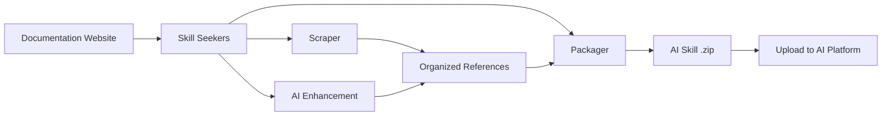

<p align="center">
  
</p>

# Skill Seekers

[English](README.md) | [简体中文](README.zh-CN.md) | [日本語](README.ja.md) | [한국어](README.ko.md) | [Español](README.es.md) | [Français](README.fr.md) | [Deutsch](README.de.md) | Português | [Türkçe](README.tr.md) | [العربية](README.ar.md) | [हिन्दी](README.hi.md) | [Русский](README.ru.md)

> ⚠️ **Aviso de tradução automática**
>
> Este documento foi traduzido automaticamente por IA. Embora nos esforcemos para garantir a qualidade, podem existir expressões imprecisas.
>
> Ajude a melhorar a tradução através do [GitHub Issue #260](https://github.com/yusufkaraaslan/Skill_Seekers/issues/260)! Seu feedback é muito valioso para nós.

[](https://github.com/yusufkaraaslan/Skill_Seekers/releases)
[](https://opensource.org/licenses/MIT)
[](https://www.python.org/downloads/)
[](https://modelcontextprotocol.io)
[](tests/)
[](https://pypi.org/project/skill-seekers/)
[](https://pypi.org/project/skill-seekers/)
[](https://skillseekersweb.com/)
[](https://github.com/yusufkaraaslan/Skill_Seekers)
[](https://pepy.tech/projects/skill-seekers)

<a href="https://trendshift.io/repositories/18329" target="_blank"></a>

**🧠 A camada de dados para sistemas de IA.** O Skill Seekers transforma sites de documentação, repositórios do GitHub, PDFs, vídeos, notebooks, wikis e muito mais — **18 tipos de fonte** — em ativos de conhecimento estruturados, prontos para alimentar Skills de IA (Claude, Gemini, OpenAI), pipelines de RAG (LangChain, LlamaIndex, Pinecone) e assistentes de programação com IA (Cursor, Windsurf, Cline). Prepare uma vez, exporte para **22 alvos**.

## 💛 Patrocinadores

<!-- SPONSORS:START -->
### Launch Partner

<p align="center">
  <a href="https://www.atlascloud.ai/"></a><br/><sub><b>Launch Partner</b></sub>
</p>

[Atlas Cloud](https://www.atlascloud.ai/) — A full-modal, OpenAI-compatible AI inference platform. Skill Seekers supports it as a packaging/enhancement target via `--target atlas` with `ATLAS_API_KEY`.

### Silver Sponsors

<p align="center">
  <a href="https://www.rapidproxy.io/?utm_source=skillseekers&utm_medium=sponsor"></a><br/><sub><b>Sponsor — Silver</b></sub>
</p>
<!-- SPONSORS:END -->

**[Torne-se um patrocinador](SPONSORSHIP.md)** · [GitHub Sponsors](https://github.com/sponsors/yusufkaraaslan)

---

## 🚀 Início Rápido

```bash
# 1. Instale
pip install skill-seekers

# 2. Crie uma skill a partir de qualquer fonte
skill-seekers create https://docs.djangoproject.com/

# 3. Empacote para a sua plataforma de IA
skill-seekers package output/django --target claude
```

Agora você tem `output/django-claude.zip`, pronto para usar.

```bash
# Escolha outro agente de IA para o aprimoramento (padrão: claude)
skill-seekers create https://docs.djangoproject.com/ --agent kimi
skill-seekers create https://docs.djangoproject.com/ --agent-cmd "my-custom-agent run"
```

### 🛰️ Varredura de projeto guiada por IA

Aponte o `scan` para um projeto e um agente de IA lerá seus manifestos, README, Dockerfile/CI e amostras de imports do código-fonte — e então emitirá uma config por framework detectado, mais um `<project>-codebase.json` para o seu próprio código:

```bash
skill-seekers scan ./my-react-app --out ./configs/scanned/
# → react.json, vite.json, tailwind.json, jest.json, my-react-app-codebase.json

skill-seekers create ./configs/scanned/react.json
```

Se uma detecção não tiver um preset existente, a IA gera uma config nova; ao sair, você pode opcionalmente publicá-la de volta no [registro da comunidade](https://github.com/yusufkaraaslan/skill-seekers-configs).

### Todos os 18 tipos de fonte

```bash
skill-seekers create facebook/react            # Repositório do GitHub
skill-seekers create ./my-project              # Base de código local
skill-seekers create manual.pdf                # PDF
skill-seekers create report.docx               # Word
skill-seekers create book.epub                 # EPUB
skill-seekers create notebook.ipynb            # Jupyter
skill-seekers create openapi.yaml              # OpenAPI/Swagger
skill-seekers create presentation.pptx         # PowerPoint
skill-seekers create guide.adoc                # AsciiDoc
skill-seekers create page.html                 # HTML local (ou um diretório inteiro)
skill-seekers create feed.rss                  # RSS/Atom
skill-seekers create curl.1                    # Man page

# Vídeo (YouTube, Vimeo ou local — requer skill-seekers[video])
skill-seekers create --video-url https://www.youtube.com/watch?v=... --name mytutorial
skill-seekers create --setup                   # instala automaticamente as deps visuais compatíveis com a GPU

skill-seekers create --space-key TEAM --name wiki               # Confluence
skill-seekers create --database-id ... --name docs              # Notion
skill-seekers create --chat-export-path ./slack-export --name team-chat  # Slack/Discord
```

Veja o [Guia de Scraping](docs/user-guide/02-scraping.md) para todos os tipos de fonte e suas opções.

---

## 📦 Instalação

```bash
pip install skill-seekers              # Núcleo: scraping, GitHub, PDF, empacotamento
pip install skill-seekers[all-llms]    # + todas as plataformas de LLM
pip install skill-seekers[mcp]         # + servidor MCP
pip install skill-seekers[all]         # Tudo
```

**Não sabe do que precisa?** Execute o assistente: `skill-seekers-setup`

<details>
<summary><b>Todos os extras de instalação</b></summary>

| Instalação | Adiciona |
|---------|------|
| `skill-seekers[gemini]` | Suporte ao Google Gemini |
| `skill-seekers[openai]` | Suporte ao OpenAI ChatGPT |
| `skill-seekers[all-llms]` | Todas as plataformas de LLM |
| `skill-seekers[mcp]` | Servidor MCP para Claude Code, Cursor, etc. |
| `skill-seekers[video]` | Extração de transcrições e metadados do YouTube/Vimeo |
| `skill-seekers[video-full]` | + Transcrição com Whisper e extração de quadros visuais |
| `skill-seekers[jupyter]` | Suporte a Jupyter Notebook |
| `skill-seekers[pptx]` | Suporte a PowerPoint |
| `skill-seekers[confluence]` | Suporte a wikis do Confluence |
| `skill-seekers[notion]` | Suporte a páginas do Notion |
| `skill-seekers[rss]` | Suporte a feeds RSS/Atom |
| `skill-seekers[chat]` | Suporte a exportações de chat do Slack/Discord |
| `skill-seekers[asciidoc]` | Suporte a AsciiDoc |
| `skill-seekers[all]` | Tudo |

> **Deps visuais de vídeo (compatíveis com GPU):** após instalar `skill-seekers[video-full]`, execute `skill-seekers create --setup` para detectar automaticamente a sua GPU e instalar a variante correspondente do PyTorch + easyocr.

</details>

**Pré-requisitos:** Python 3.10+, Git. É novo por aqui? → **[Início Rápido à Prova de Balas](docs/getting-started/BULLETPROOF_QUICKSTART.md)** 🎯

---

## 📚 Documentação

| Eu quero... | Leia isto |
|--------------|-----------|
| **Começar rapidamente** | [Início Rápido](docs/getting-started/02-quick-start.md) — 3 comandos até a sua primeira skill |
| **Entender os conceitos** | [Conceitos Fundamentais](docs/user-guide/01-core-concepts.md) |
| **Extrair conteúdo de fontes** | [Guia de Scraping](docs/user-guide/02-scraping.md) — todos os 18 tipos de fonte |
| **Aprimorar skills com IA** | [Guia de Aprimoramento](docs/user-guide/03-enhancement.md) · [Modos de Aprimoramento](docs/features/ENHANCEMENT_MODES.md) |
| **Exportar skills** | [Guia de Empacotamento](docs/user-guide/04-packaging.md) |
| **Criar workflows** | [Workflows](docs/user-guide/05-workflows.md) |
| **Consultar um comando** | [Referência da CLI](docs/reference/CLI_REFERENCE.md) — todos os 19 comandos |
| **Configurar** | [Formato de Config](docs/reference/CONFIG_FORMAT.md) · [Variáveis de Ambiente](docs/reference/ENVIRONMENT_VARIABLES.md) |
| **Configurar o MCP** | [Configuração do MCP](docs/guides/MCP_SETUP.md) · [Referência do MCP](docs/reference/MCP_REFERENCE.md) |
| **Integrar com RAG / IDEs** | [LangChain](docs/integrations/LANGCHAIN.md) · [Pipelines de RAG](docs/integrations/RAG_PIPELINES.md) · [Cursor](docs/integrations/CURSOR.md) · [Windsurf](docs/integrations/WINDSURF.md) · [Cline](docs/integrations/CLINE.md) |
| **Lidar com conjuntos enormes de docs** | [Documentação Extensa](docs/reference/LARGE_DOCUMENTATION.md) — 10K–40K+ páginas |
| **Entender a arquitetura** | [Arquitetura UML](docs/UML_ARCHITECTURE.md) — 14 diagramas |
| **Resolver um problema** | [Solução de Problemas](docs/user-guide/06-troubleshooting.md) |

**Índice completo da documentação:** [docs/README.md](docs/README.md)

---

## 🎯 O que você obtém

| Caso de uso | Saída | Alimenta |
|----------|--------|--------|
| **Skills de IA** | `SKILL.md` abrangente + arquivos de referência | Claude Code, Gemini, GPT |
| **Pipelines de RAG** | Documentos fragmentados com metadados ricos | LangChain, LlamaIndex, Haystack |
| **Bancos de dados vetoriais** | Dados pré-formatados prontos para upsert | Pinecone, Chroma, Weaviate, FAISS, Qdrant |
| **Assistentes de programação com IA** | Arquivos de contexto que a IA da sua IDE lê automaticamente | Cursor, Windsurf, Cline, Continue.dev |

### Alvos de exportação (22)

```bash
skill-seekers package output/react --target claude      # → Claude Skill (ZIP + YAML)
skill-seekers package output/react --target langchain   # → LangChain Documents
skill-seekers package output/react --target llama-index # → LlamaIndex TextNodes
skill-seekers package output/react --target ibm-bob     # → Diretório de skill do IBM Bob
```

**Plataformas de LLM (12):** `claude` · `gemini` · `openai` · `minimax` · `opencode` · `kimi` · `deepseek` · `qwen` · `openrouter` · `together` · `fireworks` · `markdown`
**RAG e vetoriais (8):** `langchain` · `llama-index` · `haystack` · `chroma` · `faiss` · `weaviate` · `qdrant` · `pinecone`
**Outros (2):** `atlas` · `ibm-bob`

Veja a [Matriz de Recursos](docs/reference/FEATURE_MATRIX.md) para detalhes de suporte por plataforma.

### Por que isso importa

- ⚡ **99% mais rápido** — dias de preparação manual de dados → 15–45 minutos
- 🎯 **Qualidade real de skill** — arquivos `SKILL.md` com mais de 500 linhas, com exemplos, padrões e guias
- 📊 **Chunks prontos para RAG** — a fragmentação inteligente preserva blocos de código e contexto
- 🔄 **Multi-fonte** — combine docs + GitHub + PDFs + vídeos em um único ativo de conhecimento
- 🌐 **Uma preparação, todos os alvos** — exporte para 22 alvos sem refazer o scraping
- ✅ **Testado em campo** — 3.900+ testes, 68 presets de workflow, pronto para produção

---

## ✨ Principais recursos

<details>
<summary><b>Scraping de documentação</b> — descoberta de SPA, llms.txt, categorização inteligente</summary>

Descoberta em três camadas para sites SPA em JavaScript (`sitemap.xml` → `llms.txt` → renderização em navegador headless), detecção automática de `llms.txt` (10× mais rápido quando presente), categorização inteligente por tópico e um parser HTML tolerante como fallback, para que markup quebrado ainda possa ser extraído.

→ [Guia de Scraping](docs/user-guide/02-scraping.md) · [Suporte a llms.txt](docs/reference/LLMS_TXT_SUPPORT.md)
</details>

<details>
<summary><b>Análise de GitHub e bases de código (C3.x)</b> — parsing de AST, detecção de padrões, guias práticos</summary>

Arquitetura de três fluxos: análise de código (AST, padrões de projeto, testes), documentação (README, `docs/`, wiki) e comunidade (issues, PRs, metadados). O pipeline C3.x adiciona 10 detectores de padrões GoF em 9 linguagens, exemplos de uso extraídos de testes, guias práticos escritos por IA, extração de configuração e visões gerais da arquitetura.

```bash
skill-seekers create ./my-project --preset quick          # 1–2 min, nível superficial
skill-seekers create ./my-project --preset standard       # equilibrado (padrão)
skill-seekers create ./my-project --preset comprehensive  # profundo, exaustivo
```

→ [Detecção de Padrões](docs/features/PATTERN_DETECTION.md) · [Guias Práticos](docs/features/HOW_TO_GUIDES.md) · [Extração de Exemplos de Testes](docs/features/TEST_EXAMPLE_EXTRACTION.md)
</details>

<details>
<summary><b>Aprimoramento por IA</b> — API ou agentes locais, 68 presets de workflow</summary>

Toda chamada de IA passa por um único transporte, em **modo API** (Anthropic, Google Gemini, OpenAI, Moonshot/Kimi, MiniMax) ou **modo LOCAL** (Claude Code, Kimi Code, Codex, Copilot, OpenCode, agentes personalizados — sem custos de API). Controle a profundidade com `--enhance-level 0-3` e escolha um agente com `--agent`.

→ [Guia de Aprimoramento](docs/user-guide/03-enhancement.md) · [Modos de Aprimoramento](docs/features/ENHANCEMENT_MODES.md) · [Configuração Multiagente](docs/guides/MULTI_AGENT_SETUP.md)
</details>

<details>
<summary><b>Scraping unificado multi-fonte</b> — combine várias fontes em uma única skill</summary>

Uma única config pode reunir documentação, GitHub, PDFs, vídeos e mais em um único ativo de conhecimento, com detecção de conflitos e síntese par a par entre as fontes.

→ [Scraping Unificado](docs/features/UNIFIED_SCRAPING.md)
</details>

<details>
<summary><b>Extração de vídeo</b> — transcrições, quadros, código na tela</summary>

YouTube, Vimeo e arquivos locais. Fallback de transcrição em três níveis (legendas → API de transcrição do YouTube → Whisper local), além de extração visual opcional que aplica OCR ao código exibido na tela a partir de quadros amostrados.

→ [Guia de Vídeo](docs/VIDEO_GUIDE.md)
</details>

<details>
<summary><b>Qualidade, sincronização e escala</b></summary>

Pontuação de qualidade com um portão de aprovação (`skill-seekers quality output/react/ --threshold 7`), detecção de mudanças na documentação com re-scrapings agendados e notificações, ingestão por streaming para conjuntos de docs muito grandes e atualizações incrementais.

→ [Documentação Extensa](docs/reference/LARGE_DOCUMENTATION.md) · [Qualidade de Código](docs/reference/CODE_QUALITY.md)
</details>

---

## 🔌 Integração MCP (40 ferramentas)

O Skill Seekers inclui um servidor MCP para Claude Code, Cursor, Windsurf, VS Code + Cline e IntelliJ IDEA.

```bash
# modo stdio (Claude Code, VS Code + Cline)
python -m skill_seekers.mcp.server_fastmcp

# modo HTTP (Cursor, Windsurf, IntelliJ)
python -m skill_seekers.mcp.server_fastmcp --transport http --port 8765
```

Depois é só pedir ao seu assistente: *"Empacote e faça upload da skill do React."*

→ [Configuração do MCP](docs/guides/MCP_SETUP.md) · [Referência do MCP](docs/reference/MCP_REFERENCE.md) · [Transporte HTTP](docs/guides/HTTP_TRANSPORT.md)

---

## 🤖 Instalação em agentes de IA

As skills são instaladas automaticamente em **19 agentes de programação com IA**:

```bash
skill-seekers install-agent output/react/ --agent cursor
skill-seekers install-agent output/react/ --agent all      # todos os agentes detectados
skill-seekers install-agent output/react/ --agent cursor --dry-run
```

| Agente | Caminho | Escopo |
|-------|------|-------|
| Claude Code | `~/.claude/skills/` | Global |
| Cursor | `.cursor/skills/` | Projeto |
| VS Code / Copilot | `.github/skills/` | Projeto |
| Amp | `~/.amp/skills/` | Global |
| Goose | `~/.config/goose/skills/` | Global |
| OpenCode | `~/.opencode/skills/` | Global |
| Letta | `~/.letta/skills/` | Global |
| Aide | `~/.aide/skills/` | Global |
| Windsurf | `~/.windsurf/skills/` | Global |
| Neovate | `~/.neovate/skills/` | Global |
| Roo Code | `.roo/skills/` | Projeto |
| Cline | `.cline/skills/` | Projeto |
| Aider | `~/.aider/skills/` | Global |
| Bolt | `.bolt/skills/` | Projeto |
| Kilo Code | `.kilo/skills/` | Projeto |
| Continue | `~/.continue/skills/` | Global |
| Kimi Code | `~/.kimi/skills/` | Global |
| IBM Bob | `.bob/skills/` | Projeto |

### Envio para o Claude

```bash
export ANTHROPIC_API_KEY=sk-ant-...
skill-seekers package output/react/ --upload   # empacota + envia
skill-seekers upload output/react.zip          # envia um zip existente
```

Sem chave de API? Empacote e envie `output/react.zip` manualmente em [claude.ai/skills](https://claude.ai/skills).

→ [Guia de Upload](docs/guides/UPLOAD_GUIDE.md)

---

## ⚙️ Como funciona



1. **Scraping** — extrai todas as páginas (verificando o `llms.txt` primeiro)
2. **Categorização** — organiza o conteúdo em tópicos (API, guias, tutoriais, …)
3. **Aprimoramento** — a IA escreve um `SKILL.md` abrangente com exemplos
4. **Empacotamento** — agrupa tudo em um artefato pronto para a plataforma
5. **Envio** — publica na sua plataforma de IA (opcional)

### Arquitetura

**8 módulos principais + 5 módulos utilitários** (~200 classes):

| Módulo | Finalidade |
|--------|---------|
| **CLICore** | Despachante de comandos no estilo Git, detecção automática de fonte |
| **Scrapers** | 18 extratores de tipos de fonte sobre uma camada de build compartilhada |
| **Adaptors** | 22 formatos de plataforma de saída por trás de uma única ABC `SkillAdaptor` |
| **Analysis** | Pipeline C3.x para bases de código, 10 detectores de padrões GoF |
| **Enhancement** | Melhoria por IA através de um único transporte `AgentClient` |
| **Packaging** | Empacota, envia e instala skills |
| **MCP** | Servidor FastMCP (40 ferramentas, 10 módulos de ferramentas) |
| **Sync** | Detecção de mudanças na documentação e notificação |

→ [Arquitetura UML](docs/UML_ARCHITECTURE.md) · [Referência da API](docs/reference/API_REFERENCE.md) · [Arquitetura de Skills](docs/reference/SKILL_ARCHITECTURE.md)

---

## 🆕 Novidades na v3.9.0

- **Fallback do parser HTML para markup quebrado** (#96) — páginas severamente malformadas não são mais extraídas como vazias; páginas bem formadas continuam byte a byte idênticas.
- **Novas tentativas em falhas transitórias** — o scraper de documentação (#97) e o `fetch_config` do MCP (#92) agora repetem oscilações de conexão e erros 5xx com backoff; erros 4xx continuam falhando imediatamente.
- **Fallback de transcrição com Whisper** (#420) — vídeos locais sem legendas finalmente ganham uma transcrição de verdade.
- **OCR de imagens da MiniMax + provedores multimodais orientados por registro** (#423) — os provedores declaram seu protocolo de comunicação e sua capacidade de imagem; chaves emitidas na China funcionam no endpoint correto.
- **Padrões econômicos em tokens para issues do GitHub** (#169) — as skills do GitHub não incluem mais, por padrão, todo o histórico de issues fechadas.
- **CORS orientado por variáveis de ambiente nos três servidores** (#422, #424) — chega de origens curinga com credenciais.

Histórico completo: **[CHANGELOG.md](CHANGELOG.md)**

---

## 📈 Desempenho

| Tamanho da documentação | Tempo | Saída |
|---|---|---|
| Pequena (< 100 páginas) | 5–10 min | ~2 MB |
| Média (100–500 páginas) | 15–30 min | ~10 MB |
| Grande (500–2.000 páginas) | 30–60 min | ~40 MB |
| Enorme (10K–40K+ páginas) | Use `stream` | Veja [Documentação Extensa](docs/reference/LARGE_DOCUMENTATION.md) |

---

## 🐛 Solução de problemas

```bash
skill-seekers doctor          # diagnostica a instalação e o ambiente
skill-seekers sync-config     # detecta divergências de configuração
```

Problemas comuns e correções: **[Guia de Solução de Problemas](docs/user-guide/06-troubleshooting.md)** · [TROUBLESHOOTING.md](docs/TROUBLESHOOTING.md)

---

## 🤝 Contribuindo

Contribuições são bem-vindas — veja **[CONTRIBUTING.md](CONTRIBUTING.md)**.

- 📋 **[Roadmap de Desenvolvimento e Tarefas](https://github.com/users/yusufkaraaslan/projects/2)** — escolha qualquer tarefa
- 💬 **[Discussões](https://github.com/yusufkaraaslan/Skill_Seekers/discussions)** — dúvidas e ideias
- 🐛 **[Issues](https://github.com/yusufkaraaslan/Skill_Seekers/issues)** — bugs e pedidos de recursos

---

## 📝 Licença

MIT — veja [LICENSE](LICENSE).

## 🔒 Segurança

[](https://mseep.ai/app/yusufkaraaslan-skill-seekers)

---

## 🌐 Ecossistema

O Skill Seekers é um projeto multi-repositório:

| Repositório | Descrição | Links |
|-----------|-------------|-------|
| **[Skill_Seekers](https://github.com/yusufkaraaslan/Skill_Seekers)** | CLI principal e servidor MCP (este repositório) | [PyPI](https://pypi.org/project/skill-seekers/) |
| **[skillseekersweb](https://github.com/yusufkaraaslan/skillseekersweb)** | Website e documentação | [No ar](https://skillseekersweb.com/) |
| **[skill-seekers-configs](https://github.com/yusufkaraaslan/skill-seekers-configs)** | Repositório de configs da comunidade | |
| **[skill-seekers-action](https://github.com/yusufkaraaslan/skill-seekers-action)** | GitHub Action para CI/CD | |
| **[skill-seekers-plugin](https://github.com/yusufkaraaslan/skill-seekers-plugin)** | Plugin do Claude Code | |
| **[homebrew-skill-seekers](https://github.com/yusufkaraaslan/homebrew-skill-seekers)** | Tap do Homebrew para macOS | |

> **Quer contribuir?** Os repositórios do website e das configs são ótimos pontos de partida para novos contribuidores!
