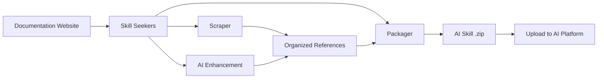

<p align="center">
  
</p>

# Skill Seekers

[English](README.md) | [简体中文](README.zh-CN.md) | [日本語](README.ja.md) | [한국어](README.ko.md) | [Español](README.es.md) | [Français](README.fr.md) | [Deutsch](README.de.md) | [Português](README.pt-BR.md) | [Türkçe](README.tr.md) | [العربية](README.ar.md) | [हिन्दी](README.hi.md) | Русский

> ⚠️ **Уведомление о машинном переводе**
>
> Этот документ был автоматически переведён с помощью ИИ. Несмотря на наши усилия по обеспечению качества, возможны неточные выражения.

[](https://github.com/yusufkaraaslan/Skill_Seekers/releases)
[](https://opensource.org/licenses/MIT)
[](https://www.python.org/downloads/)
[](https://modelcontextprotocol.io)
[](tests/)
[](https://pypi.org/project/skill-seekers/)
[](https://pypi.org/project/skill-seekers/)
[](https://skillseekersweb.com/)
[](https://github.com/yusufkaraaslan/Skill_Seekers)
[](https://pepy.tech/projects/skill-seekers)

<a href="https://trendshift.io/repositories/18329" target="_blank"></a>

**🧠 Слой данных для AI-систем.** Skill Seekers превращает сайты документации, GitHub-репозитории, PDF, видео, ноутбуки, вики и многое другое — **18 типов источников** — в структурированные активы знаний, готовые питать AI-навыки (Claude, Gemini, OpenAI), RAG-конвейеры (LangChain, LlamaIndex, Pinecone) и AI-ассистенты для кода (Cursor, Windsurf, Cline). Подготовьте один раз — экспортируйте в **22 целевые платформы**.

## 💛 Спонсоры

<!-- SPONSORS:START -->
### Launch Partner

<p align="center">
  <a href="https://www.atlascloud.ai/"></a><br/><sub><b>Launch Partner</b></sub>
</p>

[Atlas Cloud](https://www.atlascloud.ai/) — A full-modal, OpenAI-compatible AI inference platform. Skill Seekers supports it as a packaging/enhancement target via `--target atlas` with `ATLAS_API_KEY`.

### Silver Sponsors

<p align="center">
  <a href="https://www.rapidproxy.io/?utm_source=skillseekers&utm_medium=sponsor"></a><br/><sub><b>Sponsor — Silver</b></sub>
</p>
<!-- SPONSORS:END -->

**[Стать спонсором](SPONSORSHIP.md)** · [GitHub Sponsors](https://github.com/sponsors/yusufkaraaslan)

---

## 🚀 Быстрый старт

```bash
# 1. Установка
pip install skill-seekers

# 2. Создайте навык из любого источника
skill-seekers create https://docs.djangoproject.com/

# 3. Упакуйте его для вашей AI-платформы
skill-seekers package output/django --target claude
```

Готово: у вас есть `output/django-claude.zip`, готовый к использованию.

```bash
# Выберите другого AI-агента для улучшения (по умолчанию: claude)
skill-seekers create https://docs.djangoproject.com/ --agent kimi
skill-seekers create https://docs.djangoproject.com/ --agent-cmd "my-custom-agent run"
```

### 🛰️ Сканирование проекта с помощью AI

Направьте `scan` на проект — AI-агент прочитает его манифесты, README, Dockerfile/CI и выборку импортов из исходников, а затем создаст по одному конфигу на каждый обнаруженный фреймворк плюс `<project>-codebase.json` для вашего собственного кода:

```bash
skill-seekers scan ./my-react-app --out ./configs/scanned/
# → react.json, vite.json, tailwind.json, jest.json, my-react-app-codebase.json

skill-seekers create ./configs/scanned/react.json
```

Если для обнаруженного фреймворка нет готового пресета, AI сгенерирует новый конфиг; при выходе вы сможете при желании опубликовать его в [реестре сообщества](https://github.com/yusufkaraaslan/skill-seekers-configs).

### Все 18 типов источников

```bash
skill-seekers create facebook/react            # GitHub-репозиторий
skill-seekers create ./my-project              # Локальная кодовая база
skill-seekers create manual.pdf                # PDF
skill-seekers create report.docx               # Word
skill-seekers create book.epub                 # EPUB
skill-seekers create notebook.ipynb            # Jupyter
skill-seekers create openapi.yaml              # OpenAPI/Swagger
skill-seekers create presentation.pptx         # PowerPoint
skill-seekers create guide.adoc                # AsciiDoc
skill-seekers create page.html                 # Локальный HTML (или целый каталог)
skill-seekers create feed.rss                  # RSS/Atom
skill-seekers create curl.1                    # Man-страница

# Видео (YouTube, Vimeo или локальный файл — нужен skill-seekers[video])
skill-seekers create --video-url https://www.youtube.com/watch?v=... --name mytutorial
skill-seekers create --setup                   # автоустановка визуальных зависимостей с учётом GPU

skill-seekers create --space-key TEAM --name wiki               # Confluence
skill-seekers create --database-id ... --name docs              # Notion
skill-seekers create --chat-export-path ./slack-export --name team-chat  # Slack/Discord
```

Все типы источников и их параметры описаны в [руководстве по скрейпингу](docs/user-guide/02-scraping.md).

---

## 📦 Установка

```bash
pip install skill-seekers              # Базовое: скрейпинг, GitHub, PDF, упаковка
pip install skill-seekers[all-llms]    # + все LLM-платформы
pip install skill-seekers[mcp]         # + MCP-сервер
pip install skill-seekers[all]         # Всё сразу
```

**Не уверены, что именно вам нужно?** Запустите мастер настройки: `skill-seekers-setup`

<details>
<summary><b>Все дополнения для установки</b></summary>

| Установка | Что добавляет |
|---------|------|
| `skill-seekers[gemini]` | Поддержка Google Gemini |
| `skill-seekers[openai]` | Поддержка OpenAI ChatGPT |
| `skill-seekers[all-llms]` | Все LLM-платформы |
| `skill-seekers[mcp]` | MCP-сервер для Claude Code, Cursor и других |
| `skill-seekers[video]` | Извлечение транскриптов и метаданных YouTube/Vimeo |
| `skill-seekers[video-full]` | + транскрибация Whisper и извлечение видеокадров |
| `skill-seekers[jupyter]` | Поддержка Jupyter Notebook |
| `skill-seekers[pptx]` | Поддержка PowerPoint |
| `skill-seekers[confluence]` | Поддержка вики Confluence |
| `skill-seekers[notion]` | Поддержка страниц Notion |
| `skill-seekers[rss]` | Поддержка лент RSS/Atom |
| `skill-seekers[chat]` | Поддержка экспорта чатов Slack/Discord |
| `skill-seekers[asciidoc]` | Поддержка AsciiDoc |
| `skill-seekers[all]` | Всё сразу |

> **Визуальные зависимости для видео (с учётом GPU):** после установки `skill-seekers[video-full]` запустите `skill-seekers create --setup`, чтобы автоматически определить GPU и установить подходящую сборку PyTorch + easyocr.

</details>

**Требования:** Python 3.10+, Git. Впервые здесь? → **[Надёжный быстрый старт](docs/getting-started/BULLETPROOF_QUICKSTART.md)** 🎯

---

## 📚 Документация

| Я хочу... | Читайте это |
|--------------|-----------|
| **Быстро начать** | [Быстрый старт](docs/getting-started/02-quick-start.md) — 3 команды до первого навыка |
| **Разобраться в концепциях** | [Основные концепции](docs/user-guide/01-core-concepts.md) |
| **Скрейпить источники** | [Руководство по скрейпингу](docs/user-guide/02-scraping.md) — все 18 типов источников |
| **Улучшать навыки с помощью AI** | [Руководство по улучшению](docs/user-guide/03-enhancement.md) · [Режимы улучшения](docs/features/ENHANCEMENT_MODES.md) |
| **Экспортировать навыки** | [Руководство по упаковке](docs/user-guide/04-packaging.md) |
| **Строить рабочие процессы** | [Рабочие процессы](docs/user-guide/05-workflows.md) |
| **Найти нужную команду** | [Справочник CLI](docs/reference/CLI_REFERENCE.md) — все 19 команд |
| **Настроить конфигурацию** | [Формат конфигурации](docs/reference/CONFIG_FORMAT.md) · [Переменные окружения](docs/reference/ENVIRONMENT_VARIABLES.md) |
| **Настроить MCP** | [Настройка MCP](docs/guides/MCP_SETUP.md) · [Справочник MCP](docs/reference/MCP_REFERENCE.md) |
| **Интегрировать с RAG / IDE** | [LangChain](docs/integrations/LANGCHAIN.md) · [RAG-конвейеры](docs/integrations/RAG_PIPELINES.md) · [Cursor](docs/integrations/CURSOR.md) · [Windsurf](docs/integrations/WINDSURF.md) · [Cline](docs/integrations/CLINE.md) |
| **Работать с огромными наборами документации** | [Большая документация](docs/reference/LARGE_DOCUMENTATION.md) — 10K–40K+ страниц |
| **Понять архитектуру** | [UML-архитектура](docs/UML_ARCHITECTURE.md) — 14 диаграмм |
| **Решить проблему** | [Устранение неполадок](docs/user-guide/06-troubleshooting.md) |

**Полный указатель документации:** [docs/README.md](docs/README.md)

---

## 🎯 Что вы получаете

| Сценарий использования | Результат | Работает с |
|----------|--------|--------|
| **AI-навыки** | Подробный `SKILL.md` + справочные файлы | Claude Code, Gemini, GPT |
| **RAG-конвейеры** | Документы, разбитые на фрагменты, с богатыми метаданными | LangChain, LlamaIndex, Haystack |
| **Векторные базы данных** | Предварительно отформатированные данные, готовые к upsert | Pinecone, Chroma, Weaviate, FAISS, Qdrant |
| **AI-ассистенты для кода** | Контекстные файлы, которые AI вашей IDE читает автоматически | Cursor, Windsurf, Cline, Continue.dev |

### Цели экспорта (22)

```bash
skill-seekers package output/react --target claude      # → навык Claude (ZIP + YAML)
skill-seekers package output/react --target langchain   # → документы LangChain
skill-seekers package output/react --target llama-index # → TextNodes LlamaIndex
skill-seekers package output/react --target ibm-bob     # → каталог навыка IBM Bob
```

**LLM-платформы (12):** `claude` · `gemini` · `openai` · `minimax` · `opencode` · `kimi` · `deepseek` · `qwen` · `openrouter` · `together` · `fireworks` · `markdown`
**RAG и векторные БД (8):** `langchain` · `llama-index` · `haystack` · `chroma` · `faiss` · `weaviate` · `qdrant` · `pinecone`
**Прочее (2):** `atlas` · `ibm-bob`

Подробности поддержки по каждой платформе — в [матрице возможностей](docs/reference/FEATURE_MATRIX.md).

### Почему это важно

- ⚡ **На 99% быстрее** — дни ручной подготовки данных → 15–45 минут
- 🎯 **Настоящее качество навыков** — файлы `SKILL.md` на 500+ строк с примерами, паттернами и руководствами
- 📊 **Готовые для RAG фрагменты** — умное разбиение сохраняет блоки кода и контекст
- 🔄 **Несколько источников** — объедините документацию + GitHub + PDF + видео в один актив знаний
- 🌐 **Одна подготовка — все цели** — экспорт в 22 цели без повторного скрейпинга
- ✅ **Проверено в бою** — 3,900+ тестов, 68 пресетов рабочих процессов, готово к продакшену

---

## ✨ Ключевые возможности

<details>
<summary><b>Скрейпинг документации</b> — обнаружение SPA, llms.txt, умная категоризация</summary>

Трёхуровневое обнаружение для JavaScript SPA-сайтов (`sitemap.xml` → `llms.txt` → рендеринг в headless-браузере), автоматическое определение `llms.txt` (в 10× быстрее, когда он есть), умная категоризация по темам и снисходительный запасной HTML-парсер, благодаря которому даже сломанная разметка успешно скрейпится.

→ [Руководство по скрейпингу](docs/user-guide/02-scraping.md) · [Поддержка llms.txt](docs/reference/LLMS_TXT_SUPPORT.md)
</details>

<details>
<summary><b>Анализ GitHub и кодовых баз (C3.x)</b> — разбор AST, обнаружение паттернов, практические руководства</summary>

Трёхпоточная архитектура: анализ кода (AST, паттерны проектирования, тесты), документация (README, `docs/`, вики) и сообщество (issues, PR, метаданные). Конвейер C3.x добавляет 10 детекторов паттернов GoF для 9 языков, примеры использования, извлечённые из тестов, написанные AI практические руководства, извлечение конфигураций и обзоры архитектуры.

```bash
skill-seekers create ./my-project --preset quick          # 1–2 мин, поверхностный уровень
skill-seekers create ./my-project --preset standard       # сбалансированный (по умолчанию)
skill-seekers create ./my-project --preset comprehensive  # глубокий, исчерпывающий
```

→ [Обнаружение паттернов](docs/features/PATTERN_DETECTION.md) · [Практические руководства](docs/features/HOW_TO_GUIDES.md) · [Извлечение примеров из тестов](docs/features/TEST_EXAMPLE_EXTRACTION.md)
</details>

<details>
<summary><b>Улучшение с помощью AI</b> — API или локальные агенты, 68 пресетов рабочих процессов</summary>

Каждый AI-вызов проходит через единый транспорт — в **режиме API** (Anthropic, Google Gemini, OpenAI, Moonshot/Kimi, MiniMax) или в **режиме LOCAL** (Claude Code, Kimi Code, Codex, Copilot, OpenCode, пользовательские агенты — без затрат на API). Управляйте глубиной через `--enhance-level 0-3` и выбирайте агента через `--agent`.

→ [Руководство по улучшению](docs/user-guide/03-enhancement.md) · [Режимы улучшения](docs/features/ENHANCEMENT_MODES.md) · [Настройка нескольких агентов](docs/guides/MULTI_AGENT_SETUP.md)
</details>

<details>
<summary><b>Единый скрейпинг из нескольких источников</b> — объедините много источников в один навык</summary>

Один конфиг может собрать документацию, GitHub, PDF, видео и другое в единый актив знаний — с обнаружением противоречий и попарным синтезом между источниками.

→ [Единый скрейпинг](docs/features/UNIFIED_SCRAPING.md)
</details>

<details>
<summary><b>Извлечение из видео</b> — транскрипты, кадры, код на экране</summary>

YouTube, Vimeo и локальные файлы. Трёхуровневый запасной механизм получения транскрипта (субтитры → transcript API YouTube → локальный Whisper), плюс опциональное визуальное извлечение, которое распознаёт (OCR) код на экране по выборочным кадрам.

→ [Руководство по видео](docs/VIDEO_GUIDE.md)
</details>

<details>
<summary><b>Качество, синхронизация и масштаб</b></summary>

Оценка качества с пороговым значением (`skill-seekers quality output/react/ --threshold 7`), обнаружение изменений в документации с запланированным повторным скрейпингом и уведомлениями, потоковая загрузка для очень больших наборов документации и инкрементальные обновления.

→ [Большая документация](docs/reference/LARGE_DOCUMENTATION.md) · [Качество кода](docs/reference/CODE_QUALITY.md)
</details>

---

## 🔌 Интеграция с MCP (40 инструментов)

Skill Seekers поставляется с MCP-сервером для Claude Code, Cursor, Windsurf, VS Code + Cline и IntelliJ IDEA.

```bash
# режим stdio (Claude Code, VS Code + Cline)
python -m skill_seekers.mcp.server_fastmcp

# режим HTTP (Cursor, Windsurf, IntelliJ)
python -m skill_seekers.mcp.server_fastmcp --transport http --port 8765
```

Дальше просто попросите своего ассистента: *«Упакуй и загрузи навык React»*.

→ [Настройка MCP](docs/guides/MCP_SETUP.md) · [Справочник MCP](docs/reference/MCP_REFERENCE.md) · [HTTP-транспорт](docs/guides/HTTP_TRANSPORT.md)

---

## 🤖 Установка в AI-агенты

Навыки устанавливаются автоматически в **19 AI-агентов для кода**:

```bash
skill-seekers install-agent output/react/ --agent cursor
skill-seekers install-agent output/react/ --agent all      # все обнаруженные агенты
skill-seekers install-agent output/react/ --agent cursor --dry-run
```

| Агент | Путь | Область |
|-------|------|-------|
| Claude Code | `~/.claude/skills/` | Глобально |
| Cursor | `.cursor/skills/` | Проект |
| VS Code / Copilot | `.github/skills/` | Проект |
| Amp | `~/.amp/skills/` | Глобально |
| Goose | `~/.config/goose/skills/` | Глобально |
| OpenCode | `~/.opencode/skills/` | Глобально |
| Letta | `~/.letta/skills/` | Глобально |
| Aide | `~/.aide/skills/` | Глобально |
| Windsurf | `~/.windsurf/skills/` | Глобально |
| Neovate | `~/.neovate/skills/` | Глобально |
| Roo Code | `.roo/skills/` | Проект |
| Cline | `.cline/skills/` | Проект |
| Aider | `~/.aider/skills/` | Глобально |
| Bolt | `.bolt/skills/` | Проект |
| Kilo Code | `.kilo/skills/` | Проект |
| Continue | `~/.continue/skills/` | Глобально |
| Kimi Code | `~/.kimi/skills/` | Глобально |
| IBM Bob | `.bob/skills/` | Проект |

### Загрузка в Claude

```bash
export ANTHROPIC_API_KEY=sk-ant-...
skill-seekers package output/react/ --upload   # упаковать + загрузить
skill-seekers upload output/react.zip          # загрузить существующий zip
```

Нет ключа API? Упакуйте навык и загрузите `output/react.zip` вручную на [claude.ai/skills](https://claude.ai/skills).

→ [Руководство по загрузке](docs/guides/UPLOAD_GUIDE.md)

---

## ⚙️ Как это работает



1. **Скрейпинг** — извлечение каждой страницы (сначала проверяется `llms.txt`)
2. **Категоризация** — распределение контента по темам (API, руководства, туториалы, …)
3. **Улучшение** — AI пишет подробный `SKILL.md` с примерами
4. **Упаковка** — сборка в артефакт, готовый для платформы
5. **Загрузка** — отправка на вашу AI-платформу (опционально)

### Архитектура

**8 основных модулей + 5 вспомогательных модулей** (~200 классов):

| Модуль | Назначение |
|--------|---------|
| **CLICore** | Диспетчер команд в стиле Git, автоопределение источника |
| **Scrapers** | 18 экстракторов типов источников поверх общего слоя сборки |
| **Adaptors** | 22 формата выходных платформ за одним ABC `SkillAdaptor` |
| **Analysis** | Конвейер C3.x для кодовых баз, 10 детекторов паттернов GoF |
| **Enhancement** | Улучшение с помощью AI через единый транспорт `AgentClient` |
| **Packaging** | Упаковка, загрузка и установка навыков |
| **MCP** | Сервер FastMCP (40 инструментов, 10 модулей инструментов) |
| **Sync** | Обнаружение изменений в документации и уведомления |

→ [UML-архитектура](docs/UML_ARCHITECTURE.md) · [Справочник API](docs/reference/API_REFERENCE.md) · [Архитектура навыков](docs/reference/SKILL_ARCHITECTURE.md)

---

## 🆕 Новое в v3.9.0

- **Запасной HTML-парсер для сломанной разметки** (#96) — сильно некорректные страницы больше не скрейпятся пустыми; для корректных страниц результат остаётся байт в байт прежним.
- **Повторы при временных сбоях** — скрейпер документации (#97) и MCP-инструмент `fetch_config` (#92) теперь повторяют запросы при обрывах соединения и ошибках 5xx с нарастающей задержкой; 4xx по-прежнему завершается сразу.
- **Запасная транскрибация через Whisper** (#420) — локальные видео без субтитров наконец получают настоящий транскрипт.
- **OCR изображений MiniMax + мультимодальные провайдеры из реестра** (#423) — провайдеры объявляют свой сетевой протокол и поддержку изображений; ключи, выданные в Китае, работают с нужной конечной точкой.
- **Экономные по токенам значения по умолчанию для GitHub issues** (#169) — навыки на основе GitHub больше не включают по умолчанию всю историю закрытых issues.
- **CORS, управляемый переменными окружения, на всех трёх серверах** (#422, #424) — больше никаких wildcard-origin вместе с учётными данными.

Полная история: **[CHANGELOG.md](CHANGELOG.md)**

---

## 📈 Производительность

| Объём документации | Время | Результат |
|---|---|---|
| Малый (< 100 страниц) | 5–10 мин | ~2 МБ |
| Средний (100–500 страниц) | 15–30 мин | ~10 МБ |
| Большой (500–2,000 страниц) | 30–60 мин | ~40 МБ |
| Огромный (10K–40K+ страниц) | Используйте `stream` | См. [Большая документация](docs/reference/LARGE_DOCUMENTATION.md) |

---

## 🐛 Устранение неполадок

```bash
skill-seekers doctor          # диагностика установки и окружения
skill-seekers sync-config     # обнаружение расхождений в конфигурации
```

Типичные проблемы и их решения: **[Руководство по устранению неполадок](docs/user-guide/06-troubleshooting.md)** · [TROUBLESHOOTING.md](docs/TROUBLESHOOTING.md)

---

## 🤝 Участие в разработке

Мы рады вашему вкладу — см. **[CONTRIBUTING.md](CONTRIBUTING.md)**.

- 📋 **[Дорожная карта и задачи](https://github.com/users/yusufkaraaslan/projects/2)** — выберите любую задачу
- 💬 **[Обсуждения](https://github.com/yusufkaraaslan/Skill_Seekers/discussions)** — вопросы и идеи
- 🐛 **[Issues](https://github.com/yusufkaraaslan/Skill_Seekers/issues)** — баги и запросы функций

---

## 📝 Лицензия

MIT — см. [LICENSE](LICENSE).

## 🔒 Безопасность

[](https://mseep.ai/app/yusufkaraaslan-skill-seekers)

---

## 🌐 Экосистема

Skill Seekers — проект из нескольких репозиториев:

| Репозиторий | Описание | Ссылки |
|-----------|-------------|-------|
| **[Skill_Seekers](https://github.com/yusufkaraaslan/Skill_Seekers)** | Основной CLI и MCP-сервер (этот репозиторий) | [PyPI](https://pypi.org/project/skill-seekers/) |
| **[skillseekersweb](https://github.com/yusufkaraaslan/skillseekersweb)** | Сайт и документация | [Онлайн](https://skillseekersweb.com/) |
| **[skill-seekers-configs](https://github.com/yusufkaraaslan/skill-seekers-configs)** | Репозиторий конфигураций сообщества | |
| **[skill-seekers-action](https://github.com/yusufkaraaslan/skill-seekers-action)** | GitHub Action для CI/CD | |
| **[skill-seekers-plugin](https://github.com/yusufkaraaslan/skill-seekers-plugin)** | Плагин для Claude Code | |
| **[homebrew-skill-seekers](https://github.com/yusufkaraaslan/homebrew-skill-seekers)** | Homebrew tap для macOS | |

> **Хотите внести вклад?** Репозитории сайта и конфигураций — отличная отправная точка для новых участников!
