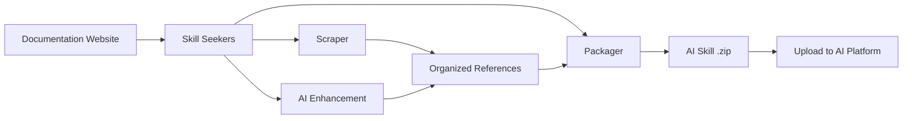

<p align="center">
  
</p>

# Skill Seekers

[English](README.md) | [简体中文](README.zh-CN.md) | [日本語](README.ja.md) | [한국어](README.ko.md) | [Español](README.es.md) | [Français](README.fr.md) | [Deutsch](README.de.md) | [Português](README.pt-BR.md) | Türkçe | [العربية](README.ar.md) | [हिन्दी](README.hi.md) | [Русский](README.ru.md)

> ⚠️ **Makine çevirisi bildirimi**
>
> Bu belge yapay zeka tarafından otomatik olarak çevrilmiştir. Kaliteyi sağlamak için çaba göstermemize rağmen, hatalı ifadeler bulunabilir.
>
> Çeviriyi iyileştirmemize yardımcı olmak için [GitHub Issue #260](https://github.com/yusufkaraaslan/Skill_Seekers/issues/260) üzerinden geri bildirimlerinizi paylaşabilirsiniz!

[](https://github.com/yusufkaraaslan/Skill_Seekers/releases)
[](https://opensource.org/licenses/MIT)
[](https://www.python.org/downloads/)
[](https://modelcontextprotocol.io)
[](tests/)
[](https://pypi.org/project/skill-seekers/)
[](https://pypi.org/project/skill-seekers/)
[](https://skillseekersweb.com/)
[](https://github.com/yusufkaraaslan/Skill_Seekers)
[](https://pepy.tech/projects/skill-seekers)

<a href="https://trendshift.io/repositories/18329" target="_blank"></a>

**🧠 Yapay zekâ sistemleri için veri katmanı.** Skill Seekers; dokümantasyon sitelerini, GitHub depolarını, PDF'leri, videoları, notebook'ları, wiki'leri ve daha fazlasını — **18 kaynak türü** — yapılandırılmış bilgi varlıklarına dönüştürür; AI Skill'lerini (Claude, Gemini, OpenAI), RAG hatlarını (LangChain, LlamaIndex, Pinecone) ve yapay zekâ kodlama asistanlarını (Cursor, Windsurf, Cline) beslemeye hazır hale getirir. Bir kez hazırlayın, **22 hedefe** aktarın.

## 💛 Sponsorlar

<!-- SPONSORS:START -->
### Launch Partner

<p align="center">
  <a href="https://www.atlascloud.ai/"></a><br/><sub><b>Launch Partner</b></sub>
</p>

[Atlas Cloud](https://www.atlascloud.ai/) — A full-modal, OpenAI-compatible AI inference platform. Skill Seekers supports it as a packaging/enhancement target via `--target atlas` with `ATLAS_API_KEY`.

### Silver Sponsors

<p align="center">
  <a href="https://www.rapidproxy.io/?utm_source=skillseekers&utm_medium=sponsor"></a><br/><sub><b>Sponsor — Silver</b></sub>
</p>
<!-- SPONSORS:END -->

**[Sponsor ol](SPONSORSHIP.md)** · [GitHub Sponsors](https://github.com/sponsors/yusufkaraaslan)

---

## 🚀 Hızlı Başlangıç

```bash
# 1. Kurun
pip install skill-seekers

# 2. Herhangi bir kaynaktan bir skill oluşturun
skill-seekers create https://docs.djangoproject.com/

# 3. Yapay zekâ platformunuz için paketleyin
skill-seekers package output/django --target claude
```

Artık kullanıma hazır bir `output/django-claude.zip` dosyanız var.

```bash
# İyileştirme için farklı bir yapay zekâ ajanı seçin (varsayılan: claude)
skill-seekers create https://docs.djangoproject.com/ --agent kimi
skill-seekers create https://docs.djangoproject.com/ --agent-cmd "my-custom-agent run"
```

### 🛰️ Yapay zekâ destekli proje taraması

`scan` komutunu bir projeye yöneltin; bir yapay zekâ ajanı projenin manifest dosyalarını, README'sini, Dockerfile/CI dosyalarını ve örneklenmiş kaynak import'larını okur — ardından tespit edilen her framework için bir config ve kendi kodunuz için bir `<project>-codebase.json` üretir:

```bash
skill-seekers scan ./my-react-app --out ./configs/scanned/
# → react.json, vite.json, tailwind.json, jest.json, my-react-app-codebase.json

skill-seekers create ./configs/scanned/react.json
```

Bir tespit için mevcut bir hazır ayar yoksa yapay zekâ sıfırdan bir config üretir; çıkışta bunu isteğe bağlı olarak [topluluk kayıt defterine](https://github.com/yusufkaraaslan/skill-seekers-configs) yayımlayabilirsiniz.

### 18 kaynak türünün tamamı

```bash
skill-seekers create facebook/react            # GitHub deposu
skill-seekers create ./my-project              # Yerel kod tabanı
skill-seekers create manual.pdf                # PDF
skill-seekers create report.docx               # Word
skill-seekers create book.epub                 # EPUB
skill-seekers create notebook.ipynb            # Jupyter
skill-seekers create openapi.yaml              # OpenAPI/Swagger
skill-seekers create presentation.pptx         # PowerPoint
skill-seekers create guide.adoc                # AsciiDoc
skill-seekers create page.html                 # Yerel HTML (veya tüm bir dizin)
skill-seekers create feed.rss                  # RSS/Atom
skill-seekers create curl.1                    # Man sayfası

# Video (YouTube, Vimeo veya yerel — skill-seekers[video] gerekir)
skill-seekers create --video-url https://www.youtube.com/watch?v=... --name mytutorial
skill-seekers create --setup                   # GPU'ya duyarlı görsel bağımlılıkları otomatik kurar

skill-seekers create --space-key TEAM --name wiki               # Confluence
skill-seekers create --database-id ... --name docs              # Notion
skill-seekers create --chat-export-path ./slack-export --name team-chat  # Slack/Discord
```

Her kaynak türü ve seçenekleri için [Scraping Rehberi](docs/user-guide/02-scraping.md) belgesine bakın.

---

## 📦 Kurulum

```bash
pip install skill-seekers              # Çekirdek: scraping, GitHub, PDF, paketleme
pip install skill-seekers[all-llms]    # + tüm LLM platformları
pip install skill-seekers[mcp]         # + MCP sunucusu
pip install skill-seekers[all]         # Her şey
```

**Neye ihtiyacınız olduğundan emin değil misiniz?** Sihirbazı çalıştırın: `skill-seekers-setup`

<details>
<summary><b>Tüm kurulum ekleri</b></summary>

| Kurulum | Eklediği |
|---------|------|
| `skill-seekers[gemini]` | Google Gemini desteği |
| `skill-seekers[openai]` | OpenAI ChatGPT desteği |
| `skill-seekers[all-llms]` | Tüm LLM platformları |
| `skill-seekers[mcp]` | Claude Code, Cursor vb. için MCP sunucusu |
| `skill-seekers[video]` | YouTube/Vimeo transkript ve meta veri çıkarımı |
| `skill-seekers[video-full]` | + Whisper transkripsiyonu ve görsel kare çıkarımı |
| `skill-seekers[jupyter]` | Jupyter Notebook desteği |
| `skill-seekers[pptx]` | PowerPoint desteği |
| `skill-seekers[confluence]` | Confluence wiki desteği |
| `skill-seekers[notion]` | Notion sayfaları desteği |
| `skill-seekers[rss]` | RSS/Atom akışı desteği |
| `skill-seekers[chat]` | Slack/Discord sohbet dışa aktarımı desteği |
| `skill-seekers[asciidoc]` | AsciiDoc desteği |
| `skill-seekers[all]` | Her şey |

> **Video görsel bağımlılıkları (GPU'ya duyarlı):** `skill-seekers[video-full]` kurduktan sonra, GPU'nuzu otomatik algılayıp uygun PyTorch sürümünü + easyocr'ı kurmak için `skill-seekers create --setup` çalıştırın.

</details>

**Ön koşullar:** Python 3.10+, Git. Yeni misiniz? → **[Kusursuz Hızlı Başlangıç](docs/getting-started/BULLETPROOF_QUICKSTART.md)** 🎯

---

## 📚 Dokümantasyon

| Şunu yapmak istiyorum... | Şunu okuyun |
|--------------|-----------|
| **Hızlıca başlamak** | [Hızlı Başlangıç](docs/getting-started/02-quick-start.md) — ilk skill'inize 3 komut |
| **Kavramları anlamak** | [Temel Kavramlar](docs/user-guide/01-core-concepts.md) |
| **Kaynakları scrape etmek** | [Scraping Rehberi](docs/user-guide/02-scraping.md) — 18 kaynak türünün tamamı |
| **Skill'leri yapay zekâ ile iyileştirmek** | [İyileştirme Rehberi](docs/user-guide/03-enhancement.md) · [İyileştirme Modları](docs/features/ENHANCEMENT_MODES.md) |
| **Skill'leri dışa aktarmak** | [Paketleme Rehberi](docs/user-guide/04-packaging.md) |
| **Workflow kurmak** | [Workflow'lar](docs/user-guide/05-workflows.md) |
| **Bir komuta bakmak** | [CLI Referansı](docs/reference/CLI_REFERENCE.md) — 19 komutun tamamı |
| **Yapılandırmak** | [Config Formatı](docs/reference/CONFIG_FORMAT.md) · [Ortam Değişkenleri](docs/reference/ENVIRONMENT_VARIABLES.md) |
| **MCP kurmak** | [MCP Kurulumu](docs/guides/MCP_SETUP.md) · [MCP Referansı](docs/reference/MCP_REFERENCE.md) |
| **RAG / IDE'lerle entegre etmek** | [LangChain](docs/integrations/LANGCHAIN.md) · [RAG Hatları](docs/integrations/RAG_PIPELINES.md) · [Cursor](docs/integrations/CURSOR.md) · [Windsurf](docs/integrations/WINDSURF.md) · [Cline](docs/integrations/CLINE.md) |
| **Devasa doküman setleriyle çalışmak** | [Büyük Dokümantasyon](docs/reference/LARGE_DOCUMENTATION.md) — 10K–40K+ sayfa |
| **Mimariyi anlamak** | [UML Mimarisi](docs/UML_ARCHITECTURE.md) — 14 diyagram |
| **Bir sorunu çözmek** | [Sorun Giderme](docs/user-guide/06-troubleshooting.md) |

**Eksiksiz dokümantasyon dizini:** [docs/README.md](docs/README.md)

---

## 🎯 Neler elde edersiniz

| Kullanım senaryosu | Çıktı | Beslediği |
|----------|--------|--------|
| **AI Skill'leri** | Kapsamlı `SKILL.md` + referans dosyaları | Claude Code, Gemini, GPT |
| **RAG hatları** | Zengin meta veriye sahip parçalanmış (chunk) dokümanlar | LangChain, LlamaIndex, Haystack |
| **Vektör veritabanları** | Upsert'e hazır, önceden biçimlendirilmiş veri | Pinecone, Chroma, Weaviate, FAISS, Qdrant |
| **Yapay zekâ kodlama asistanları** | IDE'nizdeki yapay zekânın otomatik okuduğu bağlam dosyaları | Cursor, Windsurf, Cline, Continue.dev |

### Dışa aktarma hedefleri (22)

```bash
skill-seekers package output/react --target claude      # → Claude Skill (ZIP + YAML)
skill-seekers package output/react --target langchain   # → LangChain Document'ları
skill-seekers package output/react --target llama-index # → LlamaIndex TextNode'ları
skill-seekers package output/react --target ibm-bob     # → IBM Bob skill dizini
```

**LLM platformları (12):** `claude` · `gemini` · `openai` · `minimax` · `opencode` · `kimi` · `deepseek` · `qwen` · `openrouter` · `together` · `fireworks` · `markdown`
**RAG ve vektör (8):** `langchain` · `llama-index` · `haystack` · `chroma` · `faiss` · `weaviate` · `qdrant` · `pinecone`
**Diğer (2):** `atlas` · `ibm-bob`

Platform bazlı destek ayrıntıları için [Özellik Matrisi](docs/reference/FEATURE_MATRIX.md) belgesine bakın.

### Neden önemli

- ⚡ **%99 daha hızlı** — günler süren manuel veri hazırlığı → 15–45 dakika
- 🎯 **Gerçek skill kalitesi** — örnekler, desenler ve rehberler içeren 500+ satırlık `SKILL.md` dosyaları
- 📊 **RAG'e hazır parçalar** — akıllı parçalama kod bloklarını ve bağlamı korur
- 🔄 **Çoklu kaynak** — dokümanları + GitHub'ı + PDF'leri + videoları tek bir bilgi varlığında birleştirin
- 🌐 **Tek hazırlık, tüm hedefler** — yeniden scrape etmeden 22 hedefe aktarın
- ✅ **Sahada test edilmiş** — 3,900+ test, 68 workflow hazır ayarı, üretime hazır

---

## ✨ Temel yetenekler

<details>
<summary><b>Dokümantasyon scraping</b> — SPA keşfi, llms.txt, akıllı kategorilendirme</summary>

JavaScript SPA siteleri için üç katmanlı keşif (`sitemap.xml` → `llms.txt` → headless tarayıcı render'lama), otomatik `llms.txt` tespiti (mevcut olduğunda 10× daha hızlı), akıllı konu kategorilendirmesi ve bozuk işaretlemeye sahip sayfaların yine de scrape edilebilmesi için hoşgörülü bir HTML parser yedeği.

→ [Scraping Rehberi](docs/user-guide/02-scraping.md) · [llms.txt Desteği](docs/reference/LLMS_TXT_SUPPORT.md)
</details>

<details>
<summary><b>GitHub ve kod tabanı analizi (C3.x)</b> — AST ayrıştırma, desen tespiti, nasıl yapılır rehberleri</summary>

Üç akışlı mimari: kod analizi (AST, tasarım desenleri, testler), dokümantasyon (README, `docs/`, wiki) ve topluluk (issue'lar, PR'lar, meta veriler). C3.x hattı; 9 dilde 10 GoF desen dedektörü, testlerden çıkarılan kullanım örnekleri, yapay zekânın yazdığı nasıl yapılır rehberleri, config çıkarımı ve mimari genel bakışları ekler.

```bash
skill-seekers create ./my-project --preset quick          # 1–2 dk, yüzeysel
skill-seekers create ./my-project --preset standard       # dengeli (varsayılan)
skill-seekers create ./my-project --preset comprehensive  # derin, kapsamlı
```

→ [Desen Tespiti](docs/features/PATTERN_DETECTION.md) · [Nasıl Yapılır Rehberleri](docs/features/HOW_TO_GUIDES.md) · [Test Örneği Çıkarımı](docs/features/TEST_EXAMPLE_EXTRACTION.md)
</details>

<details>
<summary><b>Yapay zekâ ile iyileştirme</b> — API veya yerel ajanlar, 68 workflow hazır ayarı</summary>

Her yapay zekâ çağrısı tek bir taşıma katmanından geçer: **API modu** (Anthropic, Google Gemini, OpenAI, Moonshot/Kimi, MiniMax) veya **LOCAL modu** (Claude Code, Kimi Code, Codex, Copilot, OpenCode, özel ajanlar — API maliyeti yok). Derinliği `--enhance-level 0-3` ile kontrol edin, ajanı `--agent` ile seçin.

→ [İyileştirme Rehberi](docs/user-guide/03-enhancement.md) · [İyileştirme Modları](docs/features/ENHANCEMENT_MODES.md) · [Çoklu Ajan Kurulumu](docs/guides/MULTI_AGENT_SETUP.md)
</details>

<details>
<summary><b>Birleşik çok kaynaklı scraping</b> — birçok kaynağı tek bir skill'de birleştirin</summary>

Tek bir config; dokümantasyonu, GitHub'ı, PDF'leri, videoları ve daha fazlasını, kaynaklar arası çakışma tespiti ve ikili sentez ile tek bir bilgi varlığında toplayabilir.

→ [Birleşik Scraping](docs/features/UNIFIED_SCRAPING.md)
</details>

<details>
<summary><b>Video çıkarımı</b> — transkriptler, kareler, ekrandaki kod</summary>

YouTube, Vimeo ve yerel dosyalar. Üç kademeli transkript yedeği (altyazılar → YouTube transkript API'si → yerel Whisper) ve örneklenmiş karelerdeki ekran kodunu OCR ile okuyan isteğe bağlı görsel çıkarım.

→ [Video Rehberi](docs/VIDEO_GUIDE.md)
</details>

<details>
<summary><b>Kalite, senkronizasyon ve ölçek</b></summary>

Eşikli kalite puanlaması (`skill-seekers quality output/react/ --threshold 7`), zamanlanmış yeniden scrape ve bildirimlerle doküman değişikliği tespiti, çok büyük doküman setleri için akış tabanlı (streaming) alım ve artımlı güncellemeler.

→ [Büyük Dokümantasyon](docs/reference/LARGE_DOCUMENTATION.md) · [Kod Kalitesi](docs/reference/CODE_QUALITY.md)
</details>

---

## 🔌 MCP Entegrasyonu (40 araç)

Skill Seekers; Claude Code, Cursor, Windsurf, VS Code + Cline ve IntelliJ IDEA için bir MCP sunucusu içerir.

```bash
# stdio modu (Claude Code, VS Code + Cline)
python -m skill_seekers.mcp.server_fastmcp

# HTTP modu (Cursor, Windsurf, IntelliJ)
python -m skill_seekers.mcp.server_fastmcp --transport http --port 8765
```

Sonrasında asistanınıza sormanız yeterli: *"React skill'ini paketle ve yükle."*

→ [MCP Kurulumu](docs/guides/MCP_SETUP.md) · [MCP Referansı](docs/reference/MCP_REFERENCE.md) · [HTTP Taşıma Katmanı](docs/guides/HTTP_TRANSPORT.md)

---

## 🤖 Yapay zekâ ajanlarına kurulum

Skill'ler **19 yapay zekâ kodlama ajanına** otomatik olarak kurulur:

```bash
skill-seekers install-agent output/react/ --agent cursor
skill-seekers install-agent output/react/ --agent all      # tespit edilen tüm ajanlar
skill-seekers install-agent output/react/ --agent cursor --dry-run
```

| Ajan | Yol | Kapsam |
|-------|------|-------|
| Claude Code | `~/.claude/skills/` | Global |
| Cursor | `.cursor/skills/` | Proje |
| VS Code / Copilot | `.github/skills/` | Proje |
| Amp | `~/.amp/skills/` | Global |
| Goose | `~/.config/goose/skills/` | Global |
| OpenCode | `~/.opencode/skills/` | Global |
| Letta | `~/.letta/skills/` | Global |
| Aide | `~/.aide/skills/` | Global |
| Windsurf | `~/.windsurf/skills/` | Global |
| Neovate | `~/.neovate/skills/` | Global |
| Roo Code | `.roo/skills/` | Proje |
| Cline | `.cline/skills/` | Proje |
| Aider | `~/.aider/skills/` | Global |
| Bolt | `.bolt/skills/` | Proje |
| Kilo Code | `.kilo/skills/` | Proje |
| Continue | `~/.continue/skills/` | Global |
| Kimi Code | `~/.kimi/skills/` | Global |
| IBM Bob | `.bob/skills/` | Proje |

### Claude'a yükleme

```bash
export ANTHROPIC_API_KEY=sk-ant-...
skill-seekers package output/react/ --upload   # paketle + yükle
skill-seekers upload output/react.zip          # mevcut bir zip'i yükle
```

API anahtarınız yok mu? Paketleyin ve `output/react.zip` dosyasını [claude.ai/skills](https://claude.ai/skills) adresinden elle yükleyin.

→ [Yükleme Rehberi](docs/guides/UPLOAD_GUIDE.md)

---

## ⚙️ Nasıl çalışır



1. **Scrape** — her sayfayı çıkarır (önce `llms.txt` kontrol edilir)
2. **Kategorilendir** — içeriği konulara göre düzenler (API, rehberler, öğreticiler, …)
3. **İyileştir** — yapay zekâ, örneklerle birlikte kapsamlı bir `SKILL.md` yazar
4. **Paketle** — platforma hazır bir çıktıda toplar
5. **Yükle** — yapay zekâ platformunuza gönderir (isteğe bağlı)

### Mimari

**8 çekirdek modül + 5 yardımcı modül** (~200 sınıf):

| Modül | Amaç |
|--------|---------|
| **CLICore** | Git tarzı komut dağıtıcısı, kaynak otomatik tespiti |
| **Scrapers** | Ortak bir derleme katmanı üzerinde 18 kaynak türü çıkarıcısı |
| **Adaptors** | Tek bir `SkillAdaptor` ABC'si arkasında 22 çıktı platformu formatı |
| **Analysis** | C3.x kod tabanı hattı, 10 GoF desen dedektörü |
| **Enhancement** | Tek bir `AgentClient` taşıma katmanı üzerinden yapay zekâ ile iyileştirme |
| **Packaging** | Skill'leri paketleme, yükleme ve kurma |
| **MCP** | FastMCP sunucusu (40 araç, 10 araç modülü) |
| **Sync** | Doküman değişikliği tespiti ve bildirim |

→ [UML Mimarisi](docs/UML_ARCHITECTURE.md) · [API Referansı](docs/reference/API_REFERENCE.md) · [Skill Mimarisi](docs/reference/SKILL_ARCHITECTURE.md)

---

## 🆕 v3.9.0 ile gelen yenilikler

- **Bozuk işaretleme için HTML parser yedeği** (#96) — ciddi biçimde bozuk sayfalar artık boş olarak scrape edilmiyor; düzgün biçimli sayfalar bayt bayt aynı kalıyor.
- **Geçici hatalarda yeniden deneme** — doküman scraper'ı (#97) ve MCP `fetch_config` (#92) artık bağlantı kesintilerini ve 5xx hatalarını geri çekilmeli (backoff) olarak yeniden deniyor; 4xx yine hızlıca başarısız oluyor.
- **Whisper transkripsiyon yedeği** (#420) — altyazısı olmayan yerel videolar nihayet gerçek bir transkripte kavuşuyor.
- **MiniMax görüntü OCR'ı + kayıt defteri güdümlü çok modlu sağlayıcılar** (#423) — sağlayıcılar kendi wire protokolünü ve görüntü yeteneğini bildiriyor; Çin'de verilen anahtarlar doğru uç noktayla çalışıyor.
- **Token açısından tutumlu GitHub issue varsayılanları** (#169) — GitHub skill'leri artık varsayılan olarak kapalı issue geçmişinin tamamını paketlemiyor.
- **Üç sunucunun tamamında ortam değişkeni güdümlü CORS** (#422, #424) — kimlik bilgileriyle birlikte joker karakterli origin'ler artık yok.

Tam geçmiş: **[CHANGELOG.md](CHANGELOG.md)**

---

## 📈 Performans

| Dokümantasyon boyutu | Süre | Çıktı |
|---|---|---|
| Küçük (< 100 sayfa) | 5–10 dk | ~2 MB |
| Orta (100–500 sayfa) | 15–30 dk | ~10 MB |
| Büyük (500–2,000 sayfa) | 30–60 dk | ~40 MB |
| Devasa (10K–40K+ sayfa) | `stream` kullanın | Bkz. [Büyük Dokümantasyon](docs/reference/LARGE_DOCUMENTATION.md) |

---

## 🐛 Sorun Giderme

```bash
skill-seekers doctor          # kurulumu ve ortamı teşhis eder
skill-seekers sync-config     # config sapmasını tespit eder
```

Sık karşılaşılan sorunlar ve çözümleri: **[Sorun Giderme Rehberi](docs/user-guide/06-troubleshooting.md)** · [TROUBLESHOOTING.md](docs/TROUBLESHOOTING.md)

---

## 🤝 Katkıda Bulunma

Katkılar memnuniyetle karşılanır — **[CONTRIBUTING.md](CONTRIBUTING.md)** dosyasına bakın.

- 📋 **[Geliştirme Yol Haritası ve Görevler](https://github.com/users/yusufkaraaslan/projects/2)** — istediğiniz görevi seçin
- 💬 **[Tartışmalar](https://github.com/yusufkaraaslan/Skill_Seekers/discussions)** — sorular ve fikirler
- 🐛 **[Issue'lar](https://github.com/yusufkaraaslan/Skill_Seekers/issues)** — hatalar ve özellik talepleri

---

## 📝 Lisans

MIT — bkz. [LICENSE](LICENSE).

## 🔒 Güvenlik

[](https://mseep.ai/app/yusufkaraaslan-skill-seekers)

---

## 🌐 Ekosistem

Skill Seekers çok depolu bir projedir:

| Depo | Açıklama | Bağlantılar |
|-----------|-------------|-------|
| **[Skill_Seekers](https://github.com/yusufkaraaslan/Skill_Seekers)** | Çekirdek CLI ve MCP sunucusu (bu depo) | [PyPI](https://pypi.org/project/skill-seekers/) |
| **[skillseekersweb](https://github.com/yusufkaraaslan/skillseekersweb)** | Web sitesi ve dokümantasyon | [Canlı](https://skillseekersweb.com/) |
| **[skill-seekers-configs](https://github.com/yusufkaraaslan/skill-seekers-configs)** | Topluluk config deposu | |
| **[skill-seekers-action](https://github.com/yusufkaraaslan/skill-seekers-action)** | CI/CD için GitHub Action | |
| **[skill-seekers-plugin](https://github.com/yusufkaraaslan/skill-seekers-plugin)** | Claude Code eklentisi | |
| **[homebrew-skill-seekers](https://github.com/yusufkaraaslan/homebrew-skill-seekers)** | macOS için Homebrew tap | |

> **Katkıda bulunmak ister misiniz?** Web sitesi ve config depoları, yeni katkıda bulunanlar için harika başlangıç noktalarıdır!
