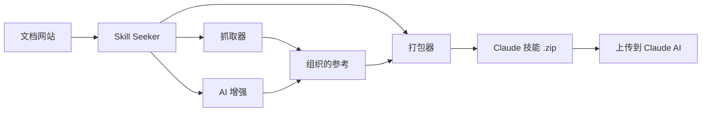

[](https://mseep.ai/app/yusufkaraaslan-skill-seekers)

# Skill Seeker

[English](https://github.com/yusufkaraaslan/Skill_Seekers/blob/main/README.md) | 简体中文

> ⚠️ **机器翻译声明**
>
> 本文档由 AI 自动翻译生成。虽然我们努力确保翻译质量，但可能存在不准确或不自然的表述。
>
> 欢迎通过 [GitHub Issue #260](https://github.com/yusufkaraaslan/Skill_Seekers/issues/260) 帮助改进翻译！您的反馈对我们非常宝贵。

[](https://github.com/yusufkaraaslan/Skill_Seekers/releases/tag/v2.7.4)
[](https://opensource.org/licenses/MIT)
[](https://www.python.org/downloads/)
[](https://modelcontextprotocol.io)
[](tests/)
[](https://github.com/users/yusufkaraaslan/projects/2)
[](https://pypi.org/project/skill-seekers/)
[](https://pypi.org/project/skill-seekers/)
[](https://pypi.org/project/skill-seekers/)
[](https://skillseekersweb.com/)
[](https://x.com/_yUSyUS_)
[](https://github.com/yusufkaraaslan/Skill_Seekers)

**几分钟内自动将文档网站、GitHub 仓库和 PDF 文件转换为 Claude AI 技能。**

> 🌐 **[访问 SkillSeekersWeb.com](https://skillseekersweb.com/)** - 浏览 24+ 个预设配置，分享您的配置，访问完整文档！

> 📋 **[查看开发路线图和任务](https://github.com/users/yusufkaraaslan/projects/2)** - 10 个类别的 134 个任务，选择任意一个参与贡献！

## 什么是 Skill Seeker？

Skill Seeker 是一个自动化工具，可将文档网站、GitHub 仓库和 PDF 文件转换为生产就绪的 [Claude AI 技能](https://www.anthropic.com/news/skills)。无需手动阅读和总结文档，Skill Seeker 可以：

1. **抓取**多个来源（文档、GitHub 仓库、PDF）的内容
2. **分析**代码仓库，进行深度 AST 解析
3. **检测**文档和代码实现之间的冲突
4. **组织**内容到分类的参考文件中
5. **增强**使用 AI 提取最佳示例和关键概念
6. **打包**所有内容为可上传的 `.zip` 文件供 Claude 使用

**结果：**20-40 分钟内获得任何框架、API 或工具的全面 Claude 技能，而不是数小时的手动工作。

## 为什么使用 Skill Seeker？

- 🎯 **面向开发者**：从文档 + GitHub 仓库创建技能，带冲突检测
- 🎮 **面向游戏开发者**：为游戏引擎生成技能（Godot 文档 + GitHub、Unity 等）
- 🔧 **面向团队**：将内部文档 + 代码仓库合并为单一真相来源
- 📚 **面向学习者**：从文档、代码示例和 PDF 构建全面技能
- 🔍 **面向开源项目**：分析仓库以发现文档空白和过时示例

## 核心功能

### 🌐 文档抓取
- ✅ **llms.txt 支持** - 自动检测并使用 LLM 就绪的文档文件（快 10 倍）
- ✅ **通用抓取器** - 适用于任何文档网站
- ✅ **智能分类** - 自动按主题组织内容
- ✅ **代码语言检测** - 识别 Python、JavaScript、C++、GDScript 等
- ✅ **8 个开箱即用的预设** - Godot、React、Vue、Django、FastAPI 等

### 📄 PDF 支持 (**v1.2.0**)
- ✅ **基础 PDF 提取** - 从 PDF 文件提取文本、代码和图像
- ✅ **扫描 PDF 的 OCR** - 从扫描文档提取文本
- ✅ **密码保护的 PDF** - 处理加密 PDF
- ✅ **表格提取** - 从 PDF 提取复杂表格
- ✅ **并行处理** - 大型 PDF 快 3 倍
- ✅ **智能缓存** - 重复运行快 50%

### 🐙 GitHub 仓库抓取 (**v2.0.0**)
- ✅ **深度代码分析** - 对 Python、JavaScript、TypeScript、Java、C++、Go 进行 AST 解析
- ✅ **API 提取** - 提取函数、类、方法及其参数和类型
- ✅ **仓库元数据** - README、文件树、语言分布、星标/fork 数
- ✅ **GitHub Issues 和 PR** - 获取带标签和里程碑的开放/关闭问题
- ✅ **CHANGELOG 和发布** - 自动提取版本历史
- ✅ **冲突检测** - 比较文档 API 与实际代码实现
- ✅ **MCP 集成** - 自然语言：「抓取 GitHub 仓库 facebook/react」

### 🔄 统一多源抓取 (**全新 - v2.0.0**)
- ✅ **组合多个来源** - 在一个技能中混合文档 + GitHub + PDF
- ✅ **冲突检测** - 自动发现文档和代码之间的差异
- ✅ **智能合并** - 基于规则或 AI 驱动的冲突解决
- ✅ **透明报告** - 并排比较，带 ⚠️ 警告
- ✅ **文档差距分析** - 识别过时文档和未记录的功能
- ✅ **单一真相来源** - 一个技能同时显示意图（文档）和现实（代码）
- ✅ **向后兼容** - 旧版单源配置仍然有效

### 🤖 多 LLM 平台支持 (**全新 - v2.5.0**)
- ✅ **4 个 LLM 平台** - Claude AI、Google Gemini、OpenAI ChatGPT、通用 Markdown
- ✅ **通用抓取** - 相同文档适用于所有平台
- ✅ **平台特定打包** - 为每个 LLM 优化的格式
- ✅ **一键导出** - `--target` 标志选择平台
- ✅ **可选依赖** - 只安装您需要的
- ✅ **100% 向后兼容** - 现有 Claude 工作流程不变

| 平台 | 格式 | 上传 | 增强 | API 密钥 |
|----------|--------|--------|-------------|---------|
| **Claude AI** | ZIP + YAML | ✅ 自动 | ✅ 是 | ANTHROPIC_API_KEY |
| **Google Gemini** | tar.gz | ✅ 自动 | ✅ 是 | GOOGLE_API_KEY |
| **OpenAI ChatGPT** | ZIP + Vector Store | ✅ 自动 | ✅ 是 | OPENAI_API_KEY |
| **通用 Markdown** | ZIP | ❌ 手动 | ❌ 否 | 无 |

```bash
# Claude（默认 - 无需更改！）
skill-seekers package output/react/
skill-seekers upload react.zip

# Google Gemini
pip install skill-seekers[gemini]
skill-seekers package output/react/ --target gemini
skill-seekers upload react-gemini.tar.gz --target gemini

# OpenAI ChatGPT
pip install skill-seekers[openai]
skill-seekers package output/react/ --target openai
skill-seekers upload react-openai.zip --target openai

# 通用 Markdown（通用导出）
skill-seekers package output/react/ --target markdown
# 直接在任何 LLM 中使用 markdown 文件
```

**安装：**
```bash
# 安装 Gemini 支持
pip install skill-seekers[gemini]

# 安装 OpenAI 支持
pip install skill-seekers[openai]

# 安装所有 LLM 平台
pip install skill-seekers[all-llms]
```

### 🌊 三流 GitHub 架构 (**全新 - v2.6.0**)
- ✅ **三流分析** - 将 GitHub 仓库拆分为代码、文档和洞察流
- ✅ **统一代码库分析器** - 同时支持 GitHub URL 和本地路径
- ✅ **C3.x 作为分析深度** - 选择「基本」（1-2 分钟）或「c3x」（20-60 分钟）分析
- ✅ **增强路由生成** - GitHub 元数据、README 快速入门、常见问题
- ✅ **问题集成** - 来自 GitHub 问题的热门问题和解决方案
- ✅ **智能路由关键词** - GitHub 标签权重 2 倍，更好的主题检测
- ✅ **81 个测试通过** - 全面的端到端验证（0.44 秒）

**三流解释：**
- **流 1：代码** - 深度 C3.x 分析（模式、示例、指南、配置、架构）
- **流 2：文档** - 仓库文档（README、CONTRIBUTING、docs/*.md）
- **流 3：洞察** - 社区知识（问题、标签、星标、fork）

```python
from skill_seekers.cli.unified_codebase_analyzer import UnifiedCodebaseAnalyzer

# 使用所有三个流分析 GitHub 仓库
analyzer = UnifiedCodebaseAnalyzer()
result = analyzer.analyze(
    source="https://github.com/facebook/react",
    depth="c3x",  # 或 "basic" 进行快速分析
    fetch_github_metadata=True
)

# 访问代码流（C3.x 分析）
print(f"设计模式: {len(result.code_analysis['c3_1_patterns'])}")
print(f"测试示例: {result.code_analysis['c3_2_examples_count']}")

# 访问文档流（仓库文档）
print(f"README: {result.github_docs['readme'][:100]}")

# 访问洞察流（GitHub 元数据）
print(f"星标: {result.github_insights['metadata']['stars']}")
print(f"常见问题: {len(result.github_insights['common_problems'])}")
```

**查看完整文档**：[三流实现摘要](docs/IMPLEMENTATION_SUMMARY_THREE_STREAM.md)

### 🔐 智能速率限制管理和配置 (**全新 - v2.7.0**)
- ✅ **多令牌配置系统** - 管理多个 GitHub 账户（个人、工作、开源）
  - 安全配置存储在 `~/.config/skill-seekers/config.json`（600 权限）
  - 每个配置文件的速率限制策略：`prompt`、`wait`、`switch`、`fail`
  - 每个配置文件可配置超时（默认：30 分钟，防止无限等待）
  - 智能回退链：CLI 参数 → 环境变量 → 配置文件 → 提示
  - Claude、Gemini、OpenAI 的 API 密钥管理
- ✅ **交互式配置向导** - 美观的终端 UI，便于设置
  - 浏览器集成用于令牌创建（自动打开 GitHub 等）
  - 令牌验证和连接测试
  - 带颜色编码的可视状态显示
- ✅ **智能速率限制处理器** - 不再无限等待！
  - 关于速率限制的前期警告（60/小时 vs 5000/小时）
  - 从 GitHub API 响应实时检测
  - 带进度的实时倒计时器
  - 速率受限时自动切换配置文件
  - 四种策略：prompt（询问）、wait（倒计时）、switch（尝试另一个）、fail（中止）
- ✅ **恢复能力** - 继续中断的任务
  - 以可配置的间隔自动保存进度（默认：60 秒）
  - 列出所有可恢复的任务及进度详情
  - 自动清理旧任务（默认：7 天）
- ✅ **CI/CD 支持** - 用于自动化的非交互模式
  - `--non-interactive` 标志快速失败，无提示
  - `--profile` 标志选择特定 GitHub 账户
  - 清晰的管道日志错误消息
  - 自动化集成的退出代码

**快速设置：**
```bash
# 一次性配置（5 分钟）
skill-seekers config --github

# 添加多个 GitHub 配置文件
skill-seekers config
# → 选择「1. GitHub Token Setup」
# → 为个人、工作、开源账户添加配置文件

# 为私有仓库使用特定配置文件
skill-seekers github --repo mycompany/private-repo --profile work

# CI/CD 模式（快速失败，无提示）
skill-seekers github --repo owner/repo --non-interactive

# 查看当前配置
skill-seekers config --show

# 测试连接
skill-seekers config --test

# 恢复中断的任务
skill-seekers resume --list
skill-seekers resume github_react_20260117_143022
```

**速率限制策略解释：**
- **prompt**（默认）- 速率受限时询问要做什么（等待、切换、设置令牌、取消）
- **wait** - 自动等待倒计时器（遵守超时）
- **switch** - 自动尝试下一个可用配置文件（用于多账户设置）
- **fail** - 立即失败并显示清晰错误（完美适用于 CI/CD）

**查看完整文档**：[配置指南](docs/guides/CONFIGURATION.md)（即将推出）

### 🎯 Bootstrap 技能 - 自托管 (**全新 - v2.7.0**)

将 skill-seekers 生成为 Claude Code 技能，以便在 Claude 中使用：

```bash
# 生成技能
./scripts/bootstrap_skill.sh

# 安装到 Claude Code
cp -r output/skill-seekers ~/.claude/skills/

# 验证
ls ~/.claude/skills/skill-seekers/SKILL.md
```

**您将获得：**
- ✅ **完整的技能文档** - 所有 CLI 命令和使用模式
- ✅ **CLI 命令参考** - 记录的每个工具及其选项
- ✅ **快速入门示例** - 常见工作流程和最佳实践
- ✅ **自动生成的 API 文档** - 代码分析、模式和示例
- ✅ **健壮的验证** - 检查 YAML frontmatter 和必需字段
- ✅ **一键 bootstrap** - 将手动标题与自动生成的分析相结合

**工作原理：**
1. 对 skill-seekers 本身运行代码库分析（dogfooding！）
2. 将手工制作的标题（先决条件、命令）与自动生成的内容相结合
3. 验证 SKILL.md 结构（frontmatter、必需字段）
4. 输出即用型技能目录

**结果：**使用 skill-seekers 在 Claude Code 中创建技能！

### 🔐 私有配置仓库 (**全新 - v2.2.0**)
- ✅ **基于 Git 的配置源** - 从私有/团队 git 仓库获取配置
- ✅ **多源管理** - 注册无限的 GitHub、GitLab、Bitbucket 仓库
- ✅ **团队协作** - 在 3-5 人团队之间共享自定义配置
- ✅ **企业支持** - 扩展到 500+ 开发人员，基于优先级的解析
- ✅ **安全认证** - 环境变量令牌（GITHUB_TOKEN、GITLAB_TOKEN）
- ✅ **智能缓存** - 克隆一次，自动拉取更新
- ✅ **离线模式** - 离线时使用缓存的配置
- ✅ **向后兼容** - 现有基于 API 的配置仍然有效

### 🤖 代码库分析和 AI 增强 (**C3.x - 全新！**)

**C3.4：配置模式提取与 AI 增强**
- ✅ **9 种配置格式** - JSON、YAML、TOML、ENV、INI、Python、JavaScript、Dockerfile、Docker Compose
- ✅ **7 种模式类型** - 数据库、API、日志、缓存、电子邮件、身份验证、服务器配置
- ✅ **AI 增强（全新！）** - 可选的双模式 AI 分析（API + LOCAL，如 C3.3）
  - 解释每个配置的作用
  - 建议最佳实践和改进
  - **安全分析** - 查找硬编码的秘密、暴露的凭据
  - 迁移建议 - 整合机会
  - 上下文感知文档
- ✅ **自动文档** - 生成所有配置的 JSON + Markdown 文档
- ✅ **类型推断** - 自动检测设置类型和环境变量
- ✅ **MCP 集成** - 带增强支持的 `extract_config_patterns` 工具

**C3.3：AI 增强的操作指南**
- ✅ **全面的 AI 增强** - 将基础指南（⭐⭐）转变为专业教程（⭐⭐⭐⭐⭐）
- ✅ **5 项自动改进** - 步骤描述、故障排除、先决条件、后续步骤、用例
- ✅ **双模式支持** - API 模式（Claude API）或 LOCAL 模式（Claude Code CLI）
- ✅ **使用 LOCAL 模式无 API 成本** - 使用您的 Claude Code Max 计划免费增强
- ✅ **质量转变** - 75 行模板 → 500+ 行全面指南

**增强内容：**
- 🔍 **步骤描述** - 自然语言解释（不仅仅是语法！）
- 🔧 **故障排除** - 常见错误的诊断流程 + 解决方案
- 📋 **先决条件** - 为什么需要 + 设置说明
- 🔗 **后续步骤** - 相关指南、变体、学习路径
- 💡 **用例** - 显示何时使用指南的真实场景

**用法：**
```bash
# AUTO 模式（默认）- 自动检测最佳选项
skill-seekers-codebase tests/ --build-how-to-guides --ai-mode auto

# API 模式 - 快速、高效（需要 ANTHROPIC_API_KEY）
skill-seekers-codebase tests/ --build-how-to-guides --ai-mode api

# LOCAL 模式 - 使用 Claude Code Max 免费（无需 API 密钥）
skill-seekers-codebase tests/ --build-how-to-guides --ai-mode local

# 禁用增强 - 仅基础指南
skill-seekers-codebase tests/ --build-how-to-guides --ai-mode none
```

**完整文档：**[docs/HOW_TO_GUIDES.md](docs/HOW_TO_GUIDES.md#ai-enhancement-new)

### ⚡ 性能和规模
- ✅ **异步模式** - 使用 async/await 实现 2-3 倍更快的抓取（使用 `--async` 标志）
- ✅ **大型文档支持** - 使用智能拆分处理 10K-40K+ 页文档
- ✅ **路由/中心技能** - 智能路由到专门的子技能
- ✅ **并行抓取** - 同时处理多个技能
- ✅ **检查点/恢复** - 长时间抓取时永不丢失进度
- ✅ **缓存系统** - 抓取一次，即时重建

### ✅ 质量保证
- ✅ **完全测试** - 1200+ 个测试，全面覆盖

---

## 📦 现已在 PyPI 上提供！

**Skill Seekers 现已发布在 Python 包索引上！**一键安装：

```bash
pip install skill-seekers
```

### 安装选项

根据您需要的功能选择安装配置文件：

```bash
# 1️⃣ 仅 CLI（技能生成）
pip install skill-seekers

# 功能：
# • 抓取文档网站
# • 分析 GitHub 仓库
# • 从 PDF 提取
# • 为所有平台打包技能

# 2️⃣ MCP 集成（Claude Code、Cursor、Windsurf）
pip install skill-seekers[mcp]

# 功能：
# • 仅 CLI 的所有功能
# • Claude Code 的 MCP 服务器
# • 一键技能安装
# • HTTP/stdio 传输模式

# 3️⃣ 多 LLM 支持（Gemini、OpenAI）
pip install skill-seekers[all-llms]

# 功能：
# • 仅 CLI 的所有功能
# • Google Gemini 支持
# • OpenAI ChatGPT 支持
# • 增强的 AI 功能

# 4️⃣ 全部功能
pip install skill-seekers[all]

# 功能：
# • 所有功能启用
# • 最大灵活性
```

**需要帮助选择？**运行设置向导：
```bash
skill-seekers-setup
```

该向导显示所有选项及详细功能列表，并指导您完成配置。

几秒钟即可开始。无需克隆，无需设置 - 只需安装并运行。请参阅下面的安装选项。

---

## 快速开始

### 选项 1：从 PyPI 安装（推荐）

```bash
# 从 PyPI 安装（最简单的方法！）
pip install skill-seekers

# 使用统一 CLI
skill-seekers scrape --config configs/react.json
skill-seekers github --repo facebook/react
skill-seekers enhance output/react/
skill-seekers package output/react/
```

**时间：**约 25 分钟 | **质量：**生产就绪 | **成本：**免费

📖 **Skill Seekers 新手？**查看我们的[快速入门指南](QUICKSTART.md)或[保证指南](BULLETPROOF_QUICKSTART.md)

### 选项 2：通过 uv 安装（现代 Python 工具）

```bash
# 使用 uv 安装（快速、现代的替代方案）
uv tool install skill-seekers

# 或直接运行而不安装
uv tool run --from skill-seekers skill-seekers scrape --config https://raw.githubusercontent.com/yusufkaraaslan/Skill_Seekers/main/configs/react.json

# 统一 CLI - 简单命令
skill-seekers scrape --config configs/react.json
skill-seekers github --repo facebook/react
skill-seekers package output/react/
```

**时间：**约 25 分钟 | **质量：**生产就绪 | **成本：**免费

### 选项 3：开发安装（从源代码）

```bash
# 克隆并以可编辑模式安装
git clone https://github.com/yusufkaraaslan/Skill_Seekers.git
cd Skill_Seekers
pip install -e .

# 使用统一 CLI
skill-seekers scrape --config configs/react.json
```

### 选项 4：从 Claude Code 和其他 4 个 AI 代理使用（MCP 集成）

```bash
# 一次性设置（5 分钟）- 自动配置 5 个 AI 代理！
./setup_mcp.sh

# 然后在 Claude Code、Cursor、Windsurf、VS Code + Cline 或 IntelliJ IDEA 中，只需问：
"从 https://react.dev/ 生成 React 技能"
"抓取 docs/manual.pdf 的 PDF 并创建技能"
```

**时间：**自动化 | **质量：**生产就绪 | **成本：**免费

**v2.4.0 全新：**MCP 服务器现在支持 5 个 AI 编码代理，带自动配置！

### 选项 5：旧版 CLI（向后兼容）

```bash
# 安装依赖
pip3 install requests beautifulsoup4

# 直接运行脚本（旧方法）
python3 src/skill_seekers/cli/doc_scraper.py --config configs/react.json

# 上传 output/react.zip 到 Claude - 完成！
```

**时间：**约 25 分钟 | **质量：**生产就绪 | **成本：**免费

---

## 🚀 **全新！**一键安装工作流程 (v2.1.1)

**从配置到上传技能的最快方式 - 完全自动化：**

```bash
# 从官方配置安装 React 技能（自动上传到 Claude）
skill-seekers install --config react

# 从本地配置文件安装
skill-seekers install --config configs/custom.json

# 不上传安装（仅打包）
skill-seekers install --config django --no-upload

# 无限抓取（无页面限制）
skill-seekers install --config godot --unlimited

# 预览工作流程而不执行
skill-seekers install --config react --dry-run
```

**时间：**总共 20-45 分钟 | **质量：**生产就绪（9/10）| **成本：**免费

### 它自动执行的操作：

1. ✅ **获取配置**（如果提供配置名称）
2. ✅ **抓取文档**（遵守速率限制，处理分页）
3. ✅ **AI 增强（强制性）** - 30-60 秒，质量从 3/10 提升到 9/10
4. ✅ **打包技能**为 .zip 文件
5. ✅ **上传到 Claude**（如果设置了 ANTHROPIC_API_KEY）

### 为什么使用这个？

- **零摩擦** - 一个命令代替 5 个单独的步骤
- **质量保证** - 增强是强制性的，确保专业输出
- **完全自动化** - 从配置名称到 Claude 中上传的技能
- **节省时间** - 完全自动化的端到端工作流程

### 执行的阶段：

```
📥 阶段 1：获取配置（如果提供配置名称）
📖 阶段 2：抓取文档
✨ 阶段 3：AI 增强（强制性 - 无跳过选项）
📦 阶段 4：打包技能
☁️  阶段 5：上传到 Claude（可选，需要 API 密钥）
```

**要求：**
- ANTHROPIC_API_KEY 环境变量（用于自动上传）
- Claude Code Max 计划（用于本地 AI 增强）

**示例：**
```bash
# 一次性设置 API 密钥
export ANTHROPIC_API_KEY=sk-ant-your-key-here

# 运行一个命令 - 坐下来放松！
skill-seekers install --config react

# 结果：20-45 分钟内 React 技能上传到 Claude
```

---

## 📊 功能矩阵

Skill Seekers 支持 **4 个平台**和 **5 种技能模式**，具有完整的功能对等性。

**平台：**Claude AI、Google Gemini、OpenAI ChatGPT、通用 Markdown
**技能模式：**文档、GitHub、PDF、统一多源、本地仓库

查看[完整功能矩阵](docs/FEATURE_MATRIX.md)了解详细的平台和功能支持。

### 快速平台比较

| 功能 | Claude | Gemini | OpenAI | Markdown |
|---------|--------|--------|--------|----------|
| 格式 | ZIP + YAML | tar.gz | ZIP + Vector | ZIP |
| 上传 | ✅ API | ✅ API | ✅ API | ❌ 手动 |
| 增强 | ✅ Sonnet 4 | ✅ 2.0 Flash | ✅ GPT-4o | ❌ 无 |
| 所有技能模式 | ✅ | ✅ | ✅ | ✅ |

**示例：**
```bash
# 为所有平台打包（相同技能）
skill-seekers package output/react/ --target claude
skill-seekers package output/react/ --target gemini
skill-seekers package output/react/ --target openai
skill-seekers package output/react/ --target markdown

# 为特定平台安装
skill-seekers install --config django --target gemini
skill-seekers install --config fastapi --target openai
```

---

## 使用示例

### 文档抓取

```bash
# 抓取文档网站
skill-seekers scrape --config configs/react.json

# 无配置快速抓取
skill-seekers scrape --url https://react.dev --name react

# 使用异步模式（快 3 倍）
skill-seekers scrape --config configs/godot.json --async --workers 8
```

### PDF 提取

```bash
# 基础 PDF 提取
skill-seekers pdf --pdf docs/manual.pdf --name myskill

# 高级功能
skill-seekers pdf --pdf docs/manual.pdf --name myskill \
    --extract-tables \        # 提取表格
    --parallel \              # 快速并行处理
    --workers 8               # 使用 8 个 CPU 核心

# 扫描的 PDF（需要：pip install pytesseract Pillow）
skill-seekers pdf --pdf docs/scanned.pdf --name myskill --ocr

# 密码保护的 PDF
skill-seekers pdf --pdf docs/encrypted.pdf --name myskill --password mypassword
```

**时间：**约 5-15 分钟（或使用并行处理 2-5 分钟）| **质量：**生产就绪 | **成本：**免费

### GitHub 仓库抓取

```bash
# 基础仓库抓取
skill-seekers github --repo facebook/react

# 使用配置文件
skill-seekers github --config configs/react_github.json

# 使用身份验证（更高速率限制）
export GITHUB_TOKEN=ghp_your_token_here
skill-seekers github --repo facebook/react

# 自定义要包含的内容
skill-seekers github --repo django/django \
    --include-issues \        # 提取 GitHub Issues
    --max-issues 100 \        # 限制问题数量
    --include-changelog \     # 提取 CHANGELOG.md
    --include-releases        # 提取 GitHub Releases
```

**时间：**约 5-10 分钟 | **质量：**生产就绪 | **成本：**免费

### 统一多源抓取 (**全新 - v2.0.0**)

**问题：**文档和代码经常分离。文档可能过时，缺少代码中存在的功能，或记录已删除的功能。

**解决方案：**将文档 + GitHub + PDF 组合成一个统一的技能，显示记录的内容和实际存在的内容，并对差异发出明确警告。

```bash
# 使用现有的统一配置
skill-seekers unified --config configs/react_unified.json
skill-seekers unified --config configs/django_unified.json

# 或创建统一配置（混合文档 + GitHub）
cat > configs/myframework_unified.json << 'EOF'
{
  "name": "myframework",
  "description": "来自文档 + 代码的完整框架知识",
  "merge_mode": "rule-based",
  "sources": [
    {
      "type": "documentation",
      "base_url": "https://docs.myframework.com/",
      "extract_api": true,
      "max_pages": 200
    },
    {
      "type": "github",
      "repo": "owner/myframework",
      "include_code": true,
      "code_analysis_depth": "surface"
    }
  ]
}
EOF

# 运行统一抓取器
skill-seekers unified --config configs/myframework_unified.json

# 打包和上传
skill-seekers package output/myframework/
# 上传 output/myframework.zip 到 Claude - 完成！
```

**时间：**约 30-45 分钟 | **质量：**生产就绪，带冲突检测 | **成本：**免费

**特别之处：**

✅ **冲突检测** - 自动发现 4 种差异类型：
- 🔴 **代码中缺失**（高）：已记录但未实现
- 🟡 **文档中缺失**（中）：已实现但未记录
- ⚠️ **签名不匹配**：不同的参数/类型
- ℹ️ **描述不匹配**：不同的解释

✅ **透明报告** - 并排显示两个版本：
```markdown
#### `move_local_x(delta: float)`

⚠️ **冲突**：文档签名与实现不同

**文档说明：**
```
def move_local_x(delta: float)
```

**代码实现：**
```python
def move_local_x(delta: float, snap: bool = False) -> None
```
```

✅ **优势：**
- **识别文档差距** - 自动查找过时或缺失的文档
- **捕获代码更改** - 了解 API 何时更改而文档未更新
- **单一真相来源** - 一个技能显示意图（文档）和现实（代码）
- **可操作的见解** - 获得修复每个冲突的建议
- **开发辅助** - 查看代码库中实际存在的内容与记录的内容

**示例统一配置：**
- `configs/react_unified.json` - React 文档 + GitHub 仓库
- `configs/django_unified.json` - Django 文档 + GitHub 仓库
- `configs/fastapi_unified.json` - FastAPI 文档 + GitHub 仓库

**完整指南：**请参阅 [docs/UNIFIED_SCRAPING.md](docs/UNIFIED_SCRAPING.md) 获取完整文档。

### 私有配置仓库 (**全新 - v2.2.0**)

**问题：**团队需要共享内部文档的自定义配置，但不想公开发布。

**解决方案：**将私有 git 仓库注册为配置源。从团队仓库获取配置，就像公共 API 一样，完全支持身份验证。

```bash
# 设置：设置您的 GitHub 令牌（一次性）
export GITHUB_TOKEN=ghp_your_token_here

# 选项 1：使用 MCP 工具（推荐）
# 注册您团队的私有仓库
add_config_source(
    name="team",
    git_url="https://github.com/mycompany/skill-configs.git",
    token_env="GITHUB_TOKEN"
)

# 从团队仓库获取配置
fetch_config(source="team", config_name="internal-api")

# 列出所有注册的源
list_config_sources()

# 不再需要时删除源
remove_config_source(name="team")
```

**直接 Git URL 模式**（无需注册）：
```bash
# 直接从 git URL 获取
fetch_config(
    git_url="https://github.com/mycompany/configs.git",
    config_name="react-custom",
    token="ghp_your_token_here"
)
```

**支持的平台：**
- GitHub（令牌环境变量：`GITHUB_TOKEN`）
- GitLab（令牌环境变量：`GITLAB_TOKEN`）
- Gitea（令牌环境变量：`GITEA_TOKEN`）
- Bitbucket（令牌环境变量：`BITBUCKET_TOKEN`）
- 任何 git 服务器（令牌环境变量：`GIT_TOKEN`）

**用例：**

📋 **小团队（3-5 人）**
```bash
# 团队负责人创建仓库
gh repo create myteam/skill-configs --private

# 将配置添加到仓库
cd myteam-skill-configs
cp ../Skill_Seekers/configs/react.json ./react-custom.json
# 为您的内部文档编辑选择器、类别...
git add . && git commit -m "Add custom React config" && git push

# 团队成员注册（一次性）
add_config_source(name="team", git_url="https://github.com/myteam/skill-configs.git")

# 每个人现在都可以获取
fetch_config(source="team", config_name="react-custom")
```

🏢 **企业（500+ 开发人员）**
```bash
# IT 为所有人预配置源
add_config_source(name="platform", git_url="gitlab.company.com/platform/configs", priority=1)
add_config_source(name="mobile", git_url="gitlab.company.com/mobile/configs", priority=2)
add_config_source(name="official", git_url="api.skillseekersweb.com", priority=3)

# 开发人员透明使用
fetch_config(config_name="internal-platform")  # 在平台源中查找
fetch_config(config_name="react")              # 回退到官方 API
```

**存储位置：**
- 注册表：`~/.skill-seekers/sources.json`
- 缓存：`$SKILL_SEEKERS_CACHE_DIR`（默认：`~/.skill-seekers/cache/`）

**功能：**
- ✅ **浅克隆** - 快 10-50 倍，最小磁盘空间
- ✅ **自动拉取** - 自动获取最新更改
- ✅ **离线模式** - 离线时使用缓存的仓库
- ✅ **优先级解析** - 具有冲突解决的多个源
- ✅ **安全** - 仅通过环境变量的令牌

**示例团队仓库：**

尝试包含的示例：
```bash
# 使用 file:// URL 测试（无需身份验证）
cd /path/to/Skill_Seekers

# 运行端到端测试
python3 configs/example-team/test_e2e.py

# 或手动测试
add_config_source(
    name="example",
    git_url="file://$(pwd)/configs/example-team",
    branch="master"
)

fetch_config(source="example", config_name="react-custom")
```

**完整指南：**请参阅 [docs/GIT_CONFIG_SOURCES.md](docs/GIT_CONFIG_SOURCES.md) 获取完整文档。

## 工作原理



0. **检测 llms.txt** - 首先检查 llms-full.txt、llms.txt、llms-small.txt
1. **抓取**：从文档中提取所有页面
2. **分类**：将内容组织到主题中（API、指南、教程等）
3. **增强**：AI 分析文档并创建带示例的全面 SKILL.md
4. **打包**：将所有内容捆绑到 Claude 就绪的 `.zip` 文件中

## 📋 先决条件

**开始之前，请确保您有：**

1. **Python 3.10 或更高版本** - [下载](https://www.python.org/downloads/) | 检查：`python3 --version`
2. **Git** - [下载](https://git-scm.com/) | 检查：`git --version`
3. **15-30 分钟**用于首次设置

**首次使用？** → **[从这里开始：保证快速入门指南](BULLETPROOF_QUICKSTART.md)** 🎯

本指南逐步引导您完成所有操作（Python 安装、git clone、首次技能创建）。

---

## 🚀 快速开始

### 方法 1：5 个 AI 代理的 MCP 服务器（最简单 - **全新 v2.4.0！**）

直接从 **Claude Code、Cursor、Windsurf、VS Code + Cline 或 IntelliJ IDEA** 使用自然语言使用 Skill Seeker！

```bash
# 克隆仓库
git clone https://github.com/yusufkaraaslan/Skill_Seekers.git
cd Skill_Seekers

# 一次性设置（5 分钟）- 自动配置所有 5 个代理！
./setup_mcp.sh

# 重启您的 AI 代理，然后只需问：
```

**在 Claude Code、Cursor、Windsurf、VS Code + Cline 或 IntelliJ IDEA 中：**
```
列出所有可用配置
为 Tailwind 在 https://tailwindcss.com/docs 生成配置
使用 configs/react.json 抓取文档
在 output/react/ 打包技能
```

**优势：**
- ✅ 无需手动 CLI 命令
- ✅ 自然语言界面
- ✅ 与您的工作流程集成
- ✅ **18 个工具**即时可用（从 9 个增加！）
- ✅ **支持 5 个 AI 代理** - 一个命令自动配置
- ✅ **经测试并在生产中工作**

**v2.4.0 全新：**
- ✅ **升级到 MCP SDK v1.25.0** - 最新功能和性能
- ✅ **FastMCP 框架** - 现代、可维护的 MCP 实现
- ✅ **HTTP + stdio 传输** - 适用于更多 AI 代理
- ✅ **18 个工具**（从 9 个增加）- 更多功能
- ✅ **多代理自动配置** - 一个命令设置所有代理

**完整指南：**
- 📘 [MCP 设置指南](docs/MCP_SETUP.md) - 完整安装说明
- 🧪 [MCP 测试指南](docs/TEST_MCP_IN_CLAUDE_CODE.md) - 测试所有 18 个工具
- 📦 [大型文档指南](docs/LARGE_DOCUMENTATION.md) - 处理 10K-40K+ 页
- 📤 [上传指南](docs/UPLOAD_GUIDE.md) - 如何上传技能到 Claude

### 方法 2：CLI（传统）

#### 一次性设置：创建虚拟环境

```bash
# 克隆仓库
git clone https://github.com/yusufkaraaslan/Skill_Seekers.git
cd Skill_Seekers

# 创建虚拟环境
python3 -m venv venv

# 激活虚拟环境
source venv/bin/activate  # macOS/Linux
# 或在 Windows 上：venv\Scripts\activate

# 安装依赖
pip install requests beautifulsoup4 pytest

# 保存依赖
pip freeze > requirements.txt

# 可选：安装 anthropic 用于基于 API 的增强（LOCAL 增强不需要）
# pip install anthropic
```

**在使用 Skill Seeker 之前始终激活虚拟环境：**
```bash
source venv/bin/activate  # 每次启动新终端会话时运行此命令
```

#### 最简单：使用预设

```bash
# 确保 venv 已激活（您应该在提示中看到 (venv)）
source venv/bin/activate

# 可选：首先估计页面（快速，1-2 分钟）
skill-seekers estimate configs/godot.json

# 使用 Godot 预设
skill-seekers scrape --config configs/godot.json

# 使用 React 预设
skill-seekers scrape --config configs/react.json

# 查看所有预设
ls configs/
```

### 交互模式

```bash
skill-seekers scrape --interactive
```

### 快速模式

```bash
skill-seekers scrape \
  --name react \
  --url https://react.dev/ \
  --description "用于 UI 的 React 框架"
```

## 📤 上传技能到 Claude

打包技能后，您需要将其上传到 Claude：

### 选项 1：自动上传（基于 API）

```bash
# 设置您的 API 密钥（一次性）
export ANTHROPIC_API_KEY=sk-ant-...

# 自动打包和上传
skill-seekers package output/react/ --upload

# 或上传现有的 .zip
skill-seekers upload output/react.zip
```

**优势：**
- ✅ 完全自动
- ✅ 无需手动步骤
- ✅ 从命令行工作

**要求：**
- Anthropic API 密钥（从 https://console.anthropic.com/ 获取）

### 选项 2：手动上传（无需 API 密钥）

```bash
# 打包技能
skill-seekers package output/react/

# 这将：
# 1. 创建 output/react.zip
# 2. 自动打开 output/ 文件夹
# 3. 显示上传说明

# 然后手动上传：
# - 转到 https://claude.ai/skills
# - 点击「上传技能」
# - 选择 output/react.zip
# - 完成！
```

**优势：**
- ✅ 无需 API 密钥
- ✅ 适用于所有人
- ✅ 文件夹自动打开

### 选项 3：Claude Code（MCP）- 智能且自动

```
在 Claude Code 中，只需问：
"打包并上传 React 技能"

# 如果设置了 API 密钥：
# - 打包技能
# - 自动上传到 Claude
# - 完成！✅

# 没有 API 密钥：
# - 打包技能
# - 显示 .zip 的位置
# - 提供手动上传说明
```

**优势：**
- ✅ 自然语言
- ✅ 智能自动检测（如果有 API 密钥则上传）
- ✅ 有或没有 API 密钥都可以工作
- ✅ 无错误或失败

---

## 🤖 安装到 AI 代理

Skill Seekers 可以自动将技能安装到 10+ 个 AI 编码代理。

### 快速开始

```bash
# 安装到特定代理
skill-seekers install-agent output/react/ --agent cursor

# 一次性安装到所有代理
skill-seekers install-agent output/react/ --agent all

# 覆盖现有安装
skill-seekers install-agent output/react/ --agent claude --force

# 预览而不安装
skill-seekers install-agent output/react/ --agent cursor --dry-run
```

### 支持的代理

| 代理 | 路径 | 类型 |
|-------|------|------|
| **Claude Code** | `~/.claude/skills/` | 全局 |
| **Cursor** | `.cursor/skills/` | 项目 |
| **VS Code / Copilot** | `.github/skills/` | 项目 |
| **Amp** | `~/.amp/skills/` | 全局 |
| **Goose** | `~/.config/goose/skills/` | 全局 |
| **OpenCode** | `~/.opencode/skills/` | 全局 |
| **Letta** | `~/.letta/skills/` | 全局 |
| **Aide** | `~/.aide/skills/` | 全局 |
| **Windsurf** | `~/.windsurf/skills/` | 全局 |
| **Neovate Code** | `~/.neovate/skills/` | 全局 |

**全局路径**安装到用户的主目录（~/）。
**项目路径**安装到当前项目的根目录。

### 完整工作流程

```bash
# 1. 抓取文档
skill-seekers scrape --config configs/react.json --enhance-local

# 2. 打包技能
skill-seekers package output/react/

# 3. 安装到您的代理
skill-seekers install-agent output/react/ --agent cursor

# 4. 重启 Cursor 以加载技能
```

---

## 🤖 多代理 MCP 支持（v2.4.0 全新）

**Skill Seekers MCP 服务器现在适用于 5 个领先的 AI 编码代理！**

### 支持的 AI 代理

| 代理 | 传输 | 设置难度 | 自动配置 |
|-------|-----------|------------------|-----------------|
| **Claude Code** | stdio | 简单 | ✅ 是 |
| **VS Code + Cline** | stdio | 简单 | ✅ 是 |
| **Cursor** | HTTP | 中等 | ✅ 是 |
| **Windsurf** | HTTP | 中等 | ✅ 是 |
| **IntelliJ IDEA** | HTTP | 中等 | ✅ 是 |

### 快速设置 - 一次性设置所有代理

```bash
# 克隆仓库
git clone https://github.com/yusufkaraaslan/Skill_Seekers.git
cd Skill_Seekers

# 运行一个命令 - 自动配置所有 5 个代理！
./setup_mcp.sh

# 重启您的 AI 代理并开始使用自然语言：
"列出所有可用配置"
"从 https://react.dev/ 生成 React 技能"
"在 output/react/ 打包技能"
```

**`setup_mcp.sh` 的功能：**
1. ✅ 安装 MCP 服务器依赖
2. ✅ 配置 Claude Code（stdio 传输）
3. ✅ 配置 VS Code + Cline（stdio 传输）
4. ✅ 配置 Cursor（HTTP 传输）
5. ✅ 配置 Windsurf（HTTP 传输）
6. ✅ 配置 IntelliJ IDEA（HTTP 传输）
7. ✅ 显示每个代理的后续步骤

**时间：**5 分钟 | **结果：**所有代理已配置并准备使用

### 传输模式

Skill Seekers MCP 服务器支持 2 种传输模式：

#### stdio 传输（Claude Code、VS Code + Cline）

**工作原理：**代理将 MCP 服务器作为子进程启动，并通过 stdin/stdout 通信

**优势：**
- ✅ 更安全（无网络端口）
- ✅ 自动生命周期管理
- ✅ 更简单的配置
- ✅ 更适合单用户开发

**配置示例（Claude Code）：**
```json
{
  "mcpServers": {
    "skill-seeker": {
      "command": "python3",
      "args": ["-m", "skill_seekers.mcp.server_fastmcp"],
      "cwd": "/path/to/Skill_Seekers"
    }
  }
}
```

#### HTTP 传输（Cursor、Windsurf、IntelliJ IDEA）

**工作原理：**MCP 服务器作为 HTTP 服务运行，代理作为客户端连接

**优势：**
- ✅ 多代理支持（一个服务器，多个客户端）
- ✅ 服务器可以独立运行
- ✅ 更适合团队协作
- ✅ 更容易调试和监控

**配置示例（Cursor）：**
```json
{
  "mcpServers": {
    "skill-seeker": {
      "url": "http://localhost:8765/sse"
    }
  }
}
```

**启动 HTTP 服务器：**
```bash
# 手动启动服务器（在后台运行）
cd /path/to/Skill_Seekers
python3 -m skill_seekers.mcp.server_fastmcp --transport http --port 8765

# 或使用自动启动脚本
./scripts/start_mcp_server.sh
```

### 代理特定说明

#### Claude Code（stdio）

```bash
# setup_mcp.sh 已配置！
# 只需重启 Claude Code

# 配置位置：~/.claude/claude_code_config.json
```

**用法：**
```
在 Claude Code 中：
"列出所有可用配置"
"抓取 React 文档在 https://react.dev/"
```

#### VS Code + Cline 扩展（stdio）

```bash
# setup_mcp.sh 已配置！
# 只需重启 VS Code

# 配置位置：~/Library/Application Support/Code/User/globalStorage/saoudrizwan.claude-dev/settings/cline_mcp_settings.json
```

**用法：**
```
在 Cline 中：
"为 Tailwind 生成配置"
"在 output/tailwind/ 打包技能"
```

#### Cursor（HTTP）

```bash
# 1. 设置已配置 HTTP 设置
# 配置位置：~/.cursor/mcp_settings.json

# 2. 启动 HTTP 服务器（每个会话一次）
./scripts/start_mcp_server.sh

# 3. 重启 Cursor
```

**用法：**
```
在 Cursor 中：
"显示所有 skill-seeker 配置"
"从文档创建 Django 技能"
```

#### Windsurf（HTTP）

```bash
# 1. 设置已配置 HTTP 设置
# 配置位置：~/.windsurf/mcp_settings.json

# 2. 启动 HTTP 服务器（每个会话一次）
./scripts/start_mcp_server.sh

# 3. 重启 Windsurf
```

**用法：**
```
在 Windsurf 中：
"估计 Godot 配置的页数"
"为 FastAPI 构建统一技能"
```

#### IntelliJ IDEA（HTTP）

```bash
# 1. 设置已配置 HTTP 设置
# 配置位置：~/.intellij/mcp_settings.json

# 2. 启动 HTTP 服务器（每个会话一次）
./scripts/start_mcp_server.sh

# 3. 重启 IntelliJ IDEA
```

**用法：**
```
在 IntelliJ IDEA 中：
"验证我的配置文件"
"拆分大型 Godot 配置"
```

### 可用的 MCP 工具（共 18 个）

所有代理都可以访问这 18 个工具：

**核心工具（9 个）：**
1. `list_configs` - 列出所有可用的预设配置
2. `generate_config` - 为任何文档站点生成新配置
3. `validate_config` - 验证配置结构
4. `estimate_pages` - 抓取前估计页数
5. `scrape_docs` - 抓取并构建技能
6. `package_skill` - 将技能打包成 .zip
7. `upload_skill` - 上传 .zip 到 Claude
8. `split_config` - 拆分大型文档配置
9. `generate_router` - 生成路由/中心技能

**扩展工具（8 个 - 全新！）：**
10. `scrape_github` - 抓取 GitHub 仓库
11. `scrape_pdf` - 从 PDF 提取内容
12. `unified_scrape` - 组合多个来源
13. `merge_sources` - 合并文档 + 代码
14. `detect_conflicts` - 查找文档/代码差异
15. `add_config_source` - 注册私有 git 仓库
16. `fetch_config` - 从 git 获取配置
17. `list_config_sources` - 列出注册的源

### v2.4.0 的新功能

**MCP 基础设施：**
- ✅ **升级到 MCP SDK v1.25.0** - 最新稳定版本
- ✅ **FastMCP 框架** - 现代、可维护的实现
- ✅ **双传输** - stdio + HTTP 支持
- ✅ **18 个工具** - 从 9 个增加（正好 2 倍！）
- ✅ **自动配置** - 一个脚本配置所有代理

**代理支持：**
- ✅ **支持 5 个代理** - Claude Code、VS Code + Cline、Cursor、Windsurf、IntelliJ IDEA
- ✅ **自动设置** - `./setup_mcp.sh` 配置一切
- ✅ **传输检测** - 每个代理自动选择 stdio vs HTTP
- ✅ **配置管理** - 处理所有代理特定的配置格式

**开发者体验：**
- ✅ **一个设置命令** - 适用于所有代理
- ✅ **自然语言** - 在任何代理中使用简单英语
- ✅ **无需 CLI** - 通过 MCP 工具的所有功能
- ✅ **全面测试** - 所有 18 个工具已测试并工作

### 多代理设置故障排除

**HTTP 服务器无法启动？**
```bash
# 检查端口 8765 是否正在使用
lsof -i :8765

# 使用不同的端口
python3 -m skill_seekers.mcp.server_fastmcp --transport http --port 9000

# 使用新端口更新代理配置
```

**代理找不到 MCP 服务器？**
```bash
# 验证配置文件是否存在
cat ~/.claude/claude_code_config.json
cat ~/.cursor/mcp_settings.json

# 重新运行设置
./setup_mcp.sh

# 检查服务器日志
tail -f logs/mcp_server.log
```

**工具未出现在代理中？**
```bash
# 完全重启代理（退出并重新启动）
# 对于 HTTP 传输，确保服务器正在运行：
ps aux | grep "skill_seekers.mcp.server_fastmcp"

# 直接测试服务器
curl http://localhost:8765/health
```

### 完整的多代理工作流程

```bash
# 1. 一次性设置（5 分钟）
git clone https://github.com/yusufkaraaslan/Skill_Seekers.git
cd Skill_Seekers
./setup_mcp.sh

# 2. 对于 HTTP 代理（Cursor/Windsurf/IntelliJ），启动服务器
./scripts/start_mcp_server.sh

# 3. 重启您的 AI 代理

# 4. 在任何代理中使用自然语言：
"列出所有可用配置"
"从 https://react.dev/ 生成 React 技能"
"估计 Godot 配置的页数"
"在 output/react/ 打包并上传技能"

# 5. 结果：无需触摸 CLI 即可创建技能！
```

**完整指南：**请参阅 [docs/MCP_SETUP.md](docs/MCP_SETUP.md) 获取详细的多代理设置说明。

---

## 📁 简单结构

```
doc-to-skill/
├── cli/
│   ├── doc_scraper.py      # 主抓取工具
│   ├── package_skill.py    # 打包到 .zip
│   ├── upload_skill.py     # 自动上传（API）
│   └── enhance_skill.py    # AI 增强
├── mcp/                    # 5 个 AI 代理的 MCP 服务器
│   └── server.py           # 18 个 MCP 工具（v2.7.0）
├── configs/                # 预设配置
│   ├── godot.json         # Godot 引擎
│   ├── react.json         # React
│   ├── vue.json           # Vue.js
│   ├── django.json        # Django
│   └── fastapi.json       # FastAPI
└── output/                 # 所有输出（自动创建）
    ├── godot_data/        # 抓取的数据
    ├── godot/             # 构建的技能
    └── godot.zip          # 打包的技能
```

## ✨ 功能

### 1. 快速页面估计（全新！）

```bash
skill-seekers estimate configs/react.json

# 输出：
📊 估计结果
✅ 发现页面：180
📈 估计总数：230
⏱️  经过时间：1.2 分钟
💡 推荐的 max_pages：280
```

**优势：**
- 抓取之前知道页面数量（节省时间）
- 验证 URL 模式是否正确工作
- 估计总抓取时间
- 推荐最佳 `max_pages` 设置
- 快速（1-2 分钟 vs 20-40 分钟完整抓取）

### 2. 自动检测现有数据

```bash
skill-seekers scrape --config configs/godot.json

# 如果数据存在：
✓ 找到现有数据：245 页
使用现有数据？(y/n): y
⏭️  跳过抓取，使用现有数据
```

### 3. 知识生成

**自动模式提取：**
- 从文档中提取常见代码模式
- 检测编程语言
- 创建带真实示例的快速参考
- 使用评分进行更智能的分类

**增强的 SKILL.md：**
- 来自文档的真实代码示例
- 语言注释的代码块
- 常见模式部分
- 来自实际使用示例的快速参考

### 4. 智能分类

自动从以下推断类别：
- URL 结构
- 页面标题
- 内容关键词
- 使用评分以获得更好的准确性

### 5. 代码语言检测

```python
# 自动检测：
- Python（def、import、from）
- JavaScript（const、let、=>）
- GDScript（func、var、extends）
- C++（#include、int main）
- 等等...
```

### 5. 跳过抓取

```bash
# 抓取一次
skill-seekers scrape --config configs/react.json

# 稍后，只需重建（即时）
skill-seekers scrape --config configs/react.json --skip-scrape
```

### 6. 用于更快抓取的异步模式（2-3 倍速度！）

```bash
# 启用 8 个工作线程的异步模式（推荐用于大型文档）
skill-seekers scrape --config configs/react.json --async --workers 8

# 小型文档（约 100-500 页）
skill-seekers scrape --config configs/mydocs.json --async --workers 4

# 无速率限制的大型文档（2000+ 页）
skill-seekers scrape --config configs/largedocs.json --async --workers 8 --no-rate-limit
```

**性能比较：**
- **同步模式（线程）：**约 18 页/秒，120 MB 内存
- **异步模式：**约 55 页/秒，40 MB 内存
- **结果：**快 3 倍，内存少 66%！

**何时使用：**
- ✅ 大型文档（500+ 页）
- ✅ 网络延迟高
- ✅ 内存受限
- ❌ 小型文档（< 100 页）- 开销不值得

**查看完整指南：**[ASYNC_SUPPORT.md](ASYNC_SUPPORT.md)

### 7. AI 驱动的 SKILL.md 增强

```bash
# 选项 1：抓取期间（基于 API，需要 API 密钥）
pip3 install anthropic
export ANTHROPIC_API_KEY=sk-ant-...
skill-seekers scrape --config configs/react.json --enhance

# 选项 2：抓取期间（LOCAL，无需 API 密钥 - 使用 Claude Code Max）
skill-seekers scrape --config configs/react.json --enhance-local

# 选项 3：抓取后（基于 API，独立）
skill-seekers enhance output/react/

# 选项 4：抓取后（LOCAL，无需 API 密钥，独立）
skill-seekers enhance output/react/
```

**它的功能：**
- 读取您的参考文档
- 使用 Claude 生成出色的 SKILL.md
- 提取最佳代码示例（5-10 个实用示例）
- 创建全面的快速参考
- 添加特定领域的关键概念
- 为不同技能级别提供导航指导
- 自动备份原始文件
- **质量：**将 75 行模板转变为 500+ 行全面指南

**LOCAL 增强（推荐）：**
- 使用您的 Claude Code Max 计划（无 API 成本）
- 使用 Claude Code 打开新终端
- 自动分析参考文件
- 需要 30-60 秒
- 质量：9/10（与 API 版本相当）

### 7. 大型文档支持（10K-40K+ 页）

**对于像 Godot（40K 页）、AWS 或 Microsoft Docs 这样的海量文档站点：**

```bash
# 1. 首先估计（发现页面数量）
skill-seekers estimate configs/godot.json

# 2. 自动拆分为专注的子技能
python3 -m skill_seekers.cli.split_config configs/godot.json --strategy router

# 创建：
# - godot-scripting.json（5K 页）
# - godot-2d.json（8K 页）
# - godot-3d.json（10K 页）
# - godot-physics.json（6K 页）
# - godot-shaders.json（11K 页）

# 3. 并行抓取所有内容（4-8 小时而不是 20-40！）
for config in configs/godot-*.json; do
  skill-seekers scrape --config $config &
done
wait

# 4. 生成智能路由/中心技能
python3 -m skill_seekers.cli.generate_router configs/godot-*.json

# 5. 打包所有技能
python3 -m skill_seekers.cli.package_multi output/godot*/

# 6. 将所有 .zip 文件上传到 Claude
# 用户只需自然提问！
# 路由器自动引导到正确的子技能！
```

**拆分策略：**
- **auto** - 根据页面数量智能检测最佳策略
- **category** - 按文档类别拆分（脚本、2d、3d 等）
- **router** - 创建中心技能 + 专门的子技能（推荐）
- **size** - 每 N 页拆分（用于没有明确类别的文档）

**优势：**
- ✅ 更快的抓取（并行执行）
- ✅ 更专注的技能（更好的 Claude 性能）
- ✅ 更容易维护（一次更新一个主题）
- ✅ 自然的用户体验（路由器处理路由）
- ✅ 避免上下文窗口限制

**配置：**
```json
{
  "name": "godot",
  "max_pages": 40000,
  "split_strategy": "router",
  "split_config": {
    "target_pages_per_skill": 5000,
    "create_router": true,
    "split_by_categories": ["scripting", "2d", "3d", "physics"]
  }
}
```

**完整指南：**[大型文档指南](docs/LARGE_DOCUMENTATION.md)

### 8. 长时间抓取的检查点/恢复

**长时间运行抓取时永不丢失进度：**

```bash
# 在配置中启用
{
  "checkpoint": {
    "enabled": true,
    "interval": 1000  // 每 1000 页保存
  }
}

# 如果抓取被中断（Ctrl+C 或崩溃）
skill-seekers scrape --config configs/godot.json --resume

# 从上次检查点恢复
✅ 从检查点恢复（已抓取 12,450 页）
⏭️  跳过 12,450 个已抓取的页面
🔄 从我们离开的地方继续...

# 重新开始（清除检查点）
skill-seekers scrape --config configs/godot.json --fresh
```

**优势：**
- ✅ 每 1000 页自动保存（可配置）
- ✅ 中断时保存（Ctrl+C）
- ✅ 使用 `--resume` 标志恢复
- ✅ 永不丢失数小时的抓取进度

## 🎯 完整工作流程

### 首次（使用抓取 + 增强）

```bash
# 1. 抓取 + 构建 + AI 增强（LOCAL，无需 API 密钥）
skill-seekers scrape --config configs/godot.json --enhance-local

# 2. 等待新终端关闭（增强完成）
# 检查增强的 SKILL.md：
cat output/godot/SKILL.md

# 3. 打包
skill-seekers package output/godot/

# 4. 完成！您有带出色 SKILL.md 的 godot.zip
```

**时间：**20-40 分钟（抓取）+ 60 秒（增强）= 约 21-41 分钟

### 使用现有数据（快速！）

```bash
# 1. 使用缓存数据 + 本地增强
skill-seekers scrape --config configs/godot.json --skip-scrape
skill-seekers enhance output/godot/

# 2. 打包
skill-seekers package output/godot/

# 3. 完成！
```

**时间：**1-3 分钟（构建）+ 60 秒（增强）= 约 2-4 分钟总计

### 无增强（基础）

```bash
# 1. 抓取 + 构建（无增强）
skill-seekers scrape --config configs/godot.json

# 2. 打包
skill-seekers package output/godot/

# 3. 完成！（SKILL.md 将是基础模板）
```

**时间：**20-40 分钟
**注意：**SKILL.md 将是通用的 - 强烈建议增强！

## 📋 可用预设

| 配置 | 框架 | 描述 |
|--------|-----------|-------------|
| `godot.json` | Godot 引擎 | 游戏开发 |
| `react.json` | React | UI 框架 |
| `vue.json` | Vue.js | 渐进式框架 |
| `django.json` | Django | Python web 框架 |
| `fastapi.json` | FastAPI | 现代 Python API |
| `ansible-core.json` | Ansible Core 2.19 | 自动化和配置 |

### 使用预设

```bash
# Godot
skill-seekers scrape --config configs/godot.json

# React
skill-seekers scrape --config configs/react.json

# Vue
skill-seekers scrape --config configs/vue.json

# Django
skill-seekers scrape --config configs/django.json

# FastAPI
skill-seekers scrape --config configs/fastapi.json

# Ansible
skill-seekers scrape --config configs/ansible-core.json
```

## 🎨 创建您自己的配置

### 选项 1：交互式

```bash
skill-seekers scrape --interactive
# 按照提示，它将为您创建配置
```

### 选项 2：复制和编辑

```bash
# 复制预设
cp configs/react.json configs/myframework.json

# 编辑它
nano configs/myframework.json

# 使用它
skill-seekers scrape --config configs/myframework.json
```

### 配置结构

```json
{
  "name": "myframework",
  "description": "何时使用此技能",
  "base_url": "https://docs.myframework.com/",
  "selectors": {
    "main_content": "article",
    "title": "h1",
    "code_blocks": "pre code"
  },
  "url_patterns": {
    "include": ["/docs", "/guide"],
    "exclude": ["/blog", "/about"]
  },
  "categories": {
    "getting_started": ["intro", "quickstart"],
    "api": ["api", "reference"]
  },
  "rate_limit": 0.5,
  "max_pages": 500
}
```

## 📊 创建的内容

```
output/
├── godot_data/              # 抓取的原始数据
│   ├── pages/              # JSON 文件（每页一个）
│   └── summary.json        # 概述
│
└── godot/                   # 技能
    ├── SKILL.md            # 用真实示例增强
    ├── references/         # 分类文档
    │   ├── index.md
    │   ├── getting_started.md
    │   ├── scripting.md
    │   └── ...
    ├── scripts/            # 空（添加您自己的）
    └── assets/             # 空（添加您自己的）
```

## 🎯 命令行选项

```bash
# 交互模式
skill-seekers scrape --interactive

# 使用配置文件
skill-seekers scrape --config configs/godot.json

# 快速模式
skill-seekers scrape --name react --url https://react.dev/

# 跳过抓取（使用现有数据）
skill-seekers scrape --config configs/godot.json --skip-scrape

# 带描述
skill-seekers scrape \
  --name react \
  --url https://react.dev/ \
  --description "用于构建 UI 的 React 框架"
```

## 💡 提示

### 1. 先测试小规模

在配置中编辑 `max_pages` 以测试：
```json
{
  "max_pages": 20  // 仅测试 20 页
}
```

### 2. 重用抓取的数据

```bash
# 抓取一次
skill-seekers scrape --config configs/react.json

# 多次重建（即时）
skill-seekers scrape --config configs/react.json --skip-scrape
skill-seekers scrape --config configs/react.json --skip-scrape
```

### 3. 查找选择器

```python
# 在 Python 中测试
from bs4 import BeautifulSoup
import requests

url = "https://docs.example.com/page"
soup = BeautifulSoup(requests.get(url).content, 'html.parser')

# 尝试不同的选择器
print(soup.select_one('article'))
print(soup.select_one('main'))
print(soup.select_one('div[role="main"]'))
```

### 4. 检查输出质量

```bash
# 构建后，检查：
cat output/godot/SKILL.md  # 应该有真实示例
cat output/godot/references/index.md  # 类别
```

## 🐛 故障排除

### 未提取内容？
- 检查您的 `main_content` 选择器
- 尝试：`article`、`main`、`div[role="main"]`

### 数据存在但不使用它？
```bash
# 强制重新抓取
rm -rf output/myframework_data/
skill-seekers scrape --config configs/myframework.json
```

### 类别不好？
使用更好的关键词编辑配置 `categories` 部分。

### 想要更新文档？
```bash
# 删除旧数据
rm -rf output/godot_data/

# 重新抓取
skill-seekers scrape --config configs/godot.json
```

## 📈 性能

| 任务 | 时间 | 注释 |
|------|------|-------|
| 抓取（同步）| 15-45 分钟 | 仅首次，基于线程 |
| 抓取（异步）| 5-15 分钟 | 使用 --async 标志快 2-3 倍 |
| 构建 | 1-3 分钟 | 快速！|
| 重建 | <1 分钟 | 使用 --skip-scrape |
| 打包 | 5-10 秒 | 最终 zip |

## ✅ 总结

**一个工具完成所有工作：**
1. ✅ 抓取文档
2. ✅ 自动检测现有数据
3. ✅ 生成更好的知识
4. ✅ 创建增强的技能
5. ✅ 使用预设或自定义配置
6. ✅ 支持跳过抓取以实现快速迭代

**简单结构：**
- `doc_scraper.py` - 工具
- `configs/` - 预设
- `output/` - 其他所有内容

**更好的输出：**
- 带语言检测的真实代码示例
- 从文档中提取的常见模式
- 智能分类
- 带实际示例的增强 SKILL.md

## 📚 文档

### 入门
- **[BULLETPROOF_QUICKSTART.md](BULLETPROOF_QUICKSTART.md)** - 🎯 **从这里开始**如果您是新手！
- **[QUICKSTART.md](QUICKSTART.md)** - 有经验的用户快速入门
- **[TROUBLESHOOTING.md](TROUBLESHOOTING.md)** - 常见问题和解决方案

### 指南
- **[docs/LARGE_DOCUMENTATION.md](docs/LARGE_DOCUMENTATION.md)** - 处理 10K-40K+ 页文档
- **[ASYNC_SUPPORT.md](ASYNC_SUPPORT.md)** - 异步模式指南（抓取快 2-3 倍）
- **[docs/ENHANCEMENT.md](docs/ENHANCEMENT.md)** - AI 增强指南
- **[docs/TERMINAL_SELECTION.md](docs/TERMINAL_SELECTION.md)** - 为本地增强配置终端应用
- **[docs/UPLOAD_GUIDE.md](docs/UPLOAD_GUIDE.md)** - 如何上传技能到 Claude
- **[docs/MCP_SETUP.md](docs/MCP_SETUP.md)** - MCP 集成设置

### 技术
- **[docs/CLAUDE.md](docs/CLAUDE.md)** - 技术架构
- **[STRUCTURE.md](STRUCTURE.md)** - 仓库结构

## 🎮 准备好了吗？

```bash
# 尝试 Godot
skill-seekers scrape --config configs/godot.json

# 尝试 React
skill-seekers scrape --config configs/react.json

# 或进入交互式
skill-seekers scrape --interactive
```

## 📝 许可证

MIT 许可证 - 详见 [LICENSE](LICENSE) 文件

---

快乐技能构建！🚀
