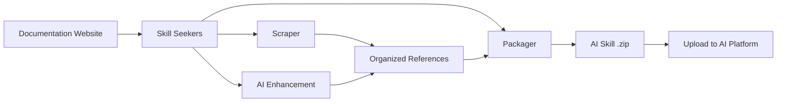

<p align="center">
  
</p>

# Skill Seekers

[English](README.md) | 简体中文 | [日本語](README.ja.md) | [한국어](README.ko.md) | [Español](README.es.md) | [Français](README.fr.md) | [Deutsch](README.de.md) | [Português](README.pt-BR.md) | [Türkçe](README.tr.md) | [العربية](README.ar.md) | [हिन्दी](README.hi.md) | [Русский](README.ru.md)

> ⚠️ **机器翻译声明**
>
> 本文档由 AI 自动翻译生成。虽然我们努力确保翻译质量，但可能存在不准确或不自然的表述。
>
> 欢迎通过 [GitHub Issue #260](https://github.com/yusufkaraaslan/Skill_Seekers/issues/260) 帮助改进翻译！您的反馈对我们非常宝贵。

[](https://github.com/yusufkaraaslan/Skill_Seekers/releases)
[](https://opensource.org/licenses/MIT)
[](https://www.python.org/downloads/)
[](https://modelcontextprotocol.io)
[](tests/)
[](https://pypi.org/project/skill-seekers/)
[](https://pypi.org/project/skill-seekers/)
[](https://skillseekersweb.com/)
[](https://github.com/yusufkaraaslan/Skill_Seekers)
[](https://pepy.tech/projects/skill-seekers)

<a href="https://trendshift.io/repositories/18329" target="_blank"></a>

**🧠 面向 AI 系统的数据层。** Skill Seekers 可以把文档站点、GitHub 仓库、PDF、视频、Notebook、Wiki 等 **18 种数据源** 转换成结构化知识资产，直接用于 AI Skills（Claude、Gemini、OpenAI）、RAG 流水线（LangChain、LlamaIndex、Pinecone）以及 AI 编程助手（Cursor、Windsurf、Cline）。准备一次，导出到 **22 个目标平台**。

## 💛 赞助商

<!-- SPONSORS:START -->
### Launch Partner

<p align="center">
  <a href="https://www.atlascloud.ai/"></a><br/><sub><b>Launch Partner</b></sub>
</p>

[Atlas Cloud](https://www.atlascloud.ai/) — A full-modal, OpenAI-compatible AI inference platform. Skill Seekers supports it as a packaging/enhancement target via `--target atlas` with `ATLAS_API_KEY`.

### Silver Sponsors

<p align="center">
  <a href="https://www.rapidproxy.io/?utm_source=skillseekers&utm_medium=sponsor"></a><br/><sub><b>Sponsor — Silver</b></sub>
</p>
<!-- SPONSORS:END -->

**[成为赞助商](SPONSORSHIP.md)** · [GitHub Sponsors](https://github.com/sponsors/yusufkaraaslan)

---

## 🚀 快速开始

```bash
# 1. 安装
pip install skill-seekers

# 2. 从任意数据源创建技能
skill-seekers create https://docs.djangoproject.com/

# 3. 为你的 AI 平台打包
skill-seekers package output/django --target claude
```

现在你已经得到了 `output/django-claude.zip`，可以直接使用。

```bash
# 选择用于增强的其他 AI agent（默认：claude）
skill-seekers create https://docs.djangoproject.com/ --agent kimi
skill-seekers create https://docs.djangoproject.com/ --agent-cmd "my-custom-agent run"
```

### 🛰️ AI 驱动的项目扫描

把 `scan` 指向一个项目，AI agent 会读取它的清单文件、README、Dockerfile/CI 以及抽样的源码 import —— 然后为检测到的每个框架输出一份配置，并额外生成一份对应你自己代码的 `<project>-codebase.json`：

```bash
skill-seekers scan ./my-react-app --out ./configs/scanned/
# → react.json、vite.json、tailwind.json、jest.json、my-react-app-codebase.json

skill-seekers create ./configs/scanned/react.json
```

如果某个检测结果没有现成的预设，AI 会生成一份全新的配置；退出时你可以选择把它发布回[社区配置仓库](https://github.com/yusufkaraaslan/skill-seekers-configs)。

### 全部 18 种数据源类型

```bash
skill-seekers create facebook/react            # GitHub 仓库
skill-seekers create ./my-project              # 本地代码库
skill-seekers create manual.pdf                # PDF
skill-seekers create report.docx               # Word
skill-seekers create book.epub                 # EPUB
skill-seekers create notebook.ipynb            # Jupyter
skill-seekers create openapi.yaml              # OpenAPI/Swagger
skill-seekers create presentation.pptx         # PowerPoint
skill-seekers create guide.adoc                # AsciiDoc
skill-seekers create page.html                 # 本地 HTML（也可以是整个目录）
skill-seekers create feed.rss                  # RSS/Atom
skill-seekers create curl.1                    # Man 手册页

# 视频（YouTube、Vimeo 或本地文件 —— 需要 skill-seekers[video]）
skill-seekers create --video-url https://www.youtube.com/watch?v=... --name mytutorial
skill-seekers create --setup                   # 自动安装适配 GPU 的视觉依赖

skill-seekers create --space-key TEAM --name wiki               # Confluence
skill-seekers create --database-id ... --name docs              # Notion
skill-seekers create --chat-export-path ./slack-export --name team-chat  # Slack/Discord
```

每种数据源类型及其可用选项详见[抓取指南](docs/user-guide/02-scraping.md)。

---

## 📦 安装

```bash
pip install skill-seekers              # 核心：抓取、GitHub、PDF、打包
pip install skill-seekers[all-llms]    # + 所有 LLM 平台
pip install skill-seekers[mcp]         # + MCP 服务器
pip install skill-seekers[all]         # 全部功能
```

**不确定该装哪些？** 运行安装向导：`skill-seekers-setup`

<details>
<summary><b>全部可选安装项</b></summary>

| 安装命令 | 新增能力 |
|---------|------|
| `skill-seekers[gemini]` | Google Gemini 支持 |
| `skill-seekers[openai]` | OpenAI ChatGPT 支持 |
| `skill-seekers[all-llms]` | 所有 LLM 平台 |
| `skill-seekers[mcp]` | 面向 Claude Code、Cursor 等的 MCP 服务器 |
| `skill-seekers[video]` | YouTube/Vimeo 字幕与元数据提取 |
| `skill-seekers[video-full]` | + Whisper 语音转写与视觉帧提取 |
| `skill-seekers[jupyter]` | Jupyter Notebook 支持 |
| `skill-seekers[pptx]` | PowerPoint 支持 |
| `skill-seekers[confluence]` | Confluence wiki 支持 |
| `skill-seekers[notion]` | Notion 页面支持 |
| `skill-seekers[rss]` | RSS/Atom 订阅源支持 |
| `skill-seekers[chat]` | Slack/Discord 聊天记录导出支持 |
| `skill-seekers[asciidoc]` | AsciiDoc 支持 |
| `skill-seekers[all]` | 全部功能 |

> **视频视觉依赖（GPU 感知）：** 安装 `skill-seekers[video-full]` 之后，运行 `skill-seekers create --setup` 自动检测 GPU 并安装匹配的 PyTorch 版本与 easyocr。

</details>

**前置条件：** Python 3.10+、Git。第一次使用？→ **[零障碍快速上手](docs/getting-started/BULLETPROOF_QUICKSTART.md)** 🎯

---

## 📚 文档

| 我想要…… | 阅读这里 |
|--------------|-----------|
| **快速上手** | [快速开始](docs/getting-started/02-quick-start.md) —— 3 条命令做出第一个技能 |
| **理解核心概念** | [核心概念](docs/user-guide/01-core-concepts.md) |
| **抓取数据源** | [抓取指南](docs/user-guide/02-scraping.md) —— 全部 18 种数据源类型 |
| **用 AI 增强技能** | [增强指南](docs/user-guide/03-enhancement.md) · [增强模式](docs/features/ENHANCEMENT_MODES.md) |
| **导出技能** | [打包指南](docs/user-guide/04-packaging.md) |
| **构建工作流** | [工作流](docs/user-guide/05-workflows.md) |
| **查询某条命令** | [CLI 参考](docs/reference/CLI_REFERENCE.md) —— 全部 19 条命令 |
| **进行配置** | [配置格式](docs/reference/CONFIG_FORMAT.md) · [环境变量](docs/reference/ENVIRONMENT_VARIABLES.md) |
| **配置 MCP** | [MCP 配置](docs/guides/MCP_SETUP.md) · [MCP 参考](docs/reference/MCP_REFERENCE.md) |
| **与 RAG / IDE 集成** | [LangChain](docs/integrations/LANGCHAIN.md) · [RAG 流水线](docs/integrations/RAG_PIPELINES.md) · [Cursor](docs/integrations/CURSOR.md) · [Windsurf](docs/integrations/WINDSURF.md) · [Cline](docs/integrations/CLINE.md) |
| **处理超大文档集** | [超大文档处理](docs/reference/LARGE_DOCUMENTATION.md) —— 10K–40K+ 页 |
| **理解整体架构** | [UML 架构](docs/UML_ARCHITECTURE.md) —— 14 张图 |
| **解决问题** | [故障排查](docs/user-guide/06-troubleshooting.md) |

**完整文档索引：** [docs/README.md](docs/README.md)

---

## 🎯 你能得到什么

| 使用场景 | 产出 | 赋能对象 |
|----------|--------|--------|
| **AI Skills** | 内容完整的 `SKILL.md` + 参考文件 | Claude Code、Gemini、GPT |
| **RAG 流水线** | 带丰富元数据的分块文档 | LangChain、LlamaIndex、Haystack |
| **向量数据库** | 预格式化、可直接 upsert 的数据 | Pinecone、Chroma、Weaviate、FAISS、Qdrant |
| **AI 编程助手** | IDE 内 AI 自动读取的上下文文件 | Cursor、Windsurf、Cline、Continue.dev |

### 导出目标（22 个）

```bash
skill-seekers package output/react --target claude      # → Claude Skill（ZIP + YAML）
skill-seekers package output/react --target langchain   # → LangChain Documents
skill-seekers package output/react --target llama-index # → LlamaIndex TextNodes
skill-seekers package output/react --target ibm-bob     # → IBM Bob 技能目录
```

**LLM 平台（12 个）：** `claude` · `gemini` · `openai` · `minimax` · `opencode` · `kimi` · `deepseek` · `qwen` · `openrouter` · `together` · `fireworks` · `markdown`
**RAG 与向量（8 个）：** `langchain` · `llama-index` · `haystack` · `chroma` · `faiss` · `weaviate` · `qdrant` · `pinecone`
**其他（2 个）：** `atlas` · `ibm-bob`

各平台的具体支持情况详见[功能矩阵](docs/reference/FEATURE_MATRIX.md)。

### 为什么值得用

- ⚡ **快 99%** —— 原本数天的人工数据准备 → 15–45 分钟
- 🎯 **真正可用的技能质量** —— 500+ 行的 `SKILL.md` 文件，包含示例、模式与指南
- 📊 **开箱即用的 RAG 分块** —— 智能分块保留代码块与上下文
- 🔄 **多源融合** —— 把文档 + GitHub + PDF + 视频合并为一份知识资产
- 🌐 **一次准备，通吃所有目标** —— 无需重新抓取即可导出到 22 个目标平台
- ✅ **久经考验** —— 3,900+ 测试、68 个工作流预设，可用于生产环境

---

## ✨ 核心能力

<details>
<summary><b>文档抓取</b> —— SPA 发现、llms.txt、智能分类</summary>

针对 JavaScript SPA 站点的三层发现机制（`sitemap.xml` → `llms.txt` → 无头浏览器渲染）、自动检测 `llms.txt`（存在时速度提升 10 倍）、智能主题分类，以及宽松的 HTML 解析器兜底，让标记破损的页面也能顺利抓取。

→ [抓取指南](docs/user-guide/02-scraping.md) · [llms.txt 支持](docs/reference/LLMS_TXT_SUPPORT.md)
</details>

<details>
<summary><b>GitHub 与代码库分析（C3.x）</b> —— AST 解析、模式检测、操作指南</summary>

三路并行架构：代码分析（AST、设计模式、测试）、文档（README、`docs/`、wiki）以及社区（issues、PR、元数据）。C3.x 流水线还提供覆盖 9 种语言的 10 种 GoF 模式检测器、从测试中提取的用法示例、AI 撰写的操作指南、配置提取以及架构总览。

```bash
skill-seekers create ./my-project --preset quick          # 1–2 分钟，浅层分析
skill-seekers create ./my-project --preset standard       # 均衡（默认）
skill-seekers create ./my-project --preset comprehensive  # 深度、详尽
```

→ [模式检测](docs/features/PATTERN_DETECTION.md) · [操作指南](docs/features/HOW_TO_GUIDES.md) · [测试示例提取](docs/features/TEST_EXAMPLE_EXTRACTION.md)
</details>

<details>
<summary><b>AI 增强</b> —— API 或本地 agent，68 个工作流预设</summary>

所有 AI 调用都经由同一条传输通道，可运行在 **API 模式**（Anthropic、Google Gemini、OpenAI、Moonshot/Kimi、MiniMax）或 **LOCAL 模式**（Claude Code、Kimi Code、Codex、Copilot、OpenCode、自定义 agent —— 无 API 费用）。用 `--enhance-level 0-3` 控制增强深度，用 `--agent` 选择 agent。

→ [增强指南](docs/user-guide/03-enhancement.md) · [增强模式](docs/features/ENHANCEMENT_MODES.md) · [多 Agent 配置](docs/guides/MULTI_AGENT_SETUP.md)
</details>

<details>
<summary><b>统一多源抓取</b> —— 将多个数据源合并为一个技能</summary>

一份配置即可把文档、GitHub、PDF、视频等汇入同一份知识资产，并支持冲突检测与跨数据源的两两综合。

→ [统一抓取](docs/features/UNIFIED_SCRAPING.md)
</details>

<details>
<summary><b>视频提取</b> —— 文字稿、视频帧、屏幕上的代码</summary>

支持 YouTube、Vimeo 和本地文件。三级文字稿兜底（内嵌字幕 → YouTube 字幕 API → 本地 Whisper），并可选启用视觉提取，对抽样帧中显示的代码做 OCR。

→ [视频指南](docs/VIDEO_GUIDE.md)
</details>

<details>
<summary><b>质量、同步与规模</b></summary>

带门禁阈值的质量评分（`skill-seekers quality output/react/ --threshold 7`）、文档变更检测配合定时重抓与通知、面向超大文档集的流式摄取，以及增量更新。

→ [超大文档处理](docs/reference/LARGE_DOCUMENTATION.md) · [代码质量](docs/reference/CODE_QUALITY.md)
</details>

---

## 🔌 MCP 集成（40 个工具）

Skill Seekers 自带一个 MCP 服务器，支持 Claude Code、Cursor、Windsurf、VS Code + Cline 以及 IntelliJ IDEA。

```bash
# stdio 模式（Claude Code、VS Code + Cline）
python -m skill_seekers.mcp.server_fastmcp

# HTTP 模式（Cursor、Windsurf、IntelliJ）
python -m skill_seekers.mcp.server_fastmcp --transport http --port 8765
```

然后直接对你的助手说：*“打包并上传 React 技能。”*

→ [MCP 配置](docs/guides/MCP_SETUP.md) · [MCP 参考](docs/reference/MCP_REFERENCE.md) · [HTTP 传输](docs/guides/HTTP_TRANSPORT.md)

---

## 🤖 安装到 AI agent

技能可自动安装到 **19 个 AI 编程 agent**：

```bash
skill-seekers install-agent output/react/ --agent cursor
skill-seekers install-agent output/react/ --agent all      # 所有检测到的 agent
skill-seekers install-agent output/react/ --agent cursor --dry-run
```

| Agent | 路径 | 作用范围 |
|-------|------|-------|
| Claude Code | `~/.claude/skills/` | 全局 |
| Cursor | `.cursor/skills/` | 项目 |
| VS Code / Copilot | `.github/skills/` | 项目 |
| Amp | `~/.amp/skills/` | 全局 |
| Goose | `~/.config/goose/skills/` | 全局 |
| OpenCode | `~/.opencode/skills/` | 全局 |
| Letta | `~/.letta/skills/` | 全局 |
| Aide | `~/.aide/skills/` | 全局 |
| Windsurf | `~/.windsurf/skills/` | 全局 |
| Neovate | `~/.neovate/skills/` | 全局 |
| Roo Code | `.roo/skills/` | 项目 |
| Cline | `.cline/skills/` | 项目 |
| Aider | `~/.aider/skills/` | 全局 |
| Bolt | `.bolt/skills/` | 项目 |
| Kilo Code | `.kilo/skills/` | 项目 |
| Continue | `~/.continue/skills/` | 全局 |
| Kimi Code | `~/.kimi/skills/` | 全局 |
| IBM Bob | `.bob/skills/` | 项目 |

### 上传到 Claude

```bash
export ANTHROPIC_API_KEY=sk-ant-...
skill-seekers package output/react/ --upload   # 打包 + 上传
skill-seekers upload output/react.zip          # 上传已有的 zip
```

没有 API key？先打包，然后在 [claude.ai/skills](https://claude.ai/skills) 手动上传 `output/react.zip`。

→ [上传指南](docs/guides/UPLOAD_GUIDE.md)

---

## ⚙️ 工作原理


```mermaid
graph LR
    A[Documentation Website] --> B[Skill Seekers]
    B --> C[Scraper]
    B --> D[AI Enhancement]
    B --> E[Packager]
    C --> F[Organized References]
    D --> F
    F --> E
    E --> G[AI Skill .zip]
    G --> H[Upload to AI Platform]
```

1. **抓取** —— 提取每一个页面（优先检查 `llms.txt`）
2. **分类** —— 把内容按主题组织（API、指南、教程……）
3. **增强** —— AI 撰写一份内容完整、带示例的 `SKILL.md`
4. **打包** —— 打成平台可直接使用的产物
5. **上传** —— 发布到你的 AI 平台（可选）

### 架构

**8 个核心模块 + 5 个工具模块**（约 200 个类）：

| 模块 | 用途 |
|--------|---------|
| **CLICore** | Git 风格的命令分发器、数据源自动检测 |
| **Scrapers** | 基于共享构建层的 18 种数据源提取器 |
| **Adaptors** | 统一 `SkillAdaptor` 抽象基类背后的 22 种输出平台格式 |
| **Analysis** | C3.x 代码库分析流水线、10 种 GoF 模式检测器 |
| **Enhancement** | 通过单一 `AgentClient` 传输通道进行 AI 增强 |
| **Packaging** | 打包、上传与安装技能 |
| **MCP** | FastMCP 服务器（40 个工具、10 个工具模块） |
| **Sync** | 文档变更检测与通知 |

→ [UML 架构](docs/UML_ARCHITECTURE.md) · [API 参考](docs/reference/API_REFERENCE.md) · [技能架构](docs/reference/SKILL_ARCHITECTURE.md)

---

## 🆕 v3.9.0 新特性

- **针对破损标记的 HTML 解析器兜底**（#96）—— 严重畸形的页面不再被抓取成空内容；格式良好的页面输出保持字节级一致。
- **瞬时故障重试** —— 文档抓取器（#97）与 MCP `fetch_config`（#92）现在会以退避策略重试连接抖动和 5xx；4xx 仍然快速失败。
- **Whisper 转写兜底**（#420）—— 没有字幕的本地视频终于能得到真正的文字稿。
- **MiniMax 图像 OCR + 注册表驱动的多模态提供方**（#423）—— 各提供方自行声明传输协议与图像能力；中国区签发的 key 可以对接正确的端点。
- **更省 token 的 GitHub issue 默认值**（#169）—— GitHub 技能默认不再打包完整的已关闭 issue 历史。
- **三个服务器统一采用环境变量驱动的 CORS**（#422、#424）—— 不再出现通配来源搭配凭据的情况。

完整变更历史：**[CHANGELOG.md](CHANGELOG.md)**

---

## 📈 性能

| 文档规模 | 耗时 | 产出体积 |
|---|---|---|
| 小型（< 100 页） | 5–10 分钟 | 约 2 MB |
| 中型（100–500 页） | 15–30 分钟 | 约 10 MB |
| 大型（500–2,000 页） | 30–60 分钟 | 约 40 MB |
| 超大型（10K–40K+ 页） | 使用 `stream` | 参见[超大文档处理](docs/reference/LARGE_DOCUMENTATION.md) |

---

## 🐛 故障排查

```bash
skill-seekers doctor          # 诊断安装与运行环境
skill-seekers sync-config     # 检测配置漂移
```

常见问题与解决办法：**[故障排查指南](docs/user-guide/06-troubleshooting.md)** · [TROUBLESHOOTING.md](docs/TROUBLESHOOTING.md)

---

## 🤝 参与贡献

欢迎贡献 —— 详见 **[CONTRIBUTING.md](CONTRIBUTING.md)**。

- 📋 **[开发路线图与任务](https://github.com/users/yusufkaraaslan/projects/2)** —— 任选一个任务认领
- 💬 **[讨论区](https://github.com/yusufkaraaslan/Skill_Seekers/discussions)** —— 提问与想法交流
- 🐛 **[Issues](https://github.com/yusufkaraaslan/Skill_Seekers/issues)** —— Bug 与功能请求

---

## 📝 许可证

MIT —— 详见 [LICENSE](LICENSE)。

## 🔒 安全

[](https://mseep.ai/app/yusufkaraaslan-skill-seekers)

---

## 🌐 生态项目

Skill Seekers 是一个多仓库项目：

| 仓库 | 说明 | 链接 |
|-----------|-------------|-------|
| **[Skill_Seekers](https://github.com/yusufkaraaslan/Skill_Seekers)** | 核心 CLI 与 MCP 服务器（本仓库） | [PyPI](https://pypi.org/project/skill-seekers/) |
| **[skillseekersweb](https://github.com/yusufkaraaslan/skillseekersweb)** | 官网与文档 | [在线访问](https://skillseekersweb.com/) |
| **[skill-seekers-configs](https://github.com/yusufkaraaslan/skill-seekers-configs)** | 社区配置仓库 | |
| **[skill-seekers-action](https://github.com/yusufkaraaslan/skill-seekers-action)** | 用于 CI/CD 的 GitHub Action | |
| **[skill-seekers-plugin](https://github.com/yusufkaraaslan/skill-seekers-plugin)** | Claude Code 插件 | |
| **[homebrew-skill-seekers](https://github.com/yusufkaraaslan/homebrew-skill-seekers)** | 面向 macOS 的 Homebrew tap | |

> **想要参与贡献？** 官网仓库和配置仓库是新贡献者非常好的起点！
